# Starmap ⭐🗺️

> A unified AI model catalog system providing accurate, up-to-date information about AI models, their capabilities, pricing, and availability across providers

<div align="center">

```
     ____  _                                 
    / ___|| |_ __ _ _ __ _ __ ___   __ _ _ __  
    \___ \| __/ _` | '__| '_ ` _ \ / _` | '_ \ 
     ___) | || (_| | |  | | | | | | (_| | |_) |
    |____/ \__\__,_|_|  |_| |_| |_|\__,_| .__/ 
                                        |_|    
```

[](https://go.dev)
[](LICENSE)

[Installation](#installation) • [Quick Start](#quick-start) • [Architecture](#architecture) • [Documentation](#documentation) • [Contributing](#contributing)

</div>

## Table of Contents

- [Why Starmap?](#why-starmap)
- [Key Features](#key-features)
- [Installation](#installation)
- [Quick Start](#quick-start)
- [Architecture](#architecture)
- [Core Concepts](#core-concepts)
- [Package Documentation](#package-documentation)
- [Understanding the System](#understanding-the-system)
- [CLI Usage](#cli-usage)
- [Go Package](#go-package)
- [Data Sources](#data-sources)
- [Model Catalog](#model-catalog)
- [HTTP Server (Coming Soon)](#http-server-coming-soon)
- [Configuration](#configuration)
- [Development](#development)
- [Contributing](#contributing)
- [License](#license)

## Why Starmap?

### The Problem

Building AI applications requires accurate information about models across multiple providers, but:

- **Fragmented Information**: Each provider has different APIs, documentation formats, and update cycles
- **Missing Pricing Data**: Many providers don't publish pricing through their APIs
- **Rapid Changes**: New models launch weekly, capabilities change, prices update
- **Integration Complexity**: Each provider requires custom code to fetch and parse model data
- **No Single Source of Truth**: Developers must check multiple sources for complete information

### The Solution

Starmap provides:

- **Unified Catalog**: Single interface for all AI model information
- **Multi-Source Reconciliation**: Combines provider APIs with community data for completeness
- **Automatic Synchronization**: Keep your catalog current with scheduled updates
- **Flexible Storage**: From in-memory for testing to persistent for production
- **Event-Driven Updates**: React to model changes in real-time
- **Type-Safe Go API**: Strongly typed models with comprehensive metadata

### Who Uses Starmap?

- **AI Application Developers**: Discover and compare models for your use case
- **Platform Engineers**: Maintain accurate model catalogs for your organization
- **Tool Builders**: Integrate comprehensive model data into your products
- **Researchers**: Track model capabilities and pricing trends
- **Cost Optimizers**: Find the best price/performance for your workloads

## Key Features

✅ **Comprehensive Coverage**: 500+ models from 10+ providers  
✅ **Accurate Pricing**: Community-verified pricing data via models.dev  
✅ **Real-time Synchronization**: Automatic updates from provider APIs  
✅ **Flexible Architecture**: Simple merging or complex reconciliation  
✅ **Multiple Interfaces**: CLI, Go package, and future HTTP API  
✅ **Production Ready**: Thread-safe, well-tested, actively maintained  

## Installation

### CLI Tool

```bash
# Homebrew (macOS/Linux)
brew install agentstation/tap/starmap

# Or install from source
go install github.com/agentstation/starmap/cmd/starmap@latest

# Verify installation
starmap version
```

### Go Package

```bash
# Add to your project
go get github.com/agentstation/starmap
```

### Docker (Coming Soon)

```bash
# Run as container
docker run -p 8080:8080 ghcr.io/agentstation/starmap:latest
```

## Quick Start

### CLI: List Available Models

```bash
# List all models
starmap list models

# Filter by provider
starmap list models --provider openai

# Search by capability
starmap list models --capability vision

# Export as JSON
starmap export --format json > models.json
```

### Go Package: Basic Usage

```go
package main

import (
    "fmt"
    "log"
    
    "github.com/agentstation/starmap"
)

func main() {
    // Create starmap with embedded catalog
    sm, err := starmap.New()
    if err != nil {
        log.Fatal(err)
    }
    
    // Get the catalog
    catalog, err := sm.Catalog()
    if err != nil {
        log.Fatal(err)
    }
    
    // Find GPT-4 model
    model, err := catalog.Model("gpt-4o")
    if err == nil {
        fmt.Printf("Model: %s\n", model.Name)
        fmt.Printf("Context: %d tokens\n", model.ContextWindow)
        fmt.Printf("Input Price: $%.2f/1M tokens\n", model.Pricing.Input)
    }
}
```

### Sync with Provider APIs

```bash
# Set up API keys
export OPENAI_API_KEY=sk-...
export ANTHROPIC_API_KEY=sk-ant-...

# Update catalog from all providers
starmap update

# Update specific provider with auto-approve
starmap update --provider openai --auto-approve
```

## Architecture

Starmap uses a layered architecture that separates concerns and enables flexibility:


### Layer Responsibilities

1. **User Interfaces**: Multiple ways to interact with starmap
2. **Starmap Interface**: Main API with event hooks and auto-updates
3. **Catalog Layer**: Unified storage abstraction with pluggable backends
4. **Reconciliation Engine**: Intelligent multi-source data merging
5. **Data Sources**: Various sources of model information
6. **Storage Backends**: Where catalog data is persisted

## Core Concepts

### 1. Catalog
The fundamental abstraction for storing and accessing model data:
- Provides CRUD operations for models, providers, authors
- Supports multiple storage backends (memory, files, embedded)
- Thread-safe collections with rich query capabilities
- See [Catalog Package Documentation](pkg/catalogs/README.md)

### 2. Source
Abstraction for fetching data from external systems:
- Provider APIs for real-time model availability
- models.dev for community-verified pricing and logos
- Local files for custom overrides
- Each source implements a common interface

### 3. Reconciliation
Intelligent merging of data from multiple sources:
- Field-level authority system
- Provenance tracking for audit trails
- Conflict resolution strategies
- See [Reconciliation Package Documentation](pkg/reconcile/README.md)

### 4. Model
Comprehensive specification of an AI model:
```go
type Model struct {
    ID            string           // Unique identifier
    Name          string           // Display name
    ProviderID    string           // Provider offering this model
    AuthorID      string           // Creator organization
    
    // Capabilities
    Features      *ModelFeatures   // Chat, vision, audio, etc.
    Tools         *ModelTools      // Function calling, web search
    Delivery      *ModelDelivery   // Streaming, formats
    
    // Operational
    Pricing       *ModelPricing    // Token costs
    Limits        *ModelLimits     // Context window, rate limits
    
    // Metadata
    Metadata      *ModelMetadata   // Release date, architecture
}
```

**Model Relationships:**


The Model type aggregates all information about an AI model, with clear separation between capabilities, pricing, and operational limits.

## 📁 Project Structure

Click on any package to view its documentation:

```
starmap/
├── 📦 pkg/                         # Public API packages
│   ├── 📚 [catalogs/](pkg/catalogs/)       # Unified catalog abstraction with storage backends
│   ├── 🔢 [constants/](pkg/constants/)     # Centralized constants for the application  
│   ├── 🔄 [convert/](pkg/convert/)         # Model format conversion utilities
│   ├── ⚠️ [errors/](pkg/errors/)           # Custom error types and handling
│   ├── 📝 [logging/](pkg/logging/)         # Structured logging with zerolog
│   ├── 🔀 [reconcile/](pkg/reconcile/)     # Multi-source reconciliation engine
│   └── 🌐 [sources/](pkg/sources/)         # Data source abstractions
│
├── 🔒 internal/                    # Internal implementation packages
│   ├── 💾 [embedded/](internal/embedded/)  # Embedded catalog data
│   ├── 🚀 [transport/](internal/transport/) # HTTP client utilities
│   └── 📡 sources/                 # Source implementations
│       ├── 🏠 [local/](internal/sources/local/)        # Local file source
│       ├── 🌍 [modelsdev/](internal/sources/modelsdev/) # models.dev integration
│       ├── 🏢 [providers/](internal/sources/providers/) # Provider API clients
│       │   ├── [anthropic/](internal/sources/providers/anthropic/)
│       │   ├── [cerebras/](internal/sources/providers/cerebras/)
│       │   ├── [deepseek/](internal/sources/providers/deepseek/)
│       │   ├── [google-ai-studio/](internal/sources/providers/google-ai-studio/)
│       │   ├── [google-vertex/](internal/sources/providers/google-vertex/)
│       │   ├── [groq/](internal/sources/providers/groq/)
│       │   └── [openai/](internal/sources/providers/openai/)
│       └── 📋 [registry/](internal/sources/registry/)   # Source registration
│
├── cmd/starmap/                    # CLI application
├── docs/                           # Generated documentation
└── scripts/                        # Build and utility scripts
```

## 📦 Package Quick Reference

| Package | Purpose | Key Types | Documentation |
|---------|---------|-----------|---------------|
| **[pkg/catalogs](pkg/catalogs/)** | Catalog storage abstraction | `Catalog`, `Model`, `Provider` | [📚 README](pkg/catalogs/README.md) |
| **[pkg/reconcile](pkg/reconcile/)** | Multi-source data merging | `Reconciler`, `Strategy`, `Authority` | [📚 README](pkg/reconcile/README.md) |
| **[pkg/sources](pkg/sources/)** | Data source interfaces | `Source`, `ProviderFetcher` | [📚 README](pkg/sources/README.md) |
| **[pkg/errors](pkg/errors/)** | Error handling | `NotFoundError`, `APIError` | [📚 README](pkg/errors/README.md) |
| **[pkg/constants](pkg/constants/)** | Application constants | Timeouts, Limits, Permissions | [📚 README](pkg/constants/README.md) |
| **[pkg/logging](pkg/logging/)** | Structured logging | `Logger`, `Config` | [📚 README](pkg/logging/README.md) |
| **[pkg/convert](pkg/convert/)** | Format conversion | `OpenAIModel`, `OpenRouterModel` | [📚 README](pkg/convert/README.md) |

### Package Dependency Graph

Starmap follows clean architecture principles with unidirectional dependencies:


**Dependency Rules:**
- User interfaces only import root package
- Root package only imports `pkg/` packages
- Internal packages implement `pkg/` interfaces
- No circular dependencies (enforced by Go)

## Package Documentation

Starmap is organized into focused packages, each with comprehensive documentation:

### 📦 [Catalog Package](pkg/catalogs/README.md)
**Simple two-catalog merging with multiple storage backends**

Use when:
- Working with one or two data sources
- Simple merge operations are sufficient
- You control the data sources
- Testing or development scenarios

```go
// Simple merge of two catalogs
catalog.MergeWith(updates, catalogs.WithStrategy(catalogs.MergeReplaceAll))
```

### 🔄 [Reconciliation Package](pkg/reconcile/README.md)
**Complex multi-source reconciliation with field-level authority**

Use when:
- Combining 3+ data sources
- Different sources are authoritative for different fields
- Need provenance tracking and audit trails
- Production systems with complex requirements

```go
// Multi-source reconciliation with authority system
reconciler, _ := reconcile.New(
    reconcile.WithAuthorities(authorities),
    reconcile.WithProvenance(true),
)
result, _ := reconciler.ReconcileCatalogs(ctx, sources)
```

### 🌐 [Sources Package](pkg/sources/)
**Abstractions for fetching data from external systems**

Implements the Source interface for:
- Provider APIs (OpenAI, Anthropic, Google, etc.)
- models.dev repository (Git and HTTP)
- Local catalog files
- Custom data sources

## Understanding the System

### Two-Tier Architecture

Starmap provides two levels of data management complexity:


### When to Use Each Approach

#### Use Catalog Package (Simple) When:
✅ Merging embedded catalog with local overrides  
✅ Combining two provider responses  
✅ Testing with mock data  
✅ Building simple tools  

#### Use Reconciliation Package (Complex) When:
✅ Syncing with multiple provider APIs  
✅ Integrating models.dev for pricing  
✅ Different sources own different fields  
✅ Need audit trail of data sources  
✅ Building production systems

### Sync Pipeline Visualization

Starmap's sync process executes in 12 well-defined stages:


**Key Stages:**
- **Stages 1-5**: Setup and validation
- **Stages 6-8**: Source preparation and concurrent fetching
- **Stages 9-10**: Baseline comparison and reconciliation
- **Stages 11-12**: Change detection and persistence

### Real-World Example

Here's how starmap's `sync` command uses reconciliation:

```go
// 1. Define field-level authorities
authorities := map[string]reconcile.SourceAuthority{
    "pricing":        {Primary: ModelsDevGit, Fallback: &ProviderAPI},
    "limits":         {Primary: ModelsDevGit, Fallback: &ProviderAPI},
    "model_list":     {Primary: ProviderAPI},  // Provider owns what exists
}

// 2. Configure sources
sources := []sources.Source{
    local.New(),                    // Embedded baseline
    providers.New(),                 // Provider APIs
    modelsdev.NewGitSource(),       // Community data
}

// 3. Reconcile with provenance tracking
reconciler, _ := reconcile.New(
    reconcile.WithAuthorities(authorities),
    reconcile.WithProvenance(true),
)

// 4. Execute reconciliation
result, _ := reconciler.ReconcileCatalogs(ctx, sources)
```

### CLI Command Flow

This diagram shows how CLI commands interact with the application layer using dependency injection:


**Key Patterns:**
- **Dependency Injection**: Commands receive `Application` interface, not concrete types
- **Thread Safety**: All catalog access returns deep copies
- **Singleton Management**: App manages starmap instance lifecycle
- **Clean Architecture**: Clear separation between layers

## CLI Usage

### Core Commands

```bash
# Discovery
starmap list models              # List all models
starmap list providers          # List all providers  
starmap list authors            # List all authors

# Update catalog
starmap update                  # Update all providers
starmap update -p openai        # Update specific provider
starmap update --dry-run        # Preview changes

# Development
starmap validate                # Validate configurations
starmap generate completion bash # Generate shell completion
```

### Advanced Update Workflows

```bash
# Development: Use file-based catalog
starmap update --input ./catalog --provider groq --dry-run

# Production: Fresh update with auto-approval
starmap update --fresh --auto-approve

# Custom directories
starmap update --input ./dev --output ./prod

# Specific sources only
starmap update --sources "Provider APIs,models.dev (git)"
```

### Environment Setup

```bash
# Required for provider syncing
export OPENAI_API_KEY=sk-...
export ANTHROPIC_API_KEY=sk-ant-...
export GOOGLE_API_KEY=...
export GROQ_API_KEY=...

# Optional for Google Vertex
export GOOGLE_VERTEX_PROJECT=my-project
export GOOGLE_VERTEX_LOCATION=us-central1
```

## Go Package

### Installation and Setup

```go
import (
    "github.com/agentstation/starmap"
    "github.com/agentstation/starmap/pkg/catalogs"
    "github.com/agentstation/starmap/pkg/reconcile"
)
```

### Basic Usage Patterns

#### Simple Catalog Access
```go
// Default embedded catalog with auto-updates
sm, _ := starmap.New()
catalog, _ := sm.Catalog()

// Query models
model, _ := catalog.Model("claude-3-opus")
fmt.Printf("Context: %d tokens\n", model.ContextWindow)
```

#### Event-Driven Updates
```go
// React to catalog changes
sm.OnModelAdded(func(model catalogs.Model) {
    log.Printf("New model: %s", model.ID)
})

sm.OnModelUpdated(func(old, new catalogs.Model) {
    if old.Pricing.Input != new.Pricing.Input {
        log.Printf("Price changed for %s", new.ID)
    }
})
```

#### Custom Storage Backend
```go
// Use filesystem for development
catalog, _ := catalogs.New(
    catalogs.WithPath("./my-catalog"),
)

sm, _ := starmap.New(
    starmap.WithInitialCatalog(catalog),
)
```

#### Complex Reconciliation
```go
// Set up multi-source reconciliation
reconciler, _ := reconcile.New(
    reconcile.WithAuthorities(map[string]reconcile.SourceAuthority{
        "pricing": {Primary: "models.dev"},
        "limits":  {Primary: "models.dev"},
    }),
)

// Fetch from all sources
sources := []sources.Source{
    providers.New(),
    modelsdev.NewGitSource(),
}

// Reconcile and get unified catalog
result, _ := reconciler.ReconcileCatalogs(ctx, sources)
```

### Advanced Patterns

#### Automatic Updates with Custom Logic
```go
updateFunc := func(current catalogs.Catalog) (catalogs.Catalog, error) {
    // Custom sync logic
    // Could call provider APIs, merge data, etc.
    return updatedCatalog, nil
}

sm, _ := starmap.New(
    starmap.WithAutoUpdateInterval(30 * time.Minute),
    starmap.WithUpdateFunc(updateFunc),
)
```

#### Filtering and Querying
```go
// Find vision-capable models under $10/M tokens
models := catalog.Models()
models.ForEach(func(id string, model *catalogs.Model) bool {
    if model.Features.Vision && model.Pricing.Input < 10 {
        fmt.Printf("Vision model: %s ($%.2f/M)\n", 
            model.ID, model.Pricing.Input)
    }
    return true
})
```

## Data Sources

Understanding where data comes from and why we need multiple sources:

### Provider APIs
**Purpose**: Real-time model availability and basic specifications  
**Authority**: Model existence, deprecation, basic capabilities  
**Limitations**: Often missing pricing, incomplete metadata  

```yaml
Example from OpenAI API:
- Lists model IDs and capabilities
- No pricing information
- Basic context window data
```

### models.dev Repository
**Purpose**: Community-verified pricing and enhanced metadata  
**Authority**: Pricing, accurate limits, provider logos  
**Source**: https://models.dev  

```yaml
Example enhancements:
- Verified pricing per million tokens
- Accurate context windows
- Knowledge cutoff dates
- SVG logos for providers
```

### Embedded Catalog
**Purpose**: Baseline data shipped with starmap  
**Authority**: Starting point, manual corrections  
**Updates**: Rebuilt with each release  

### Local Files
**Purpose**: User customizations and overrides  
**Authority**: User-specific requirements  
**Location**: Configurable via `--input` flag  

### How Sources Work Together

```mermaid
flowchart LR
    API[Provider API<br/>✓ Model List<br/>✗ Pricing]
    MD[models.dev<br/>✓ Pricing<br/>✓ Logos]
    EMB[Embedded<br/>✓ Baseline<br/>✓ Fixes]
    
    API --> REC{Reconciliation}
    MD --> REC
    EMB --> REC
    
    REC --> CAT[Unified Catalog<br/>✓ Complete Data]
    
    style API fill:#ffe0e0
    style MD fill:#e0ffe0
    style EMB fill:#e0e0ff
    style CAT fill:#fffacd
```



## Model Catalog

### Browse Documentation

The catalog contains 500+ models from major providers:

- 📋 **[Browse by Provider](./docs/catalog/providers/README.md)** - Models organized by service provider
- 👥 **[Browse by Author](./docs/catalog/authors/README.md)** - Models organized by creator

### Quick Provider Links

- 🤖 [Anthropic Models](./docs/catalog/providers/anthropic/README.md) - Claude family
- 🔥 [OpenAI Models](./docs/catalog/providers/openai/README.md) - GPT and O-series
- 🔍 [Google AI Studio](./docs/catalog/providers/google-ai-studio/README.md) - Gemini models
- ⚡ [Groq](./docs/catalog/providers/groq/README.md) - High-speed inference
- 🚀 [DeepSeek](./docs/catalog/providers/deepseek/README.md) - Efficient models
- 🧠 [Cerebras](./docs/catalog/providers/cerebras/README.md) - Fast inference

### Generate Documentation

```bash
# Generate Go package documentation
make generate
```

## HTTP Server (Coming Soon)

Future HTTP server for centralized catalog service:

### Planned Features

- **REST API**: Standard HTTP endpoints for catalog access
- **GraphQL**: Flexible queries for complex data needs
- **WebSocket**: Real-time updates for model changes
- **Webhooks**: Push notifications for catalog updates
- **Multi-tenant**: API key-based access control
- **Caching**: Redis-backed performance optimization

### Planned Endpoints

```bash
# Models
GET    /api/v1/models                 # List all models
GET    /api/v1/models/{id}            # Get specific model
POST   /api/v1/models/search          # Search models

# Providers  
GET    /api/v1/providers              # List providers
GET    /api/v1/providers/{id}         # Get provider
GET    /api/v1/providers/{id}/models  # Provider's models

# Updates
POST   /api/v1/webhooks               # Subscribe to updates
GET    /api/v1/updates/stream         # SSE update stream

# Admin
POST   /api/v1/sync                   # Trigger sync
GET    /api/v1/health                 # Health check
```

## Configuration

### Environment Variables

```bash
# Provider API Keys
OPENAI_API_KEY=sk-...
ANTHROPIC_API_KEY=sk-ant-...
GOOGLE_API_KEY=...
GROQ_API_KEY=...
DEEPSEEK_API_KEY=...
CEREBRAS_API_KEY=...

# Google Vertex (optional)
GOOGLE_VERTEX_PROJECT=my-project
GOOGLE_VERTEX_LOCATION=us-central1
GOOGLE_APPLICATION_CREDENTIALS=/path/to/service-account.json

# Starmap Configuration
STARMAP_CONFIG=/path/to/config.yaml
STARMAP_CACHE_DIR=/var/cache/starmap
STARMAP_LOG_LEVEL=info
```

### Configuration File

```yaml
# ~/.starmap.yaml
providers:
  openai:
    api_key: ${OPENAI_API_KEY}
    rate_limit: 100
  
catalog:
  type: embedded
  auto_update: true
  update_interval: 1h
  
sync:
  sources:
    - Provider APIs
    - models.dev (git)
  auto_approve: false
  
logging:
  level: info
  format: json
```

## Development

### Prerequisites

- Go 1.21 or later
- Make (for build automation)
- Git (for models.dev integration)

### Setup

```bash
# Clone repository
git clone https://github.com/agentstation/starmap.git
cd starmap

# Install dependencies
go mod download

# Run tests
make test

# Build binary
make build
```

### Development Workflow

```bash
# Format and lint code
make fix
make lint

# Run tests with coverage
make test-coverage

# Update provider testdata
make testdata-update

# Generate Go documentation
make generate

# Full build cycle
make all  # clean, fix, lint, test, build
```

### Project Structure

```
starmap/
├── cmd/starmap/        # CLI implementation
├── pkg/
│   ├── catalogs/      # Catalog abstraction and storage
│   ├── reconcile/     # Multi-source reconciliation
│   └── sources/       # Data source interfaces
├── internal/
│   ├── embedded/      # Embedded catalog data
│   └── sources/       # Source implementations
│       ├── providers/ # Provider API clients
│       └── modelsdev/ # models.dev integration
├── docs/              # Generated documentation
└── scripts/           # Build and automation
```

### Testing

```bash
# Run all tests
go test ./...

# Run specific package tests
go test ./pkg/catalogs/...

# Update testdata
go test ./internal/sources/providers/openai -update

# Integration tests
make test-integration
```

## Contributing

We welcome contributions! Here's how to get involved:

### Adding New Providers
See our comprehensive [Provider Implementation Guide](docs/PROVIDER_IMPLEMENTATION_GUIDE.md) for step-by-step instructions.

### Adding a New Provider

1. **Add Provider Configuration**
   ```yaml
   # internal/embedded/catalog/providers.yaml
   - id: newprovider
     name: New Provider
     api_key:
       name: NEWPROVIDER_API_KEY
   ```

2. **Implement Client**
   ```go
   // internal/sources/providers/newprovider/client.go
   type Client struct {...}
   func (c *Client) ListModels(ctx context.Context) ([]catalogs.Model, error)
   ```

3. **Update Provider Registry**
   ```go
   // internal/sources/providers/providers.go
   case "newprovider":
       return newprovider.NewClient(provider)
   ```

4. **Add Tests and Documentation**
   ```bash
   starmap testdata --provider newprovider --update
   ```

### Contributing to models.dev

For pricing and metadata improvements:
1. Visit https://models.dev
2. Submit corrections via GitHub
3. Data syncs automatically to starmap

### Submitting Changes

1. Fork the repository
2. Create a feature branch (`git checkout -b feature/amazing`)
3. Commit your changes (`git commit -m 'Add amazing feature'`)
4. Push to branch (`git push origin feature/amazing`)
5. Open a Pull Request

### Development Guidelines

- Write tests for new functionality
- Update documentation
- Follow Go best practices
- Keep commits focused and atomic
- Add yourself to CONTRIBUTORS.md

## License

This project is licensed under the GNU Affero General Public License v3.0 (AGPL-3.0).

The AGPL ensures that:
- Source code remains open for any network use
- Modifications must be shared with users
- The community benefits from all improvements

See [LICENSE](LICENSE) file for full details.

---

<div align="center">
Built with ❤️ by the Starmap Community

[Report Bug](https://github.com/agentstation/starmap/issues) • [Request Feature](https://github.com/agentstation/starmap/issues) • [Join Discord](https://discord.gg/starmap)
</div>

<!-- gomarkdoc:embed:start -->

<!-- Code generated by gomarkdoc. DO NOT EDIT -->

# starmap

```go
import "github.com/agentstation/starmap"
```

Package starmap provides the main entry point for the Starmap AI model catalog system. It offers a high\-level interface for managing AI model catalogs with automatic updates, event hooks, and provider synchronization capabilities.

Starmap wraps the underlying catalog system with additional features including: \- Automatic background synchronization with provider APIs \- Event hooks for model changes \(added, updated, removed\) \- Thread\-safe catalog access with copy\-on\-read semantics \- Flexible configuration through functional options \- Support for multiple data sources and merge strategies

Example usage:

```
// Create a starmap instance with default settings
sm, err := starmap.New()
if err != nil {
    log.Fatal(err)
}
defer sm.AutoUpdatesOff()

// Register event hooks
sm.OnModelAdded(func(model catalogs.Model) {
    log.Printf("New model: %s", model.ID)
})

// Get catalog (returns a copy for thread safety)
catalog, err := sm.Catalog()
if err != nil {
    log.Fatal(err)
}

// Access models
models := catalog.Models()
for _, model := range models.List() {
    fmt.Printf("Model: %s - %s\n", model.ID, model.Name)
}

// Manually trigger sync
result, err := sm.Sync(ctx, WithProviders("openai", "anthropic"))
if err != nil {
    log.Fatal(err)
}

// Configure with custom options
sm, err = starmap.New(
    WithAutoUpdateInterval(30 * time.Minute),
    WithLocalPath("./custom-catalog"),
    WithAutoUpdates(true),
)
```

Package starmap provides a unified AI model catalog system with automatic updates, event hooks, and support for multiple storage backends.

## Index

- [type AutoUpdateFunc](<#AutoUpdateFunc>)
- [type AutoUpdater](<#AutoUpdater>)
- [type Catalog](<#Catalog>)
- [type Client](<#Client>)
  - [func New\(opts ...Option\) \(Client, error\)](<#New>)
- [type Hooks](<#Hooks>)
- [type ModelAddedHook](<#ModelAddedHook>)
- [type ModelRemovedHook](<#ModelRemovedHook>)
- [type ModelUpdatedHook](<#ModelUpdatedHook>)
- [type Option](<#Option>)
  - [func WithAutoUpdateFunc\(fn AutoUpdateFunc\) Option](<#WithAutoUpdateFunc>)
  - [func WithAutoUpdateInterval\(interval time.Duration\) Option](<#WithAutoUpdateInterval>)
  - [func WithAutoUpdatesDisabled\(\) Option](<#WithAutoUpdatesDisabled>)
  - [func WithEmbeddedCatalog\(\) Option](<#WithEmbeddedCatalog>)
  - [func WithLocalPath\(path string\) Option](<#WithLocalPath>)
  - [func WithRemoteServer\(url string, apiKey \*string\) Option](<#WithRemoteServer>)
  - [func WithRemoteServerOnly\(\) Option](<#WithRemoteServerOnly>)
- [type Persistence](<#Persistence>)
- [type Updater](<#Updater>)


<a name="AutoUpdateFunc"></a>
## type [AutoUpdateFunc](<https://github.com/agentstation/starmap/blob/master/options.go#L98>)

AutoUpdateFunc is a function that updates the catalog.

```go
type AutoUpdateFunc func(catalogs.Catalog) (catalogs.Catalog, error)
```

<a name="AutoUpdater"></a>
## type [AutoUpdater](<https://github.com/agentstation/starmap/blob/master/autoupdate.go#L17-L23>)

AutoUpdater provides controls for automatic catalog updates.

```go
type AutoUpdater interface {
    // AutoUpdatesOn begins automatic updates if configured
    AutoUpdatesOn() error

    // AutoUpdatesOff stops automatic updates
    AutoUpdatesOff() error
}
```

<a name="Catalog"></a>
## type [Catalog](<https://github.com/agentstation/starmap/blob/master/client.go#L66-L68>)

Catalog provides copy\-on\-read access to the catalog.

```go
type Catalog interface {
    Catalog() (catalogs.Catalog, error)
}
```

<a name="Client"></a>
## type [Client](<https://github.com/agentstation/starmap/blob/master/client.go#L79-L95>)

Client manages a catalog with automatic updates and event hooks.

```go
type Client interface {

    // Catalog provides copy-on-read access to the catalog
    Catalog

    // Updater handles catalog update and sync operations
    Updater

    // Persistence handles catalog persistence operations
    Persistence

    // AutoUpdater provides access to automatic update controls
    AutoUpdater

    // Hooks provides access to event callback registration
    Hooks
}
```

<a name="New"></a>
### func [New](<https://github.com/agentstation/starmap/blob/master/client.go#L119>)

```go
func New(opts ...Option) (Client, error)
```

New creates a new Client instance with the given options.

<a name="Hooks"></a>
## type [Hooks](<https://github.com/agentstation/starmap/blob/master/hooks.go#L14-L23>)

Hooks provides event callback registration for catalog changes.

```go
type Hooks interface {
    // OnModelAdded registers a callback for when models are added
    OnModelAdded(ModelAddedHook)

    // OnModelUpdated registers a callback for when models are updated
    OnModelUpdated(ModelUpdatedHook)

    // OnModelRemoved registers a callback for when models are removed
    OnModelRemoved(ModelRemovedHook)
}
```

<a name="ModelAddedHook"></a>
## type [ModelAddedHook](<https://github.com/agentstation/starmap/blob/master/hooks.go#L28>)

ModelAddedHook is called when a model is added to the catalog.

```go
type ModelAddedHook func(model catalogs.Model)
```

<a name="ModelRemovedHook"></a>
## type [ModelRemovedHook](<https://github.com/agentstation/starmap/blob/master/hooks.go#L34>)

ModelRemovedHook is called when a model is removed from the catalog.

```go
type ModelRemovedHook func(model catalogs.Model)
```

<a name="ModelUpdatedHook"></a>
## type [ModelUpdatedHook](<https://github.com/agentstation/starmap/blob/master/hooks.go#L31>)

ModelUpdatedHook is called when a model is updated in the catalog.

```go
type ModelUpdatedHook func(old, updated catalogs.Model)
```

<a name="Option"></a>
## type [Option](<https://github.com/agentstation/starmap/blob/master/options.go#L51>)

Option is a function that configures a Starmap instance.

```go
type Option func(*options) error
```

<a name="WithAutoUpdateFunc"></a>
### func [WithAutoUpdateFunc](<https://github.com/agentstation/starmap/blob/master/options.go#L101>)

```go
func WithAutoUpdateFunc(fn AutoUpdateFunc) Option
```

WithAutoUpdateFunc configures a custom function for updating the catalog.

<a name="WithAutoUpdateInterval"></a>
### func [WithAutoUpdateInterval](<https://github.com/agentstation/starmap/blob/master/options.go#L90>)

```go
func WithAutoUpdateInterval(interval time.Duration) Option
```

WithAutoUpdateInterval configures how often to automatically update the catalog.

<a name="WithAutoUpdatesDisabled"></a>
### func [WithAutoUpdatesDisabled](<https://github.com/agentstation/starmap/blob/master/options.go#L82>)

```go
func WithAutoUpdatesDisabled() Option
```

WithAutoUpdatesDisabled configures whether automatic updates are disabled.

<a name="WithEmbeddedCatalog"></a>
### func [WithEmbeddedCatalog](<https://github.com/agentstation/starmap/blob/master/options.go#L126>)

```go
func WithEmbeddedCatalog() Option
```

WithEmbeddedCatalog configures whether to use an embedded catalog. It defaults to false, but takes precedence over WithLocalPath if set.

<a name="WithLocalPath"></a>
### func [WithLocalPath](<https://github.com/agentstation/starmap/blob/master/options.go#L117>)

```go
func WithLocalPath(path string) Option
```

WithLocalPath configures the local source to use a specific catalog path.

<a name="WithRemoteServer"></a>
### func [WithRemoteServer](<https://github.com/agentstation/starmap/blob/master/options.go#L65>)

```go
func WithRemoteServer(url string, apiKey *string) Option
```

WithRemoteServer configures the remote server for catalog updates. A url is required, an api key can be provided for authentication, otherwise use nil to skip Bearer token authentication.

<a name="WithRemoteServerOnly"></a>
### func [WithRemoteServerOnly](<https://github.com/agentstation/starmap/blob/master/options.go#L74>)

```go
func WithRemoteServerOnly() Option
```

WithRemoteServerOnly configures whether to only use the remote server and not hit provider APIs.

<a name="Persistence"></a>
## type [Persistence](<https://github.com/agentstation/starmap/blob/master/persistence.go#L12-L15>)

Persistence handles catalog persistence operations.

```go
type Persistence interface {
    // Save with options
    Save(opts ...save.Option) error
}
```

<a name="Updater"></a>
## type [Updater](<https://github.com/agentstation/starmap/blob/master/update.go#L23-L29>)

Updater handles catalog synchronization operations.

```go
type Updater interface {
    // Sync synchronizes the catalog with provider APIs
    Sync(ctx context.Context, opts ...sync.Option) (*sync.Result, error)

    // Update manually triggers a catalog update
    Update(ctx context.Context) error
}
```

Generated by [gomarkdoc](<https://github.com/princjef/gomarkdoc>)


<!-- gomarkdoc:embed:end -->