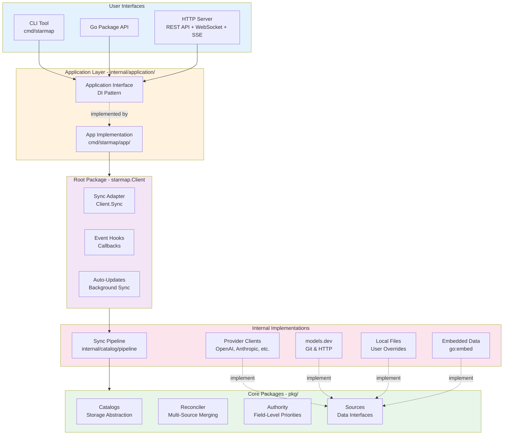
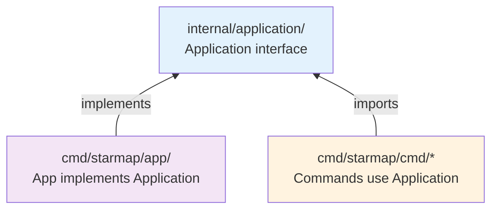
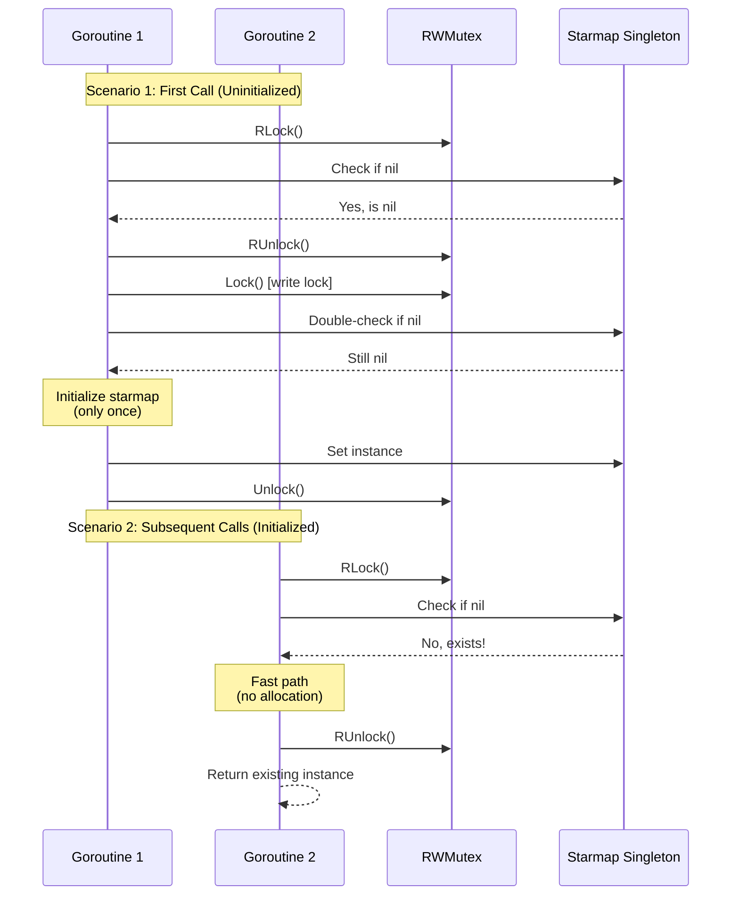
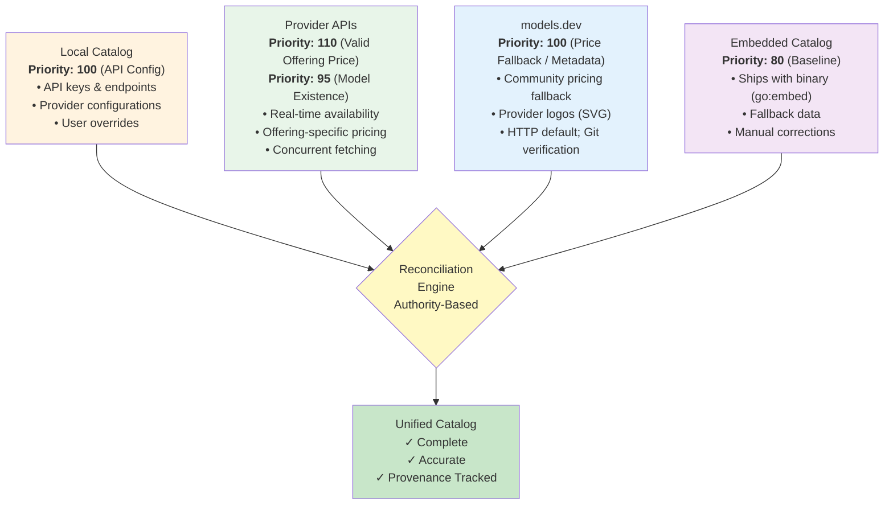
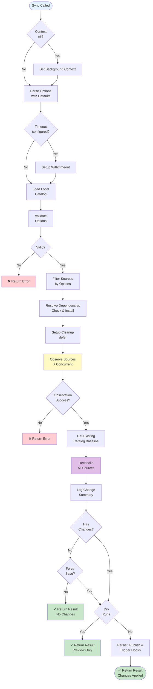
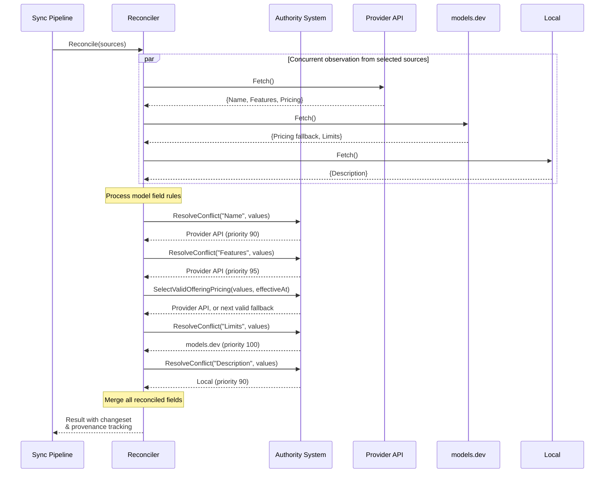
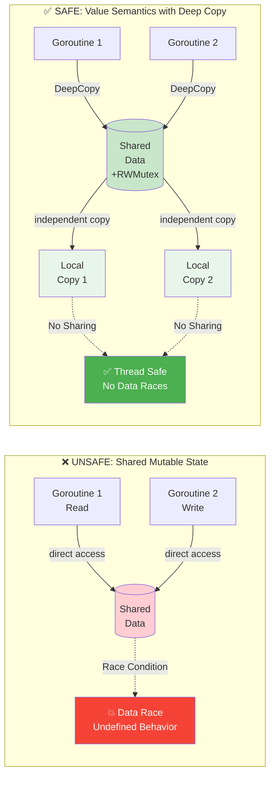
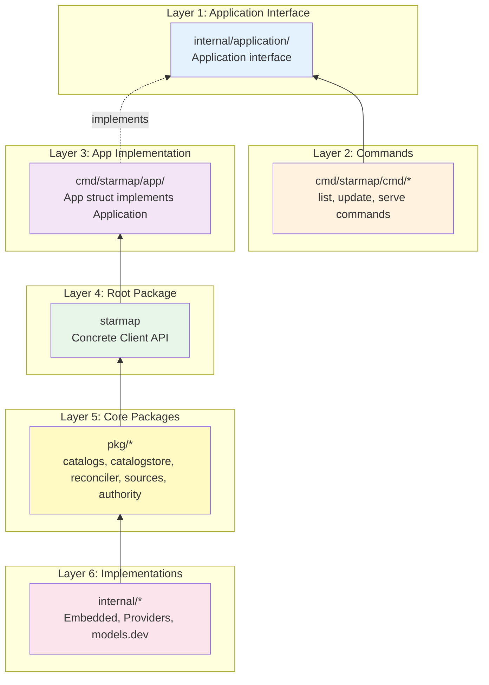

# Starmap Architecture

> Technical deep dive into Starmap's system design, components, and patterns

**Last Updated:** 2026-07-09
**Status:** Production-ready architecture following idiomatic Go patterns

## Table of Contents

- [Overview](#overview)
- [Design Principles](#design-principles)
- [System Components](#system-components)
- [Application Layer](#application-layer)
- [CLI Architecture](#cli-architecture)
- [Core Package Layer](#core-package-layer)
- [Root Package (starmap.Client)](#root-package-starmapclient)
- [Data Sources](#data-sources)
- [Sync Pipeline](#sync-pipeline)
- [Reconciliation System](#reconciliation-system)
- [Real-Time Event Delivery](#real-time-event-delivery)
- [Thread Safety](#thread-safety)
- [Package Organization](#package-organization)
- [Testing Strategy](#testing-strategy)
- [References](#references)

## Overview

Starmap is a unified AI model catalog system that combines data from multiple sources into a single authoritative catalog. The architecture follows idiomatic Go patterns with a focus on:

- **Separation of concerns**: Clear boundaries between layers
- **Dependency injection**: Interface-based design for testability
- **Thread safety**: Value semantics and proper synchronization
- **Extensibility**: Plugin patterns for sources, strategies, and storage backends

### High-Level Architecture


```mermaid
graph TB
    subgraph UI["User Interfaces"]
        CLI[CLI Tool<br/>cmd/starmap]
        GO[Go Package API]
        HTTP[HTTP Server<br/>REST API + WebSocket + SSE]
    end

    subgraph APP["Application Layer - internal/application/"]
        APPIF[Application Interface<br/>DI Pattern]
        APPIMPL[App Implementation<br/>cmd/starmap/app/]
    end

    subgraph ROOT["Root Package - starmap.Client"]
        SYNC[Sync Adapter<br/>Client.Sync]
        HOOKS[Event Hooks<br/>Callbacks]
        AUTO[Auto-Updates<br/>Background Sync]
    end

    subgraph CORE["Core Packages - pkg/"]
        CAT[Catalogs<br/>Storage Abstraction]
        REC[Reconciler<br/>Multi-Source Merging]
        AUTH[Authority<br/>Field-Level Priorities]
        SOURCES[Sources<br/>Data Interfaces]
    end

    subgraph IMPL["Internal Implementations"]
        PIPE[Sync Pipeline<br/>internal/catalog/pipeline]
        EMBED[Embedded Data<br/>go:embed]
        PROVS[Provider Clients<br/>OpenAI, Anthropic, etc.]
        MODELS[models.dev<br/>Git & HTTP]
        LOCAL[Local Files<br/>User Overrides]
    end

    CLI --> APPIF
    GO --> APPIF
    HTTP --> APPIF
    APPIF -.implemented by.-> APPIMPL
    APPIMPL --> ROOT
    ROOT --> PIPE
    PIPE --> CORE
    PROVS & MODELS & LOCAL & EMBED -.implement.-> SOURCES

    style UI fill:#e3f2fd
    style APP fill:#fff3e0
    style ROOT fill:#f3e5f5
    style CORE fill:#e8f5e9
    style IMPL fill:#fce4ec
```

**Architecture Layers:**
1. **User Interfaces**: Multiple entry points (CLI, Go package, HTTP API)
2. **Application Layer**: Dependency injection pattern with interface/implementation separation
3. **Root Package**: Public API with sync orchestration, hooks, and lifecycle management
4. **Core Packages**: Reusable business logic for catalog management and reconciliation
5. **Internal Implementations**: Provider-specific code and data sources

## Design Principles

### 1. Interface Segregation
- **Define interfaces where they're used** (Go proverb)
- Application interface in `internal/application/` (reusable across binaries)
- Implementation in `cmd/starmap/app/` (concrete types)
- Commands depend only on what they need

### 2. Dependency Injection
- Constructor injection via functional options
- Interface-based contracts
- Easy mocking for tests
- Example: `NewCommand(app application.Application)`

### 3. Thread Safety
- Value semantics for collections
- Deep copy once at immutable catalog publication
- Atomic generation reads; caller-owned copies at collection boundaries
- Double-checked locking for singletons
- RWMutex for concurrent access
- See [Thread Safety](#thread-safety) section for details

### 4. Single Responsibility
- Each package has one clear purpose
- Catalog: storage abstraction
- Reconciler: multi-source merging
- Authority: field-level priorities
- Sources: data fetching

### 5. Explicit Error Handling
- Typed errors in `pkg/errors`
- No panics in library code
- Errors wrap context
- Examples: `NotFoundError`, `SyncError`, `APIError`

## System Components

### Layer Responsibilities

1. **Application Layer** (`internal/application/`, `cmd/starmap/app/`)
   - Dependency injection
   - Configuration management
   - Lifecycle control (startup/shutdown)
   - Singleton management

2. **Root Package** (`starmap.Client`)
   - Public API surface
   - Sync adapter into `internal/catalog/pipeline`
   - Event hooks
   - Atomic immutable generation publication

3. **Core Packages** (`pkg/`)
   - Catalog domain and immutable reads (`pkg/catalogs/`)
   - Transactional generation storage (`pkg/catalogstore/`)
   - Multi-source reconciliation (`pkg/reconciler/`)
   - Field-level authority (`pkg/authority/`)
   - Data source abstractions (`pkg/sources/`)

4. **Internal Implementations** (`internal/`)
   - Embedded catalog data
   - Provider API clients
   - models.dev integration
   - Transport utilities
   - Shared catalog query behavior for CLI and HTTP adapters

## Application Layer

### Application Interface

Location: `internal/application/application.go`

**Design Philosophy:**
- "Accept interfaces, return structs" (Go proverb)
- "Define interfaces where they're used" (idiomatic Go)
- Located in `internal/application` for internal package organization
- Zero import cycles (unidirectional dependency flow)

**Interface Definition:**

```go
type Application interface {
    // Catalog adapts the concrete immutable catalog for command callers
    Catalog() (*catalogs.Catalog, error)

    // Starmap returns starmap instance with optional configuration
    // Without options: returns cached instance (thread-safe singleton)
    // With options: creates new instance (no caching)
    Starmap(opts ...starmap.Option) (*starmap.Client, error)

    // Logger returns the configured logger
    Logger() *zerolog.Logger

    // OutputFormat returns configured output format
    OutputFormat() string

    // Version info methods
    Version() string
    Commit() string
    Date() string
    BuiltBy() string
}
```

### Interface seam inventory

Starmap applies the deletion test to interfaces: retain them at algorithm,
transport, or application input boundaries only when there are multiple real
adapters, or when an executable alternate adapter proves the extension seam.
Constructors return concrete types when a package owns one implementation.

| Interface seam | Count | Adapters exercised by the repository | Disposition |
|---|---:|---|---|
| `catalogs.Reader` | 2 | `*catalogs.Builder`, `*catalogs.Catalog` | Retained algorithm input; `TestSeamConformanceReaderHasBuilderAndCatalogAdapters` executes both |
| Catalog collection readers | 2 each | Mutable `Providers`/`Authors`/`Endpoints`/`Models`/`Provenance` and immutable reader wrappers | Retained read-only collection boundaries with two implementations each |
| `catalogstore.Store` | 4 | memory, filesystem, SQLite, conditional object storage | Retained generation-storage boundary; all adapters run the same `TestCatalogStoreConformance` suite |
| `catalogstore.ObjectBackend` | 2 | memory reference backend, recording alternate backend | Retained cloud-object input; `TestSeamConformanceObjectStoreAcceptsAlternateBackend` executes replacement injection |
| `authority.Authority` | 2 | default authorities, custom `seamAuthority` | Retained policy input; `TestSeamConformanceAuthorityAcceptsCustomAdapter` proves replacement policy |
| `provenance.Tracker` | 2 | in-memory tracker, custom `seamTracker` | Retained observation input; `TestSeamConformancePipelineAcceptsCustomTracker` proves replacement tracking |
| `enhancer.Enhancer` | 4 | `ModelsDevEnhancer`, `MetadataEnhancer`, `ChainEnhancer`, test enhancer | Retained plugin boundary; compile assertions cover all built-ins and pipeline tests execute alternates |
| `reconciler.Strategy` and internal `resourceConflictResolver` | 2 each | authority and source-order strategies | Retained policy boundaries with two production algorithms |
| `sources.Source` | 5+ | local, provider, models.dev HTTP, models.dev Git, test sources | Retained source/plugin boundary with four production adapters |
| Public and internal provider-client seams | 4+ each | OpenAI-compatible, Anthropic, Google, injected fakes | Retained provider transport boundaries with three production families |
| `application.Application` | 2 | CLI `App`, `application.Mock` | Retained consumer-owned command boundary; compile assertions cover both |
| Pipeline `Store` | 2 | root `pipelineStore`, `pipelineTestStore` | Retained consumer-owned persistence boundary |
| Pipeline `providerSetter` | 2 | `*catalogs.Builder`, failing test adapter | Retained failure-injection boundary exercised by pipeline tests |
| Update `syncClient` | 2 | `*starmap.Client`, `recordingSyncClient` | Retained command boundary exercised without network calls |
| Attribution `Matcher` | 2 | compiled matcher, custom `seamMatcher` | Retained composite-algorithm input; `TestSeamConformanceMultiMatcherAcceptsCustomAdapter` proves injection |
| CLI hints `Provider` | 2 | `ProviderFunc`, named provider | Retained registry/plugin boundary with two adapters |
| CLI `Formatter` | 4 | JSON, YAML, table, function adapter | Retained output boundary with four adapters |
| CLI alerts `Writer` | 2 | function and structured format writers | Retained output boundary with two adapters |
| Transport `Authenticator` | 5 | no-auth, bearer, header, query, provider auth | Retained transport policy boundary with five adapters |
| Event `Subscriber` | 2 | SSE and WebSocket subscribers | Retained fan-out boundary with two production transports |

Deleted one-adapter or unused abstractions include the exported `Snapshot`, the
catalog `Builder`, `Writer`, `Merger`, `Copier`, and `Persistence` interfaces,
the root `Client`, `Catalog`, `Updater`, `AutoUpdater`, `Hooks`, and
`Persistence` capability interfaces, reconciler `Merger` and `Reconciler`,
differ `Differ`, and provenance `Auditor`. `Builder`, `Client`, `Reconciler`,
and `Differ` are now concrete product types; mutation and publication remain
separate.

The root client exposes explicit idempotent `Sync`/`Update` operations and owns
no ticker, cadence lifecycle, retry loop, or constructor-started goroutine.
Starport and deployment composition own scheduling, startup policy, jitter,
leases, and HA coordination. Custom candidate construction uses the
context-aware `WithUpdateFunc` seam; it does not imply cadence.

### Application dependency flow


```mermaid
flowchart BT
    APP[cmd/starmap/app/<br/>App implements Application]
    CMD[cmd/starmap/cmd/*<br/>Commands use Application]
    INT[internal/application/<br/>Application interface]

    APP -->|implements| INT
    CMD -->|imports| INT

    style INT fill:#e3f2fd
    style CMD fill:#fff3e0
    style APP fill:#f3e5f5
```

**Key Points:**
- Commands depend only on the interface, not the implementation
- App is injected into commands at runtime
- Zero import cycles (unidirectional dependencies)
- Easy to test with mock implementations

### App Implementation

Location: `cmd/starmap/app/app.go`

**Responsibilities:**
- Implements `Application` interface
- Manages configuration, logger, starmap singleton
- Thread-safe lazy initialization
- Graceful lifecycle management

**Key Components:**

```go
type App struct {
    version string
    commit  string
    date    string
    builtBy string

    config  *Config
    logger  *zerolog.Logger

    mu      sync.RWMutex
    starmap starmap.Client  // Lazy-initialized singleton
}
```

**Thread-Safe Singleton Pattern:**

The App uses double-checked locking for optimal performance:

```go
func (a *App) Starmap(opts ...starmap.Option) (starmap.Client, error) {
    // Fast path: read lock check
    a.mu.RLock()
    if a.starmap != nil && len(opts) == 0 {
        sm := a.starmap
        a.mu.RUnlock()
        return sm, nil
    }
    a.mu.RUnlock()

    // Slow path: write lock initialization
    a.mu.Lock()
    defer a.mu.Unlock()

    // Double-check after acquiring write lock
    if a.starmap != nil && len(opts) == 0 {
        return a.starmap, nil
    }

    // Create instance (new if opts provided)
    sm, err := starmap.New(...)
    if err != nil {
        return nil, err
    }

    // Cache only if no custom options
    if len(opts) == 0 {
        a.starmap = sm
    }

    return sm, nil
}
```

**Visual Representation of Double-Checked Locking:**


```mermaid
sequenceDiagram
    participant G1 as Goroutine 1
    participant G2 as Goroutine 2
    participant Lock as RWMutex
    participant SM as Starmap Singleton

    Note over G1,G2: Scenario 1: First Call (Uninitialized)
    G1->>Lock: RLock()
    G1->>SM: Check if nil
    SM-->>G1: Yes, is nil
    G1->>Lock: RUnlock()

    G1->>Lock: Lock() [write lock]
    G1->>SM: Double-check if nil
    SM-->>G1: Still nil
    Note over G1: Initialize starmap<br/>(only once)
    G1->>SM: Set instance
    G1->>Lock: Unlock()

    Note over G1,G2: Scenario 2: Subsequent Calls (Initialized)
    G2->>Lock: RLock()
    G2->>SM: Check if nil
    SM-->>G2: No, exists!
    Note over G2: Fast path<br/>(no allocation)
    G2->>Lock: RUnlock()
    G2-->>G2: Return existing instance
```

**Why This Pattern?**
- **First Check (Read Lock)**: Fast path for the common case (already initialized)
- **Write Lock Acquisition**: Only when initialization needed
- **Second Check (Write Lock)**: Prevent race condition between locks
- **Result**: Thread-safe singleton with minimal overhead

## CLI Architecture

### Design Philosophy

Starmap's CLI is built on these core principles:

1. **POSIX Compliance**: Standard Unix flag conventions (`-o`, `--output`)
2. **Discoverability**: Clear help text, intuitive command names
3. **Consistency**: Same patterns across all commands
4. **Ergonomics**: Short flags for common operations, sensible defaults

### Command Structure

Commands follow the **VERB-NOUN pattern** borrowed from kubectl and other modern CLIs:

```
starmap <verb> <noun> [arguments] [flags]
        ↓      ↓         ↓           ↓
     action  resource  identity   modifiers
```

**Examples:**
```bash
starmap models list                    # resource=models, subcommand=list
starmap providers fetch anthropic      # resource=providers, subcommand=fetch, arg=anthropic
starmap update openai                  # verb=update, arg=openai
```

**Command Groups:**
- **Setup Commands**: Getting started (auth, deps)
- **Catalog Commands**: Working with catalog resources (authors, models, providers, update)
- **Server Commands**: Running the API (serve)
- **Development Commands**: Debugging and exploration (embed, validate)
- **Additional Commands**: Utilities (completion, version, help)

### Flag Architecture

#### Global Flags (Reserved)

These flags are **always available** and must not be overridden by commands:

| Short | Long | Purpose | Notes |
|-------|------|---------|-------|
| `-v` | `--verbose` | Verbose output | Sets log level to debug |
| `-q` | `--quiet` | Minimal output | Sets log level to warn |
| `-o` | `--output` | Output format | table, json, yaml, wide |
| `-h` | `--help` | Show help | Built-in Cobra flag |

**Why `-o` for output?**
- Avoids conflict with embed cat's `--filename` (`-f`)
- Matches common tools like `gcc -o output`
- Frees up `-f` for `--force` in commands that need it

#### Resource Filter Flags

Added programmatically via `globals.AddResourceFlags()`:

| Short | Long | Purpose |
|-------|------|---------|
| `-p` | `--provider` | Filter by provider |
| | `--author` | Filter by author |
| | `--search` | Search term |
| `-l` | `--limit` | Limit results |

#### Command-Specific Flags

Commands define their own flags that don't conflict with global flags:

**Update Command:**
- `-f` / `--force` - Force fresh update
- `-y` / `--yes` - Auto-approve changes
- `--dry` - Preview changes (primary)
- `--dry-run` - Preview changes (deprecated alias)

**Embed Commands:**
- Custom help flag (`-?`) frees up `-h` and `-f`
- `ls -h` - Human-readable sizes (like Unix ls)
- `cat -f` - Show filename before content

### Architectural Decisions

#### 1. Positional Arguments vs Flags

**Decision**: Use positional arguments for **identity/resource**, flags for **options/modifiers**

**Rationale:**
```bash
# ✅ Good: Resource is positional, options are flags
starmap update openai --dry

# ❌ Avoided: Resource as flag feels less natural
starmap update --provider openai --dry
```

**Pattern:**
- Positional = "What to act on" (which provider, which model)
- Flags = "How to act" (dry run, force, output format)

#### 2. Breaking Changes Strategy

**Decision**: Clean breaks acceptable for young projects (<1.0)

**Rationale:**
- Project is pre-1.0, rapid iteration beneficial
- Clear communication via commit messages
- Deprecation periods add complexity without benefit at this stage
- Post-1.0: Will use proper deprecation (6-12 months)

**Example from Phase 2:**
```bash
# Before (v0.x)
starmap update --provider openai

# After (v0.x+1) - Clean break
starmap update openai

# Commit message included migration guide
```

#### 3. Custom Help Flags

**Decision**: Allow command groups to override `-h` with custom patterns

**Rationale:**
- Embed commands need Unix-like flags (`ls -h` for human-readable)
- Solution: Parent command defines `-?` for help
- All subcommands inherit this, freeing `-h` and `-f`

**Implementation:**
```go
// Parent: cmd/starmap/app/commands.go
cmd.PersistentFlags().BoolP("help", "?", false, "help for embed commands")

// Now subcommands can use -h
LsCmd.Flags().BoolVarP(&lsHuman, "human-readable", "h", false, "...")
```

#### 4. Hidden Alias Flags

**Decision**: Support backward compatibility via hidden aliases

**Rationale:**
- Users may have scripts depending on old flags
- Hidden flags don't clutter help text
- Smooth migration path

**Example:**
```go
// Primary flag (shown in help)
rootCmd.PersistentFlags().StringVarP(&a.config.Output, "output", "o", "", "...")

// Hidden aliases (backward compat)
rootCmd.PersistentFlags().StringVar(&a.config.Output, "format", "", "")
_ = rootCmd.PersistentFlags().MarkHidden("format")
```

### Implementation Details

**Framework**: [Cobra](https://github.com/spf13/cobra) - Industry-standard Go CLI library

**Key Files:**
- `cmd/starmap/app/execute.go` - Root command and global flags
- `cmd/starmap/app/commands.go` - Command registration
- `internal/cli/globals/` - Shared flag utilities
- `cmd/starmap/cmd/*/` - Individual command implementations

**For comprehensive CLI reference and implementation guidelines**, see **[CLI.md](CLI.md)**.

## Core Package Layer

### Catalogs Package

Location: `pkg/catalogs/`

**Purpose:** Immutable catalog product plus a separate advanced construction type

**Key Types:**
- `Catalog` - Concrete immutable catalog returned to consumers
- `Builder` - Concrete mutable construction type for sources/plugins and update pipelines
- `Reader` - Narrow algorithm-input interface implemented by both types
- `Model`, `Provider`, `Author`, `Endpoint` - Core data types
- Collections: `Providers`, `Authors`, `Models`, `Endpoints`

**Storage Backends:**
- Memory (testing)
- Filesystem (development)
- Embedded (production)
- Custom FS (S3, GCS, etc.)

**Thread Safety:** Value semantics, all List() methods return slices of values (not pointers)

See [pkg/catalogs/README.md](../pkg/catalogs/README.md) for details.

### Generation manifest contract

`catalogs.GenerationManifest` is the transport-neutral identity and audit record
for one immutable catalog payload. P3.1 defines the contract; P3.2 and later
store work is responsible for committing and activating it atomically.

| Manifest field | Meaning |
|---|---|
| `manifest_version` | Version of the manifest envelope itself |
| `schema_version` | Version of the canonical catalog payload schema |
| `generation_id`, `generated_at` | Immutable generation identity and UTC creation time |
| `payload` | SHA-256 checksum, exact byte size, and canonical media type |
| `validation` | Validator version/time, overall status, counts, and named check results |
| `sync_run_id` | Correlation ID for the synchronization attempt that built the candidate |
| `source_observations` | Source/observation IDs and evidence checksums needed for audit and replay |
| `completeness`, `degraded`, `degradation_reasons` | Separate record-coverage and quality/fallback state |
| `consumer_compatibility` | Inclusive catalog-schema range; never a Starmap or Starport binary range |

Publication eligibility requires a passed validation report, no failed checks,
valid checksums, a non-empty observation set, internally consistent
completeness/degradation state, and a schema version inside the declared
consumer range. The checked-in JSON Schema, example manifest, and exact payload
fixture live in `pkg/catalogs/testdata/generation/`.

### Catalog distribution artifact

`pkg/catalogartifact` packages one validated `catalogstore.Generation` as a
deterministic archive plus detached in-toto statement. The archive contains a
strict descriptor, the complete generation manifest, and the exact canonical
payload. Rebuilds of identical inputs are byte-identical; opening revalidates
the manifest/payload binding, member descriptors, compatibility identity, and
all statement subjects before returning a generation. See
[Catalog Artifact Format](CATALOG_ARTIFACT_FORMAT.md).

Generation IDs are immutable logical IDs. SHA-256 independently content-addresses
the payload and archive; schema compatibility is not coupled to binary versions.
Release staging writes archive, statement, and checksum as one fsynced atomic
directory; exact retries are idempotent and same-generation byte changes are
typed conflicts. The GitHub tag workflow uploads these assets without an
overwrite flag.

`pkg/catalogremote` owns the online Starmap-to-Starmap protocol. A client reads
the current strict manifest from a versioned API base, then fetches the exact
generation-addressed canonical snapshot. Strict media type, body bounds,
catalog-schema compatibility, size, and checksum validation all precede decode
and compare-and-swap publication. The server and root remote-update path share
these route constants; the old ad-hoc unversioned catalog envelope is removed.
See [Remote Catalog Protocol](REMOTE_CATALOG_PROTOCOL.md).

`pkg/catalogdistribution` owns the separate hosted protocol. A small
latest-compatible pointer selects immutable archive and attestation URLs under
the same origin; the client verifies pointer compatibility, URL origin, media
type, size, checksum, artifact, statement, and downloaded manifest identity.
The handler reads through a narrow repository boundary. Hosted pointers are
explicit `dev`, `canary`, or `stable` channels, with stable as the consumer
default. Promotion is ordered dev-to-canary-to-stable; stable additionally
requires recent hosted canary evidence for availability, generation freshness,
latency, and exact archive identity. Promotion failures and successes are
queryable telemetry. Reasoned rollback may select only a generation previously
served by that channel and never deletes immutable history. See
[Hosted Catalog Distribution](HOSTED_CATALOG_DISTRIBUTION.md).
Channel-specific trust roots and availability/freshness tradeoffs are defined in
[Catalog Distribution Trust Model](CATALOG_DISTRIBUTION_TRUST.md).

The embedded fallback has a separate checked-in budget gate for generation age,
canonical uncompressed payload size, deterministic compressed archive size, and
minimum provider/model coverage. Runtime readiness and hosted CI report distinct
evidence. See [Embedded Catalog Budgets](EMBEDDED_CATALOG_BUDGETS.md).

Repository-owned [Scheduled Catalog Generation](SCHEDULED_CATALOG_GENERATION.md)
runs daily or manually above the idempotent sync/generation boundary. It derives
new manifest identity only when canonical payload bytes change, validates and
attests before immutable payload-digest release publication, and never uses
Actions artifacts as runtime distribution.

Deployment-owned [Durable Scheduling](DURABLE_SCHEDULING.md) composes a narrow
Syncer with a named Lease. Contending replicas skip before source work. The
reference lease uses expiry plus fencing, and the filesystem adapter coordinates
independent processes on a shared volume; Starport can supply a distributed
adapter without changing Starmap's core client. Scheduled triggers add bounded
pre-lease jitter; typed retry is fail-closed and bounded while the lease remains
held. An optional RunLedger begins before acquisition, records every attempt,
and completes with the base and published generation identities. Memory and
SQLite reference adapters make lifecycle semantics and crash-visible `running`
records executable; Starport can bind the same narrow interface to its database.
Successful Sync results also expose validated source-observation projections
even when catalog bytes do not change. An explicit deployment FreshnessPolicy
turns those observations into ready/degraded/unready states and stable alerts;
there are no implicit SLA durations. Out-of-order completion cannot regress the
latest source evidence, and a current generation can seed state after restart.
An `InitialRunController` requires one of blocking, background, or schedule-only
startup modes. It composes an explicit baseline-readiness probe, performs at
most one startup attempt, and coalesces only scheduled due-times inside a
configured window. Failed startup never suppresses the recovery tick. The
controller remains passive and owns no ticker.

### CatalogStore contract

`pkg/catalogstore.Store` persists a `Generation` (manifest plus exact payload)
and exposes `Current`, `Get`, and `Commit`. Every commit is compare-and-swap:
the caller supplies the expected current generation ID, with an empty ID meaning
the store must still be empty. Implementations validate the manifest and payload
before storage, retain old immutable generations, return caller-owned bytes, and
make an identical retry idempotent.

| Adapter | Baseline P3.2 mechanism | Later hardening owner |
|---|---|---|
| Memory | Locked immutable map and current ID | Reference semantics/conformance |
| Filesystem | Cross-instance advisory commit lock plus fsynced immutable directory/current rename | P3.3/P3.5 durability and same-base CAS complete |
| SQLite | Serializable `database/sql` transaction over generation/current tables | P3.8 rollback, reactivation, deletion, CAS, reopen, and fault matrix complete |
| Object | Immutable manifest/payload objects plus version-conditional current object | P3.9 upload/promotion faults, corruption, rollback, deletion, CAS, and reopen complete |

The shared conformance suite covers empty reads, commit/current/get, immutable
ownership, durable reopen, retained history, idempotent retries, stale CAS,
checksum rejection, generation-ID collisions, and cancellation. Passing the
baseline suite does not substitute for the later adapter-specific fault gates.
The concurrent same-base matrix opens independent adapters over one backend and
requires exactly one success and one typed conflict. SQLite deployments use
immediate transactions with bounded busy waiting; filesystem writers coordinate
through a context-aware advisory lock shared across processes.

`Builder.Save` materializes an optional editable YAML export using replacement
semantics for its managed YAML indexes and provider/author model trees, so
deleted records cannot survive a
save/reload. It deliberately preserves unmanaged neighboring files such as
logos and operator notes. It is a portable materialization, not a second
transactional database: a process failure or rejected durable commit can leave
that directory temporarily ahead of or behind the authoritative generation.
Production readers must consume `catalogstore.Store`/the immutable distribution
protocol rather than serve the YAML view directly; restart with a durable
current deliberately ignores the export view. Catalog-generation jobs
may still use it as an explicit checked export.

The root client makes that dependency explicit: `WithCatalogStore` is required
before any non-dry manual, remote, server-triggered, or scheduled mutation. The
preflight runs before source fetch, custom callbacks, remote HTTP, or scheduler
startup and returns a typed `errors.ConfigError` when the store is absent.
Read-only construction, `Catalog`, and dry-run synchronization remain usable
without a store. The CLI composition root supplies a passive filesystem store
at `catalog_path` (default `~/.starmap/catalog`); constructing the adapter does
not create storage until its first commit. Optional editable YAML uses
`catalog_export_path` and defaults to `~/.starmap/exports/catalog` for CLI
materialization. Database and export roots must not contain one another, even
through an existing symlink. Cache, source evidence, logs, configuration, YAML
exports, and immutable generations remain separate lifecycle domains.

An explicitly configured catalog export is optional only when its path does not
exist. `NewLocal` detects the wrapped `os.ErrNotExist` and uses the embedded
bootstrap; malformed provider, author, provenance, or model YAML and other I/O
or validation failures remain typed errors. When a configured CatalogStore has
a current generation, that validated durable generation is authoritative and
export YAML is not parsed; this prevents a stale or partially materialized
export view from blocking restart. Export YAML is consulted only when no
durable current exists.

The embedded bootstrap has a strict embedded `generation.json` binding its
generation ID, generation time, catalog schema version, canonical payload
SHA-256, and byte size. `starmap.New` verifies that manifest entirely offline
before publication. `Client.Readiness` reports the generation metadata and age;
`WithEmbeddedBootstrapMaxAge` and `WithEmbeddedBootstrapMaxSizeBytes` make the
HTTP readiness endpoint fail with stable reason codes while an out-of-budget
bootstrap remains active. A committed generation supersedes bootstrap budgets.
The CLI/server composition root accepts the same policies through
`embedded_bootstrap_max_age` and `embedded_bootstrap_max_size_bytes` (or their
uppercase environment-variable forms).

The documented pre-generation directory format is frozen under
`pkg/catalogstore/testdata/legacy-v0/`. `MigrateLegacyDirectory` parses that
format without mutation, requires caller-supplied generation/run/observation
identity and UTC time, and deterministically emits schema-v1 `CatalogPayload`
bytes plus a validated manifest. Provider-specific and author model indexes are
encoded separately because the legacy record structs intentionally exclude
their runtime model maps from JSON/YAML indexes.

### Reconciler Package

Location: `pkg/reconciler/`

**Purpose:** Multi-source data reconciliation with conflict resolution

**Key Components:**
- `Reconciler` concrete engine
- `Strategy` - Defines how conflicts are resolved
- Field rule catalog - Package-internal model/provider/author field inventory
- `Result` - Reconciliation outcome with changeset and metadata

**Strategies:**
1. **AuthorityStrategy** - Field-level authority priorities
2. **SourceOrderStrategy** - Fixed source precedence order

**Pipeline:**
1. Fetch catalogs from all sources
2. Merge using configured strategy
3. Detect changes vs baseline
4. Generate changeset with provenance
5. Return result

**Field Rules:**
`pkg/reconciler/field_rules.go` is the canonical inventory for reconciled fields. Each rule carries the resource type, reflection path, authority path, and provenance path. The merger iterates this catalog instead of local string slices, so adding or renaming a catalog field requires updating one rule table and the matching authority entry. Tests verify that every model, provider, and author rule points at a real struct field and resolves through the authority system.

See [pkg/reconciler/README.md](../pkg/reconciler/README.md) for details.

### Authority Package

Location: `pkg/authority/`

**Purpose:** Field-level source authority system

**How It Works:**
- Each field (e.g., "Pricing", "Limits") has authority configuration
- Sources ranked by priority for that field
- Pattern matching supports wildcards: "Pricing.*"
- Higher priority wins in conflicts

**Example Authorities:**

```go
// Pricing - a valid provider-offering observation wins atomically
{Path: "Pricing", Source: sources.ProvidersID, Priority: 110}
{Path: "Pricing", Source: sources.ModelsDevHTTPID, Priority: 100}

// Availability - Provider API is truth
{Path: "Features", Source: sources.ProvidersID, Priority: 95}

// Descriptions - prefer manual edits
{Path: "Description", Source: sources.LocalCatalogID, Priority: 90}
```

See `pkg/authority/authority.go` for legacy field authority configuration.
The canonical definition/offering inventory and merge/empty semantics are
documented in [CATALOG_AUTHORITY_POLICY.md](CATALOG_AUTHORITY_POLICY.md) and
enforced by `pkg/authority.CanonicalPolicies` coverage tests.

Source decoding uses scoped strictness rather than a global permissive or
strict mode. Identity and container type drift rejects its source/record scope;
unknown additive members are preserved inside extensions or classified as
reviewable evidence before promotion. The executable inventory and rationale
are documented in [SCHEMA_DRIFT_POLICY.md](SCHEMA_DRIFT_POLICY.md) and exposed
by `pkg/sources.SchemaDriftPolicies`.

### Sources Package

Location: `pkg/sources/`

**Purpose:** Reentrant observation boundary for external catalog data

**Source Interface:**

```go
type Source interface {
    ID() ID
    Name() string
    Observe(ctx context.Context, opts ...Option) (Observation, error)
    Cleanup() error
    Dependencies() []Dependency
    IsOptional() bool
}

type Observation struct {
    ID               string
    SourceID         ID
    ObservedAt       time.Time
    Revision         Revision
    Completeness     ObservationCompleteness
    Status           ObservationStatus
    EvidenceChecksum string
    Catalog          *catalogs.Catalog
}
```

`Observe` returns one immutable result directly. Implementations are safe for
repeated and concurrent calls and never require stateful `Fetch` then `Catalog`
ordering. Each call builds its mutable candidate off to the side and publishes
only the resulting immutable catalog. Observation construction deterministically
encodes the normalized catalog, binds its SHA-256 evidence checksum, and derives
an event ID from source, UTC observation time, revision, completeness, status,
and checksum. HTTP ETags and exact Git commits are preferred when available;
until those transport-specific revisions are exposed, adapters explicitly use
the normalized content digest rather than inventing an upstream revision.
models.dev transport loaders execute per observation and honor that source
instance's configured directory; no package-level `sync.Once` or cached parsed
API survives between scheduled/manual calls. The HTTP transport may still reuse
a validated on-disk response under its explicit cache policy, while parsing it
again for every observation. A versioned sidecar binds cache origin,
validation time, ETag/Last-Modified, and the raw response checksum to the exact
`api.json` bytes. Only a checksum-matching sidecar can supply conditional
headers or be classified as fresh. After TTL, ETag is preferred and
Last-Modified is the fallback validator; a valid `304 Not Modified` refreshes
the sidecar without transferring or rewriting the catalog body, and its exact
validator becomes the observation revision. A missing/mismatched sidecar forces
an unconditional fetch and can only degrade to unverified stale fallback.
Embedded cache origin is retained across reuse and therefore never becomes a
successful fresh HTTP observation. Git verification checks/builds its
configured checkout for every observation. Because Git is an explicit
verification transport, callers must supply an exact 40- or 64-character commit
through `sync.WithModelsDevGitCommit` (or the corresponding CLI flag); branch
names and empty revisions fail validation before clone/fetch. The Git client
fetches that object, uses a forced detached checkout, verifies `HEAD`, hashes
`bun.lock`, runs `bun install --frozen-lockfile`, and rejects any lockfile
mutation. Its observation revision records the exact Git commit plus lockfile
path and SHA-256, so the build input can be reproduced after the remote branch
moves.

The pipeline validates every observation before reconciliation. Durable
generation manifests preserve the exact observation ID, UTC time, revision,
completeness, typed status, and evidence checksum; they never substitute the
final reconciled catalog checksum for source evidence. A partial observation
forces partial/degraded generation state.

`pkg/sourceevidence` implements the separate evidence-retention boundary. Its
long-term normalized record contains the canonical catalog payload (including
provenance), observation metadata, checksum, and machine-readable issue
scope/code/subject. Diagnostic issue messages are deliberately omitted because
they can contain upstream response text or credentials. Loading a normalized
record verifies its payload checksum and reconstructs the same observation ID,
candidate catalog bytes, and provenance before it can be used for replay.

Raw evidence is response-body-only: request headers, query parameters, and
credentials have no representation in the retained type. `Archive` encrypts it
with AES-256-GCM using a caller-supplied 32-byte key, binds the ciphertext to
the observation ID and expiry, writes directories/files with `0700`/`0600`
permissions, and uses fsynced atomic replacement. The default raw retention is
24 hours and the enforced maximum is seven days; `PurgeExpiredRaw` removes
expired envelopes. Archive construction is passive, and normalized evidence
can be retained independently of optional raw retention.

Observation outcomes use one explicit policy:

- a non-nil Go error means the source call failed and produced no policy-usable
  observation (a diagnostic partial catalog may accompany it, but publication
  stops);
- a usable incomplete result returns nil error with `partial`/`degraded` state
  and typed issues, so valid sibling providers/records remain reconcilable;
- issue scope is exactly `record`, `provider`, `source`, or `stale_fallback`;
  record/provider issues name their subject and every issue carries a stable
  code and message;
- missing provider credentials/configuration and provider fetch failures are
  provider-scoped partial degradation, not successful empty live fetches;
- stale last-known-good fallback is explicitly degraded (and can remain
  structurally complete), never mislabeled as a fresh success.

**Source Types:**
- **Provider APIs** (`sources.ProvidersID`) - Real-time model availability
- **models.dev HTTP** (`sources.ModelsDevHTTPID`) - Default production input,
  with validated disk-cache and embedded last-known-good fallback
- **models.dev Git** (`sources.ModelsDevGitID`) - Explicit build/verification
  transport; never runs alongside HTTP in one sync
- **Local Catalog** (`sources.LocalCatalogID`) - User overrides
- **Embedded** (`sources.EmbeddedID`) - Baseline data shipped with binary

See [pkg/sources/README.md](../pkg/sources/README.md) for details.
See [pkg/sourceevidence/README.md](../pkg/sourceevidence/README.md) for evidence retention and replay.

## Root Package (starmap.Client)

Location: `client.go`, `sync.go`

**Purpose:** Main public API with sync adapter, catalog access, persistence, and event hooks

### Concrete Client API

```go
type Client struct {
    // unexported state
}

func New(opts ...Option) (*Client, error)
func (c *Client) Catalog() *catalogs.Catalog
func (c *Client) Sync(ctx context.Context, opts ...sync.Option) (*sync.Result, error)
```

The root package returns concrete `*Client`; consumers that need substitution
define the smallest interface at their own use site. After `New` succeeds,
`Catalog` is non-failing, non-nil, O(1), and returns a retained immutable
generation.

### Functional Options Pattern

Used throughout for configuration:

```go
// Creating with options
store, err := catalogstore.NewFilesystem("./catalog")
if err != nil {
    return err
}
sm, err := starmap.New(
	starmap.WithCatalogStore(store),
    starmap.WithCatalogExportPath("./exports/catalog"),
)

// Sync with options
result, err := sm.Sync(ctx,
    sync.WithProvider("openai"),
    sync.WithDryRun(true),
    sync.WithTimeout(5 * time.Minute),
)
```

### Catalog Query Adapters

Location: `internal/catalog/query/`

CLI commands and HTTP handlers share catalog list behavior through `internal/catalog/query`. That package owns reusable filtering, stable ID sorting, limiting, and pagination for models, providers, and authors. Command and server packages still own input parsing, authentication, cache keys, transport responses, table formatting, and JSON/YAML output.

The HTTP model query contract validates every declared sort, order, range,
modality, feature, date, and pagination value before execution. Supported model
sorts are `id`, `name`, `release_date`, `context_window`, `created_at`, and
`updated_at`; missing date/numeric values sort last in either direction and ID
is the deterministic tie-breaker. Unsupported or malformed values return a
typed client error rather than silently changing semantics.

Each catalog publication also advances a monotonic process-local sequence tied
to the durable `generation_id`. Request handlers atomically read the immutable
catalog, generation ID, and sequence together, set `X-Starmap-Generation-ID`,
and use that pair as the cache namespace. Advancing a sequence flushes the old
namespace; an in-flight request from an older sequence cannot reactivate or
populate it. Only a successful durable commit swaps the catalog and emits the
asynchronous `catalog.published` event containing the same generation,
sync-run, and sequence identities. Failed commits change neither state nor
events, and an identical remote-generation retry is not republished.

`pkg/catalogscheduler.Operations` is the deployment composition boundary for
operator telemetry. It owns no ticker or update lifecycle: the deployment
injects its durable `RunLedger`, `FreshnessMonitor`, and optional
`InitialRunController`, then supplies the atomic catalog identity when reading
state. `GET /api/v1/operations` exposes the evaluated generation, source SLA
report, degraded source IDs, latest actual sync (excluding lease/coalescing
skips), and whether scheduler/startup telemetry is configured. A deployment
that has not wired scheduling reports `scheduler.configured=false` explicitly
instead of presenting fabricated freshness or success state.

This keeps adapters thin without moving UI-specific behavior into catalog storage:

```go
models := query.Models(cat.Models().List(), query.ModelOptions{
    Author:     flags.Author,
    Capability: capability,
    Search:     flags.Search,
    Limit:      flags.Limit,
})

page := query.Paginate(filteredModels, limit, offset)
```

## Data Sources

### Source Hierarchy and Authority

Data flows from multiple sources into the reconciliation engine, with each source having specific authority for different types of data:


```mermaid
graph TD
    LOCAL["Local Catalog<br/><b>Priority: 100</b> (API Config)<br/>• API keys & endpoints<br/>• Provider configurations<br/>• User overrides"]
    API["Provider APIs<br/><b>Priority: 110</b> (Valid Offering Price)<br/><b>Priority: 95</b> (Model Existence)<br/>• Real-time availability<br/>• Offering-specific pricing<br/>• Concurrent fetching"]
    MD["models.dev<br/><b>Priority: 100</b> (Price Fallback / Metadata)<br/>• Community pricing fallback<br/>• Provider logos (SVG)<br/>• HTTP default; Git verification"]
    EMB["Embedded Catalog<br/><b>Priority: 80</b> (Baseline)<br/>• Ships with binary (go:embed)<br/>• Fallback data<br/>• Manual corrections"]

    REC{Reconciliation<br/>Engine<br/>Authority-Based}
    CAT["Unified Catalog<br/>✓ Complete<br/>✓ Accurate<br/>✓ Provenance Tracked"]

    LOCAL --> REC
    API --> REC
    MD --> REC
    EMB --> REC
    REC --> CAT

    style LOCAL fill:#fff3e0
    style API fill:#e8f5e9
    style MD fill:#e3f2fd
    style EMB fill:#f3e5f5
    style REC fill:#fff9c4
    style CAT fill:#c8e6c9
```

**Authority Resolution:**
- **Pricing**: A semantically valid, currently effective provider observation
  wins for that provider offering; models.dev and local data are fallbacks
- **Limits**: models.dev remains the legacy reconciler authority while the
  canonical provider-offering policy is implemented
- **Model Existence**: Provider APIs determine what models actually exist
- **API Configuration**: Local catalog takes precedence (user's environment)
- **Baseline Data**: Embedded catalog provides defaults when other sources unavailable

**Provider Fetching Seam:**
Provider API acquisition has one implementation in the public
`pkg/sources.ProviderFetcher`: context timeouts, credential loading/preflight,
client construction, and `ListModels` execution. Model and raw fetches share the
same credential preflight. `internal/sources/providers` composes that concrete
fetcher to add bounded multi-provider concurrency, translate typed fetch errors
into observation issues, and associate models with provider catalog entries; it
does not own a second credential/client/fetch policy. Public/internal
conformance tests cover missing credentials, configuration errors, fetch
failures, and adapter call suppression.

Provider configuration and provider evidence are deliberately separated. The
configuration catalog may contain embedded or last-known-good models needed by
the baseline source, but `internal/sources/providers` removes those models from
its copied configuration before fetching. Its observation therefore contains
only models returned by that invocation. Missing credentials yield a
provider-scoped partial/degraded observation with zero live models, while a
successful fetch replaces bootstrap models instead of blending them into
current evidence. Reconciliation may still use the separately identified local
baseline observation according to authority policy.

Source and provider libraries never write directly to process stdout/stderr.
They emit context-bound zerolog events through `pkg/logging`; the pipeline adds
one `run_id` before source work, every source adds its stable `source`, and
provider-scoped work adds `provider_id`. Direct library callers can supply the
same correlation with `logging.WithRunID`. The operation `run_id` correlates
pre-publication logs and is intentionally distinct from the durable
`sync_run_id` assigned to a committed generation. AST and captured-output tests
prevent regressions to `fmt.Print*`, standard-log printing, or direct
`os.Stdout`/`os.Stderr` access in source/provider packages.

### Source Completeness Policy

Starmap treats source fields as an explicit contract. Every attribute from models.dev, provider APIs, local catalogs, and embedded catalogs must have one of three outcomes:

- mapped into canonical catalog schema when the field is broadly meaningful;
- preserved in a controlled `extensions` bucket when the field is source-specific but still useful;
- intentionally ignored with a documented reason and regression coverage when the field is operational noise or not meaningful to the catalog.

Canonical fields cover lifecycle status, lineage, context/input/output limits, generation controls, reasoning controls, tiered pricing, mode-specific pricing/request overrides, and provider/model metadata. Controlled extensions preserve source-specific details without letting them participate in field-authority decisions. Reconciliation merges extension buckets additively by source while the field-rule catalog continues to own canonical precedence.

Source-shape tests in `internal/sources/modelsdev` and `internal/providers/*` classify representative response paths so upstream schema drift fails deterministically. Live refreshes are opt-in and must write raw payloads outside the repository, print only normalized path summaries, and never persist secrets.

Every checked-in provider response fixture has an adjacent versioned metadata
record containing provider, capture time, content-digest source revision,
payload path/SHA-256, and an explicit maximum age (currently 365 days for the
legacy capture set). `internal/providers/testhelper` rejects missing, future,
stale, provider-mismatched, or checksum-mismatched metadata. Refresh helpers
write payload and metadata together; the Make target propagates test/fetch
failures and also fails when an alleged refresh changes neither file, preventing
`-update` no-ops from silently reporting success.

### Concurrent Fetching

Provider APIs are fetched concurrently with a bounded worker gate:

```go
// internal/sources/providers/providers.go
resultChan := make(chan providerModels, len(providerConfigs))
semaphore := make(chan struct{}, s.effectiveMaxConcurrency(len(providerConfigs)))

for _, provider := range providerConfigs {
    wg.Add(1)
    go func(p *catalogs.Provider) {
        defer wg.Done()
        semaphore <- struct{}{}
        defer func() { <-semaphore }()

        client, err := s.clientFactory(p)
        // Fetch, classify errors, and send provider result...
    }(provider)
}
```

## Sync Pipeline

Location: `internal/catalog/pipeline/` with public entry through `client.Sync` in `sync.go`

The sync pipeline is a deep internal module behind the public `starmap.Client.Sync` method. The root client supplies only a store adapter for reading the current catalog and applying a reconciled catalog after persistence succeeds. `internal/catalog/pipeline` owns execution ordering, source construction, dependency filtering, observation/cleanup fan-out, reconciliation, dry-run behavior, no-change behavior, and forced-save policy.

The pipeline executes in 13 stages with comprehensive error handling and decision points:

### Pipeline Flowchart


```mermaid
flowchart TD
    Start([Sync Called]) --> S1{Context<br/>nil?}
    S1 -->|Yes| S1B[Set Background Context]
    S1 -->|No| S2
    S1B --> S2[Parse Options<br/>with Defaults]

    S2 --> S3{Timeout<br/>configured?}
    S3 -->|Yes| S3B[Setup WithTimeout]
    S3 -->|No| S4
    S3B --> S4[Load Local<br/>Catalog]

    S4 --> S5[Validate<br/>Options]
    S5 --> E1{Valid?}
    E1 -->|No| Error1[❌ Return Error]
    E1 -->|Yes| S6[Filter Sources<br/>by Options]

    S6 --> S7[Resolve Dependencies<br/>Check & Install]
    S7 --> S8[Setup Cleanup<br/>defer]
    S8 --> S9[Observe Sources<br/>⚡ Concurrent]

    S9 --> E2{Observation<br/>Success?}
    E2 -->|No| Error2[❌ Return Error]
    E2 -->|Yes| S10[Get Existing<br/>Catalog Baseline]

    S10 --> S11[Reconcile<br/>All Sources]
    S11 --> S12[Log Change<br/>Summary]

    S12 --> D1{Has<br/>Changes?}
    D1 -->|No| D1B{Force<br/>Save?}
    D1B -->|No| End1[✓ Return Result<br/>No Changes]
    D1B -->|Yes| D2
    D1 -->|Yes| D2{Dry<br/>Run?}
    D2 -->|Yes| End2[✓ Return Result<br/>Preview Only]
    D2 -->|No| S13[Persist, Publish &<br/>Trigger Hooks]

    S13 --> End3([✅ Return Result<br/>Changes Applied])

    style Start fill:#e3f2fd
    style Error1 fill:#ffcdd2
    style Error2 fill:#ffcdd2
    style S9 fill:#fff9c4
    style S11 fill:#e1bee7
    style End1 fill:#c8e6c9
    style End2 fill:#c8e6c9
    style End3 fill:#c8e6c9
```

**Stage Groups:**
- **Stages 1-5** (Setup): Context, options, validation
- **Stages 6-9** (Preparation): Source filtering, dependency resolution, cleanup, concurrent observation
- **Stages 10-11** (Processing): Baseline comparison, reconciliation
- **Stages 12-13** (Finalization): Change detection, persistence, hooks

### Stage-by-Stage Code

```go
func (c *Client) Sync(ctx context.Context, opts ...sync.Option) (*sync.Result, error) {
    return pipeline.New(pipelineStore{client: c}).Sync(ctx, opts...)
}

type pipelineStore struct {
    client *Client
}

func (s pipelineStore) Catalog() (*catalogs.Catalog, error) {
    return s.client.Catalog(), nil
}

func (s pipelineStore) Apply(ctx context.Context, catalog *catalogs.Builder, options *sync.Options, changeset *differ.Changeset, observations []sources.Observation) (pipeline.Publication, error) {
    return s.client.save(ctx, catalog, options, changeset, observations)
}
```

### Key Pipeline Features

- **Deep module boundary**: `internal/catalog/pipeline.Pipeline` owns orchestration; `client.Sync` remains a stable public adapter
- **Staged execution**: Each stage has clear purpose
- **Error handling**: Fail fast with context
- **Concurrent observation**: Reentrant sources return immutable observations in parallel
- **Change detection**: Diff against baseline
- **Dry-run support**: Preview without applying
- **Force-save support**: `--fresh` and `--reformat` persist even when there are no detected changes
- **Safe publication**: A validated generation commits through `CatalogStore`
  before the immutable in-memory swap; failed commits emit no callback
- **Restart recovery**: `New` reads, validates, decodes, and publishes the exact
  durable current generation before consulting local compatibility YAML; an
  empty store alone falls back to the verified bootstrap/local baseline, while
  corrupt or unavailable store state fails initialization
- **Isolated hooks**: Post-commit callbacks run asynchronously through bounded
  delivery slots; publication observers within a slot run independently so one
  slow callback cannot head-of-line block cache/SSE/WebSocket notification.
  Returned errors, panics, drops, and latency are observable through
  `Client.HookStats` and cannot fail or delay the commit path

The HTTP logging middleware preserves the optional `http.Flusher`,
`http.Hijacker`, and `http.Pusher` capabilities of the underlying response
writer. This is required for SSE flushing and WebSocket upgrades; middleware
must not accidentally turn supported streaming transports into HTTP 500s.

## Reconciliation System

Model definition, provider offering, alias, and Starport routing identities
follow the normative [Catalog Identity Contract](CATALOG_IDENTITY.md). In
particular, offering identity is the `(provider ID, provider model ID)` tuple;
route aliases are policy-layer objects and never source-ingestion aliases.
`catalogs.ProviderOffering` is the provider-specific schema: its comparable key
is `(ProviderID, ProviderModelID)`, and it owns pricing, limits, availability,
regions, endpoint behavior, provider lifecycle, modes, and typed request
overrides. The legacy `Model` compatibility record remains in place until the
P4 migration moves intrinsic definition fields into their canonical schema.
`catalogs.ModelDefinition` is the complementary provider-independent record;
reflection and round-trip tests keep its authorship, lineage, weights, and
capabilities surface disjoint from every offering-owned field.
Legacy embedded and source catalogs pass through `MigrateLegacySchema`, which
uses deterministic provider ordering and classifies exact/defaulted/missing/
conflicting transformations. Its checked embedded baseline currently contains
516 offerings, 490 definitions, 1,073 defaults, 23 reviewed definition
conflicts, 81 explicit missing-authorship records, and zero unclassified
changes. Multi-author marketplace declarations are candidate sets and are never
copied onto every model as invented joint authorship.
Published catalogs precompute definition and offering indexes. Canonical reads
use `Definition`, `Offering`, and `ProviderOfferings`; the latter two retain the
exact provider-scoped identity and return deep copies of nested mutable values.
Route aliases remain caller-supplied policy-layer identities.
`MaterializeRouteAlias` resolves their exact offering keys against a retained
catalog generation and reports ineligible targets without storing routing
weights or fallback policy in ingestion.

Public compatibility is versioned through the concrete `LegacyCatalogV0`
adapter. Canonical `Catalog.FindModel` returns `ModelDefinition`; provider facts
come from `Offering`. Existing callers that require the former flattened
`Model` use `catalog.LegacyV0()`. Direct legacy collection methods remain
deprecated during the v1 transition, and schema-v0/v1 constants make the
compatibility boundary executable rather than release-version folklore.

### Authority-Based Strategy

The default reconciliation strategy uses field-level authorities:

**How it works:**
1. Iterate the reconciler field-rule catalog for each resource type
2. Use each rule's authority path to find matching authority
3. Select value from highest-priority source
4. Track provenance using each rule's provenance path
5. Generate changeset by comparing with baseline

**Example:**

```
Model "gpt-4o" exists in 3 sources:
  - Provider API: { Name: "GPT-4o", Features: {...}, Pricing: {...} }
  - models.dev:   { Pricing: {fallback...}, Limits: {...} }
  - Local:        { Description: "Custom description" }

Reconciled result:
  - Name:        "GPT-4o"         (Provider API, priority 90)
  - Features:    {...}             (Provider API, priority 95)
  - Pricing:     {...}             (Provider API, validated and atomic)
  - Limits:      {...}             (models.dev, priority 100)
  - Description: "Custom desc"     (Local, priority 90)
```

### Reconciliation Flow Visualization


```mermaid
sequenceDiagram
    participant Sync as Sync Pipeline
    participant Rec as Reconciler
    participant Auth as Authority System
    participant P as Provider API
    participant M as models.dev
    participant L as Local

    Sync->>Rec: Reconcile(sources)

    par Concurrent observation from selected sources
        Rec->>P: Fetch()
        P-->>Rec: {Name, Features, Pricing}
        Rec->>M: Fetch()
        M-->>Rec: {Pricing fallback, Limits}
        Rec->>L: Fetch()
        L-->>Rec: {Description}
    end

    Note over Rec: Process model field rules

    Rec->>Auth: ResolveConflict("Name", values)
    Auth-->>Rec: Provider API (priority 90)

    Rec->>Auth: ResolveConflict("Features", values)
    Auth-->>Rec: Provider API (priority 95)

    Rec->>Auth: SelectValidOfferingPricing(values, effectiveAt)
    Auth-->>Rec: Provider API, or next valid fallback

    Rec->>Auth: ResolveConflict("Limits", values)
    Auth-->>Rec: models.dev (priority 100)

    Rec->>Auth: ResolveConflict("Description", values)
    Auth-->>Rec: Local (priority 90)

    Note over Rec: Merge all reconciled fields

    Rec-->>Sync: Result with changeset<br/>& provenance tracking
```

**Reconciliation Steps:**
1. **Concurrent Fetch**: All sources fetched in parallel
2. **Field-Level Resolution**: Authority system determines winner for each field
3. **Provenance Tracking**: Record which source provided each value
4. **Changeset Generation**: Compare with baseline to detect changes

### Changeset Generation

The reconciler generates a comprehensive changeset:

```go
type Changeset struct {
    Models struct {
        Added   []Model
        Updated []ModelUpdate
        Removed []Model
    }
    Summary struct {
        TotalChanges int
        AddedCount   int
        UpdatedCount int
        RemovedCount int
    }
}
```

**Change Detection:**
- Compare reconciled catalog with baseline
- Track field-level changes
- Preserve attribution for each field
- Generate human-readable diffs

## Real-Time Event Delivery

The server exposes catalog update events through WebSocket and Server-Sent Events (SSE). Event delivery is split into lifecycle adapters and one shared fan-out policy module:

- `internal/server/events.Broker` accepts catalog events and delivers them to internal subscribers.
- `internal/server/sse.Broadcaster` owns SSE client registration, HTTP streaming, and SSE formatting.
- `internal/server/websocket.Hub` owns WebSocket client registration, ping/write pumps, and WebSocket message formatting.
- `internal/server/events.Fanout` owns target delivery, cumulative counters, and backpressure policy.

Backpressure behavior is explicit per adapter:

| Adapter | Policy | Behavior |
| --- | --- | --- |
| Broker subscribers | Skip/log failed delivery | Subscribers receive events through one bounded queue and worker per subscriber, so slow subscribers cannot stall the broker event loop and fan-out does not spawn one goroutine per subscriber per event |
| SSE clients | Skip | A full SSE client buffer skips that event and keeps the client connected |
| WebSocket clients | Disconnect | A full WebSocket client buffer removes and closes that client |

`Fanout` exposes comparable delivery counters: sent, skipped, disconnected, and failed. Admin stats surface those counters for broker, SSE, and WebSocket delivery so production behavior can be monitored consistently.

The broker, SSE broadcaster, and WebSocket hub still use buffered registration/unregistration channels so setup and cleanup do not depend on event-loop startup order.

Browser WebSocket upgrades are same-origin by default and follow an explicit
CORS allowlist only when CORS is enabled. The application rate limiter keys on
the normalized socket-peer IP and deliberately ignores untrusted forwarding
headers; deployments that need end-client limits behind a proxy should enforce
them at a trusted ingress boundary. Cleanup is request-driven and owns no
background goroutine or shutdown lifecycle.

## Thread Safety

Starmap's catalog system is designed for thread-safe concurrent access. This section consolidates all thread safety patterns and guidelines.

### Design Philosophy

**Value Semantics Over Pointer Semantics**

The catalog system uses value semantics to prevent race conditions:

```go
// ✅ CORRECT: Returns values
func (c *Catalog) Models() []Model

// ❌ WRONG: Returns pointers (race condition risk)
func (c *Catalog) Models() []*Model
```

**Immutable Generation Publication**

Builders are deep-copied once when published. Readers atomically load the same
sealed immutable generation; collection methods return caller-owned copies:

```go
func (c *Client) Catalog() *catalogs.Catalog {
    c.mu.RLock()
    catalog := c.catalog
    c.mu.RUnlock()
    return catalog
}
```

### Core Patterns

#### 1. Double-Checked Locking (Singleton Pattern)

Used in `App.Starmap()` for optimal performance:

```go
func (a *App) Starmap(opts ...starmap.Option) (starmap.Client, error) {
    // Fast path: read lock check (common case)
    a.mu.RLock()
    if a.starmap != nil && len(opts) == 0 {
        sm := a.starmap
        a.mu.RUnlock()
        return sm, nil  // No allocation
    }
    a.mu.RUnlock()

    // Slow path: write lock initialization (rare)
    a.mu.Lock()
    defer a.mu.Unlock()

    // Double-check after acquiring write lock
    if a.starmap != nil && len(opts) == 0 {
        return a.starmap, nil
    }

    // Initialize exactly once
    sm, err := starmap.New(buildOptions()...)
    if err != nil {
        return nil, err
    }

    a.starmap = sm  // Cache for future calls
    return sm, nil
}
```

**Why double-checked locking?**
- First check (read lock): Fast path for initialized case
- Second check (write lock): Prevent race between read unlock and write lock
- Initialization happens exactly once
- Subsequent calls are fast (read lock only)

#### 2. Value Semantics in Collections

Collections return slices of values, not pointers:

```go
// Safe: Returns copies
models := catalog.Models().List()  // []Model (values)

// Each model is an independent copy
for _, model := range models {
    model.Name = "Modified"  // Only affects local copy
}
```

#### 3. Deep Copy Helpers

Every type provides deep copy methods:

```go
func (m Model) DeepCopy() Model {
    copy := m
    // Deep copy nested pointers
    if m.Pricing != nil {
        pricingCopy := *m.Pricing
        copy.Pricing = &pricingCopy
    }
    // ... copy other pointer fields
    return copy
}
```

### Catalog Ownership Contract

Catalog collection boundaries are copy-on-read and copy-on-write:

- `Providers`, `Authors`, `Models`, and `Endpoints` store caller input as owned copies.
- `Get`, `Resolve`, `List`, `Map`, and catalog convenience methods return caller-owned values or pointers to copies.
- Batch writes (`AddBatch`, `SetBatch`) copy accepted values before storing them.
- `ForEach` callbacks receive copies; callback mutation must not affect catalog internals.
- `Provenance` copies maps and slices on `Set`, `Map`, `FindByField`, and `FindByResource`. Provenance `Value` and `PreviousValue` are `any`, so callers should treat complex values placed there as immutable.
- `Builder.Build()` is the deep-copy publication boundary. `starmap.Client`
  stores only a concrete immutable `*catalogs.Catalog`, swaps it under one lock after persistence,
  and returns that immutable generation without a full-catalog read copy.
- Catalog publication precomputes provider/model indexes keyed by canonical
  provider ID and aliases. Provider-specific queries use `ProviderModels` or
  `ProviderModel`; they never recover membership from the legacy flattened
  `Models()` view, where equal model IDs from different providers are lossy.

### Safe Usage Patterns

#### ✅ Safe Concurrent Reads

```go
// Multiple goroutines can safely read
go func() {
    models := catalog.Models().List()
    // Process models...
}()

go func() {
    providers := catalog.Providers().List()
    // Process providers...
}()
```

#### ✅ Safe Concurrent Updates

```go
// Updates are atomic and thread-safe
catalog.SetModel(model1)
catalog.SetModel(model2)

// Concurrent writes are serialized internally
go func() { catalog.SetProvider(p1) }()
go func() { catalog.SetProvider(p2) }()
```

#### ❌ Avoid: Storing References Across Goroutines

```go
// Don't do this - unnecessary
models := catalog.Models().List()
go func() {
    // models already contains values, safe to use
    fmt.Println(models[0].Name)
}()

// This is fine because models are values
models[0].Name = "Modified"  // Only affects local copy
```

### Visual Comparison: Safe vs Unsafe Patterns


```mermaid
graph LR
    subgraph "❌ UNSAFE: Shared Mutable State"
        direction TB
        G1A[Goroutine 1<br/>Read] -->|direct access| SHARED1[(Shared<br/>Data)]
        G2A[Goroutine 2<br/>Write] -->|direct access| SHARED1
        SHARED1 -.->|Race Condition| CRASH[💥 Data Race<br/>Undefined Behavior]
        style SHARED1 fill:#ffcdd2
        style CRASH fill:#f44336,color:#fff
    end

    subgraph "✅ SAFE: Value Semantics with Deep Copy"
        direction TB
        G1B[Goroutine 1] -->|DeepCopy| SHARED2[(Shared<br/>Data<br/>+RWMutex)]
        SHARED2 -->|independent copy| COPY1[Local<br/>Copy 1]
        G2B[Goroutine 2] -->|DeepCopy| SHARED2
        SHARED2 -->|independent copy| COPY2[Local<br/>Copy 2]
        COPY1 & COPY2 -.->|No Sharing| SAFE[✅ Thread Safe<br/>No Data Races]
        style SHARED2 fill:#c8e6c9
        style COPY1 fill:#e8f5e9
        style COPY2 fill:#e8f5e9
        style SAFE fill:#4caf50,color:#fff
    end
```

**Key Differences:**
- **Unsafe**: Direct access to shared mutable state causes race conditions
- **Safe**: Deep copy creates independent instances, preventing data races
- **Trade-off**: Safety vs. memory efficiency (copies allocate more memory)
- **Starmap Choice**: Safety first with optimizations (e.g., single copy in App.Catalog)

### Thread Safety in Storage Layer

Collections use RWMutex for concurrent access:

```go
type ProviderCollection struct {
    mu        sync.RWMutex
    providers map[ProviderID]Provider
}

func (c *ProviderCollection) Get(id ProviderID) (Provider, error) {
    c.mu.RLock()
    defer c.mu.RUnlock()

    p, exists := c.providers[id]
    if !exists {
        return Provider{}, &errors.NotFoundError{...}
    }
    return p.DeepCopy(), nil  // Return copy
}

func (c *ProviderCollection) Set(provider Provider) {
    c.mu.Lock()
    defer c.mu.Unlock()

    c.providers[provider.ID] = provider.DeepCopy()
}
```

### Performance Characteristics

**Budget scope:** `BenchmarkClientCatalog` measures only loading the current
embedded immutable catalog through `Client.Catalog`. It does not include
materializing provider/model lists, filtering, serialization, or network I/O.

The executable fast-path budget is zero allocations per call and no more than
10 microseconds per call. The latency ceiling intentionally has broad CI
headroom while still rejecting the former millisecond-scale full-catalog copy.
`scripts/verify-catalog-performance.sh` enforces both limits across three runs;
race tests remain a separate gate because race instrumentation distorts
allocation measurements.

On 2026-07-09, `darwin/arm64` on an Apple M2 Max with Go 1.25.1 measured:

```
BenchmarkClientCatalog-12    11.09-11.32 ns/op    0 B/op    0 allocs/op
```

Bytes-per-operation in Go benchmark output can reflect amortized harness or
initialization effects even when allocations round to zero. Reproduce with:

```bash
go test . -run '^$' -bench BenchmarkClientCatalog -benchmem -count=3
```

### Testing for Thread Safety

**Race Detector:**

```bash
# Run all tests with race detector
go test -race ./...

# Run specific package
go test -race ./pkg/catalogs -v

# Benchmark with race detection
go test -race -bench=. ./pkg/catalogs
```

**Concurrent Test Pattern:**

```go
func TestConcurrentCatalogAccess(t *testing.T) {
    catalog := catalogs.Empty()

    var wg sync.WaitGroup
    for i := 0; i < 100; i++ {
        wg.Add(1)
        go func() {
            defer wg.Done()
            models := catalog.Models().List()
            // Use models...
        }()
    }

    wg.Wait()
}
```

### Migration Notes

The codebase has been fully migrated to value semantics:

**Completed Changes:**
- ✅ Collections return values instead of pointers
- ✅ Client interfaces return `[]Model` not `[]*Model`
- ✅ Filters work with value types
- ✅ Deep copy helpers for all types
- ✅ Double-checked locking for singletons
- ✅ Removed redundant double-copy in App.Catalog()

**Performance Improvements:**
- Catalog generation reads perform no full-catalog copy
- The fast path is guarded at zero allocations with a 10 microsecond ceiling
- Collection materialization retains caller-owned copies and is outside this budget

#### 4. Channel Buffering for Event-Driven Systems

For event-driven systems using channels (event brokers, WebSocket hubs, SSE broadcasters), **ALWAYS buffer channels used for registration/unregistration**:

```go
// ❌ WRONG: Unbuffered channels cause initialization deadlocks
type Broker struct {
    register   chan Subscriber    // Blocks if Run() not started
    unregister chan Subscriber    // Blocks during cleanup
}

// ✅ CORRECT: Buffered channels prevent blocking
type Broker struct {
    register   chan Subscriber, 10    // Buffer for setup phase
    unregister chan Subscriber, 10    // Buffer for cleanup phase
}
```

**Why buffering is critical:**

1. **Initialization Order Independence**: Components can be initialized and subscribed before event loops start
2. **No Deadlocks**: `Subscribe()` doesn't block waiting for `Run()` to read from channel
3. **Graceful Cleanup**: Unregister operations during shutdown don't block

**Buffer sizing guidelines:**

- **Registration channels**: Size based on typical number of subscribers registered during initialization (commonly 5-10)
- **Unregistration channels**: Same size as registration channels
- **Event channels**: Size based on burst capacity (commonly 256+ for high-throughput systems)

**Real-world example from `internal/server/events/broker.go`:**

```go
func NewBroker(logger *zerolog.Logger) *Broker {
    return &Broker{
        subscribers: make([]Subscriber, 0),
        events:      make(chan Event, 256),        // High-capacity event buffer
        register:    make(chan Subscriber, 10),    // Prevents blocking during setup
        unregister:  make(chan Subscriber, 10),    // Prevents blocking during shutdown
        logger:      logger,
    }
}
```

**Testing for initialization order bugs:**

Always write tests that verify subscriptions work before `Run()` starts:

```go
func TestBroker_SubscribeBeforeRun(t *testing.T) {
    b := NewBroker(logger)

    // Subscribe BEFORE starting Run() - should NOT block
    done := make(chan struct{})
    go func() {
        sub := newSubscriber()
        b.Subscribe(sub)  // Would deadlock with unbuffered channels
        close(done)
    }()

    select {
    case <-done:
        // Success
    case <-time.After(2 * time.Second):
        t.Fatal("Deadlock detected - channels not buffered!")
    }
}
```

See `internal/server/events/broker_test.go:TestBroker_SubscribeBeforeRun` for a complete example.

### Thread Safety Checklist

When adding new code, ensure:

- [ ] Collections return values, not pointers
- [ ] Public methods that access shared state use locks
- [ ] Deep copy methods handle all pointer fields
- [ ] Tests include `-race` detector runs
- [ ] Singletons use double-checked locking
- [ ] No direct pointer returns from getters
- [ ] Event-driven channels are buffered (registration/unregistration channels especially)
- [ ] Initialization order tests verify Subscribe/Register work before Run()

## Package Organization

```
starmap/
├── cmd/
│   └── starmap/              # CLI binary
│       ├── main.go           # Entry point
│       ├── app/              # App implementation
│       │   ├── app.go        # App struct and methods
│       │   ├── config.go     # Configuration loading
│       │   ├── logger.go     # Logger setup
│       │   ├── context.go    # Signal handling
│       │   └── execute.go    # Command registration
│       └── cmd/              # Command implementations
│           ├── list/         # List command
│           ├── update/       # Update command
│           ├── serve/        # API server command
│           └── ...           # Other commands
│
├── pkg/                      # Public packages
│   ├── catalogs/             # Catalog domain, builder, and immutable reads
│   ├── catalogstore/         # Generation commit/read/CAS adapters
│   ├── reconciler/           # Multi-source reconciliation
│   ├── authority/            # Field-level authority system
│   ├── sources/              # Source interfaces
│   ├── sync/                 # Sync options and results
│   ├── errors/               # Typed errors
│   ├── logging/              # Logging utilities
│   ├── constants/            # Application constants
│   └── convert/              # Format conversion
│
├── internal/                 # Internal packages
│   ├── application/          # Application interface used by CLI and server
│   ├── cli/                  # CLI support helpers
│   │   ├── format/           # Output formatting
│   │   ├── table/            # Table rendering
│   │   ├── globals/          # Shared flag utilities
│   │   └── ...               # Command support packages
│   ├── catalog/
│   │   ├── query/           # Shared CLI/HTTP catalog query behavior
│   │   └── pipeline/        # Sync orchestration behind Client.Sync
│   ├── providers/            # Provider API clients and registry
│   │   ├── clients/          # Provider client registry and raw fetch
│   │   ├── openai/           # OpenAI-compatible client
│   │   ├── anthropic/        # Anthropic client
│   │   ├── google/           # Google AI Studio and Vertex client
│   │   └── ...               # Provider-specific test wrappers
│   ├── embedded/             # Embedded catalog data
│   │   ├── catalog/          # Embedded YAML files
│   │   └── openapi/          # OpenAPI 3.1 specs (JSON/YAML)
│   ├── server/               # HTTP server implementation
│   │   ├── server.go         # Server struct & lifecycle
│   │   ├── config.go         # Configuration management
│   │   ├── router.go         # Route registration & middleware
│   │   ├── events/           # Shared event fan-out and broker
│   │   ├── sse/              # Server-Sent Events adapter
│   │   ├── websocket/        # WebSocket adapter
│   │   └── handlers/         # HTTP request handlers
│   │       ├── models.go     # Model endpoints
│   │       ├── providers.go  # Provider endpoints
│   │       ├── admin.go      # Admin operations
│   │       ├── health.go     # Health checks
│   │       ├── realtime.go   # WebSocket/SSE
│   │       └── openapi.go    # OpenAPI spec endpoints
│   ├── sources/              # Source implementations
│   │   ├── providers/        # Provider-backed catalog source
│   │   ├── modelsdev/        # models.dev integration
│   │   └── local/            # Local file source
│   ├── attribution/          # Model author attribution and matcher
│   └── transport/            # HTTP client utilities
│
├── client.go                 # Client implementation
├── sync.go                   # Public sync adapter and persistence apply hook
├── hooks.go                  # Event hooks
├── autoupdate.go             # Auto-updates
├── options.go                # Functional options
└── persistence.go            # Save/load operations
```

### Import Cycle Prevention

**Dependency Flow (Unidirectional):**


```mermaid
graph BT
    subgraph "Layer 6: Implementations"
        INT[internal/*<br/>Embedded, Providers, models.dev]
    end

    subgraph "Layer 5: Core Packages"
        PKG[pkg/*<br/>catalogs, catalogstore, reconciler, sources, authority]
    end

    subgraph "Layer 4: Root Package"
        ROOT[starmap<br/>Concrete Client API]
    end

    subgraph "Layer 3: App Implementation"
        APPIMPL[cmd/starmap/app/<br/>App struct implements Application]
    end

    subgraph "Layer 2: Commands"
        CMDS[cmd/starmap/cmd/*<br/>list, update, serve commands]
    end

    subgraph "Layer 1: Application Interface"
        APPIF[internal/application/<br/>Application interface]
    end

    INT --> PKG
    PKG --> ROOT
    ROOT --> APPIMPL
    APPIMPL -.implements.-> APPIF
    CMDS --> APPIF

    style APPIF fill:#e3f2fd
    style CMDS fill:#fff3e0
    style APPIMPL fill:#f3e5f5
    style ROOT fill:#e8f5e9
    style PKG fill:#fff9c4
    style INT fill:#fce4ec
```

**Architecture Benefits:**
- **Clean Separation**: Each layer has clear responsibilities
- **Testability**: Commands depend on interfaces, easily mocked
- **Flexibility**: Implementation can change without affecting commands
- **No Cycles**: Go enforces unidirectional dependencies

**Rules:**
- Never import from higher layers
- Commands import `internal/application/` interface, not `cmd/starmap/app/`
- Root package imports pkg packages
- Internal packages can import pkg packages
- Pkg packages are fully independent

## Testing Strategy

The primary deterministic verification gate is:

```bash
make verify
```

This runs full tests, race-short tests, vet, lint when available, generated-doc checks, whitespace checks, local CLI smoke checks, and critical seam coverage thresholds. See [TESTING.md](TESTING.md) for the maintained verification contract and the current module thresholds.

Use global coverage as an orientation metric only. Production trust comes from coverage at the interfaces where correctness concentrates: catalog ownership, sync pipeline, provider source and client registry, query/params translation, authority and reconciliation, transport, and event fan-out.

### Unit Tests

**Package-Level Tests:**

```go
// pkg/catalogs/catalog_test.go
func TestCatalogOperations(t *testing.T) {
    catalog := catalogs.Empty()

    // Test adding models
    err := catalog.SetModel(model)
    assert.NoError(t, err)

    // Test retrieval
    retrieved, err := catalog.Model(model.ID)
    assert.NoError(t, err)
    assert.Equal(t, model.Name, retrieved.Name)
}
```

**Command Tests with Mocks:**

```go
func TestListCommand(t *testing.T) {
    // Create mock application
    mock := &mockApp{
        catalog: testCatalog,
        logger:  testLogger,
    }

    // Create command with mock
    cmd := list.NewCommand(mock)

    // Execute and verify
    err := cmd.Execute()
    assert.NoError(t, err)
}
```

### Integration Tests

**Full Pipeline Tests:**

```bash
# Tag integration tests
go test -tags=integration ./...

# Run integration tests for specific package
go test -tags=integration ./pkg/reconciler -v
```

**Example Integration Test:**

```go
//go:build integration
func TestFullSyncPipeline(t *testing.T) {
    // Create real starmap with embedded catalog
    sm, _ := starmap.New()

    // Perform actual sync
    result, err := sm.Sync(context.Background(),
        sync.WithProvider("openai"),
        sync.WithDryRun(true),
    )

    assert.NoError(t, err)
    assert.NotNil(t, result)
}
```

### Race Detection

**Always test with race detector:**

```bash
# All tests with race detector
go test -race ./...

# Specific package with race detector
go test -race ./pkg/catalogs -v

# Benchmarks with race detector
go test -race -bench=. ./pkg/catalogs
```

### Test Coverage

```bash
# Generate coverage report
go test -coverprofile=coverage.out ./...
go tool cover -html=coverage.out

# Coverage for specific package
go test -coverprofile=coverage.out ./pkg/catalogs
go tool cover -func=coverage.out
```

### Testdata Management

Provider API responses are captured as testdata:

```bash
# Update testdata for all providers
make testdata

# Update specific provider
make testdata PROVIDER=openai

# Or directly
go test ./internal/providers/openai -update
```

**Testdata Pattern:**

```go
var updateFlag = flag.Bool("update", false, "update testdata files")

func TestListModels(t *testing.T) {
    if *updateFlag {
        // Fetch from real API and save
        models, _ := client.ListModels(ctx)
        saveTestdata(models)
    } else {
        // Load from testdata
        models := loadTestdata()
        // Test with loaded data
    }
}
```

## References

### Key Files

| File | Purpose | Lines |
|------|---------|-------|
| `client.go` | Concrete public Client API and immutable catalog publication | ~150 |
| `sync.go` | Public sync adapter and persistence apply hook | ~120 |
| `internal/catalog/pipeline/pipeline.go` | 13-stage catalog sync pipeline | ~150 |
| `internal/application/application.go` | Application interface | ~97 |
| `cmd/starmap/app/app.go` | App implementation | ~200 |
| `pkg/reconciler/reconciler.go` | Reconciliation engine | ~300 |
| `pkg/authority/authority.go` | Field-level authorities | ~210 |

### Package Documentation

- [pkg/catalogs/README.md](../pkg/catalogs/README.md) - Catalog storage
- [pkg/reconciler/README.md](../pkg/reconciler/README.md) - Multi-source reconciliation
- [pkg/sources/README.md](../pkg/sources/README.md) - Data source abstractions
- [pkg/authority/](../pkg/authority/) - Field-level authority system
- [pkg/errors/README.md](../pkg/errors/README.md) - Error types
- [pkg/logging/README.md](../pkg/logging/README.md) - Logging utilities

### Related Documentation

- [CLAUDE.md](../CLAUDE.md) - LLM coding assistant instructions
- [README.md](../README.md) - User-facing documentation
- [CHANGELOG.md](../CHANGELOG.md) - Version history

---

**Architecture Status:** ✅ Production-ready, fully implemented

This architecture has been battle-tested and optimized for:
- Thread safety with race detector validation
- Zero import cycles
- Comprehensive test coverage
- Production use with real provider APIs
