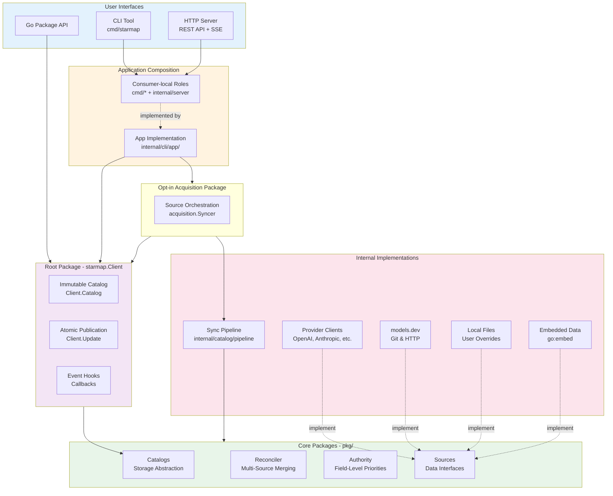
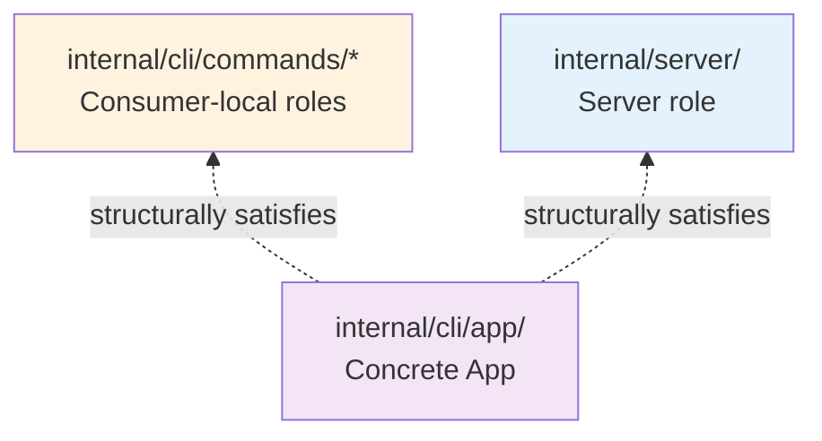
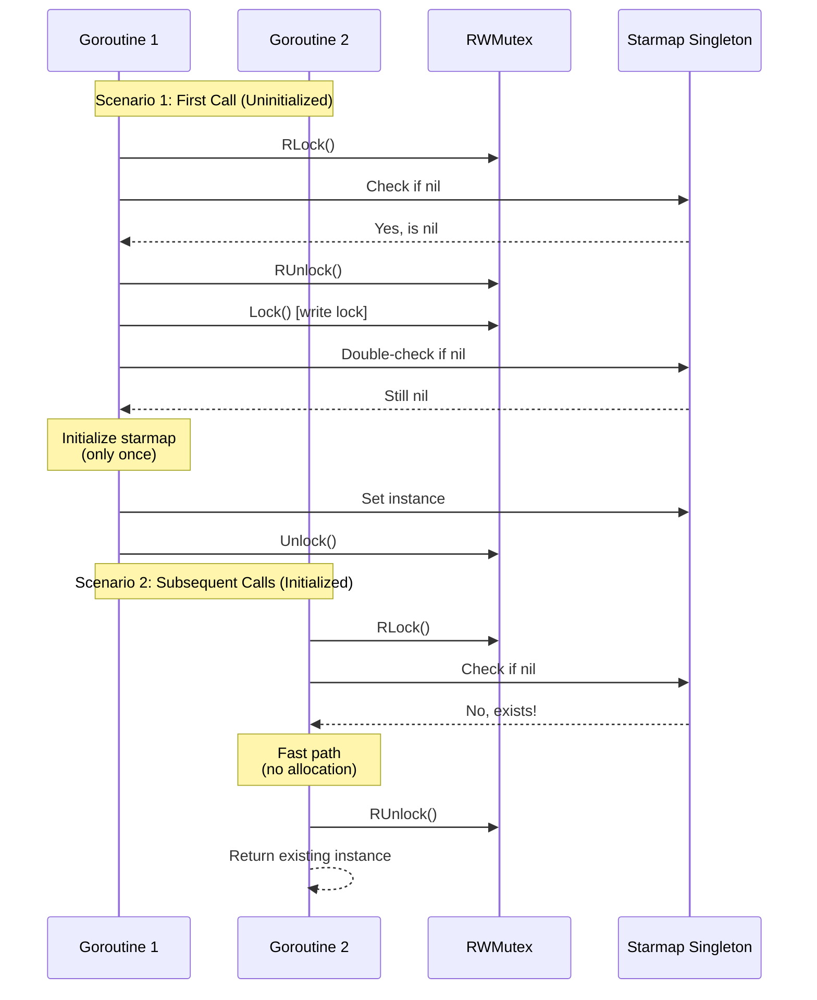
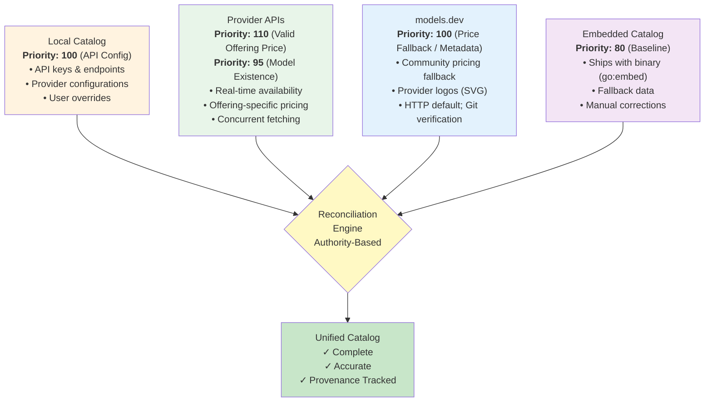
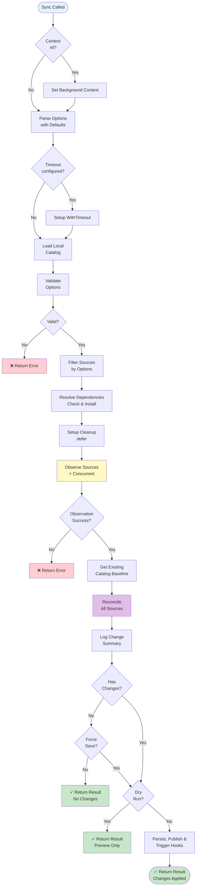
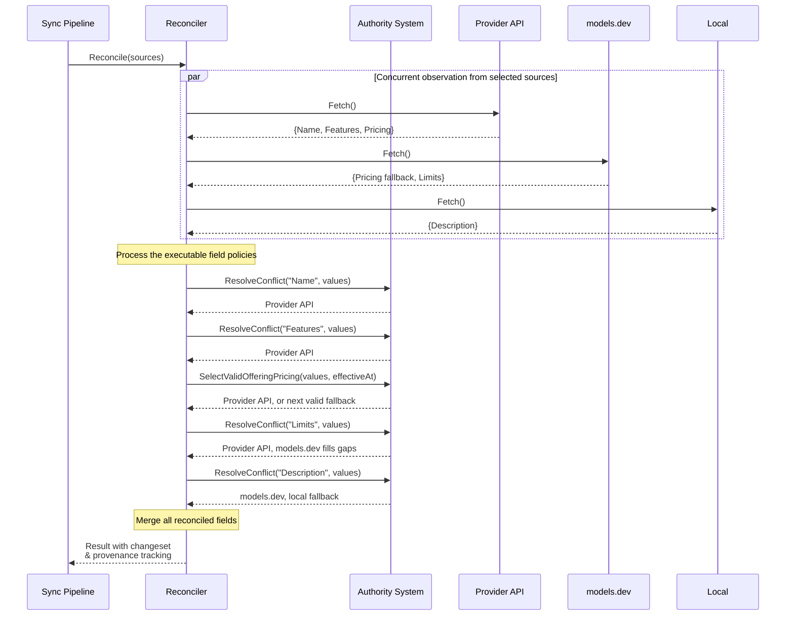
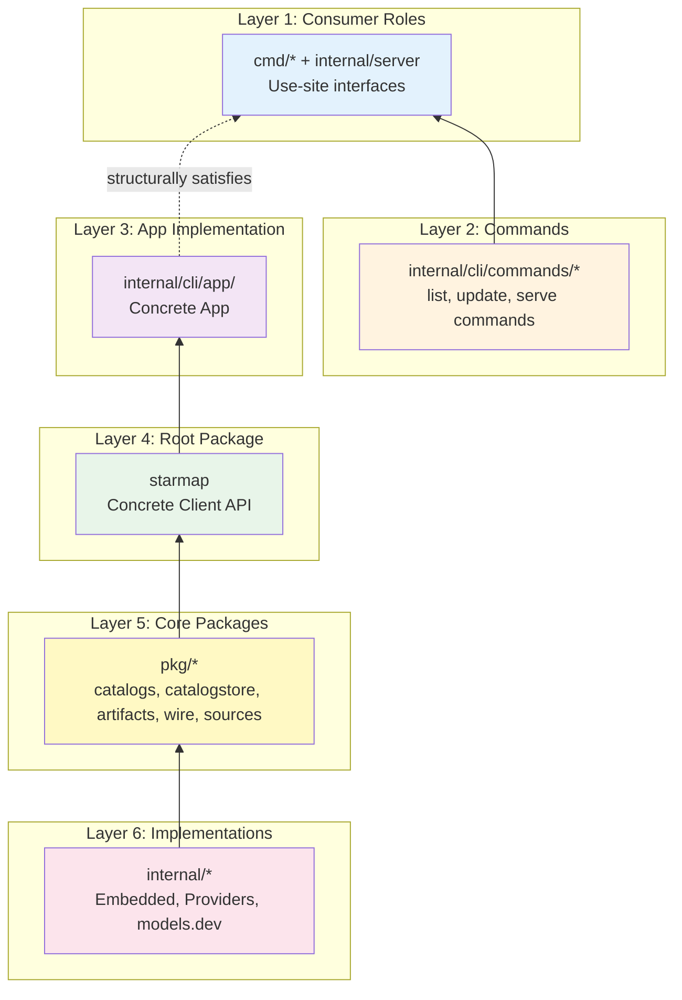

# Starmap Architecture

> Technical deep dive into Starmap's system design, components, and patterns

**Last Updated:** 2026-07-09
**Status:** Production-ready architecture following idiomatic Go patterns

## Table of Contents

- [Overview](#overview)
- [Design Principles](#design-principles)
- [System Components](#system-components)
- [Application Layer](#application-layer)
- [CLI Architecture](#cli-architecture)
- [Core Package Layer](#core-package-layer)
- [Root Package (starmap.Client)](#root-package-starmapclient)
- [Data Sources](#data-sources)
- [Sync Pipeline](#sync-pipeline)
- [Reconciliation System](#reconciliation-system)
- [Real-Time Event Delivery](#real-time-event-delivery)
- [Thread Safety](#thread-safety)
- [Package Organization](#package-organization)
- [Testing Strategy](#testing-strategy)
- [References](#references)

## Overview

Starmap is a unified AI model catalog system that combines data from multiple sources into a single authoritative catalog. The architecture follows idiomatic Go patterns with a focus on:

- **Separation of concerns**: Clear boundaries between layers
- **Dependency injection**: Interface-based design for testability
- **Thread safety**: Value semantics and proper synchronization
- **Extensibility**: Plugin patterns for sources, strategies, and storage backends

### High-Level Architecture


```mermaid
graph TB
    subgraph UI["User Interfaces"]
        CLI[CLI Tool<br/>cmd/starmap]
        GO[Go Package API]
        HTTP[HTTP Server<br/>REST API + SSE]
    end

    subgraph APP["Application Composition"]
        APPIF[Consumer-local Roles<br/>cmd/* + internal/server]
        APPIMPL[App Implementation<br/>internal/cli/app/]
    end

    subgraph ROOT["Root Package - starmap.Client"]
        READ[Immutable Catalog<br/>Client.Catalog]
        PUBLISH[Atomic Publication<br/>Client.Update]
        HOOKS[Event Hooks<br/>Callbacks]
    end

    subgraph ACQ["Opt-in Acquisition Package"]
        SYNC[Source Orchestration<br/>acquisition.Syncer]
    end

    subgraph CORE["Core Packages - pkg/"]
        CAT[Catalogs<br/>Storage Abstraction]
        REC[Reconciler<br/>Multi-Source Merging]
        AUTH[Authority<br/>Field-Level Priorities]
        SOURCES[Sources<br/>Data Interfaces]
    end

    subgraph IMPL["Internal Implementations"]
        PIPE[Sync Pipeline<br/>internal/catalog/pipeline]
        EMBED[Embedded Data<br/>go:embed]
        PROVS[Provider Clients<br/>OpenAI, Anthropic, etc.]
        MODELS[models.dev<br/>Git & HTTP]
        LOCAL[Local Files<br/>User Overrides]
    end

    CLI --> APPIF
    GO --> ROOT
    HTTP --> APPIF
    APPIF -.implemented by.-> APPIMPL
    APPIMPL --> ROOT
    APPIMPL --> ACQ
    ACQ --> PIPE
    ACQ --> ROOT
    ROOT --> CAT
    PIPE --> CORE
    PROVS & MODELS & LOCAL & EMBED -.implement.-> SOURCES

    style UI fill:#e3f2fd
    style APP fill:#fff3e0
    style ROOT fill:#f3e5f5
    style CORE fill:#e8f5e9
    style IMPL fill:#fce4ec
```

**Architecture Layers:**
1. **User Interfaces**: Multiple entry points (CLI, Go package, HTTP API)
2. **Application Composition**: Concrete CLI app injected through consumer-local roles
3. **Root Package**: Small provider-independent API for immutable reads and atomic publication
4. **Acquisition Package**: Explicit opt-in composition for provider/source synchronization
5. **Core Packages**: Reusable business logic for catalog management and reconciliation
6. **Internal Implementations**: Provider-specific code and data sources

### Provider authentication planes

Starmap owns catalog-acquisition authentication. Each provider record declares
credential fields, ordered profiles, and the permitted profiles for each
authentication plane. Each profile declares placement, scopes, and endpoint
bindings. Compiled primitives implement API keys, bearer tokens, and three
cloud default chains. The cloud chains support Google, Azure, and AWS. The
primitives do not contain provider membership rules.

The process-owned acquisition resolver checks one operator-selected `env:` or
`file:` reference before ambient discovery. Ambient discovery checks each
catalog-declared conventional environment name and then the derived
`STARMAP_<PROVIDER_ID>_<FIELD_ID>` name. An explicit source can fall back only
after a typed `not_configured` result and only when operator configuration
permits it. Invalid, denied, unavailable, timeout, and cancellation failures
are terminal.

Resolved material contains named values, one opaque version, and optional
expiry and lease metadata. The material type keeps values private and preserves
exact source bytes. Its generic formatter omits secret values.

The resolver owns cache and single-flight state. It rereads static files and
detects rotation without depending on modification time. The resolver reuses
renewable cloud material only until its refresh time. Starmap resolves material
only when it builds a provider observation. Credential values never enter a
catalog payload or generation.

The catalog also records provider inference service facts. These facts include
the provider base URL, operation paths, offering capabilities, and status-page
metadata. They do not include inference credentials or gateway policy.

An LLM gateway such as Starport owns inference authentication. It stores and
validates tenant or operator credentials and applies them to inference calls.
This split prevents a catalog-acquisition credential from becoming an
inference credential by accident.

## Design Principles

### 1. Interface Segregation
- **Define interfaces where they're used** (Go proverb)
- Command and server interfaces live in their consuming packages
- Implementation in `internal/cli/app/` (concrete types)
- Commands depend only on what they need

### 2. Dependency Injection
- Constructor injection via functional options
- Interface-based contracts
- Easy mocking for tests
- Example: `NewCommand(app application)` where `application` is local to that command package

### 3. Thread Safety
- Value semantics for collections
- Deep copy once at immutable catalog publication
- Atomic generation reads; caller-owned copies at collection boundaries
- Double-checked locking for singletons
- RWMutex for concurrent access
- See [Thread Safety](#thread-safety) section for details

### 4. Single Responsibility
- Each package has one clear purpose
- Catalog: storage abstraction
- Internal reconciler: multi-source merging
- Authority: field-level priorities
- Sources: data fetching

### 5. Explicit Error Handling
- Typed errors in `pkg/errors`
- No panics in library code
- Errors wrap context
- Examples: `NotFoundError`, `SyncError`, `APIError`

## System Components

### Layer Responsibilities

1. **Application Composition** (`internal/cli/app/`, command packages, `internal/server/`)
   - Dependency injection
   - Configuration management
   - Lifecycle control (startup/shutdown)
   - Singleton management

2. **Root Package** (`starmap.Client`)
   - Public API surface
   - Sync adapter into `internal/catalog/pipeline`
   - Event hooks
   - Atomic immutable generation publication

3. **Public Contracts**
   - Catalog domain and immutable reads (`pkg/catalogs/`)
   - Transactional generation storage (`pkg/catalogstore/`)
   - Data source abstractions (`pkg/sources/`)

4. **Internal Implementations** (`internal/`)
   - Multi-source reconciliation
   - Field-level authority policy
   - CLI composition, commands, and presentation conversion
   - Tolerant source-payload decoding
   - Embedded catalog data
   - Provider API clients
   - models.dev integration
   - Transport utilities
   - Shared catalog query behavior for CLI and HTTP adapters

## Application Composition

### Consumer-local application roles

Locations: `internal/cli/commands/*/application.go`, `internal/server/application.go`

**Design Philosophy:**
- "Accept interfaces, return structs" (Go proverb)
- "Define interfaces where they're used" (idiomatic Go)
- Each consumer declares only the methods it calls
- Zero import cycles (unidirectional dependency flow)

**Interface Definition:**

```go
type application interface {
    Catalog() (*catalogs.Catalog, error)
    Logger() *zerolog.Logger
}
```

Commands that format output add `OutputFormat`; update commands request
`Starmap` instead of `Catalog`. The HTTP server owns its wider role because it
consumes catalog state, readiness, logging, and client construction. Build
metadata remains concrete on `*app.App` and is not forced onto unrelated
command tests.

### Interface seam inventory

Starmap applies the deletion test to interfaces: retain them at algorithm,
transport, or application input boundaries only when there are multiple real
adapters, or when an executable alternate adapter proves the extension seam.
Constructors return concrete types when a package owns one implementation.

| Interface seam | Count | Adapters exercised by the repository | Disposition |
|---|---:|---|---|
| `catalogs.Reader` | 2 | `*catalogs.Builder`, `*catalogs.Catalog` | Retained algorithm input; `TestSeamConformanceReaderHasBuilderAndCatalogAdapters` executes both |
| Catalog collection readers | 2 each | Mutable `Providers`/`Authors`/`Endpoints`/`Models`/`Provenance` and immutable reader wrappers | Retained read-only collection boundaries with two implementations each |
| `catalogstore.Store` | 3+ | Starmap memory, filesystem, and conditional object storage; caller-owned injected adapters | Retained generation-storage boundary; the Starmap adapters run the same behavioral contract and external applications own database-specific implementations |
| `catalogstore.ObjectBackend` | 3 | memory reference backend, S3-compatible production backend, recording alternate backend | Retained cloud-object input; the production S3 protocol matrix and `TestSeamConformanceObjectStoreAcceptsAlternateBackend` execute both replacement implementations |
| `authority.Reader` | 2 | immutable default table, custom `seamAuthority` | Retained policy input; `TestSeamConformanceAuthorityAcceptsCustomAdapter` proves replacement policy |
| Enhancer/reconciler provenance inputs | 2 | concrete `*provenance.Tracker`, custom `seamTracker` | Retained as consumer-local `Track` roles; the provenance package returns its concrete tracker |
| `enhancer.Enhancer` | 4 | `ModelsDevEnhancer`, `MetadataEnhancer`, `ChainEnhancer`, test enhancer | Retained plugin boundary; compile assertions cover all built-ins and pipeline tests execute alternates |
| `reconciler.Strategy` and internal `resourceConflictResolver` | 2 each | authority and source-order strategies | Retained policy boundaries with two production algorithms |
| `sources.Source` | 5+ | local, provider, models.dev HTTP, models.dev Git, test sources | Retained source/plugin boundary with four production adapters |
| Public and internal provider-client seams | 4+ each | OpenAI-compatible, Anthropic, Google, injected fakes | Retained provider transport boundaries with three production families |
| Command/server application roles | 2+ each | CLI `*app.App`, consumer-local test stubs | Retained at each use site with only the capabilities that consumer invokes |
| Pipeline `Store` | 2 | root `pipelineStore`, `pipelineTestStore` | Retained consumer-owned persistence boundary |
| Pipeline `providerSetter` | 2 | `*catalogs.Builder`, failing test adapter | Retained failure-injection boundary exercised by pipeline tests |
| Update `syncClient` | 2 | `*starmap.Client`, `recordingSyncClient` | Retained command boundary exercised without network calls |
| Attribution `Matcher` | 2 | compiled matcher, custom `seamMatcher` | Retained composite-algorithm input; `TestSeamConformanceMultiMatcherAcceptsCustomAdapter` proves injection |
| CLI hints `Provider` | 2 | `ProviderFunc`, named provider | Retained registry/plugin boundary with two adapters |
| CLI `Formatter` | 4 | JSON, YAML, table, function adapter | Retained output boundary with four adapters |
| CLI alerts `Writer` | 2 | function and structured format writers | Retained output boundary with two adapters |
| Transport `Authenticator` | 5 | no-auth, bearer, header, query, provider auth | Retained transport policy boundary with five adapters |

Deleted one-adapter or unused abstractions include the exported `Snapshot`, the
catalog `Builder`, `Writer`, `Merger`, `Copier`, and `Persistence` interfaces,
the root `Client`, `Catalog`, `Updater`, `AutoUpdater`, `Hooks`, and
`Persistence` capability interfaces, reconciler `Merger` and `Reconciler`,
differ `Differ`, and provenance `Auditor`. `Builder`, `Client`, `Reconciler`,
and `Differ` are now concrete product types; mutation and publication remain
separate.

The root client exposes explicit `Update` and `Activate` publication operations
and owns no provider SDK, source pipeline, ticker, cadence lifecycle, retry
loop, or constructor-started goroutine. Provider synchronization is the opt-in
`acquisition.Syncer` composition. Starport and deployment composition own
scheduling, startup policy, jitter, leases, and HA coordination. Custom
candidate construction uses the context-aware callback passed directly to
`Client.Update`; it does not imply cadence.

### Application dependency flow


```mermaid
flowchart BT
    APP[internal/cli/app/<br/>Concrete App]
    CMD[internal/cli/commands/*<br/>Consumer-local roles]
    SERVER[internal/server/<br/>Server role]

    APP -.structurally satisfies.-> CMD
    APP -.structurally satisfies.-> SERVER

    style CMD fill:#fff3e0
    style SERVER fill:#e3f2fd
    style APP fill:#f3e5f5
```

**Key Points:**
- Commands and the server depend only on their local roles, not the implementation
- App is injected into commands at runtime
- Zero import cycles (unidirectional dependencies)
- Easy to test with mock implementations

### App Implementation

Location: `internal/cli/app/app.go`

**Responsibilities:**
- Implements `Application` interface
- Manages configuration, logger, starmap singleton
- Thread-safe lazy initialization
- Graceful lifecycle management

**Key Components:**

```go
type App struct {
    version string
    commit  string
    date    string
    builtBy string

    config  *Config
    logger  *zerolog.Logger

    mu      sync.RWMutex
    starmap starmap.Client  // Lazy-initialized singleton
}
```

**Thread-Safe Singleton Pattern:**

The App uses double-checked locking for optimal performance:

```go
func (a *App) Starmap(opts ...starmap.Option) (starmap.Client, error) {
    // Fast path: read lock check
    a.mu.RLock()
    if a.starmap != nil && len(opts) == 0 {
        sm := a.starmap
        a.mu.RUnlock()
        return sm, nil
    }
    a.mu.RUnlock()

    // Slow path: write lock initialization
    a.mu.Lock()
    defer a.mu.Unlock()

    // Double-check after acquiring write lock
    if a.starmap != nil && len(opts) == 0 {
        return a.starmap, nil
    }

    // Create instance (new if opts provided)
    sm, err := starmap.New(...)
    if err != nil {
        return nil, err
    }

    // Cache only if no custom options
    if len(opts) == 0 {
        a.starmap = sm
    }

    return sm, nil
}
```

**Visual Representation of Double-Checked Locking:**


```mermaid
sequenceDiagram
    participant G1 as Goroutine 1
    participant G2 as Goroutine 2
    participant Lock as RWMutex
    participant SM as Starmap Singleton

    Note over G1,G2: Scenario 1: First Call (Uninitialized)
    G1->>Lock: RLock()
    G1->>SM: Check if nil
    SM-->>G1: Yes, is nil
    G1->>Lock: RUnlock()

    G1->>Lock: Lock() [write lock]
    G1->>SM: Double-check if nil
    SM-->>G1: Still nil
    Note over G1: Initialize starmap<br/>(only once)
    G1->>SM: Set instance
    G1->>Lock: Unlock()

    Note over G1,G2: Scenario 2: Subsequent Calls (Initialized)
    G2->>Lock: RLock()
    G2->>SM: Check if nil
    SM-->>G2: No, exists!
    Note over G2: Fast path<br/>(no allocation)
    G2->>Lock: RUnlock()
    G2-->>G2: Return existing instance
```

**Why This Pattern?**
- **First Check (Read Lock)**: Fast path for the common case (already initialized)
- **Write Lock Acquisition**: Only when initialization needed
- **Second Check (Write Lock)**: Prevent race condition between locks
- **Result**: Thread-safe singleton with minimal overhead

## CLI Architecture

### Design Philosophy

Starmap's CLI is built on these core principles:

1. **POSIX Compliance**: Standard Unix flag conventions (`-o`, `--output`)
2. **Discoverability**: Clear help text, intuitive command names
3. **Consistency**: Same patterns across all commands
4. **Ergonomics**: Short flags for common operations, sensible defaults

### Command Structure

Commands follow the **VERB-NOUN pattern** borrowed from kubectl and other modern CLIs:

```
starmap <verb> <noun> [arguments] [flags]
        ↓      ↓         ↓           ↓
     action  resource  identity   modifiers
```

**Examples:**
```bash
starmap models list                    # resource=models, subcommand=list
starmap providers fetch anthropic      # resource=providers, subcommand=fetch, arg=anthropic
starmap update openai                  # verb=update, arg=openai
```

**Command Groups:**
- **Setup Commands**: Getting started (auth, deps)
- **Catalog Commands**: Working with catalog resources (authors, models, providers, update)
- **Server Commands**: Running the API (serve)
- **Development Commands**: Debugging and exploration (embed, validate)
- **Additional Commands**: Utilities (completion, version, help)

### Flag Architecture

#### Global Flags (Reserved)

These flags are **always available** and must not be overridden by commands:

| Short | Long | Purpose | Notes |
|-------|------|---------|-------|
| `-v` | `--verbose` | Verbose output | Sets log level to debug |
| `-q` | `--quiet` | Minimal output | Sets log level to warn |
| `-o` | `--output` | Output format | table, json, yaml, wide |
| `-h` | `--help` | Show help | Built-in Cobra flag |

**Why `-o` for output?**
- Avoids conflict with embed cat's `--filename` (`-f`)
- Matches common tools like `gcc -o output`
- Frees up `-f` for `--force` in commands that need it

#### Resource Filter Flags

Added programmatically via `globals.AddResourceFlags()`:

| Short | Long | Purpose |
|-------|------|---------|
| `-p` | `--provider` | Filter by provider |
| | `--author` | Filter by author |
| | `--search` | Search term |
| `-l` | `--limit` | Limit results |

#### Command-Specific Flags

Commands define their own flags that don't conflict with global flags:

**Update Command:**
- `-f` / `--force` - Force fresh update
- `-y` / `--yes` - Auto-approve changes
- `--dry-run` - Preview changes without publishing

**Embed Commands:**
- Custom help flag (`-?`) frees up `-h` and `-f`
- `ls -h` - Human-readable sizes (like Unix ls)
- `cat -f` - Show filename before content

### Architectural Decisions

#### 1. Positional Arguments vs Flags

**Decision**: Use positional arguments for **identity/resource**, flags for **options/modifiers**

**Rationale:**
```bash
# ✅ Good: Resource is positional, options are flags
starmap update openai --dry-run

# ❌ Avoided: Resource as flag feels less natural
starmap update --provider openai --dry-run
```

**Pattern:**
- Positional = "What to act on" (which provider, which model)
- Flags = "How to act" (dry run, force, output format)

#### 2. Breaking Changes Strategy

**Decision**: Clean breaks acceptable for young projects (<1.0)

**Rationale:**
- Project is pre-1.0, rapid iteration beneficial
- Clear communication via commit messages
- Deprecation periods add complexity without benefit at this stage
- Post-1.0: Will use proper deprecation (6-12 months)

**Example from Phase 2:**
```bash
# Before (v0.x)
starmap update --provider openai

# After (v0.x+1) - Clean break
starmap update openai

# Commit message included migration guide
```

#### 3. Custom Help Flags

**Decision**: Allow command groups to override `-h` with custom patterns

**Rationale:**
- Embed commands need Unix-like flags (`ls -h` for human-readable)
- Solution: Parent command defines `-?` for help
- All subcommands inherit this, freeing `-h` and `-f`

**Implementation:**
```go
// Parent: internal/cli/app/commands.go
cmd.PersistentFlags().BoolP("help", "?", false, "help for embed commands")

// Now subcommands can use -h
LsCmd.Flags().BoolVarP(&lsHuman, "human-readable", "h", false, "...")
```

#### 4. One Canonical Flag Spelling

Before launch, each option has one long name and at most one conventional short
name. Starmap does not retain hidden aliases or deprecated flag spellings that
would become permanent compatibility surface. For example, structured output
uses `--output`/`-o`, and update previews use `--dry-run`.

### Implementation Details

**Framework**: [Cobra](https://github.com/spf13/cobra) - Industry-standard Go CLI library

**Key Files:**
- `internal/cli/app/execute.go` - Root command and global flags
- `internal/cli/app/commands.go` - Command registration
- `internal/cli/globals/` - Shared flag utilities
- `internal/cli/commands/*/` - Individual command implementations

**For comprehensive CLI reference and implementation guidelines**, see **[CLI.md](CLI.md)**.

## Core Package Layer

### Catalogs Package

Location: `pkg/catalogs/`

**Purpose:** Immutable catalog product plus a separate advanced construction type

**Key Types:**
- `Catalog` - Concrete immutable catalog returned to consumers
- `Builder` - Concrete mutable construction type for sources/plugins and update pipelines
- `Reader` - Narrow algorithm-input interface implemented by both types
- `Model`, `Provider`, `Author`, `Endpoint` - Core data types
- Collections: `Providers`, `Authors`, `Models`, `Endpoints`

**Storage Backends:**
- Memory (testing)
- Filesystem (development)
- Embedded (production)
- Custom FS (S3, GCS, etc.)

**Thread Safety:** Value semantics, all List() methods return slices of values (not pointers)

See [pkg/catalogs/README.md](../pkg/catalogs/README.md) for details.

### Generation manifest contract

`catalogs.GenerationManifest` is the transport-neutral identity and audit record
for one immutable catalog payload. P3.1 defines the contract; P3.2 and later
store work is responsible for committing and activating it atomically.

| Manifest field | Meaning |
|---|---|
| `manifest_version` | Version of the manifest envelope itself |
| `schema_version` | Version of the canonical catalog payload schema |
| `generation_id`, `generated_at` | Immutable generation identity and UTC creation time |
| `payload` | SHA-256 checksum, exact byte size, and canonical media type |
| `validation` | Validator version/time, overall status, counts, and named check results |
| `sync_run_id` | Correlation ID for the synchronization attempt that built the candidate |
| `source_observations` | Source/observation IDs and evidence checksums needed for audit and replay |
| `review_candidates` | Ordered excluded offerings with a linked source observation |
| `completeness`, `degraded`, `degradation_reasons` | Separate record-coverage and quality/fallback state |
| `consumer_compatibility` | Inclusive catalog-schema range, independent of binary versions |

Publication requires a passed validation report, no failed checks, and valid
checksums. It also requires a non-empty observation set and consistent quality
state. Review candidates must use canonical order and match their source
observations. The schema version must be in the declared consumer range.

The JSON Schema, example manifest, and exact payload fixture are in
`pkg/catalogs/testdata/generation/`.

### Catalog distribution artifact

`pkg/catalogartifact` packages one validated `catalogstore.Generation` as a
deterministic archive plus detached in-toto statement. The archive contains a
strict descriptor, the complete generation manifest, and the exact canonical
payload. Rebuilds of identical inputs are byte-identical; opening revalidates
the manifest/payload binding, member descriptors, compatibility identity, and
all statement subjects before returning a generation. See
[Catalog Artifact Format](CATALOG_ARTIFACT_FORMAT.md).

Generation IDs are immutable logical IDs. SHA-256 independently content-addresses
the payload and archive; schema compatibility is not coupled to binary versions.
Release staging writes archive, statement, and checksum as one fsynced atomic
directory; exact retries are idempotent and same-generation byte changes are
typed conflicts. The GitHub tag workflow uploads these assets without an
overwrite flag.

Portable import is explicit and opt-in. `catalogartifact.VerifyRelease`
strictly verifies the checksum asset, archive, detached statement, schema
compatibility, and a caller-owned `PublisherVerifier`; no Starmap constructor
performs release I/O. `acquisition.Syncer.ImportRelease` then reconciles the
verified generation as a `release_artifact` observation with the human
workspace and last-known-good baseline. Release facts rank above the embedded
fallback and below human evidence. Only the resulting validated candidate
enters generation-store CAS and atomic publication, so failure retains current
state and rollback can reactivate the exact prior retained generation.

`pkg/catalogremote` owns the online Starmap-to-Starmap wire protocol. It reads
the current strict manifest or a retained generation-addressed manifest, then
fetches the exact generation-addressed canonical payload. Strict media type,
body bounds, catalog-schema compatibility, size, and checksum validation all
precede decode and compare-and-swap publication. The same module owns the sole
`catalog.published` SSE event shape: generation ID plus matching positive
event-ID/sequence, with comment heartbeats carrying no publication identity.
The parser bounds individual lines to 64 KiB and cumulative frames to 256 KiB;
resumption IDs must be positive integers before any request is sent.

The opt-in public `remote` package composes that protocol into a reactive
consumer. The configured origin is its publisher identity: production origins
require HTTPS with a verified certificate chain, cross-origin redirects are
rejected, and plain HTTP is limited to loopback. `remote.New` starts no
goroutine or request. `Start(ctx)` verifies and
activates current state, subscribes to SSE, closes the fetch/subscribe race with
another verified current fetch, and owns reconnection under the caller context.
Every reconnect uses `Last-Event-ID` when available and performs mandatory
current-state catch-up, so replay is never required for correctness. Duplicate
generation IDs, duplicate payload digests, and stale retained events do not
republish or regress the immutable catalog. A per-stream reader is explicitly
closed and joined. The validated 20-second expected-heartbeat and 60-second
liveness defaults make a silent or half-open stream reconnect; caller
cancellation and bounded `Close` own termination even while initial fetch is
in progress. Normal operation performs no polling. An optional
`PollingFallbackPolicy` activates only after its explicit consecutive-stream
failure threshold and serializes conditional current-manifest requests inside
the reconnect loop at a rate bounded by the configured interval, without
creating a parallel scheduler. Successful stream establishment plus mandatory
catch-up disables fallback before event consumption resumes.
`PollingFallbackStatus` exposes the mode, entries, polls, and modified responses
without treating stream liveness as catalog freshness. HTTP 401 and 403 are
terminal across stream open, addressed fetch, catch-up, and conditional
fallback polling; the one-shot lifecycle stops instead of retrying credentials
or access policy indefinitely.

Production health keeps publisher delivery, subscriber transport, and catalog
freshness distinct. `server.Health()` reports the active generation timestamp,
post-commit hook coalescing/failure counters, connected SSE state, last
successful heartbeat/event delivery, and every backpressure or write
termination. `remote.Subscriber.Health()` reports stream/retry/polling state,
last received heartbeat/event, last successful catch-up, active generation
age, retry count, and a structured secret-free last error. Heartbeats update
only transport liveness; catalog age is always derived from the atomic active
generation timestamp. See
[Remote Catalog Protocol](REMOTE_CATALOG_PROTOCOL.md).

### OpenRouter catalog compatibility adapter

`internal/server/openrouter` is one concrete server-owned adapter over the
immutable catalog interface. It implements the exact
`GET /api/v1/model/{author}/{slug}` and
`GET /api/v1/models/{author}/{slug}/endpoints` discovery routes without adding
OpenRouter transport types to `pkg/catalogs` or changing the human YAML model.
The adapter reads definitions and `DefinitionOfferings` directly; generated
`endpoints.yaml` remains an inspectable digest-bound projection and is never a
runtime authority. The transport shape follows OpenRouter's current
[model-by-slug](https://openrouter.ai/docs/api/api-reference/models/get-a-model-by-its-slug)
and
[model-endpoints](https://openrouter.ai/docs/api/api-reference/endpoints/list-all-endpoints-for-a-model)
contracts.

Resolution first canonicalizes an author alias, then checks the canonical
author/slug identity and the catalog's precomputed model-alias index. A resolved
alias must still belong to the requested author. Ambiguous aliases remain typed
conflicts and are returned as deterministic not-found responses instead of
selecting a map entry. A suffix such as `:free` is accepted only when at least
one eligible offering defines that exact mode; the response contains only those
offerings and applies the mode's provider price. Unknown suffixes return 404.
Generated detail links honor the configured server path prefix. Authentication
failures use OpenRouter's numeric `401` envelope only on the two compatibility
route shapes; native Starmap routes retain their existing error contract.

Model identity, description, dates, architecture, modalities, reasoning
controls, and supported parameters come from the authored definition.
Provider names, exact opaque provider model IDs, USD pricing, limits, cache
pricing, and serving eligibility come from provider offerings. Cache price
presence is not misreported as implicit caching; that field remains false until
an explicit provider fact exists. Endpoint order is the catalog's stable
provider/model-ID order. Unavailable and retired
offerings are excluded; every included row uses status `0` to mean catalog
eligible, not observed runtime health. The model summary deterministically
selects the least expensive eligible USD offering for its price and top-provider
summary while retaining the maximum eligible context as the aggregate model
context. Non-USD prices are omitted because this compatibility shape has no
currency field and Starmap does not invent exchange rates.

Latency, throughput, and uptime fields are optional transport fields and remain
absent without real provider-performance samples. Publisher health, SSE
liveness, and catalog generation age cannot populate them. If a real telemetry
producer is introduced later, it must join samples inside this server adapter at
response time; telemetry must not enter catalog YAML, generation identity, or
catalog freshness.

The online server and offline artifact are the only distribution
representations. A deployment at `starmap.agentstation.ai` uses the same
manifest, immutable generation, and SSE contract rather than a second mutable
channel/promotion protocol. Channel-specific trust roots and
availability/freshness tradeoffs are defined in
[Catalog Distribution Trust Model](CATALOG_DISTRIBUTION_TRUST.md).

The external pinned-artifact composition makes air-gap startup executable: it
uses a compile-time archive digest as its trust root, blanks provider
credentials, performs no HTTP operation, verifies the checksum/statement and
pin, then activates the exact compatible generation in a caller-selected
store. It imports neither acquisition nor online server/remote
implementations. Embedded-only startup exercises the same no-network property
without requiring any artifact.

The embedded fallback has a separate checked-in budget gate for generation age,
canonical uncompressed payload size, deterministic compressed archive size, and
minimum provider/model coverage. Runtime readiness and hosted CI report distinct
evidence. See [Embedded Catalog Budgets](EMBEDDED_CATALOG_BUDGETS.md).

Repository-owned [Scheduled Catalog Generation](SCHEDULED_CATALOG_GENERATION.md)
runs daily or manually above the idempotent sync/generation boundary. It derives
new release identity only when catalog facts change, while retaining the exact
evidence-bearing payload checksum for integrity and audit. It validates and
attests before immutable semantic-digest release publication and never uses
Actions artifacts as runtime distribution.

The core library owns no scheduler, retry loop, lease, or startup goroutine.
Deployments invoke the explicit acquisition operation under their own
supervision and coordination policy.

### CatalogStore contract

`pkg/catalogstore.Store` persists a `Generation` (manifest plus exact payload)
and exposes `Current`, `Get`, and `Commit`. Every commit is compare-and-swap:
the caller supplies the expected current generation ID, with an empty ID meaning
the store must still be empty. Implementations validate the manifest and payload
before storage, retain old immutable generations, return caller-owned bytes, and
make an identical retry idempotent.

The normative caller and adapter obligations live in
[CATALOG_STORE_CONTRACT.md](CATALOG_STORE_CONTRACT.md).

| Adapter | Baseline P3.2 mechanism | Later hardening owner |
|---|---|---|
| Memory | Locked immutable map and current ID | Reference semantics/conformance |
| Filesystem | Cross-instance advisory commit lock plus fsynced immutable directory/current rename | P3.3/P3.5 durability and same-base CAS complete |
| Object | Immutable manifest/payload objects plus version-conditional current object | P3.9 in-memory protocol faults plus P8.11 production S3-compatible ETag/CAS, corruption, rollback, concurrency, and reopen matrix |

The shared conformance suite covers empty reads, commit/current/get, immutable
ownership, durable reopen, retained history, idempotent retries, stale CAS,
checksum rejection, generation-ID collisions, and cancellation. Passing the
baseline suite does not substitute for the later adapter-specific fault gates.
The concurrent same-base matrix opens independent adapters over one backend and
requires exactly one success and one typed conflict. Filesystem writers
coordinate through a context-aware advisory lock shared across processes.
The filesystem adapter rejects symbolic-link substitutions for its owned root,
generation tree, lock/current entries, manifests, and payloads before reading
or mutation. The release staging boundary applies the same rule to lifecycle
roots, generation directories, and immutable assets. These checks assume the
deployment protects the parent path from a hostile same-UID concurrent actor.
Starmap owns no relational adapter. An embedding application may implement
`catalogstore.Store` using SQLite, MySQL, PostgreSQL, or another database, but
owns the driver, schema, migrations, credentials, pool, backups, lifecycle, and
dialect-specific transaction/CAS behavior before injecting the store through
`starmap.WithCatalogStore`.

For deployments without a persistent filesystem,
`pkg/catalogstore/s3.Backend` adapts a caller-owned AWS SDK v2 S3 client to
`catalogstore.ObjectBackend`. The caller owns endpoint selection, region,
credentials, retry policy, HTTP transport, observability, and client lifecycle;
the constructor is inert. The adapter requires a non-empty ETag on every
successful read and write, translates immutable creation to
`If-None-Match: *`, translates pointer promotion to `If-Match: <ETag>`, and
rejects unconditional writes. An S3-compatible endpoint that rejects
conditional writes fails explicitly; Starmap never falls back to
last-writer-wins. The protocol-level test server exercises the complete store
contract, concurrent same-base CAS, restart/reopen, retained rollback,
digest-corruption rejection, and upload/promotion failure preservation through
the real AWS SDK HTTP stack.

Storage selection belongs to the server deployment, before `server.New`:

- standalone `starmap serve` uses the CLI's filesystem store by default;
- an embedding application explicitly selects filesystem or object mode,
  validates that mode's path or client/bucket/prefix inputs, constructs the
  store, and injects it through `starmap.WithCatalogStore`; and
- `server.New` consumes the already-constructed `*starmap.Client`, so the
  server package never discovers credentials, opens a database, creates an S3
  client, or owns storage lifecycle.

The isolated `testdata/consumers/server-storage` module makes both production
compositions executable. For each mode it constructs the store without I/O,
seeds a validated immutable generation, starts the public server, establishes a
reactive SSE subscriber, publishes and pushes a new generation, shuts down,
reopens the same store, and verifies the exact generation and catalog. The
ordinary read-only, server, and remote consumer closures explicitly exclude
AWS/Smithy; only the opt-in storage module imports the S3 adapter.

`Builder.Save` and `Builder.SaveTo` materialize the human YAML workspace using
replacement semantics for its managed author-model and provider-model trees,
so deleted records cannot survive a save/reload. Authored records live under
`authors/{author}/models` and own canonical identity plus intrinsic facts.
Provider records live under `providers/{provider}/models`, retain their exact
opaque provider ID and serving facts, and link explicitly to one authored
record through `model: author/slug`. Every model record exposes the same
complete Boolean feature matrix for hand editing; `false` is the conservative
projection default and `null` remains explicit uncertainty. Numeric limits are
never fabricated as zero merely to complete the visual schema. It deliberately
preserves unmanaged neighboring files such as logos and operator notes. Direct
builder saves are construction tools; normal
Starmap publication commits the immutable generation first and then atomically
projects YAML plus a deterministic digest-bound `endpoints.yaml` join.
`endpoints.yaml` is inspectable generated output, never an independent
authority. Production readers consume the immutable catalog generation, while
explicit updates treat semantic human source-record changes as local
observations.

There is no implicit filesystem watcher. A caller explicitly constructs an
`acquisition.Syncer` and reloads the human workspace with
`syncer.Sync(ctx, sync.WithSources(sources.LocalCatalogID))`; the CLI uses
`starmap update --source local`. A semantic change publishes exactly one
immutable generation and event, while unchanged or formatting-only input
publishes none.

`Client.Rollback` validates and decodes a retained generation off to the side,
binds the pre-rollback workspace semantic digest, and reactivates the target
through the catalog store's existing compare-and-swap. That store transition is
the sole durable commit point. In-memory reads and one publication event then
move to the exact target payload. YAML projection deterministically restores
the target's prior workspace semantic digest and provenance. If a human edits
the workspace between rollback preparation and projection, the committed
generation remains active, the human edit is preserved, and the result reports
pending repair. Repeating rollback to the current durable generation is
idempotent and emits no second event.

The root client makes that dependency explicit: `WithCatalogStore` is required
before any non-dry manual, remote, server-triggered, or scheduled mutation. The
preflight runs before source fetch, custom callbacks, remote HTTP, or scheduler
startup and returns a typed `errors.ConfigError` when the store is absent.
Read-only construction, `Catalog`, and dry-run synchronization remain usable
without a store. `NewContext` carries the caller's cancellation and deadline
through durable-current loading and projection repair; `New` is the explicit
background-context convenience wrapper. The CLI's `catalog_path` names the one
human workspace and defaults to `~/.starmap/catalog`. Its passive machine-owned
generation store defaults separately to `~/.starmap/state/catalog`; constructing
either composition creates no directory. Workspace and state roots must not
contain one another. The same pre-read validation rejects an active models.dev
cache or source-checkout root that contains, equals, or sits beneath the
workspace.
A selected workspace containing `current`, `generations/`, or `.commit.lock`
is rejected with `errors.LegacyCatalogLayoutError` before any mutation and
requires `starmap migrate catalog`. That explicit operation acquires the
generation commit lock and workspace writer lock, validates the exact current
and every retained generation against the running schema before mutation,
atomically relocates the store to the separate state root, verifies the
relocated current, and projects its canonical payload as human YAML. A
process-visible failure rolls the relocation back. If another actor recreates
the vacated path, rollback preserves both that path and the relocated store and
returns a typed conflict rather than deleting concurrent data. Operators must
stop every older Starmap process before migration and must not restart it,
because those binaries do not understand the path's new human-workspace
meaning. An exit after the atomic move is recoverable because startup activates
the relocated durable current and repairs the still-missing projection without
another generation commit. An older binary rejects a newer manifest schema
before moving the store.
Generation
locks, current pointers, retained generations, and their temporary candidates
remain under the catalog-store root. Atomic YAML projection alone stages beside
the workspace so same-filesystem rename remains possible; its hidden staging is
cleaned and its sibling digest marker is never traversed by the provider-YAML
loader. Projection and repair share a nonblocking OS advisory writer lock in
another sibling file. A competing process receives a typed conflict; readers
take no lock and observe the complete directory before or after atomic
promotion. OS process exit releases ownership even though the empty lock file
remains. Cache, source evidence, logs, configuration, YAML, and immutable
generations remain separate lifecycle domains.

An explicitly configured catalog workspace is optional only when its path does
not exist. Construction loads an existing workspace exactly as human YAML; it
does not pre-merge the running binary's embedded revision. A missing workspace
uses the verified embedded bootstrap in memory and is seeded only by an explicit
update. Malformed provider, author, and provenance structure plus filesystem
failures remain typed fatal errors. Individual malformed provider-model YAML
files are quarantined with a typed `LoadReport` so valid siblings can form a
degraded local observation; embedded bootstrap and atomic projection validation
require an empty report and remain fail-closed. When a configured
CatalogStore has a current generation, that validated durable generation is
authoritative during construction; the workspace is reconciled by explicit
reload or update rather than silently replacing the active generation.

The embedded bootstrap has a strict embedded `generation.json` binding its
generation ID, generation time, catalog schema version, facts-only semantic
SHA-256, and exact evidence-bearing payload SHA-256/byte size. `starmap.New`
verifies both identities entirely offline before publication.
`Client.Readiness` reports the generation metadata and age;
`WithEmbeddedBootstrapMaxAge` and `WithEmbeddedBootstrapMaxSizeBytes` make the
HTTP readiness endpoint fail with stable reason codes while an out-of-budget
bootstrap remains active. A committed generation supersedes bootstrap budgets.
The CLI/server composition root accepts the same policies through
`embedded_bootstrap_max_age` and `embedded_bootstrap_max_size_bytes` (or their
uppercase environment-variable forms).

`starmap migrate catalog` safely reassigns the on-disk path that briefly held
the current generation-store format before the single human-workspace contract
was chosen. This storage-layout migration remains necessary for development
installations and is distinct from catalog payload compatibility, which is not
retained before launch.

### Internal Reconciler

Location: `internal/catalog/reconciler/`

**Purpose:** Multi-source data reconciliation with conflict resolution

**Key Components:**
- `Reconciler` concrete engine
- `Strategy` - Defines how conflicts are resolved
- `authority.Table` - The one executable field inventory and source order
- `Result` - Reconciliation outcome with changeset and metadata

**Strategies:**
1. **AuthorityStrategy** - Field-level authority priorities
2. **SourceOrderStrategy** - Fixed source precedence order

**Pipeline:**
1. Fetch catalogs from all sources
2. Merge using configured strategy
3. Detect changes vs baseline
4. Generate changeset with provenance
5. Return result

**Field Policies:**
`internal/catalog/authority/authority.go` is the sole executable inventory for reconciled
model, provider, and author fields. The merger iterates its immutable policies
directly. Focused executors for structured fields accept the selected policy
and contain no source-order table of their own. Tests verify schema coverage,
real reflection paths, complete policy metadata, defensive copies, and
deterministic selection.

Presence is part of field evidence, not inferred from a Go zero value.
Description, feature, limit, and open-weights records distinguish omitted,
explicitly unknown, and known values. Normal readers keep scalar fields;
algorithms and source adapters use `DescriptionValue`,
`ModelFeatures.Support`, `ModelLimits.Value`, and `OpenWeightsValue` when the
distinction matters. Human model YAML deliberately renders every Boolean
capability as an editable checklist: an unobserved capability projects as the
conservative `false` default and an explicitly unknown capability remains
`null`. Untouched generated defaults are recognized as projection state rather
than synthetic local evidence, so a later real source claim can replace them.
For non-Boolean fields, omission still means no claim; `null` means unknown;
and an explicit `0` or `""` is known. Provider and models.dev decoders retain
the wire-level distinction, and immutable JSON payloads, deep copies,
reconciliation, and change detection preserve it.

See [the internal reconciler documentation](../internal/catalog/reconciler/README.md)
for implementation details. Consumers use `acquisition.Syncer`, not this
package directly.

### Internal Authority Policy

Location: `internal/catalog/authority/`

**Purpose:** Field-level source authority system

**How It Works:**
- Each field family has one `Policy`
- `SourceOrder` is highest to lowest
- Merge and empty-value behavior are explicit
- Pattern matching supports nested field families
- Provenance authority is derived from order rather than arbitrary scores

**Example Authorities:**

```go
// Pricing - a valid provider observation wins atomically.
{
    Resource:    sources.ResourceTypeModel,
    Path:        "Pricing",
    SourceOrder: []sources.ID{
        sources.ProvidersID,
        sources.ModelsDevHTTPID,
        sources.ModelsDevGitID,
        sources.LocalCatalogID,
        sources.EmbeddedCatalogID,
    },
    Merge: authority.MergeReplace,
    Empty: authority.EmptyAbsent,
}
```

The complete table and its semantics are documented in
[CATALOG_AUTHORITY_POLICY.md](CATALOG_AUTHORITY_POLICY.md).

Source decoding uses scoped strictness rather than a global permissive or
strict mode. Identity and container type drift rejects its source/record scope;
unknown additive members are preserved inside extensions or classified as
reviewable evidence before promotion. The executable inventory and rationale
are documented in [SCHEMA_DRIFT_POLICY.md](SCHEMA_DRIFT_POLICY.md) and exposed
by `pkg/sources.SchemaDriftPolicies`.

### Sources Package

Location: `pkg/sources/`

**Purpose:** Reentrant observation boundary for external catalog data

**Source Interface:**

```go
type Source interface {
    ID() ID
    Observe(ctx context.Context, opts ...Option) (Observation, error)
    Cleanup() error
    Dependencies() []Dependency
    IsOptional() bool
}

type Observation struct {
    ID               string
    SourceID         ID
    ObservedAt       time.Time
    Revision         Revision
    Completeness     ObservationCompleteness
    Status           ObservationStatus
    Records          ObservationRecordCounts
    Issues           []ObservationIssue
    EvidenceChecksum string
    Catalog          *catalogs.Catalog
}
```

`Observe` returns one immutable result directly. Implementations are safe for
repeated and concurrent calls and never require stateful `Fetch` then `Catalog`
ordering. Each call builds its mutable candidate off to the side and publishes
only the resulting immutable catalog. Observation construction deterministically
encodes the normalized catalog, binds its SHA-256 evidence checksum, and derives
an event ID from source, UTC observation time, revision, completeness, status,
and checksum. HTTP ETags and exact Git commits are preferred when available;
until those transport-specific revisions are exposed, adapters explicitly use
the normalized content digest rather than inventing an upstream revision.
models.dev transport loaders execute per observation and honor that source
instance's configured directory; no package-level `sync.Once` or cached parsed
API survives between scheduled/manual calls. The HTTP transport may still reuse
a validated on-disk response under its explicit cache policy, while parsing it
again for every observation. A versioned sidecar binds cache origin,
validation time, ETag/Last-Modified, and the raw response checksum to the exact
`api.json` bytes. Only a checksum-matching sidecar can supply conditional
headers or be classified as fresh. After TTL, ETag is preferred and
Last-Modified is the fallback validator; a valid `304 Not Modified` refreshes
the sidecar without transferring or rewriting the catalog body, and its exact
validator becomes the observation revision. A missing/mismatched sidecar forces
an unconditional fetch and can only degrade to unverified stale fallback.
Embedded cache origin is retained across reuse and therefore never becomes a
successful fresh HTTP observation. Git verification checks/builds its
configured checkout for every observation. Because Git is an explicit
verification transport, callers must supply an exact 40- or 64-character commit
through `sync.WithModelsDevGitCommit` (or the corresponding CLI flag); branch
names and empty revisions fail validation before clone/fetch. The Git client
fetches that object, uses a forced detached checkout, verifies `HEAD`, hashes
`bun.lock`, runs `bun install --frozen-lockfile`, and rejects any lockfile
mutation. Its observation revision records the exact Git commit plus lockfile
path and SHA-256, so the build input can be reproduced after the remote branch
moves.

The pipeline validates every observation before reconciliation. Durable
generation manifests preserve the exact observation ID, UTC time, revision,
completeness, typed status, and evidence checksum; they never substitute the
final reconciled catalog checksum for source evidence. A partial observation
forces partial/degraded generation state.

Observation outcomes use one explicit policy:

- a non-nil source error is retained as a partial/degraded attempt with a
  bounded empty candidate when the adapter returned no usable catalog;
  non-strict synchronization may still reconcile other valid sources against
  the last-known-good baseline, while `RequireAllSources` fails and a canceled
  caller context always stops;
- `RequireAllSources` is a pre-publication health contract, not only a
  dependency preflight: every configured source must return exactly one
  `Complete`/`Succeeded` observation containing at least one model; skipped
  dependencies, missing credentials, quarantine, stale/bootstrap fallback,
  volume collapse, missing observations, and unexplained empty results fail
  before reconciliation;
- a usable incomplete result returns nil error with `partial`/`degraded` state
  and typed issues, so valid sibling providers/records remain reconcilable;
- issue scope is exactly `record`, `provider`, `source`, or `stale_fallback`;
  record/provider issues name their subject and every issue carries a stable
  code and message;
- missing provider credentials/configuration and provider fetch failures are
  provider-scoped partial degradation, not successful empty live fetches;
- stale last-known-good fallback is explicitly degraded (and can remain
  structurally complete), never mislabeled as a fresh success;
- present valid fields from partial observations remain eligible at their
  normal authority position, and their durable provenance records status,
  completeness, accepted/rejected counts, and stable issue codes;
- a stale cache or bootstrap fallback may fill an absent fact but cannot
  regress a known baseline fact;
- source absence is never lifecycle evidence: complete omission, record
  quarantine, source failure, and a source-attributed model-count regression
  retain the exact baseline model and provenance;
- an offering without a reviewed canonical model link stays unpublished. A
  durable review candidate identifies its exact source observation.
- a source-attributed count regression adds a provider-scoped
  `volume_collapse` issue and makes the observation partial/degraded; and
- `Fresh` refuses an empty-baseline publication if any observation is
  degraded or partial.

**Source Types:**
- **Provider APIs** (`sources.ProvidersID`) - Real-time model availability
- **models.dev HTTP** (`sources.ModelsDevHTTPID`) - Default production input,
  with validated disk-cache and embedded last-known-good fallback
- **models.dev Git** (`sources.ModelsDevGitID`) - Explicit build/verification
  transport; never runs alongside HTTP in one sync
- **Local Catalog** (`sources.LocalCatalogID`) - Semantic values read from an
  existing human workspace
- **Release Artifact** (`sources.ReleaseArtifactID`) - Explicitly imported,
  checksum/statement/compatibility/publisher-verified facts; reconciled above
  embedded fallback and below semantic human evidence
- **Embedded** (`sources.EmbeddedCatalogID`) - Verified lowest-authority
  revision shipped with the binary; participates as a separate observation
  without external dependencies, seeds an absent workspace, advances unchanged
  embedded-derived fields, and fills gaps without replacing semantic human
  edits

See [pkg/sources/README.md](../pkg/sources/README.md) for details.

## Root Package (starmap.Client)

Location: `client.go`, `update.go`

**Purpose:** Small provider-independent API for immutable catalog access,
serialized publication, rollback, and event hooks

### Concrete Client API

```go
type Client struct {
    // unexported state
}

func New(opts ...Option) (*Client, error)
func (c *Client) Catalog() *catalogs.Catalog
func (c *Client) Update(ctx context.Context, update UpdateFunc) (Publication, error)
func (c *Client) Activate(ctx context.Context, generation catalogstore.Generation) (Publication, error)
```

The root package returns concrete `*Client`; consumers that need substitution
define the smallest interface at their own use site. After `New` succeeds,
`Catalog` is non-failing, non-nil, O(1), and returns a retained immutable
generation. A nil `*Client` has a defined zero-value read: `Catalog` returns
nil. Storage-backed callers use `NewContext` so cancellation and deadlines
bound constructor I/O; `New` uses a background context for convenience.

The supported library, store, server, remote, and CLI compositions are pure Go
and execute with `CGO_ENABLED=0`; repository-authored source has no
`import "C"`. Release archives and the container use the same cgo-disabled
contract. Reliability verification keeps the race suite explicitly
cgo-enabled because the Go race detector normally requires it. The
non-standard dependency budget is therefore independent of the optional
standard-library `runtime/cgo` implementation package.

## Embeddable Server Package

Location: `server/`

The public `server` package accepts the concrete `*starmap.Client` product and
returns a concrete `*server.Server`. Construction opens no listener and starts
no goroutine. `Serve(net.Listener)` starts the
server-owned services and blocks; `Shutdown(ctx)` first drains that `net/http`
server and then stops those services. `Handler` plus explicit `Start` support
programs that already own an `http.Server`; those programs drain their own
server before calling Starmap `Shutdown`.

Catalog acquisition is an optional capability rather than a transitive
dependency of read-only serving. `server.Syncer` is the narrow input boundary;
`server.WithSyncer(acquisitionSyncer)` enables the update route. Without that
option the route is absent, and the public server dependency closure contains no
provider clients, catalog acquisition pipeline, Google GenAI, gRPC, or cloud
SDK packages. The CLI explicitly composes the acquisition implementation and
uses this same public server package.

### Functional Options Pattern

Used throughout for configuration:

```go
// Creating with options
store, err := catalogstore.NewFilesystem("./state/catalog")
if err != nil {
    return err
}
sm, err := starmap.NewContext(ctx,
    starmap.WithCatalogStore(store),
    starmap.WithCatalogPath("./catalog"),
)

syncer, err := acquisition.New(sm)
if err != nil {
    return err
}

// Provider/source synchronization is an explicit opt-in composition.
result, err := syncer.Sync(ctx,
    sync.WithProvider("openai"),
    sync.WithDryRun(true),
    sync.WithTimeout(5 * time.Minute),
)
```

### Catalog Query Adapters

Location: `internal/catalog/query/`

CLI commands and HTTP handlers share catalog list behavior through `internal/catalog/query`. That package owns reusable filtering, stable ID sorting, limiting, and pagination for models, providers, and authors. Command and server packages still own input parsing, authentication, cache keys, transport responses, table formatting, and JSON/YAML output.

The HTTP model query contract validates every declared sort, order, range,
modality, feature, date, and pagination value before execution. Supported model
sorts are `id`, `name`, `release_date`, `context_window`, `created_at`, and
`updated_at`; missing date/numeric values sort last in either direction and ID
is the deterministic tie-breaker. Unsupported or malformed values return a
typed client error rather than silently changing semantics.

Each catalog publication also advances a monotonic process-local sequence tied
to the durable `generation_id`. Request handlers atomically read the immutable
catalog, generation ID, and sequence together, set `X-Starmap-Generation-ID`,
and use that pair as the cache namespace. Advancing a sequence flushes the old
namespace; an in-flight request from an older sequence cannot reactivate or
populate it. Only a successful durable commit swaps the catalog and emits the
asynchronous `catalog.published` event containing the same generation,
sync-run, and sequence identities. Failed commits change neither state nor
events, and an identical remote-generation retry is not republished.

This keeps adapters thin without rebuilding a lossy cross-provider model map:

```go
definitions := cat.Definitions()
offerings, err := cat.ProviderOfferings(providerID)
if err != nil {
    return err
}

page := query.Paginate(offerings, limit, offset)
```

## Data Sources

### Source Hierarchy and Authority

Data flows from multiple sources into the reconciliation engine, with each source having specific authority for different types of data:


```mermaid
graph TD
    LOCAL["Local Catalog<br/><b>Priority: 100</b> (API Config)<br/>• API keys & endpoints<br/>• Provider configurations<br/>• User overrides"]
    API["Provider APIs<br/><b>Priority: 110</b> (Valid Offering Price)<br/><b>Priority: 95</b> (Model Existence)<br/>• Real-time availability<br/>• Offering-specific pricing<br/>• Concurrent fetching"]
    MD["models.dev<br/><b>Priority: 100</b> (Price Fallback / Metadata)<br/>• Community pricing fallback<br/>• Provider logos (SVG)<br/>• HTTP default; Git verification"]
    EMB["Embedded Catalog<br/><b>Priority: 80</b> (Baseline)<br/>• Ships with binary (go:embed)<br/>• Fallback data<br/>• Manual corrections"]

    REC{Reconciliation<br/>Engine<br/>Authority-Based}
    CAT["Unified Catalog<br/>✓ Complete<br/>✓ Accurate<br/>✓ Provenance Tracked"]

    LOCAL --> REC
    API --> REC
    MD --> REC
    EMB --> REC
    REC --> CAT

    style LOCAL fill:#fff3e0
    style API fill:#e8f5e9
    style MD fill:#e3f2fd
    style EMB fill:#f3e5f5
    style REC fill:#fff9c4
    style CAT fill:#c8e6c9
```

**Authority Resolution:**
- **Pricing**: A semantically valid, currently effective provider observation
  wins for that provider offering; models.dev and local data are fallbacks
- **Limits**: provider observations lead; models.dev and local evidence fill
  dimensions the provider omits
- **Model Existence**: Provider APIs determine what models actually exist
- **API Configuration**: Local catalog takes precedence (user's environment)
- **Baseline Data**: Embedded catalog provides lowest-authority defaults when other sources are unavailable

**Provider Fetching Seam:**
The public `pkg/sources.ProviderFetcher` owns provider API acquisition. It owns
context timeouts, credential preflight, client construction, and `ListModels`
execution. Model and raw fetches share the same credential preflight. They also
share the same process-owned resolver.

`internal/sources/providers` composes that concrete fetcher. It adds bounded
provider concurrency. It translates typed fetch errors into observation
issues. It also associates models with provider catalog entries. It does not
own a second credential, client, or fetch policy.

Provider clients receive resolved material for one invocation. They do not
cache credential values. Public and internal conformance tests cover missing
credentials, source precedence, rotation, cancellation, concurrent refresh,
configuration errors, fetch failures, and adapter call suppression.

Provider configuration and provider evidence are deliberately separated. The
configuration catalog may contain embedded or last-known-good models needed by
the baseline source, but `internal/sources/providers` removes those models from
its copied configuration before fetching. Its observation therefore contains
only models returned by that invocation. Missing credentials yield a
provider-scoped partial/degraded observation with zero live models, while a
successful fetch replaces bootstrap models instead of blending them into
current evidence. Reconciliation may still use the separately identified local
baseline observation according to authority policy.

Source and provider libraries never write directly to process stdout/stderr.
They emit context-bound zerolog events through `pkg/logging`; the pipeline adds
one `run_id` before source work, every source adds its stable `source`, and
provider-scoped work adds `provider_id`. Direct library callers can supply the
same correlation with `logging.WithRunID`. The operation `run_id` correlates
pre-publication logs and is intentionally distinct from the durable
`sync_run_id` assigned to a committed generation. AST and captured-output tests
prevent regressions to `fmt.Print*`, standard-log printing, or direct
`os.Stdout`/`os.Stderr` access in source/provider packages.

### Source Completeness Policy

Starmap treats source fields as an explicit contract. Every attribute from models.dev, provider APIs, local catalogs, and embedded catalogs must have one of three outcomes:

- mapped into canonical catalog schema when the field is broadly meaningful;
- preserved in a controlled `extensions` bucket when the field is source-specific but still useful;
- intentionally ignored with a documented reason and regression coverage when the field is operational noise or not meaningful to the catalog.

Canonical fields cover lifecycle status, lineage, context/input/output limits, generation controls, reasoning controls, tiered pricing, mode-specific pricing/request overrides, and provider/model metadata. Controlled extensions preserve source-specific details without letting them participate in field-authority decisions. Reconciliation merges extension buckets additively by source while the field-rule catalog continues to own canonical precedence.

Source-shape tests in `internal/sources/modelsdev` and `internal/providers/*` classify representative response paths so upstream schema drift fails deterministically. Live refreshes are opt-in and must write raw payloads outside the repository, print only normalized path summaries, and never persist secrets.

Every checked-in provider response fixture has an adjacent versioned metadata
record containing provider, capture time, content-digest source revision,
payload path/SHA-256, and an explicit maximum age (currently 365 days for the
legacy capture set). `internal/providers/testhelper` rejects missing, future,
stale, provider-mismatched, or checksum-mismatched metadata. Refresh helpers
write payload and metadata together; the Make target propagates test/fetch
failures and also fails when an alleged refresh changes neither file, preventing
`-update` no-ops from silently reporting success.

### Concurrent Fetching

Provider APIs are fetched concurrently with a bounded worker gate:

```go
// internal/sources/providers/providers.go
resultChan := make(chan providerModels, len(providerConfigs))
semaphore := make(chan struct{}, s.effectiveMaxConcurrency(len(providerConfigs)))

for _, provider := range providerConfigs {
    wg.Add(1)
    go func(p *catalogs.Provider) {
        defer wg.Done()
        semaphore <- struct{}{}
        defer func() { <-semaphore }()

        client, err := s.clientFactory(p)
        // Fetch, classify errors, and send provider result...
    }(provider)
}
```

## Sync Pipeline

Location: `acquisition/` and `internal/catalog/pipeline/`

The source pipeline is a deep internal module behind the opt-in
`acquisition.Syncer.Sync` method. The acquisition layer prepares a complete
candidate and delegates the sole durable compare-and-swap plus atomic in-memory
publication to the root client. `internal/catalog/pipeline` owns execution
ordering, source construction, dependency filtering, observation/cleanup
fan-out, reconciliation, dry-run behavior, no-change behavior, and forced-save
policy.

The pipeline executes in 13 stages with comprehensive error handling and decision points:

### Pipeline Flowchart


```mermaid
flowchart TD
    Start([Sync Called]) --> S1{Context<br/>nil?}
    S1 -->|Yes| S1B[Set Background Context]
    S1 -->|No| S2
    S1B --> S2[Parse Options<br/>with Defaults]

    S2 --> S3{Timeout<br/>configured?}
    S3 -->|Yes| S3B[Setup WithTimeout]
    S3 -->|No| S4
    S3B --> S4[Load Local<br/>Catalog]

    S4 --> S5[Validate<br/>Options]
    S5 --> E1{Valid?}
    E1 -->|No| Error1[❌ Return Error]
    E1 -->|Yes| S6[Filter Sources<br/>by Options]

    S6 --> S7[Resolve Dependencies<br/>Check & Install]
    S7 --> S8[Setup Cleanup<br/>defer]
    S8 --> S9[Observe Sources<br/>⚡ Concurrent]

    S9 --> E2{Observation<br/>Success?}
    E2 -->|No| Error2[❌ Return Error]
    E2 -->|Yes| S10[Get Existing<br/>Catalog Baseline]

    S10 --> S11[Reconcile<br/>All Sources]
    S11 --> S12[Log Change<br/>Summary]

    S12 --> D1{Has<br/>Changes?}
    D1 -->|No| D1B{Force<br/>Save?}
    D1B -->|No| End1[✓ Return Result<br/>No Changes]
    D1B -->|Yes| D2
    D1 -->|Yes| D2{Dry<br/>Run?}
    D2 -->|Yes| End2[✓ Return Result<br/>Preview Only]
    D2 -->|No| S13[Persist, Publish &<br/>Trigger Hooks]

    S13 --> End3([✅ Return Result<br/>Changes Applied])

    style Start fill:#e3f2fd
    style Error1 fill:#ffcdd2
    style Error2 fill:#ffcdd2
    style S9 fill:#fff9c4
    style S11 fill:#e1bee7
    style End1 fill:#c8e6c9
    style End2 fill:#c8e6c9
    style End3 fill:#c8e6c9
```

**Stage Groups:**
- **Stages 1-5** (Setup): Context, options, validation
- **Stages 6-9** (Preparation): Source filtering, dependency resolution, cleanup, concurrent observation
- **Stages 10-11** (Processing): Baseline comparison, reconciliation
- **Stages 12-13** (Finalization): Change detection, persistence, hooks

### Stage-by-Stage Code

```go
syncer, err := acquisition.New(client)
if err != nil {
    return err
}
result, err := syncer.Sync(ctx,
    sync.WithProvider("openai"),
    sync.WithDryRun(true),
)
if err != nil {
    return err
}
```

### Key Pipeline Features

- **Deep module boundary**: `internal/catalog/pipeline.Pipeline` owns
  orchestration behind the explicit public `acquisition.Syncer`
- **Staged execution**: Each stage has clear purpose
- **Error handling**: Fail fast with context
- **Concurrent observation**: Reentrant sources return immutable observations in parallel
- **Change detection**: Diff against baseline
- **Dry-run support**: Preview without applying
- **Force-save support**: CLI `--force` selects a fresh baseline and
  `--reformat` can project even when there are no detected fact changes
- **Safe publication**: A validated generation commits through `CatalogStore`
  before the immutable catalog, generation ID, and monotonic sequence become
  visible as one atomic state; failed commits emit no callback
- **Restart recovery**: `New` reads, validates, decodes, and publishes the exact
  durable current generation before consulting the human YAML workspace; an
  empty store alone falls back to the verified bootstrap/local baseline, while
  corrupt or unavailable store state fails initialization
- **Ordered isolated hooks**: Post-commit generations begin callback delivery
  in sequence order. Publication observers for one generation run independently
  so one slow callback cannot prevent its cache/event observer from running,
  while the next generation waits for the complete callback boundary. The
  dispatcher retains at most the running generation plus the newest pending
  generation, making overload bounded and observable through sequence gaps and
  `Client.HookStats().Coalesced`. Returned errors, panics, coalescing, and
  latency cannot fail or delay the durable commit path

The tested publication order is generation-store CAS, atomic in-memory
catalog/generation/sequence activation, ordered callback dispatch, server cache
activation, then publication-event enqueue. The store, catalog state, cache
namespace, and event identity therefore agree for every delivered generation.
Intermediate callback delivery may be coalesced, but a later generation cannot
overtake one already being delivered.

The HTTP logging middleware preserves `http.Flusher`, error-returning flushes,
`http.Pusher`, and `http.ResponseController` unwrapping from the underlying
response writer. This is required for flushed, write-deadline-aware SSE;
middleware must not accidentally turn a supported stream into an HTTP 500.

## Reconciliation System

Model definition, provider offering, alias, and Starport routing identities
follow the normative [Catalog Identity Contract](CATALOG_IDENTITY.md). In
particular, offering identity is the `(provider ID, provider model ID)` tuple;
route aliases are policy-layer objects and never source-ingestion aliases.
`catalogs.ProviderOffering` is the provider-specific read schema: its comparable key
is `(ProviderID, ProviderModelID)`, and it owns pricing, limits, availability,
regions, endpoint behavior, provider lifecycle, modes, and typed request
overrides.
`catalogs.ModelDefinition` is the complementary provider-independent record;
reflection and round-trip tests keep its authorship, lineage, weights, and
capabilities surface disjoint from every offering-owned field.
Authored model YAML owns canonical `author/slug` identity and intrinsic model
facts. Provider model YAML owns provider-serving facts and an explicit link to
the authored model; provider identity is never used as authorship evidence.
Published catalogs validate every link and lifecycle value, then precompute
definition, offering, author-membership, alias, provider-to-offering, and
definition-to-offering indexes. Provider-independent conflicts use the same
executable authority table and value-matched provenance as reconciliation;
indistinguishable conflicting facts remain unknown instead of using map
iteration or alphabetical order. The required definition name falls back to
its stable definition ID. Multi-author declarations are retained only on the
authored record and are never inferred from serving providers. Canonical reads
use `Definition`, `Offering`, `ProviderOfferings`, `DefinitionOfferings`,
`AuthorModel`, and `AuthorModels`; they return deep copies of nested mutable
values.
Route aliases remain caller-supplied policy-layer identities.
`MaterializeRouteAlias` resolves their exact offering keys against a retained
catalog generation and reports ineligible targets without storing routing
weights or fallback policy in ingestion.

Canonical `Catalog.FindModel` returns `ModelDefinition`. Provider facts come
from `Offering` or `DefinitionOfferings`. The method accepts canonical
`author/slug` identities. It also accepts unambiguous bare slugs and provider
ID aliases. Ambiguity returns a typed conflict.

Schema version 3 replaced provider-only schema version 2. Schema version 4
added provider credential profiles and plane references. Schema version 5
removes provider feature rules. Acquisition adapters use only direct response
fields and catalog-declared author mappings. Starmap has no compatibility
reader for an earlier schema because it has not launched.

### Authority-Based Strategy

The default reconciliation strategy uses field-level authorities:

**How it works:**
1. Iterate the immutable authority policies for each resource type
2. Select or compose the field according to its source order and merge policy
3. Track provenance using the policy's stable evidence path and the exact
   provider/model identity
4. Generate changeset by comparing with baseline

Model provenance is provider-scoped durably. Consumers use
`Catalog.Provenance().FindModel(providerID, modelID)`; this prevents two
providers that expose the same opaque model ID from combining price, limit, or
lifecycle evidence.

When a projected YAML workspace is read as a local observation, reconciliation
compares each parsed semantic value with the projected evidence value.
Unchanged generated values retain their original source and immutable
observation evidence; an actually changed value becomes a local claim. A
current observation from the original source replaces its unchanged projected
copy at the original authority position. Formatting and comments never create
local evidence. Removing a YAML key withdraws its claim; writing `false`, `0`,
`""`, or `null` is a distinct semantic edit.

**Example:**

```
Model "gpt-4o" exists in 3 sources:
  - Provider API: { Name: "GPT-4o", Features: {...}, Pricing: {...} }
  - models.dev:   { Pricing: {fallback...}, Limits: {...} }
  - Local:        { Description: "Custom description" }

Reconciled result:
  - Name:        "GPT-4o"         (Provider API)
  - Features:    {...}             (Provider API)
  - Pricing:     {...}             (Provider API, validated and atomic)
  - Limits:      {...}             (Provider API, models.dev fills gaps)
  - Description: "Upstream desc"   (models.dev, local fills absence)
```

### Reconciliation Flow Visualization


```mermaid
sequenceDiagram
    participant Sync as Sync Pipeline
    participant Rec as Reconciler
    participant Auth as Authority System
    participant P as Provider API
    participant M as models.dev
    participant L as Local

    Sync->>Rec: Reconcile(sources)

    par Concurrent observation from selected sources
        Rec->>P: Fetch()
        P-->>Rec: {Name, Features, Pricing}
        Rec->>M: Fetch()
        M-->>Rec: {Pricing fallback, Limits}
        Rec->>L: Fetch()
        L-->>Rec: {Description}
    end

    Note over Rec: Process the executable field policies

    Rec->>Auth: ResolveConflict("Name", values)
    Auth-->>Rec: Provider API

    Rec->>Auth: ResolveConflict("Features", values)
    Auth-->>Rec: Provider API

    Rec->>Auth: SelectValidOfferingPricing(values, effectiveAt)
    Auth-->>Rec: Provider API, or next valid fallback

    Rec->>Auth: ResolveConflict("Limits", values)
    Auth-->>Rec: Provider API, models.dev fills gaps

    Rec->>Auth: ResolveConflict("Description", values)
    Auth-->>Rec: models.dev, local fallback

    Note over Rec: Merge all reconciled fields

    Rec-->>Sync: Result with changeset<br/>& provenance tracking
```

**Reconciliation Steps:**
1. **Concurrent Fetch**: All sources fetched in parallel
2. **Field-Level Resolution**: Authority system determines winner for each field
3. **Provenance Tracking**: Record which source provided each value
4. **Changeset Generation**: Compare with baseline to detect changes

### Changeset Generation

The reconciler generates a comprehensive changeset:

```go
type Changeset struct {
    Models struct {
        Added   []Model
        Updated []ModelUpdate
        Removed []Model
    }
    Summary struct {
        TotalChanges int
        AddedCount   int
        UpdatedCount int
        RemovedCount int
    }
}
```

**Change Detection:**
- Compare reconciled catalog with baseline
- Track field-level changes
- Preserve attribution for each field
- Generate human-readable diffs

## Real-Time Event Delivery

The server exposes one post-commit catalog publication event through
Server-Sent Events. SSE is the sole reactive transport because publication is
server-to-client; the unused WebSocket and generic event-broker paths were
deleted.

`internal/server/sse.Broadcaster` owns connection registration, SSE framing,
delivery counters, and backpressure policy. Each request handler is the only
writer for its connection, serializing publication events and heartbeat
comments without an extra per-connection goroutine. Construction starts no
background loop.

The only named event is `catalog.published`, containing a committed generation
ID and monotonic sequence. It contains no model diff or mutable catalog
payload. The server flushes comment-line heartbeats every 20 seconds by default;
heartbeats carry no event ID and do not advance publication sequence.

Each connection has one pending publication slot. If it cannot accept the next
publication, or if a frame cannot be written and flushed within its 10-second
default deadline, the server terminates the connection. The remote subscriber
then performs mandatory manifest catch-up. This prevents silent loss while a
stream continues to look healthy. Delivery counters expose publications,
successful sends, heartbeats, disconnects, backpressure terminations, and write
failures.

## Thread Safety

Starmap's catalog system is designed for thread-safe concurrent access. This section consolidates all thread safety patterns and guidelines.

### Design Philosophy

**Immutable Product, Caller-Owned Values**

The catalog system uses value semantics to prevent race conditions:

```go
// The retained pointer refers to an immutable catalog generation.
catalog := client.Catalog()

// Materialized definitions and offerings are caller-owned values.
definitions := catalog.Definitions()
offerings, err := catalog.ProviderOfferings("openai")
```

**Immutable Generation Publication**

Builders are deep-copied once when published. Readers atomically load the same
sealed immutable generation; collection methods return caller-owned copies:

```go
func (c *Client) Catalog() *catalogs.Catalog {
    c.mu.RLock()
    catalog := c.catalog
    c.mu.RUnlock()
    return catalog
}
```

### Core Patterns

#### 1. Double-Checked Locking (Singleton Pattern)

Used in `App.Starmap()` for optimal performance:

```go
func (a *App) Starmap(opts ...starmap.Option) (*starmap.Client, error) {
    // Fast path: read lock check (common case)
    a.mu.RLock()
    if a.starmap != nil && len(opts) == 0 {
        sm := a.starmap
        a.mu.RUnlock()
        return sm, nil  // No allocation
    }
    a.mu.RUnlock()

    // Slow path: write lock initialization (rare)
    a.mu.Lock()
    defer a.mu.Unlock()

    // Double-check after acquiring write lock
    if a.starmap != nil && len(opts) == 0 {
        return a.starmap, nil
    }

    // Initialize exactly once
    sm, err := starmap.New(buildOptions()...)
    if err != nil {
        return nil, err
    }

    a.starmap = sm  // Cache for future calls
    return sm, nil
}
```

**Why double-checked locking?**
- First check (read lock): Fast path for initialized case
- Second check (write lock): Prevent race between read unlock and write lock
- Initialization happens exactly once
- Subsequent calls are fast (read lock only)

#### 2. Value Semantics in Collections

Collections return slices of values, not pointers:

```go
// Safe: returns caller-owned copies from the immutable catalog.
definitions := catalog.Definitions() // []ModelDefinition

// Each definition is independent of catalog state.
for _, definition := range definitions {
    definition.Name = "Modified" // Only affects the local copy.
}
```

#### 3. Deep Copy Boundary

Construction records with nested mutable state use centralized deep-copy
helpers. `Builder.Build` validates and seals an independent immutable product;
ordinary consumers do not copy the complete catalog:

```go
builder, err := catalogs.NewBuilderFrom(current)
// mutate builder only
next, err := builder.Build()
```

### Catalog Ownership Contract

Catalog collection boundaries are copy-on-read and copy-on-write:

- Builder `Providers`, `Authors`, and `Endpoints` store caller input as owned copies.
- Provider models remain nested under their provider in the one construction
  representation; the immutable catalog derives definitions, offerings, and
  author membership at publication.
- `Get`, `Resolve`, `List`, `Map`, and catalog convenience methods return caller-owned values or pointers to copies.
- Batch writes (`AddBatch`, `SetBatch`) copy accepted values before storing them.
- `ForEach` callbacks receive copies; callback mutation must not affect catalog internals.
- `Provenance` copies maps and slices on `Set`, `Map`, `FindByField`, and `FindByResource`. Provenance `Value` and `PreviousValue` are `any`, so callers should treat complex values placed there as immutable.
- `Builder.Build()` is the deep-copy publication boundary. `starmap.Client`
  stores only a concrete immutable `*catalogs.Catalog`, swaps it under one lock after persistence,
  and returns that immutable generation without a full-catalog read copy.
- Catalog publication precomputes definition, offering, and author-membership
  indexes. Provider-specific queries use `Offering` or `ProviderOfferings`;
  the immutable catalog exposes no flattened model view where equal model IDs
  from different providers would be lossy.

### Safe Usage Patterns

#### ✅ Safe Concurrent Reads

```go
// Multiple goroutines can safely read
go func() {
    definitions := catalog.Definitions()
    // Process provider-independent definitions...
}()

go func() {
    offerings, err := catalog.ProviderOfferings("openai")
    // Process exact provider offerings...
    _ = offerings
    _ = err
}()
```

#### ✅ Safe Concurrent Updates

```go
// Construct and validate a complete candidate off to the side.
builder := catalogs.NewEmpty()
_ = builder.SetProvider(provider)
next, err := builder.Build()
if err != nil {
    return err
}

// Publication swaps the complete immutable catalog atomically. Existing
// readers retain the prior complete catalog; new readers receive next.
publish(next)
```

#### ✅ Retaining Caller-Owned Values

```go
// No defensive full-catalog copy is needed before sharing.
definitions := catalog.Definitions()
go func() {
    fmt.Println(definitions[0].Name)
}()

// This is fine because definitions are caller-owned values.
definitions[0].Name = "Modified" // Only affects the local copy.
```

### Visual Comparison: Safe vs Unsafe Patterns

```mermaid
graph LR
    subgraph "❌ UNSAFE: Shared Mutable State"
        direction TB
        G1A[Goroutine 1<br/>Read] -->|direct access| SHARED1[(Shared<br/>Data)]
        G2A[Goroutine 2<br/>Write] -->|direct access| SHARED1
        SHARED1 -.->|Race Condition| CRASH[💥 Data Race<br/>Undefined Behavior]
        style SHARED1 fill:#ffcdd2
        style CRASH fill:#f44336,color:#fff
    end

    subgraph "✅ SAFE: Immutable Generation + Owned Values"
        direction TB
        G1B[Goroutine 1] -->|O(1) catalog read| SHARED2[(Immutable<br/>Generation)]
        SHARED2 -->|materialize values| COPY1[Owned<br/>Values 1]
        G2B[Goroutine 2] -->|O(1) catalog read| SHARED2
        SHARED2 -->|materialize values| COPY2[Owned<br/>Values 2]
        COPY1 & COPY2 -.->|No Sharing| SAFE[✅ Thread Safe<br/>No Data Races]
        style SHARED2 fill:#c8e6c9
        style COPY1 fill:#e8f5e9
        style COPY2 fill:#e8f5e9
        style SAFE fill:#4caf50,color:#fff
    end
```

**Key Differences:**
- **Unsafe**: Direct access to shared mutable state causes race conditions
- **Safe**: readers retain one sealed generation and receive owned materialized
  values from its collections
- **Trade-off**: collection materialization allocates, while the full-catalog
  accessor remains allocation-free
- **Starmap choice**: deep-copy once at the mutable-builder boundary, then share
  the immutable product

### Mutable Builder Collections

Builder collections own copies of caller input and return copies to callers.
Their locks protect only advanced construction; ordinary reads use the sealed
`Catalog`:

```go
builder := catalogs.NewEmpty()
_ = builder.SetProvider(provider) // stores an owned copy
provider, found := builder.Providers().Get(providerID) // returns a copy
catalog, err := builder.Build() // seals a separate immutable generation
```

### Performance Characteristics

**Budget scope:** `BenchmarkClientCatalog` measures only loading the current
embedded immutable catalog through `Client.Catalog`. It does not include
materializing provider/model lists, filtering, serialization, or network I/O.

The executable fast-path budget is zero allocations per call and no more than
10 microseconds per call. The latency ceiling intentionally has broad CI
headroom while still rejecting the former millisecond-scale full-catalog copy.
`scripts/verify-catalog-performance.sh` enforces both limits across three runs;
race tests remain a separate gate because race instrumentation distorts
allocation measurements.

On 2026-07-29, `darwin/arm64` on an Apple M2 Max with Go 1.26.5 measured:

```
BenchmarkClientCatalog-12    8.711-9.608 ns/op    0 B/op    0 allocs/op
```

Complete local publication and verified remote activation are separately
measured off-request-path boundaries. Their current latency/allocation review
budgets and reproduction commands are recorded in
[P10 Production Budgets](reviews/P10_PRODUCTION_BUDGETS_2026-07-29.md).
Reproduce the accessor with:

```bash
go test . -run '^$' -bench BenchmarkClientCatalog -benchmem -count=3
```

### Testing for Thread Safety

**Race Detector:**

```bash
# Run all tests with race detector
go test -race ./...

# Run specific package
go test -race ./pkg/catalogs -v

# Benchmark with race detection
go test -race -bench=. ./pkg/catalogs
```

**Concurrent Test Pattern:**

```go
func TestConcurrentCatalogAccess(t *testing.T) {
    builder := catalogs.NewEmpty()
    catalog, err := builder.Build()
    if err != nil {
        t.Fatal(err)
    }

    var wg sync.WaitGroup
    for i := 0; i < 100; i++ {
        wg.Add(1)
        go func() {
            defer wg.Done()
            definitions := catalog.Definitions()
            // Use definitions...
            _ = definitions
        }()
    }

    wg.Wait()
}
```

### Current Ownership Invariants

- `Client.Catalog` returns the concrete immutable `*catalogs.Catalog`.
- Mutable work is confined to `catalogs.Builder`.
- `Builder.Build` validates and isolates the published generation.
- Catalog generation reads perform no full-catalog copy.
- The accessor fast path is guarded at zero allocations with a 10 microsecond
  ceiling; collection materialization is deliberately outside that budget.

#### 4. Serialized Streaming Writers

Every SSE connection has exactly one writer: its request handler. Publication
callbacks only offer immutable generation identities to a bounded queue; they
never write to the response directly. The same handler writes both publication
frames and heartbeat comments, applies a fresh per-frame deadline, and flushes
before recording success.

The queue is deliberately one element. A full queue terminates the connection
instead of dropping a publication while leaving the stream healthy. Correctness
comes from reconnect catch-up, not from an unbounded queue or an exactly-once
stream.

### Thread Safety Checklist

When adding new code, ensure:

- [ ] Mutable input is copied before it enters builder/store ownership
- [ ] Public mutable-state methods synchronize access
- [ ] Immutable catalog methods return immutable values or caller-owned copies
- [ ] Tests include `-race` detector runs
- [ ] Publication commits before the catalog pointer and event sequence advance
- [ ] Event queues are bounded and overload is observable
- [ ] Every owned goroutine has explicit start, cancellation, and join behavior

## Package Organization

```
starmap/
├── cmd/
│   └── starmap/              # CLI binary
│       ├── main.go           # Entry point
│       ├── app/              # App implementation
│       │   ├── app.go        # App struct and methods
│       │   ├── config.go     # Configuration loading
│       │   ├── logger.go     # Logger setup
│       │   ├── context.go    # Signal handling
│       │   └── execute.go    # Command registration
│       └── cmd/              # Command implementations
│           ├── list/         # List command
│           ├── update/       # Update command
│           ├── serve/        # API server command
│           └── ...           # Other commands
│
├── pkg/                      # Public packages
│   ├── catalogs/             # Catalog domain, builder, and immutable reads
│   ├── catalogstore/         # Generation commit/read/CAS adapters
│   │   └── s3/               # Optional caller-owned S3 client adapter
│   ├── catalogartifact/      # Deterministic portable generation format
│   ├── catalogmeta/          # Source/observation identity vocabulary
│   ├── catalogremote/        # Versioned manifest/payload/SSE wire client
│   ├── sources/              # Source interfaces
│   ├── sync/                 # Acquisition options and results
│   ├── provenance/           # Durable field evidence
│   ├── differ/               # Catalog changesets
│   ├── errors/               # Typed errors
│   └── logging/              # Caller-owned logging boundary
│
├── internal/                 # Internal packages
│   ├── cli/                  # CLI support helpers
│   │   ├── app/              # Concrete CLI composition
│   │   ├── commands/         # Command-local capability interfaces
│   │   ├── format/           # Output formatting
│   │   ├── table/            # Table rendering
│   │   └── ...               # Command support packages
│   ├── catalog/
│   │   ├── authority/        # One executable field-authority table
│   │   ├── pipeline/         # Prepare-only source orchestration
│   │   ├── query/            # Shared CLI/HTTP catalog queries
│   │   ├── reconciler/       # Multi-source reconciliation
│   │   └── workspace/        # Atomic human-YAML projection
│   ├── providers/            # Provider API clients and registry
│   │   ├── clients/          # Provider client registry and raw fetch
│   │   ├── openai/           # OpenAI-compatible client
│   │   ├── anthropic/        # Anthropic client
│   │   ├── google/           # Google AI Studio and Vertex client
│   │   └── ...               # Provider-specific test wrappers
│   ├── embedded/             # Embedded catalog data
│   │   ├── catalog/          # Embedded YAML files
│   │   └── openapi/          # OpenAPI 3.1 specs (JSON/YAML)
│   ├── server/               # HTTP server implementation
│   │   ├── server.go         # Server struct & lifecycle
│   │   ├── config.go         # Configuration management
│   │   ├── router.go         # Route registration & middleware
│   │   ├── sse/              # Serialized publication stream
│   │   └── handlers/         # HTTP request handlers
│   │       ├── models.go     # Model endpoints
│   │       ├── providers.go  # Provider endpoints
│   │       ├── admin.go      # Admin operations
│   │       ├── health.go     # Health checks
│   │       ├── realtime.go   # SSE publications
│   │       └── openapi.go    # OpenAPI spec endpoints
│   ├── sources/              # Source implementations
│   │   ├── providers/        # Provider-backed catalog source
│   │   ├── modelsdev/        # models.dev integration
│   │   └── local/            # Local file source
│   └── transport/            # HTTP client utilities
│
├── acquisition/              # Opt-in provider/source synchronization
├── server/                   # Public embeddable HTTP server
├── remote/                   # Public reactive remote subscriber
├── client.go                 # Immutable client reads and initialization
├── update.go                 # Explicit candidate publication
├── generation.go             # Retained generation access/commit
├── hooks.go                  # Event hooks
├── options.go                # Functional options
└── persistence.go            # Explicit YAML projection
```

### Import Cycle Prevention

**Dependency Flow (Unidirectional):**


```mermaid
graph BT
    subgraph "Layer 6: Implementations"
        INT[internal/*<br/>Embedded, Providers, models.dev]
    end

    subgraph "Layer 5: Core Packages"
        PKG[pkg/*<br/>catalogs, catalogstore, artifacts, wire, sources]
    end

    subgraph "Layer 4: Root Package"
        ROOT[starmap<br/>Concrete Client API]
    end

    subgraph "Layer 3: App Implementation"
        APPIMPL[internal/cli/app/<br/>Concrete App]
    end

    subgraph "Layer 2: Commands"
        CMDS[internal/cli/commands/*<br/>list, update, serve commands]
    end

    subgraph "Layer 1: Consumer Roles"
        APPIF[cmd/* + internal/server<br/>Use-site interfaces]
    end

    INT --> PKG
    PKG --> ROOT
    ROOT --> APPIMPL
    APPIMPL -.structurally satisfies.-> APPIF
    CMDS --> APPIF

    style APPIF fill:#e3f2fd
    style CMDS fill:#fff3e0
    style APPIMPL fill:#f3e5f5
    style ROOT fill:#e8f5e9
    style PKG fill:#fff9c4
    style INT fill:#fce4ec
```

**Architecture Benefits:**
- **Clean Separation**: Each layer has clear responsibilities
- **Testability**: Commands depend on interfaces, easily mocked
- **Flexibility**: Implementation can change without affecting commands
- **No Cycles**: Go enforces unidirectional dependencies

**Rules:**
- Never import from higher layers
- Commands declare local interfaces and do not import `internal/cli/app/`
- Root package imports pkg packages
- Internal packages can import public domain packages
- Public packages remain acyclic and keep optional acquisition/server/remote/S3
  compositions out of the root read-only closure

## Testing Strategy

The primary deterministic verification gate is:

```bash
make verify
```

This runs full tests, race-short tests, vet, lint when available, generated-doc checks, whitespace checks, local CLI smoke checks, and critical seam coverage thresholds. See [TESTING.md](TESTING.md) for the maintained verification contract and the current module thresholds.

Use global coverage as an orientation metric only. Production trust comes from coverage at the interfaces where correctness concentrates: catalog ownership, sync pipeline, provider source and client registry, query/params translation, authority and reconciliation, transport, and event fan-out.

### Unit Tests

**Package-Level Tests:**

```go
// pkg/catalogs/catalog_test.go
func TestCatalogOperations(t *testing.T) {
    catalog := catalogs.Empty()

    // Test adding models
    err := catalog.SetModel(model)
    assert.NoError(t, err)

    // Test retrieval
    retrieved, err := catalog.Model(model.ID)
    assert.NoError(t, err)
    assert.Equal(t, model.Name, retrieved.Name)
}
```

**Command Tests with Mocks:**

```go
func TestListCommand(t *testing.T) {
    // Create mock application
    mock := &mockApp{
        catalog: testCatalog,
        logger:  testLogger,
    }

    // Create command with mock
    cmd := list.NewCommand(mock)

    // Execute and verify
    err := cmd.Execute()
    assert.NoError(t, err)
}
```

### Integration Tests

**Full Pipeline Tests:**

```bash
# Tag integration tests
go test -tags=integration ./...

# Run integration tests for specific package
go test -tags=integration ./internal/catalog/reconciler -v
```

**Example Integration Test:**

```go
//go:build integration
func TestFullSyncPipeline(t *testing.T) {
    // Create a read-only Starmap client and the explicit acquisition adapter.
    sm, err := starmap.New()
    assert.NoError(t, err)
    syncer, err := acquisition.New(sm)
    assert.NoError(t, err)

    // Perform a dry-run acquisition; no writable store is required.
    result, err := syncer.Sync(context.Background(),
        sync.WithProvider("openai"),
        sync.WithDryRun(true),
    )

    assert.NoError(t, err)
    assert.NotNil(t, result)
}
```

### Race Detection

**Always test with race detector:**

```bash
# All tests with race detector
go test -race ./...

# Specific package with race detector
go test -race ./pkg/catalogs -v

# Benchmarks with race detector
go test -race -bench=. ./pkg/catalogs
```

### Test Coverage

```bash
# Generate coverage report
go test -coverprofile=coverage.out ./...
go tool cover -html=coverage.out

# Coverage for specific package
go test -coverprofile=coverage.out ./pkg/catalogs
go tool cover -func=coverage.out
```

### Testdata Management

Provider API responses are captured as testdata:

```bash
# Update testdata for all providers
make testdata

# Update specific provider
make testdata PROVIDER=openai

# Or directly
go test ./internal/providers/openai -update
```

**Testdata Pattern:**

```go
var updateFlag = flag.Bool("update", false, "update testdata files")

func TestListModels(t *testing.T) {
    if *updateFlag {
        // Fetch from real API and save
        models, _ := client.ListModels(ctx)
        saveTestdata(models)
    } else {
        // Load from testdata
        models := loadTestdata()
        // Test with loaded data
    }
}
```

## References

### Key Files

| File | Purpose |
|------|---------|
| `client.go` | Concrete public Client API and immutable catalog access |
| `acquisition/syncer.go` | Explicit provider/source acquisition adapter |
| `update.go` | Serialized durable publication and activation |
| `generation.go` | Generation encoding, CAS, retention, and activation |
| `internal/catalog/pipeline/pipeline.go` | Source-acquisition orchestration |
| `internal/cli/commands/*/application.go` | Consumer-local command roles |
| `internal/server/application.go` | HTTP server application role |
| `internal/catalog/reconciler/reconciler.go` | Reconciliation engine |
| `internal/catalog/authority/authority.go` | Field-level authority table |

### Package Documentation

- [pkg/catalogs/README.md](../pkg/catalogs/README.md) - Catalog construction and immutable reads
- [CATALOG_STORE_CONTRACT.md](CATALOG_STORE_CONTRACT.md) - Generation-store contract
- [pkg/sources/README.md](../pkg/sources/README.md) - Data source abstractions
- [internal/catalog/authority/](../internal/catalog/authority/) - Internal field-level authority policy
- [pkg/errors/README.md](../pkg/errors/README.md) - Error types
- [pkg/logging/README.md](../pkg/logging/README.md) - Logging utilities

Internal implementation documentation:

- [internal/catalog/reconciler/README.md](../internal/catalog/reconciler/README.md) - Multi-source reconciliation

### Related Documentation

- [CLAUDE.md](../CLAUDE.md) - LLM coding assistant instructions
- [README.md](../README.md) - User-facing documentation
- [CHANGELOG.md](../CHANGELOG.md) - Version history

---

**Architecture Status:** ✅ Production-ready, fully implemented

This architecture has been battle-tested and optimized for:
- Thread safety with race detector validation
- Zero import cycles
- Comprehensive test coverage
- Production use with real provider APIs
