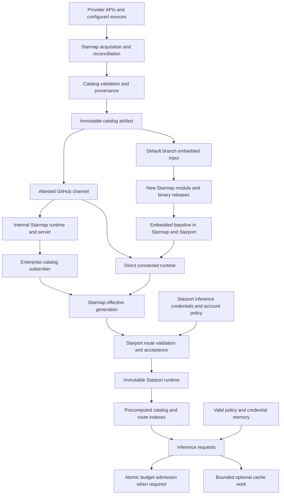

# Starmap and Starport catalog lifecycle specification

Starmap owns the catalog lifecycle. Starport supplies its storage and uses each
accepted generation to construct a complete inference runtime.

This draft specifies the target contracts for the [PRD](PRD.md).
The [repository findings](REPOSITORY_FINDINGS.md) record the inspected behavior.
Requirements in this document do not imply that the current code implements them.
New setting names and API concepts below are proposals unless marked existing.

Updated: 2026-09-05. Status: engineering draft after verified review.
The review resolution and canonical plan distinguish proposed contracts from implementation evidence.
The [storage review](STORAGE_REVIEW.md) records current file locations and backend behavior.
The [storage revision](../../plans/proof/starport-production-catalog/storage-revision-2026-09-05/REVIEW_RESOLUTION.md) maps its fourteen findings to the contracts below.
The accepted [latency target](LATENCY_REVIEW.md) adds the request-path contracts in section 8.9.
The [latency revision](../../plans/proof/starport-production-catalog/latency-revision-2026-09-05/REVIEW_RESOLUTION.md) maps each finding to implementation tasks and tests.

## 1. Ownership and composition



The diagram shows alternative direct and enterprise compositions. Enterprise
subscribers do not also contact the public channel.

The root `github.com/agentstation/starmap` package remains passive. It verifies
embedded data and reads caller-supplied storage. Explicit remote storage reads may use network connections and transport workers.
It starts no automatic source acquisition, provider acquisition, or refresh scheduler. Default construction remains offline.
The `runtime` package owns connected source and acquisition work.

The standalone CLI selects Starmap paths. Starport selects Starport paths and
injects a catalog store through the existing `WithCatalogStore` contract.

The owner approved native dependency budgets after measurement on 2026-09-06.
Read-only consumers permit 34 non-standard packages on Linux, 35 on Windows, and 37 on macOS.
Pinned-artifact consumers add their existing artifact reader, with limits of 35, 36, and 38 respectively.
The verifier retains forbidden-dependency checks. These build limits do not establish request latency or native platform qualification.

Construction must write no files.

Both constructors must preserve this rule with a durable store and workspace path.

`Client.RepairWorkspace(ctx)` explicitly repairs that workspace from the client's durable generation without publishing another generation.
It serializes repair with catalog publication and preserves operator changes. Connected runtime startup invokes this operation.

The owner approved explicit remote storage reads on 2026-09-06. The constructor calls the supplied store's `Current` method.
`NewContext` passes its context to that read. Network and worker acceptance must distinguish this explicit I/O from automatic acquisition and refresh.
The [decision record](../../plans/proof/starport-production-catalog/csp2/owner-decisions-2026-09-06.md) preserves this scope without claiming qualification.

Starmap owns credential contracts for catalog acquisition. Starport supplies a
deployment-scoped resolver when it embeds acquisition. This resolver must not
read account BYOK or shared inference credential repositories.

## 2. Catalog identities and state

Each catalog generation must bind a manifest, payload, full payload checksum,
schema version, validation result, and source evidence. A generation ID must
never name two different payloads. The semantic digest identifies catalog
facts. The payload checksum identifies exact transport and evidence bytes.

The following state has separate ownership:

| State | Owner and meaning |
| --- | --- |
| Embedded baseline | Immutable input compiled into the selected Starmap module |
| Selected source generation | Verified complete catalog from public, private, internal, or file source |
| Source observations | Scope-bound facts and completeness evidence from acquisition |
| Effective generation | Starmap's deterministic result under the authority policy |
| Candidate head | Durable generation awaiting Starport validation |
| Accepted head | Durable generation that Starport can activate |
| Runtime generation | Accepted catalog plus compatible connectors, credential handles, and routing policy |
| Runtime observations | Provider health and inference measurements, separate from catalog facts |

The runtime now keeps its compiled baseline separate from the accepted current head through `Client.EmbeddedCatalogState`.
Reconstruction never uses previously merged provider output as that baseline. The accessor reuses the verified immutable catalog without storage reads or decoding.
The constructor-free `EmbeddedGeneration` accessor remains the baseline-export contract.

An accepted head can remain the initial served state when no retained inputs exist under current startup behavior.
CSP3 must still apply authority and active revision checks to that choice. Explicit local inputs require separate source evidence during reconstruction.
A rebuild test that excludes a layer does not qualify operator revocation or restart admission policy.

Every request must retain one runtime generation until completion. A catalog
update must not change model identity, price selection, or credential placement
halfway through a request. Streaming requests retain their existing lease.

Generation status must carry the upstream identity and authority identity.
It must record the authority policy version and observation scope used for a
derived generation. A policy or credential-scope change must invalidate any
retained layer that no longer belongs to that scope.

The proposed `CATALOG_AUTHORITY_ID` names a stable authority independently of its
current URL. Both products use their own environment prefix for this setting.
Internal subscribers must verify that identity through the configured transport
and trust policy. A matching string alone does not prove authority.
An endpoint migration may preserve accepted state only when that trust still holds.

### 2.1 Client model identity and price changes

Canonical model IDs must remain stable. Never reuse a retired ID for a different model.
Starmap owns alias and deprecation metadata. Starport enforces it during request admission.
An alias must identify one canonical model and preserve the declared operation.
Reject cycles, ambiguous targets, cross-authority aliases, and targets outside permitted membership.

For a planned canonical rename, publish an alias before removing the old ID.
Use a time-based deprecation window from the release profile, not one generation.
The proposed default is 30 days. Confirm that value before CSP3 changes client identity behavior.

Provider withdrawal, lost capability, and authority revocation can end availability earlier.
The UI and API must distinguish those events from a planned rename.
A successor suggestion must not silently select a different model, price, or capability.

New attempts use the currently permitted identity mapping and one runtime generation.
Existing streams retain their request snapshot, subject to the withdrawal rules in section 8.2.
Every retry and queued line must pass current admission again.
Price selection binds to the request generation. Actual provider charges can still differ from catalog estimates.
Report unknown or stale pricing explicitly instead of treating it as zero.

The compatibility matrix must define each route's error status, shape, and stable reason.
Cover unknown ID, removed ID, unavailable offering, and denied permission separately.
Do not reveal private catalog membership to unauthorized callers.
Fix the exact protocol mappings before CSP10 implements these errors.
Transition tests must cover both API families, SDKs, aliases, removals, and concurrent requests.

## 3. Bootstrap and persistence

### 3.1 Persistent application startup

1. Resolve product paths and the deployment authority policy.
2. Validate the configured storage locations and permissions.
3. Read and validate the accepted catalog from durable storage.
4. Verify the embedded generation through its passive accessor.
5. Persist the baseline under an immutable baseline identity before external catalog work.
6. Select serving readiness according to the startup policy.
7. Start source synchronization and permitted acquisition.

Baseline persistence must be idempotent. An existing valid generation must not
be overwritten. A baseline record must not count as an accepted internal
generation. Empty storage, corrupt storage, and unavailable storage are
different states and require different diagnostics.

Application startup must save an inspectable manifest and catalog payload in
the product's catalog directory. Starport also saves the required generation
record through its KV adapter. The filesystem copy is a managed baseline
export, not a second authority for the accepted head.

Starmap must expose a pure public accessor for its complete embedded generation.
The proposed signature is `EmbeddedGeneration() (catalogs.Generation, error)`.
Starport must use that contract instead of reconstructing an embedded manifest.
The accessor validates and returns caller-owned data without external I/O.

For a fleet, each node can materialize its own baseline export. It must not
publish that baseline over an existing shared accepted head. The first shared
baseline write uses compare-and-swap against absence.

An explicit ephemeral composition uses memory and declares that it cannot
survive restart. A read-only library consumer can remain entirely passive.
Persistent application startup must not silently switch to ephemeral mode
after a permission, capacity, or storage error.

Temporary Starport development uses in-memory Badger, in-memory SQLite, and one private scratch root for blobs and catalog runtime state.
The scratch root uses the operating system temporary directory and a unique `starport-dev-` name.
Reject explicit persistent KV, SQL, blob, or catalog-state selections before opening stores.
The error names conflicting settings and links to persistent setup. It must not silently ignore them.
Inference and catalog network access still follow their separate policies.

Normal shutdown removes owned scratch files. Crash cleanup validates ownership and excludes live processes before removing abandoned files.
Development must not create or rotate a persistent local administrator token.
Existing read-only local authentication grants retain their separate authorization contract.
The current object-store and explicit catalog-state exceptions require migration diagnostics under A43.

### 3.2 Startup policies

| Mode | No accepted source catalog | Accepted source catalog exists |
| --- | --- | --- |
| Public or explicit local mode | Serve the saved baseline and refresh in the background. | Serve the retained catalog and refresh. |
| Internal authority | Keep diagnostics available and block inference until an approved catalog arrives. | Serve the retained internal catalog and reconnect. |
| Strict online source requirement | Require a successful source check before serving. | Require a successful source check before serving. |
| Verified file import | Accept the configured artifact after verification. | Keep the prior accepted artifact if the replacement fails. |

The existing `require_source` policy requires an online source read at open.
It is therefore not sufficient for the confirmed retained-internal behavior.
Add an authority-aware policy, proposed as `require_authority`, that accepts a
retained generation from the configured authority without requiring a new reply.

A subscriber with no lease must apply the same readiness rule. Another
instance's lease does not prove that an approved shared generation exists.

An internal authority has no implicit public fallback. Changing the configured
authority requires an explicit transition. A retained catalog from the previous
authority cannot satisfy the new authority's first-boot requirement.

The default retained-catalog policy has no hard expiry. It reports freshness
warnings. An operator can set a hard expiry that blocks new inference requests.
This metadata-retention default does not override permission freshness under section 8.2.
Expired inference credentials remain unusable regardless of catalog retention.

## 4. Product directories

### 4.1 Path contract

Each application owns configuration, data, state, and cache roots. Starmap's
library must accept caller-supplied paths and stores. It must not select a
Starmap home directory inside Starport.

The proposed default roots are below. `<product>` is `starmap` or `starport`.
Environment overrides use the corresponding uppercase product name.

| Platform | Configuration | Durable data | Process state | Cache |
| --- | --- | --- | --- | --- |
| Linux user | `$XDG_CONFIG_HOME/<product>` | `$XDG_DATA_HOME/<product>` | `$XDG_STATE_HOME/<product>` | `$XDG_CACHE_HOME/<product>` |
| macOS user | `~/Library/Application Support/<product>/config` | `~/Library/Application Support/<product>/data` | `~/Library/Application Support/<product>/state` | `~/Library/Caches/<product>` |
| Windows user | `%APPDATA%\<product>` | `%LOCALAPPDATA%\<product>\data` | `%LOCALAPPDATA%\<product>\state` | `%LOCALAPPDATA%\<product>\cache` |

Linux fallbacks are `~/.config`, `~/.local/share`, `~/.local/state`, and
`~/.cache`. Relative XDG values are invalid. The resolver must follow the
[XDG directory specification](https://specifications.freedesktop.org/basedir/0.8/).
The macOS mapping follows Apple's support and cache directory guidance.
[Apple directory guidance](https://developer.apple.com/library/archive/documentation/FileManagement/Conceptual/FileSystemProgrammingGuide/MacOSXDirectories/MacOSXDirectories.html)
The Windows mapping separates roaming configuration from local machine state.
[Windows known folders](https://learn.microsoft.com/en-us/windows/win32/shell/knownfolderid)

These exact product subdirectories are design choices. Platform documentation
defines the parent directory roles, not a mandatory Starmap or Starport layout.
Use platform directory APIs where available. Do not construct paths from an
assumed username, drive, or translated folder name.

Proposed precedence is explicit command or Go option, product-specific root
setting, product home, then platform default. Proposed `STARMAP_HOME` and
`STARPORT_HOME` group all roots under one configured directory. Root-specific
settings override only their corresponding child. Environment settings precede
configuration-file settings at the same specificity.

| Setting | Proposed contract |
| --- | --- |
| `<PRODUCT>_HOME` | New grouped root for configuration, data, state, and cache |
| `<PRODUCT>_CONFIG_DIR` | Configuration root. Starport already supports this name. |
| `<PRODUCT>_DATA_DIR` | New durable data root |
| `<PRODUCT>_STATE_ROOT` | New common parent for process state |
| `<PRODUCT>_CACHE_DIR` | Disposable cache root |
| `<PRODUCT>_INSTANCE_ID` | New bootstrap identity for one persistent process. Single-process recipes use `default`. Named replicas require distinct values. |
| `<PRODUCT>_DEPLOYMENT_ID` | Node-owned deployment identity. Local recipes use `local`. Fleet replicas use the same explicit deployment value. |
| `STARMAP_STATE_DIR` | Preserve the existing explicit runtime-directory meaning. |
| `STARPORT_CATALOG_STATE_DIR` | Preserve the existing explicit catalog runtime directory. |
| `STARMAP_CATALOG_STORE_PATH` | New explicit standalone catalog store path |
| `<PRODUCT>_CATALOG_WORKSPACE_PATH` | Preserve the existing explicit workspace selection. |
| `<PRODUCT>_RELATIVE_PATH_BASE` | Explicit `config` declaration for new relative legacy selectors. Empty values require absolute legacy selections. Node-owned and never inherited across products. |

`<PRODUCT>` means `STARMAP` or `STARPORT`. A leaf path override wins over its
parent root. Existing explicit directory settings must not silently gain new
child components during migration.

Starport must never inherit Starmap filesystem roots through environment
fallback. An explicit caller path can point to a shared read-only artifact.
It cannot silently share a writable catalog workspace or instance seed.

Grouped `<PRODUCT>_HOME` roots use exactly `config/`, `data/`, `state/`, and `cache/` children.
Root selectors must be absolute. Resolve relative leaf paths against the resolved configuration root, never the working directory.
Report that anchor with every relative input. Reject empty required paths in persistent mode, including the SQLite path.
Existing explicit runtime-directory overrides select that exact directory without extra children.

Migration must resolve prior relative inputs before adopting the new rule. If the old anchor is unknown, require an explicit absolute path.

Starmap enforces this boundary with `relative_path_base: config`, `STARMAP_RELATIVE_PATH_BASE=config`, or `--relative-path-base=config`.
Without that declaration, legacy relative selectors fail before primary-file selection or catalog initialization.
The declaration follows node-setting precedence. Empty values remove the declaration, and other values fail validation without value disclosure.
It does not move files or establish migration completion. Existing deployments must first replace old relative values with their previous absolute locations.

The guard covers primary configuration, runtime state, canonical and legacy workspace settings, and update workspace and source overrides.
File catalog sources also resolve `catalog_source_url` through this guard before baseline writes.
Runtime composition receives the absolute source filename, and the file inventory reports the same path and anchor as `source-file`.

A relative primary file needs bootstrap intent from flags, environment, or an explicitly selected dotenv file.
The selected file cannot authorize its own relative selection. Absolute primary files can declare intent for their relative leaf settings.
The new `catalog_store_path` has no prior anchor and continues to resolve relative values against the configuration root.
Starport must apply the same node-owned rule at its CSP8 integration boundary.

Choose the configuration root and selected file before parsing that file.
A value inside the selected file cannot relocate the file that supplied it.
Root, instance, storage-connection, and trust-bootstrap settings remain node-owned under shared configuration.

### 4.2 Directory contents

Starmap uses `config.yaml`. Starport retains `config.env` for bootstrap and local configuration.
Do not automatically search alternate formats or the other product's directory.
An explicitly selected Starmap file retains its supported format. A future format change needs a separate schema migration.

The following manifest defines proposed managed names. Existing explicit locations remain valid through migration.
`R` is the selected runtime directory. Its default is `<state>/catalog/runtime/<instance-id>/`.
Generation and operation directory components use lowercase SHA-256 hashes of their IDs. Manifests retain the original IDs.

| Owner | Root and path | Creation, lifetime, and recovery |
| --- | --- | --- |
| Starmap configuration | `<config>/config.yaml` | Explicit setup or operator input. Preserve settings and secret access. |
| Starport configuration | `<config>/config.env` | Persistent setup and local edits. Shared mode retains bootstrap values only as authority. |
| Application baseline | `<data>/catalog/baseline/<generation-id-hash>/{manifest.json,catalog.json}` | Persistent startup creates an inspectable export. Preserve identity, or reproduce from the exact installed binary. |
| Human catalog workspace | `<data>/catalog/workspace/` | Optional explicit authoring. Preserve operator content. |
| Workspace preparation | `<workspace-parent>/.<workspace-name>.preparing-<id>/` | Private enclosure for rendering and access restoration. Descendants retain workspace policies. Preserve interrupted preparation until ownership checks permit cleanup. |
| Workspace replacement journal | `<workspace-parent>/.<workspace-name>.starmap-replacement.json` | Windows replacement intent. Preserve with its candidate and backup until verified recovery completes. |
| Workspace replacement backup | `<workspace-parent>/.<workspace-name>.backup-<id>/` | Previous directory retained through receipt publication. Preserve changed or unrecognized entries. |
| Starmap catalog store | `<state>/catalog/{current,.commit.lock,generations/<generation-id-hash>/}` | Preserve the accepted pointer, manifests, and payloads. Let the adapter manage locks. |
| Runtime ownership | `R/{owner.json,.owner.lock,instance-seed}` | Persistent initialization and process locking. Restore one identity to one active owner only. |
| Runtime evidence | `R/catalog-runtime/source.json`, `R/catalog-runtime/providers/<provider-id>.json`, and `R/catalog-runtime/providers/bindings/<key-digest>.json` | Preserve permitted source layers across restart. Fleet-required layers also need shared durable storage. |
| Runtime manual history | `R/catalog-runtime/manual.json` | Owner-only head for accepted observation batches in `publication-inputs`. Preserve its full referenced history through restart and backup. |
| Runtime publication record | `R/catalog-runtime/publication.json` | Owner-only transaction state. Startup resolves prepared records or replays committed records before reading retained inputs. |
| Runtime publication inputs | `R/catalog-runtime/publication-inputs/<sha256>.json` | Owner-only immutable records for retention recovery. Preserve references from pending publication and accepted manual history. CSP5 owns safe compaction and collection. |
| GitHub discovery | `R/github-catalog-source/<channel-hash>.json` | Preserve replay floors and verified release references. ETags alone are disposable. |
| Badger | `<data>/badger/` | Embedded Starport KV. Back up through an engine-consistent method. |
| SQLite | `<data>/sqlite/starport.db` and engine sidecars | Embedded Starport SQL. Recover through a consistent snapshot that includes committed WAL data. |
| Local blob bytes | `<data>/files/objects/<prefix>/<prefix>/<key-hash>` | Preserve bytes referenced by KV metadata. The key hash does not promise content deduplication. |
| Blob staging | `<data>/files/staging/put-*` | Temporary upload state. Collect only abandoned writes after ownership checks. |
| Local console token | `<data>/local-admin-token.json` | Starport local authorization. Preserve privately or rotate through explicit recovery. No independent path selector. |
| Welcome marker | `<data>/welcomed` | Starport first-use state. Optional during recovery. |
| Starmap HTTP source cache | `<cache>/models.dev/{api.json,api.json.metadata.json}` | Rebuild from permitted source access. Accepted source evidence remains separate. |
| Starmap source checkout | `<cache>/sources/models.dev-git/` | Managed fetch/build input. Preserve source receipts outside this cache. Never delete an operator-selected checkout. |
| Catalog download staging | `<cache>/catalog/downloads/` | Disposable transfer files. Reverify completed bytes before acceptance. |
| Starmap administration identities | `<state>/admin/identities.json` | Standalone server initialization and recovery. Starport retains its token and identity repositories. |
| Local administration operations | `<state>/admin/{audit/events.ndjson,operations/<operation-id-hash>.json}` | Standalone Starmap and local Starport config operations. Shared Starport config uses transactional SQL audit and receipts. |
| Migration journal | `<state>/migrations/<operation-id-hash>/{manifest.json,journal.ndjson}` | Preserve intent, old and new paths, checksums, and completion state until recovery closes the operation. |
| Runtime migration stage | `<target-parent>/.migration-<manifest-sha256>/` | Keep a private copy beside its final target for verification and later publication. |
| Pending migration marker | `<stage-or-target>/.migration-pending.json` | Bind the directory to its immutable manifest. Keep the marker through rename and refuse startup until activation. |
| Runtime migration receipt | `<target-runtime>/.migration-receipt.json` | Bind a published target to the immutable migration manifest. Retain it through later catalog refreshes. |
| Runtime completion record | `<target-runtime>/.migration-completed.json` | Bind completed selection to the migration manifest after the final journal event. Retain it while legacy-root acknowledgement is required. |
| Runtime retirement record | `<source-runtime>/.migration-retired.json` | Refuse startup from a migrated source. Keep older binaries stopped because they do not honor this record. |
| Partial migration copies | `<migration-stage>/.migration-work/<target-path-sha256>.partial` | Resume only operation-owned scratch files. Preserve conflicting published files and unknown entries. |
| Optional managed trust | `<config>/trust/<name>.pem` | Explicit operator import. Existing external trust paths remain operator-owned. Compiled trust remains in the binary. |
| Optional file logs | `<state>/logs/<product>.log` | Created only when file logging is selected without a leaf override. Rotation and retention follow the declared recipe. |
| Usage export | Explicit file or HTTP destination | No default file. External collector durability is a separate contract. |
| Backup bundle | Explicit destination containing `backup-manifest.json` and adapter outputs | Preserve store identities, checksums, references, secret recovery requirements, and authority evidence. No implicit backup directory. |

Badger internal file names and SQLite sidecars belong to their engines. The product manifest records the engine directory or consistent snapshot boundary.
Identifiers used in managed paths must reject traversal and invalid native components.
The channel hash preserves the existing repository, NUL separator, and channel hash convention.

Runtime enforcement and diagnostic declarations must consume one semantic file-role policy definition.
Platform adapters may inspect or enforce access differently, but they must not independently choose the expected access class.
Tests must preserve the editable-workspace boundary and detect drift between file-role declarations and enforcement.
Workspace replacement must preserve declared access restrictions and operator editing rights, including unrelated files, or refuse before publication.

Starmap now shares role declarations and POSIX classification through `pkg/productpaths/policy`.
Adapters refuse an incompatible declaration before file access. Starport adoption remains a CSP8 obligation.

Workspace replacement journals now use version 2 with content, mode, ownership, and native ACL bindings.
Recovery refuses older journals and missing access digests without changing their files.
Atomic replacement also checks the original access-bound tree before publication.

Private staging restores workspace access before candidate publication.
macOS and Linux component tests cover modes, ACLs, inheritance, operator notes, and interrupted replacement.
Native Windows execution, foreign-owner restoration, and complete recovery qualification remain UNVERIFIED.

See the [snapshot evidence](../../plans/proof/starport-production-catalog/csp2/workspace-access-snapshots.md) for limits and legacy recovery obligations.
The [preservation evidence](../../plans/proof/starport-production-catalog/csp2/workspace-access-preservation.md) records the initial checks and process-lock failure.
The [shared-policy record](../../plans/proof/starport-production-catalog/csp2/shared-file-policy.md) records its test-lifetime correction, shared policy, and subsequent verification.

Private configuration, credentials, runtime evidence, administration, and migration files require owner-only access by default.
Use `0700` private directories and `0600` private files on POSIX, with equivalent tested Windows ACLs.
Shared static baseline exports can use explicit read permissions. They contain no credential material.
Local `config.env` can contain the security master key today. Never classify all configuration files as secret-free.

D23 permits a checked exception for explicitly selected, administrator-owned primary configuration, such as `root:starmap` with mode `0640`.
The reader must verify trusted ownership, service read access, and absence of untrusted write access, including equivalent Windows ACL checks.
The exception requires explicit selection. A failed private-file check must not enable it automatically.

Catalog state and dotenv files retain their private-access requirements. CSP2 and CSP8 own implementation and qualification for Starmap and Starport.
This approved exception remains unimplemented at this checkpoint.

The Starmap CLI now applies private-file access checks to primary YAML and every explicit dotenv file before parsing.
Each file permits at most 1 MiB. This input bound applies before and during the read.
Private read-only files remain valid. The reader resolves selected symlinks and validates the resulting regular file and supported native ACLs.

A missing selected target causes a conflict. A genuinely absent default primary file remains optional.

All dotenv files must pass access checks and parsing before any environment mutation.
Read failures retain typed causes without configuration values. Parse errors continue to omit parser input.
The shared record reader serves runtime evidence and configuration inputs. Directory policy stays with each caller.

Linux and macOS now enforce the ancestor policy below. Service-owned file exceptions, other file roles, and native Windows qualification remain open.

Every manifest entry needs a descriptor for its override, applicability, access, retention, and recovery policy.
An unselected local backend must not create empty database directories during shared startup.
The path report must show effective absolute paths, origins, active backend, instance ownership, and whether each artifact exists or is applicable.
CLI text, JSON, authenticated API, UI, and generated docs use the same descriptor inventory.
Reports must resolve real leaf overrides. Merely printing default paths fails A03 and A24.

The current Starmap `config paths` command reports selected locations through `productpaths.FileManifest` schema version 1.
Its four roots and file entries retain origins and anchors. JSON and YAML also include creation conditions, recovery rules, and external destination roles.
The application resolves configuration without opening the catalog runtime or creating product files.

The current default inventory contains 28 file entries and seven external roles.
A selected file source adds one entry.
Six reserved entries carry `planned` availability because their writers remain unimplemented.

File patterns describe possible artifacts. The optional `--inspect` scan reports existence and bounded metadata without opening catalog state or creating files.
Its default budget covers 10,000 entries, including unmatched directory entries. The maximum explicit budget is 100,000 entries.
Budget exhaustion and metadata failures produce an incomplete report. These limits do not bound elapsed time on slow storage.

Linux and macOS report mode bits and numeric filesystem owners. Those values do not prove effective access or ACL safety.
The runtime owner observation compares at most 4,097 record bytes against the configured binding without reading the seed or acquiring locks.
A matching record does not prove active ownership. Windows permission and owner adapters remain unverified.

Each managed and external role now includes selectors, applicability, access class, retention class, and removal conditions.
JSON and YAML expose the full policy. Wide output exposes access and retention classes.
Unknown file roles cause a typed configuration error instead of receiving an implicit policy.
These descriptors state requirements. They do not certify file permissions or enable cleanup.

Private POSIX observations report access conflicts for group or other mode bits, or a different effective owner.
Other present observations remain unverified because metadata alone cannot qualify ACLs and effective access.
Absent or inapplicable roles report no assessment. Inspection preserves file bytes and permissions.
The exact embedded baseline permits explicit shared reads, although its current exporter creates private files and directories.

Complete enforcement, Starport integration, and API and UI reporting remain required before acceptance.
Retained runtime evidence and GitHub discovery now use shared private-file creation and access checks.
POSIX creation uses private modes. Windows creation uses an explicit owner and protected DACL.

Directory bindings compare filesystem identity before each operation. A lost binding is a conflict, not an absent record.
Existing records must be private regular files. Failed checks preserve their bytes and permissions.

The record reader enforces the existing byte limit before and during the read.
Writes use exclusive temporary creation, file flush, complete-record publication, and directory flush.
Only the recorded temporary file identity permits cleanup. Competing replacement files remain untouched.
Existing legacy temporary files do not become staging destinations.

Runtime migration validation binds existing directories without creating missing paths.
The existing native ACL checks now live in the shared private-file package. Runtime identity guards delegate to that package.
Older exposed child paths require explicit operator review and correction before use.
Ancestor policies, other file roles, orphan cleanup, and native durability qualification remain open.

Current POSIX startup also rejects exposed mode bits or another UID on the runtime directory, lock, owner record, and seed.
The application checks its configured runtime path before baseline export. Runtime ownership repeats the check before identity initialization.
Existing modes remain unchanged. Operators must verify the service identity and paths before correcting permissions and retrying startup or migration.

The macOS adapter also inspects descriptor-bound native ACL metadata on these four paths.
Every allow entry with nonzero rights must identify the file owner. This rule includes inherited and inheritance-only grants. Deny entries remain valid.
The adapter refuses unsupported or incomplete ACL metadata. It does not rewrite ACLs or evaluate ordered effective access.

Native calls use `libSystem` through `github.com/ebitengine/purego`, without a Cgo requirement or a runtime shell command.

The Windows adapter requires the process account SID as owner. It permits allow entries only for that SID, SYSTEM, and Administrators.
SYSTEM and Administrators retain privileged host access. This exception does not include ordinary groups or other service accounts.

Absent and null DACLs cause refusal. Empty DACLs deny access and remain distinct from null DACLs.
Unsupported ACE types cause refusal. Basic deny entries remain valid, and inherited allow entries use the same grant policy.

New Windows runtime directories, locks, and staged identity files receive an explicit owner and protected DACL during exclusive creation.
Migration staging roots use the same private creation primitive. Existing files and directories retain their security descriptors.
Native creation uses one child name relative to an open directory handle, with reparse traversal disabled.
These operations use the existing `golang.org/x/sys/windows` dependency and need no Cgo toolchain.

This guard does not qualify ancestor access, other file roles, or native Windows behavior.
The metadata inspection command still lacks ACL observations. Native macOS x64 and Windows qualification remain open.

#### POSIX ancestor access

Private directory bindings, private record operations, runtime startup, and configuration inputs now check existing ancestors on Linux and macOS.
Ancestors and selected symlinks must belong to root or the effective user. Group or other write bits require a trusted sticky directory.
Read and search permissions remain compatible with shared system ancestors.
Each intermediate symlink target must pass the same policy before Starmap uses its resolved path.

Linux applies its ACL mask through the group permission bits. Its sticky restriction protects directory entries from other unprivileged accounts.
See the Linux [ACL mapping](https://man7.org/linux/man-pages/man5/acl.5.html) and [sticky-directory contract](https://man7.org/linux/man-pages/man7/inode.7.html).
macOS checks native ACL grants separately. Read, search, and synchronization grants remain valid for other accounts.
Other nonzero grant rights require root or the effective user. Deny entries remain valid, and unknown metadata causes refusal.

Creation uses parent handles and validates each child before descent. It refuses replacement symlinks without writing into their targets.
Private record publication repeats ancestor checks before the record switch. Existing bytes, ownership, and permissions remain unchanged after an access refusal.

Configuration symlink checks preserve both the selected route and its intermediate target checks.
Runtime validation runs before baseline export. Baseline directory creation uses the same parent-handle creation primitive.

These controls do not qualify hostile mount replacement, every file role, native Windows ancestry, or managed-service file ownership exceptions.
The leaf policy still requires private owner access. Ancestor read permissions do not relax that policy.

#### Private filesystem catalog store

The filesystem adapter applies the private-state policy to its root, generation directories, JSON records, current pointer, and commit lock.
The file inventory declares this store `owner-only`, including its staging entries. POSIX inspection reports conflicting mode bits without changing existing files.

Its constructor remains passive. Operations refuse unsafe existing access without automatic permission or ownership changes.
The same refusal applies before legacy-store migration. Public YAML export permissions remain separate.

Candidate publication validates private access and exact staged bytes before a no-replace directory rename.
Current publication retains its original directory binding and checks cancellation and access before replacement.
Cleanup preserves changed files and replacement directories. CSP5 owns abandoned-stage collection.

The [CSP2 evidence](../../plans/proof/starport-production-catalog/csp2.md#private-filesystem-catalog-store) records local race and native Linux checks.
Native Windows execution, Windows ancestors, service-file exceptions, and complete durability qualification remain open.

The [Linux ownership fixture](../../plans/proof/starport-production-catalog/csp2/native-ownership-and-tooling.md) verifies refusal without ownership rights and successful preservation with authorized rights.

It includes supplementary-group updates without capabilities. This component evidence does not qualify other platforms or managed-service configurations.
These store checks do not add filesystem access to the active in-memory catalog lookup path.
CSP5 must classify errors after current-pointer publication, including a failed directory flush after rename.
The pointer can already be visible when that flush fails. An arbitrary I/O error does not prove rollback.

#### Windows ancestor access

The shared ancestor boundary now selects native Windows ownership and DACL checks before private file access.
It validates component identities through handles that open reparse points without following them.
The guard checks trusted symlink routes and targets, including components before `..`.

Trusted ancestor principals are the process account, SYSTEM, Administrators, and TrustedInstaller.
Shared read, traversal, and subdirectory creation grants remain valid. Other mutation grants require a trusted principal.

Inheritance-only grants do not affect the current ancestor. Protected private creation excludes inherited grants from new private children.
Existing private leaf policy remains stricter. Unsupported entries, flags, and reparse points cause refusal.

The implementation accepts drive, UNC, extended filesystem, and volume GUID path forms for validation.
Native parser and filesystem tests remain UNVERIFIED until the Windows matrix runs.
The [CSP2 evidence](../../plans/proof/starport-production-catalog/csp2.md#windows-ancestor-access) separates portable policy checks from native API qualification.
Windows service procedures, declared service-file exceptions, and complete platform durability remain open.

#### Windows file inspection

File inspection now reads ownership and DACL metadata through a handle with metadata and security-read rights.
The handle opens the selected reparse point itself. Symbolic links and unsupported reparse points receive no target security observation.
The reader checks file identity before and after the security query. It does not request file-data access.

The native descriptor decoder belongs to `internal/runtimeacl/windows` and serves both inspection and enforcement.
Observations distinguish absent, null, empty, and populated DACLs. They include owner and process SIDs without account-name resolution.

The shared private policy determines known conflicts for owner-only file roles. Compatible descriptors still leave effective access unverified.
Other access classes retain their declared uncertainty. Native Windows execution remains UNVERIFIED.

### 4.3 Services and migration

The proposed Linux service roots are `/etc/<product>`, `/var/lib/<product>/data`,
`/var/lib/<product>/state`, and `/var/cache/<product>` for configuration, data, state, and cache.
macOS services use `/Library/Application Support/<product>/{config,data,state}` and `/Library/Caches/<product>`.
Windows services use ACL-protected `%ProgramData%\<product>\{config,data,state,cache}`.
Container recipes select these roots explicitly. They must not depend on the image user's home directory.
Configuration mounts can be read-only. Required data and state mounts must remain writable and survive container replacement.

The current Compose recipe explicitly groups roots under `/home/nonroot/starmap` within its named volume.
This path uses the pinned base image's existing nonroot directory for initial volume ownership.
Resolution does not use the process `HOME` value. The ephemeral example selects `/var/lib/starmap` on a private temporary mount.
Changing these selectors does not migrate an existing volume. Operators must preserve old state and complete the corresponding migration first.

The Kubernetes example selects `/var/lib/starmap/instance` under a provisioned PVC mount.
It omits automatic recursive group-permission changes that can conflict with private retained files.
Its single-writer Deployment uses `Recreate` during upgrades and accepts the resulting availability gap.
Runtime locking remains necessary during other replacement paths. Cluster and storage-driver qualification remain open.


Each process needs a unique runtime directory, including two instances on one
developer machine. A fleet must not copy or share an instance seed. A shared
catalog store is separate from this process identity.

Validate instance IDs as single safe path components. Record the product, deployment, instance, and schema in `owner.json`.
Hold an exclusive runtime-directory lock for the process lifetime. Refuse a conflicting owner before changing state.

The owner record uses schema version 1 and contains `product`, `deployment`, and `instance`.
An explicit scheduler identity adds `scheduler_identity_sha256`. Changing or clearing that override requires ownership migration.

Starmap exposes this node override as `STARMAP_SCHEDULER_IDENTITY`, YAML `scheduler_identity`, and `--scheduler-identity`.
Its node configuration report includes the selected value and origin. The empty default derives identity from the seed and owner.

Migration preserves the observed identity through this explicit override and the selected `state_dir`.
Starport must not inherit Starmap node identity settings. CSP8 owns its product-local composition.
Deployment IDs use at most 256 UTF-8 bytes, with no control characters or surrounding whitespace.
The product generates the record. Manual changes require an explicit ownership migration.

Persistent identity binds the seed to the recorded product, deployment, and instance. Host and port changes do not create another identity.
Startup refuses missing or invalid seeds in existing runtime state before catalog access.
A crash after owner creation but before initial seed creation can resume when no prior runtime state exists.


Shared deployments also reject duplicate active instance identities. A changed port does not establish isolation.
Restoring a seed to a replacement requires fencing its former owner. Creating another replica requires a new identity and seed.

The migration must detect existing `~/.starmap`, Starport configuration-root
data, and Starport's current XDG catalog state. It must preserve explicit paths.
If old and new roots both contain data, startup reports the conflict and does
not choose by modification time. A migration operation must copy, verify, and
switch roots before it removes any old files.

Each runtime migration first records an immutable source inventory under its operation ID.
The inventory binds source and target paths, file sizes, SHA-256 digests, the source identity, and the requested owner.
Preparation holds the source-directory lock. Operators must also stop older binaries that do not honor that lock.

An existing owner record must verify the supplied source identity.
Legacy state without that record requires the identity observed in the old deployment and reports that identity as unverified.
The migration must preserve that identity explicitly. It must not infer the old identity from the seed, current hostname, or current port.

Journal events follow `prepared`, `copied`, `verified`, `promoted`, and `completed` in order.
Each event binds the preceding event digest. The first event binds the manifest digest.
Recovery preserves a partial final write before truncation. It refuses an invalid complete event or a suffix that differs from the next event.
The migration engine must finish each action and verify its result before it records the corresponding event.

A staged runtime must not start before publication. Its pending marker must cause refusal before owner, seed, or catalog initialization.
Copying files must not alter the configured roots or expose an incomplete final target.
Retries must verify existing staged files against the immutable inventory before they reuse those files.
Only operation-owned partial copies may restart. Conflicting complete files and unknown entries require explicit recovery.

Publication validates retained catalog layers before it renames the stage without replacement.

Baseline export and migration publication share an operation relative to the open parent directory.
The filesystem call must refuse every existing destination, including an empty directory.
An earlier existence check cannot establish this guarantee. The operation must not resolve paths from the parent's original name.
Atomic publication does not establish durable storage. File and directory synchronization remain separate requirements.

Baseline staging now retains directory identity and open file handles until publication or local cleanup.
Before publication, it verifies the exact file inventory, identities, metadata, and bytes. Cancellation must cause refusal before the rename call.
Cleanup repeats these checks and removes only unchanged files created by that export. It never recursively removes a staging path.

An added entry, changed file, or replaced directory causes a typed conflict. Cleanup preserves the original operation error as well.
After successful publication, cleanup must ignore the former staging name, even if another process reuses it.
Staging directories from earlier processes remain untouched because the current operation cannot prove their ownership.
These checks do not provide an atomic multi-file transaction against arbitrary external editors.

CSP5 owns abandoned-stage recovery and collection under its existing staged-write step.
It must cover baseline, migration, workspace, retained-evidence, and discovery scratch records, with writer exclusion and ownership checks.
CSP8 separately owns temporary Starport scratch cleanup under A43. Neither task can infer ownership from a filename prefix or process identifier alone.

Windows flush operations require writable handles. The directory adapter must reopen the directory under its existing handle and preserve access failures.
Unsupported directory flushes must cause an error. They must not count as successful durable writes.
Workspace staging must also use writable handles when it flushes regular files.

Native qualification must verify the selected filesystem. API success alone does not prove hardware power-loss recovery.

The target retains its pending marker until the source retirement record and target receipt are durable.
Each record binds the immutable migration manifest. Conflicting receipts cause refusal without replacement.
Retries after activation preserve catalog updates from the replacement runtime. A later migration binds the preceding receipt digest.

The replacement runtime confirms completion only when its active configuration selects the target directory, owner, and retained identity.
Completion records the final journal phase, then writes `R/.migration-completed.json` with the immutable manifest.
A retry repairs a missing completion record after a process exit. Conflicting records cause refusal.
Completion does not edit host configuration or remove source files.

The CLI exposes `migrate runtime prepare`, `stage`, `publish`, and `complete` through application-owned adapters.
Its default journal root is `<state>/migrations`. An explicit root must remain outside both runtime trees.
The application uses its selected product, deployment, and instance for the target owner.

CLI completion requires saved `state_dir` and `scheduler_identity` values that match the effective runtime selection.
Saved deployment and instance values must also match, including their documented defaults.
The loader hashes the exact bytes it parses. Completion checks that digest before and after opening its temporary runtime.
It verifies publication before runtime initialization and closes the temporary runtime after completion.

`runtime.WithPublishedDirectoryMigration` binds startup to the exact published operation.
The runtime verifies its receipts, owner, and seed under the target-directory lock before persistent initialization.
A directory replacement after preflight must not receive a new owner, seed, or catalog.

Operators persist the configuration selection through their existing configuration-management process.
The CLI does not modify configuration content or service definitions.

Default-root startup can acknowledge one recognized legacy runtime through a verified completion record.

`runtime.ReadDirectoryMigrationCompletion` checks the preserved source inventory and retirement record, target receipts, owner, and seed without writes.
The record must match the selected target, owner, and retained scheduler identity. Another recognized legacy runtime still requires explicit migration.

`runtime.WithCompletedDirectoryMigration` repeats that check under the target-directory lock before persistent initialization.
Verification permits later target catalog updates and does not read the operation journal.
The preserved source must remain intact while default-root startup needs this acknowledgement. Ordinary catalog reads do not hash that source inventory.
Known catalog-layer validation does not qualify every host setting, backend, or native filesystem.

Migration must preserve catalog identities, KV records, SQL records, and
credential encryption configuration. It must not overwrite a human catalog
workspace. Native tests must cover Windows rename behavior, ACLs, symlinks,
read-only homes, and interrupted migration.
Run native path and interrupted-migration checks before CSP2 and CSP8 complete.
Cross-compilation alone is insufficient. Repeat the checks against release artifacts in CSP22.

The current CSP2 source suite has native Linux ARM64 container evidence for all ten prepared filesystem and runtime packages.
Its 697 test and subtest results include process-exit recovery, with no failures or skips.
The [execution proof](../../plans/proof/starport-production-catalog/csp2.md#native-linux-arm64-package-execution) states the tested environment and limits.
This evidence does not qualify Windows APIs, service-manager recipes, hardware power loss, or the released product pair.

### Source directory composition

`productpaths.SourceDirectoriesAt` derives source parents from a clean absolute cache root.
`productpaths.DefaultSourceDirectories` selects native defaults for the named product and creates no files.
The HTTP parent is the cache root. The Git parent is `<cache>/sources`.

`acquisition.WithSourceDirectories` lets the host inject both parents without ambient product settings.
Starmap CLI update and server acquisition use the cache root from their resolved application configuration.
The path report includes the actual HTTP cache and Git checkout directories.

Per-operation `sync.WithSourcesDir` retains precedence over these defaults and selects one parent for both transports.
The Go option preserves its caller-owned path semantics. The Starmap CLI resolves its legacy source selectors before catalog access.
Absolute CLI selections keep their locations. Relative CLI selections require `relative_path_base: config` and use the configuration root.

Workspace projection reads logos from the same selected checkout parent.
Sync and release import must reject checkout overlap with the human catalog workspace before publication.
Projection repeats that separation check before workspace writes.

Invalid native defaults cause refusal before source acquisition or cleanup. Explicit paths do not require native home settings.
The source adapters do not migrate or delete old `.starmap` cache and checkout roots.
Accepted source evidence remains separate from these disposable files.

## 5. Publication and release embedding

The current workflow already uses `17 */4 * * *`. Keep one serialized producer
for each channel. A run must report required, optional, disabled, missing-key,
failed, and successful sources separately.

The proposed complete publication sequence is:

1. Read the current accepted publication and its source observations.
2. Collect all configured and eligible source evidence.
3. Reconcile a candidate under the versioned authority policy.
4. Validate identities, links, schema, completeness, provenance, and size bounds.
5. Stage the immutable artifact and generate its attestation.
6. Publish and verify the immutable artifact through its public download path.
7. Promote that exact generation into the default branch's embedded input through a checked bot PR.
8. Verify the merged branch's manifest and payload against the published generation.
9. Advance and attest the mutable channel pointer.
10. Record the run outcome and the promoted source revision.

A bot PR may merge automatically only after its configured gates pass. The
publisher must serialize catalog promotion and revalidate after a base-branch
change. Required human review can delay promotion and must appear in status.
This design does not authorize a repository write during this documentation task.

GitHub cannot atomically commit a branch and update an independent channel.
The run therefore records each transition. If promotion fails, the previous
channel remains selected. If channel publication fails, retry selects the
already verified artifact and promotion without rebuilding different bytes.

The success condition binds artifact digest, promoted source commit, and
channel sequence. A partial run must not report complete success. New source
checkouts contain the latest completed promotion, not an unfinished run.

An unchanged semantic catalog reuses its immutable artifact. The publisher
advances channel confirmation after successful validation. Per-source receipts
must distinguish fresh observations from retained evidence or skipped sources.
Channel freshness alone must not imply fresh provider observations.

Each new Starmap release embeds the verified catalog present in its source
revision. A release from an older branch must import and commit the selected
catalog before it tags the module. Release tooling must not rebuild different
embedded bytes under an existing tag.

Starport embeds the baseline in its pinned Starmap module. Updating Starmap's
default branch does not update that pin. Starport's release process must select
a Starmap module containing the desired baseline and record its generation.
Ordinary Starport startup can still download newer catalogs independently.

### 5.1 Publication admission and source receipts

Every publication profile must name required sources, scope, maximum retained age,
and any removal threshold that requires review. Record its policy version.
Missing credentials do not make a required source optional.

| Source result | Publication verdict |
| --- | --- |
| Required source succeeds completely | Use its validated scoped evidence. |
| Required source fails or is partial, with permitted retained evidence | Retain that scope within its age limit. Publish other valid changes and report retention. |
| Required source has no permitted retained evidence | Reject publication. Keep the current branch promotion and channel. |
| Optional source is absent or fails | Publish other valid scopes if the profile permits it. Do not invent freshness or deletions. |
| Complete empty source or explicit tombstone | Apply deletion only within its authorized scope. Enforce the removal review threshold. |
| Disabled source or revoked scope | Apply the explicit removal policy. Never treat its old evidence as a current observation. |
| No fresh source result | Confirm only the checks that actually completed. Reject any claim of a fresh acquisition. |

A first run with no required evidence must fail even if embedded facts exist.
A profile can explicitly select the embedded source as approved evidence.
Incomplete empty replies must never satisfy a complete-deletion contract.
Record rejected candidates and their causes without advancing either mutable head.

Unchanged facts can reuse the immutable semantic artifact.
Store each new run receipt as a separate immutable, verified object.
Bind the receipt to the artifact digest, source scopes, observation ages, and admission policy.

The channel names both the artifact and the receipt digest.
Consumers verify both bindings. They must not substitute channel confirmation for provider freshness.
Do not alter historical manifest bytes to attach newer observation times.

### 5.2 Publisher identity and checks

The proposed bot uses a GitHub App installed only on the publishing repository.
Its installation token needs the narrowly scoped contents and pull-request permissions for promotion.
The release owner must verify the actual branch rules and required check identities.
The bot must not approve its own changes or bypass required reviews.

A controlled repository test must prove that bot updates run the required checks
and that only the verified generation can merge and advance the channel.
GitHub currently gives relevant GITHUB_TOKEN-created pull requests approval-required workflow runs.
Do not treat a created pull request as proof that all checks ran.
[GitHub workflow triggering](https://docs.github.com/en/actions/how-tos/write-workflows/choose-when-workflows-run/trigger-a-workflow)

The four-hour schedule remains the target. Delays and failed admission can extend catalog age.
Unchanged facts do not require an empty bot commit.
Record bot setup and publication authority before CSP6 exercises external writes.

## 6. Sources, reconciliation, and deletion

One configured source kind selects the distribution base. Existing kinds are
`public`, `github`, `starmap`, `file`, and `embedded`. Selecting a private
source must not cause a fallback request to the public source.

The existing suffixes below use `STARMAP_CATALOG_` or `STARPORT_CATALOG_`.
The target contract preserves explicit false and zero values during translation.

| Suffix | Target default or behavior |
| --- | --- |
| `SOURCE` | `public` for an ordinary installation |
| `SOURCE_REPOSITORY` | `agentstation/starmap` for the public source |
| `SOURCE_CHANNEL` | `catalog/v1` |
| `SOURCE_URL` | Required for internal Starmap or file sources |
| `SOURCE_POLL_INTERVAL` | `1h` |
| `SOURCE_MAX_AGE` | `6h` warning threshold, separate from hard expiry |
| `SOURCE_STARTUP_POLICY` | `prefer_source` for public mode, proposed `require_authority` for internal authority |
| `ACQUISITION_ENABLED` | `true` for ordinary connected mode, `false` for internal-authority subscribers |
| `ACQUISITION_INTERVAL` | `4h`. Explicit zero means one startup pass. |
| `STARTUP_SPREAD` | `15m` |
| `TRANSFER_IDLE_TIMEOUT` | `2m` |
| `TRANSFER_MAX_DURATION` | `60m` |
| `REFRESH_TIMEOUT` | `0s`, which adds no deadline beyond transfer and caller bounds |

Offline catalog mode selects `SOURCE=embedded` or `SOURCE=file` and disables
acquisition. Internal-authority mode selects `SOURCE=starmap`, names its URL,
and disables acquisition unless an explicit enrichment policy permits it.

Within acquisition, every registered source needs enablement, authority,
credential requirements, completeness semantics, and a timeout. The publisher
must distinguish source support from source eligibility in a particular run.

### 6.1 Deterministic rules

| Fact or event | Required selection rule |
| --- | --- |
| Complete source generation | Replace the fallback base as one validated snapshot. |
| Authored model identity | Use canonical Starmap identity. Provider identifiers remain exact and opaque. |
| Provider-owned endpoint or service fact | Select the latest valid observation from the authorized provider scope. |
| Intrinsic model facts | Use field authority from the canonical policy. Recency alone cannot override it. |
| Reviewed operator catalog fact | Apply explicit field authority and record its provenance. |
| Starport account allow or deny | Apply gateway policy after catalog reconciliation. |
| Empty or omitted field | Distinguish unknown, explicit null, zero, false, and deliberate deletion. |
| Failed or incomplete source reply | Preserve prior accepted facts. Do not infer global deletion. |
| Complete deletion or tombstone | Remove the record within the source's declared scope. Lower layers cannot restore it. |
| Unlinked new offering | Retain a review candidate. Exclude it from routable output until identity resolves. |

The current connected runtime validates retained provider payloads against their digest, canonical provider identifier, observation time, and storage filename.
It owns copied payload bytes and classified issue records and validates each supplied batch before retention.
Retained receipts bind source identity, revision, completeness, status, and record counts to the payload through the existing observation identity.
Original diagnostic messages are absent from receipts. These checks do not establish account scope or source authority.

New observations use versioned identities with byte-length fields and explicit record and issue counts.
Legacy identities remain readable only when their fields contain no NUL separators and the original hash matches.
The runtime rejects ambiguous legacy evidence instead of silently assigning a new identity.

Provider retention refuses time regressions and conflicting payloads at the same observation time before batch writes.
Within an unambiguous batch, the newest provider observation wins regardless of input order. Identical retained observations require no rewrite.

Retention forwards cancellation through ordered selection and private-file publication. It does not undo previously committed batch members.
Partial receipts produce degraded acquisition health. They do not authorize deletion or prove complete upstream coverage.

The connected runtime uses canonical Starmap reconciliation for provider layers.
Valid serving records can omit optional pricing and limits. They must reference reviewed authored definitions.
Provider observations cannot establish authored identity. Tests must prove each deliberate field-precedence change.

Every provider observation must identify its provider, account or project
scope, region, API surface, completeness, and credential role where applicable.
These identifiers must not expose credential material. Two scoped observations
cannot erase each other's offerings through a global replacement.

An acquisition binding has a stable deployment-owned identity and revision.
It declares the provider, account or project scope, region, API surface, and catalog-acquisition role.
The selected credential profile describes authentication. It does not identify the provider account.
The resolver's opaque material version describes credential lifecycle. It is not an account identity or a persistent scope key.

Each observation must use the same binding and resolved credential material from preflight through its provider request.
Concurrent observations must not replace each other's selected material.

The provider source now uses one credential memo per observation run. Explicit binding calls restrict resolution to the declared acquisition profile.
A different resolved profile causes refusal before client creation. The acquirer retains the binding and the source receipt without publishing them.
A runtime with explicit bindings now uses the built-in binding-aware batch role for scheduled and manual acquisition.

The shared settings contract accepts `STARMAP_CATALOG_PROVIDER_BINDINGS` as a JSON array, or a list of objects in YAML.
An explicit empty list permits no provider acquisition in the connected runtime or manual application syncer. Omission retains legacy unscoped behavior.
The CLI update command and HTTP server share an application-owned acquisition factory. It passes the resolved binding set, credential resolver, and source directories.
Manual runtime retention, Starport adoption, and scoped deletion remain open.

Reconciliation now retains separate provider observations during collection and primary-source filtering.
It selects direct observations before stale fallback, then uses observation time to select shared provider records.
Selected models and providers retain their own observation receipts and health classifications.
Records with the same identity, time, and fallback classification must agree. Identical records select a receipt deterministically.

This selection applies within the provider source type. The existing field-authority table still governs precedence between source types.
The caller must select permitted bindings before reconciliation.
This change does not complete field-presence handling, scoped deletion, or active-policy enforcement in manual update adapters.

The manual acquisition package now accepts `acquisition.WithProviderBindings` during construction.
An explicit empty set disables provider acquisition. Source and provider filters can only restrict the declarations.
The pipeline validates selected provider profiles before source work, emits separate binding observations, and bounds concurrent provider calls.
Strict mode requires the exact selected bindings. Dry-run previews still avoid publication.

Field provenance now carries optional binding identity and revision through JSON and YAML.
Volume checks compare only history from the same binding revision. They do not attribute unscoped or peer history to a selected binding.

Existing unscoped payloads omit the new fields. Missing models remain in the accepted baseline. Scoped deletion remains open.
CLI and HTTP composition now pass the shared settings. Their manual publication still needs coordination with runtime retention.

Runtime reconstruction now uses the canonical reconciler for active provider layers.
It restores each original observation and publishes its link and any review candidates with the effective generation.
Legacy provider layers retain separate record receipts. Binding selection still occurs before reconstruction.

Generated change timestamps derive from retained publication and observation times, so unchanged evidence produces stable bytes.
Each reconstruction checks pricing validity at the current time. Rejection evidence names the fixed interval boundary that caused refusal.
The primary-source filter applies before provider reconciliation, so unselected providers retain their existing field evidence.
Concurrent rebuilds serialize durable publication and activation. A rebuild checks cancellation before durable publication.

Provider observations cannot introduce authored model definitions. Serving records must link to reviewed definitions from the baseline or selected catalog source.
An unresolved record remains a review candidate with its original provider receipt.
The runtime retains source layers separately. Upstream manifest lineage and complete manual-source publication remain open.

The reconciler owns source selection and baseline enrichment for pipeline acquisition, explicit observation publication, release imports, and runtime reconstruction.
The function accepts supplied observations. It does not read sources or publish catalogs.
Runtime reconstruction supplies stable change timestamps.

Source refresh and provider windows now stage immutable inputs before catalog publication.
A private transaction record binds the prior and candidate catalog identities and payload checksums.
Only catalog acceptance permits retained input replacement. A bounded completion attempt continues after caller cancellation.

Startup discards a prepared transaction only when the loaded catalog matches its prior identity and checksum.
A matching accepted candidate completes retention. A committed record requires replay, and an unresolved prepared record blocks startup.
Recovery validates every referenced input before it writes retained files. Migration refuses a pending transaction.

An accepted catalog remains active when later retention fails. Reports retain its generation ID and show degraded health.
Pending recovery blocks further updates in that process. Reopening the runtime resolves the recorded outcome or returns a conflict.
Unknown records remain unchanged. Shared fleet recovery and completed-input collection remain CSP11 and CSP5 work.

`Runtime.PublishObservations` now retains original caller-supplied observations in that transaction.
It validates receipts and active bindings, reads no source, and serializes distinct manual calls with refresh operations.
Without a reset, observations already in manual history do not append history, advance the catalog sequence, or broadcast another generation.

Accepted manual history retains complete original payloads and safe receipts, including aggregate provider observations.
Current active provider evidence enters that history when manual publication starts. Later provider windows append their selected observations.

Reconstruction applies reviewed metadata before provider facts. Provider facts follow the shared fallback and observation-time policy.
Earlier accepted facts survive a later omission unless an accepted reset clears that scope. Equal-priority conflicts still require corrected evidence.
The runtime excludes inactive binding observations after restart. Changed selectors require a new binding revision.

Publication version 2 records manual history. New readers accept version 1 records that contain no manual reference.
Version 2 idle markers prevent version 1 readers from silently rebuilding without manual history.
Recovery validates all referenced parent batches before replacing any retained source, provider, or manual head.
Native upgrade and downgrade qualification remains open.

This component bounds manual history at 4,096 batches and 64 MiB of encoded observations and reset scopes.
A full history rejects new observations before publication and preserves its accepted head.
CSP5 must provide tested compaction, collection, and operator recovery before production support.
CLI and HTTP acquisition still use direct client publication. Their runtime integration and complete D24 source reset semantics remain open.

`Runtime.ObservationInputs` now returns immutable current and selected-baseline snapshots from retained memory.
The selected baseline excludes this runtime's local observations. This method reads no source and writes no files.

`Runtime.UpdateObservations` holds operation ownership while a caller prepares original observations and the runtime publishes them.
Empty or failed preparation preserves accepted state. Shutdown or cancellation rejects a late callback result.
Callbacks must not request another mutation on the same runtime. Preview callers use the read-only input method.

Runtime manual reconciliation now checks the original scope of unchanged fields in a local projection.
A carried provider fact must match the active provider, binding identity, and revision. An explicit empty set permits no carried provider facts.
Without an explicit set, only unscoped provider facts retain legacy behavior.

Other source types keep their existing field authority.
A changed operator value no longer matches the carried value and keeps local source authority.
These field checks do not implement scoped membership deletion, reset masks, or complete authority enforcement.

The reconciler now supports provider record selection by original observation identity.
An omitted identity retains all its providers. An explicit empty list excludes all provider records from that observation.
It validates the original receipt before selection and rejects unknown observations, unknown providers, and duplicate providers.

Provider APIs and models.dev HTTP or Git observations support provider record selection.
Selection rejects embedded, release, and local operator observations.
The selection is an owned copy. Caller changes to the map or its slices cannot alter reconciliation.

Selection applies before record conflicts, provider and model collection, review-candidate evidence, and primary membership filtering.
Selected records retain their original observation identity and checksum. Neither payload nor receipt is rewritten to represent a smaller observation.
This permits one provider to be reset within a legacy aggregate observation without discarding another provider's records.
Baseline facts and reviewed authored definitions remain separate inputs.

Metadata reconciliation now builds a separate provider view after original receipt validation.
The view limits providers to the baseline and maps source aliases to canonical provider identities. Selection applies before that mapping.
The original metadata observation supplies receipts and authored definitions. Filtering no longer replaces its catalog payload.

Primary membership without a baseline also follows the selection. This prevents excluded records from reappearing through primary filtering.

This reconciler option does not derive, retain, or publish reset scopes. Runtime provider resets now use it. General source resets and adapter integration remain open.
Scoped membership and reset evidence still need checks that prevent old projections from restoring retired acquisition results.


Effective generation identity binds the payload, original source links, and review candidates.
A receipt change creates a new identity even when selected catalog values remain unchanged.
Evidence ordering and empty-slice representation do not change the identity. The payload checksum continues to describe only catalog bytes.

Changing scope selectors or credential role requires a new binding revision and invalidates retained evidence from the former binding.
Credential rotation permits retention only when the binding still describes the same scope.
If the runtime cannot establish scope continuity, it must require new scoped evidence before use. Never promote an unknown account scope into global authority.

The Go type `ProviderAcquisitionBinding` defines the current contract.
Version `1` requires a binding identity, revision, canonical provider, region, API surface, catalog-acquisition role, and declared credential profile.
Scope must explicitly name public coverage or account/project selectors. Validation bounds each selector and rejects control characters.
The binding is a deployment declaration. Its integrity does not authenticate account ownership, credential selection, or upstream completeness.

Scoped observation IDs use version 3 and bind every declared field. Unscoped observations retain version 2, and safe legacy identities remain readable.
Receipt decoding rejects unknown binding fields and unsupported schemas. Receipt copies and restart preserve the declared binding and reject altered metadata.

The runtime now indexes retained layers by provider, binding identity, and revision. Scoped records use a separate private directory with hashed filenames.
Changing selectors under one binding identity and revision causes refusal during retention and restart.

Refresh windows must track exact validated observations within each binding revision.
An early publication must not suppress another scope or a newer observation in the final result.
The runtime now validates final receipts before duplicate checks and preserves separate observations across windows.
Aggregate retained-provider reports include providers with any unanswered retained scope.

`runtime.WithProviderBindings` now selects one active declaration per binding identity. An explicit empty set permits no local provider evidence.
The runtime excludes inactive evidence from reconstruction and acquisition freshness. It rejects inactive publication batches before writes.

Startup with this option reconstructs and publishes the selected generation before the runtime or HTTP server can serve.
This mode supplies a memory store when the caller supplies none. A supplied store retains precedence.

The generation identity includes the complete active declarations, source identity, and payload checksum.
An explicit return to an earlier selection reuses its retained immutable generation. The identity itself grants no source or account authority.

The runtime requires `BindingAcquirer` for an explicit nonempty set and refuses unscoped provider I/O.
The built-in acquirer now implements this role. It validates the complete selected binding set before credential resolution or provider I/O.
An explicit empty set selects nothing. A provider filter restricts that set and rejects any requested provider without a binding.
Duplicate identities and invalid profile selections reject the batch before acquisition.

Attempt records include `BindingID` and `BindingRevision`. Legacy attempts omit both fields.
Eligible and terminal counts refer to bindings in this mode, so one provider can have several independent attempts.
Source attempt sinks preserve the same identifiers.

One shared coalescing loop tracks target positions, which prevents two bindings from sharing one completion slot.
An early publication receives its own payload and receipt copies. Cancellation closes the run without publishing late results.
Failures carry safe reason codes and leave permitted peer evidence available.
Operator configuration remains incomplete.

Legacy construction without the option still permits unscoped behavior. Configuration-omission guards and internal accepted-head policy remain under CSP4.

Operator integration and scoped deletion remain under CSP3 before support. CSP18 must qualify scoped receipt upgrades and downgrade limits.

A complete source update removes superseded evidence within the declared
source scope. Retained provider observations require an explicit retention or
expiry rule. Revoking a source or changing its scope must prevent its old
layer from reappearing after restart.

Under internal authority, the internal generation defines catalog membership.
Local acquisition is off by default. Explicitly permitted enrichment remains
inside the authority's membership and field permissions. Starport can further
restrict routing through its account policy.

### 6.2 Update controls and network access

The following controls describe different operations. The UI must show their
combined effect before a change. A zero interval must never serve as a general
offline switch.

| Intent | Required configuration and behavior |
| --- | --- |
| Follow public GitHub updates | Select `SOURCE=public`. Automatic source refresh defaults to hourly. Provider acquisition has its own schedule. |
| Stop GitHub reads but retain provider acquisition | Select a local distribution base, such as `embedded` or an approved `file`. Keep permitted acquisition enabled. |
| Use internal Starmap | Select `SOURCE=starmap` and an explicit URL. Subscribers make no public catalog fallback request. |
| Stop GitHub updates at internal Starmap | Select its approved local artifact or manual source mode. Starport subscribers continue to follow the internal server. |
| Stop automatic source changes | Proposed `SOURCE_REFRESH_MODE=manual` suppresses startup fetches, polling, and stream-driven activation. Explicit refresh remains subject to authority and network policy. |
| Stop scheduled provider observations | Existing `ACQUISITION_ENABLED=false` stops automatic acquisition. A manual request still needs a separate authority and network check. |
| Prohibit external catalog requests | Proposed `NETWORK_MODE=offline` rejects network source reads and provider acquisition through every trigger. Verified local imports remain available. |
| Freeze the effective catalog | Pin an accepted generation. Source refresh, provider observations, and workspace changes cannot activate another generation until an explicit unpin or replacement. |

New suffixes in this table use the product's `CATALOG_` prefix.
The proposed values for `SOURCE_REFRESH_MODE` are `automatic` and `manual`.
The proposed values for `NETWORK_MODE` are `configured` and `offline`.
These names are target contracts, not flags that the inspected release accepts.
Existing `SOURCE_POLL_INTERVAL=0` stops periodic polling, but watcher events can
still wake the source worker. Startup policy can also require a source read.

Offline mode applies to catalog operations. Inference, identity providers,
telemetry, and secret-manager access have separate network requirements.
An air-gapped recipe must account for every enabled subsystem.
Catalog credential resolution must remain lazy when offline mode prevents its use.

Manual source mode with no accepted catalog follows the startup authority rule.
It cannot grant an internal subscriber permission to serve the public baseline.
A pin remains bound to its authority and retention policy. A change of authority
must invalidate an incompatible pin before readiness can succeed.

A source change stages and validates the replacement before acceptance.
No source change may reintroduce retained observations from a revoked scope.
Offline selection and disabled acquisition must take effect before any worker
starts. A UI toggle cannot merely hide refresh controls.

#### Fresh manual acquisition

D24 changes fresh manual acquisition: `starmap update --force` in the current CLI and `sync.WithFresh` in Go.
Reset prior local acquisition results while preserving the embedded or selected upstream baseline.
Apply source and provider filters to the reset scope. Preserve unrelated scopes and reviewed operator inputs.
An internal authoritative catalog still controls membership. Fresh mode cannot activate public fallback when internal startup rules forbid it.

Prepare replacement observations before committing the reset. A failed, canceled, or degraded strict reset preserves the previous accepted inputs and generation.
Acceptance must atomically bind the reset scope, replacement observations, and resulting generation to retained recovery records.
Restart must reconstruct the same result. Retired binding revisions must not return through old local projections.
Previews show the reset scope and catalog changes without altering active or retained state.

`Runtime.UpdateObservations` accepts explicit `ObservationReset` scopes. `ProviderObservationReset` remains an alias.
A provider API scope names a provider and either legacy unscoped input or an exact binding identity and revision.
A metadata scope names models.dev HTTP or Git and either one original provider identity or the whole source.
Metadata resets preserve peer source records and independent authored definitions. Protected baseline and operator sources cannot be reset.

Each scope requires complete successful replacement evidence. Invalid scopes and failed preparation preserve accepted history.
The runtime owns the reset list before calling acquisition, so caller changes cannot alter the accepted scope.

Reset scopes share the manual batch and publication journal with replacement observations.
Earlier scheduled provider files enter a separate preceding batch before the first reset.
Replay excludes cleared records while preserving unrelated providers and peer bindings within original observations.
A reset can accept the same original receipt again. The operation retains it as a replacement instead of discarding it as a duplicate.

Reset operations contribute to generation identity even when payload bytes do not change.
Recovery can resolve a lost catalog commit reply and reconstruct the same scope decisions.
Manual head and batch version 3 retain metadata resets. Version 2 retains provider resets, and version 1 contains no reset scopes.
Readers accept these older records and reject reset fields that their version cannot describe.
The history byte limit includes encoded reset scopes, and one request permits at most 4,096 reset scopes.

Known cleared provider fields cannot return through unchanged local projections. Actual operator edits keep local field authority.

The acquisition factory (`acquisition.NewForRuntime`) connects manual source reads to retained runtime publication.
The runtime update (`Runtime.UpdateAcquisition`) derives reset scopes from completed source observations under one operation lock.
The preview (`Runtime.PreviewAcquisition`) uses a captured snapshot without writing catalog, workspace, or runtime state.
The CLI update and HTTP update use this composition. HTTP accepts `fresh=true`. The CLI uses `--force`.

Fresh acquisition preserves the selected baseline and requires complete successful replacement observations.
Explicit reset permits source omissions. Normal refresh retains the volume-collapse guard, and strict non-reset publication still rejects an empty source.
The result reports reset count and generation identity even when the effective payload stays equal.
A root-only acquisition composition rejects Fresh because it lacks separate baseline and retained acquisition history.

Ten focused runtime race events now cover reset projections through restart.
An unchanged acquired-only offering disappears, and the baseline offering remains. Metadata acquisition cannot introduce a provider outside the selected baseline.

An unchanged acquired zero resets to the known baseline limit. An operator's explicit zero remains known zero.
Unknown and missing local limits permit the known baseline fallback under the existing authority policy.
These checks add coverage without a production change. They do not prove every membership or field-presence combination.

Scoped tombstones, complete deletion authority, other projection combinations, enterprise authority enforcement, native qualification, and released-pair acceptance remain open.
The [local developer milestone](../../plans/proof/starport-production-catalog/local-developer-flow.md) records working-pair integration evidence.

### 6.3 Acquisition across application compositions

Use the same registered source contracts in the CLI, publisher, Starmap server,
and Starport's embedded connected runtime. Application composition selects eligibility.
A provider-only connected acquirer does not satisfy this contract.

| Input | Target integration |
| --- | --- |
| Provider APIs | Collect scoped observations through the shared acquisition contract in all four compositions. |
| models.dev Git or HTTP | Support the selected registered form in all four compositions, subject to dependencies and egress policy. |
| Local human catalog workspace | Read the selected product-owned workspace under explicit authority in each composition. |
| Embedded or release artifact | Select a verified distribution base. Do not fetch it again as an independent provider observation. |

Alternative forms of one source must not count twice as independent authority.
Each composition reports supported, enabled, eligible, attempted, and accepted sources separately.
A missing dependency yields an actionable result. Installation remains an explicit operator policy.
Disabled inputs collect no evidence and cannot retain a revoked scope after restart.

A20 must change provider and non-provider fixtures and observe the resulting catalog.
Run it through each application entry point, including manual refresh and partial failure.
A list of configured source names cannot replace these ingestion checks.

## 7. Credentials and configuration

### 7.1 Roles

| Role | Owner | Permitted consumers |
| --- | --- | --- |
| Catalog distribution token | Deployment | GitHub or artifact transport |
| Internal catalog authentication | Deployment | Starmap server protocol |
| Provider acquisition credential | Starmap acquisition composition | Catalog and permitted status observations |
| Provider inference credential | Starport | Authorized inference attempts |
| Gateway API key | Starport | Caller authentication |
| Secret-manager identity | Deployment | Configured credential resolver backend |

One physical secret can serve two roles only through explicit configuration or
the documented conventional-key behavior. Logical role separation remains
mandatory. No resolver may inspect unrelated credential repositories.

### 7.2 Proposed environment precedence

An explicit credential reference wins before ambient lookup. Failure of that
reference is terminal except for an explicitly permitted not-configured
fallback. Authentication refusal, malformed material, and revoked material must
not cause an ambient fallback.

The proposed ambient precedence is:

| Consumer | Lookup order |
| --- | --- |
| Standalone Starmap acquisition | `STARMAP_<PROVIDER>_<FIELD>`, then catalog-declared conventional names |
| Acquisition embedded in Starport | `STARPORT_CATALOG_<PROVIDER>_<FIELD>`, `STARMAP_<PROVIDER>_<FIELD>`, `STARPORT_<PROVIDER>_<FIELD>`, then conventional names |
| Starport inference | `STARPORT_<PROVIDER>_<FIELD>`, conventional names, then explicitly enabled `STARMAP_<PROVIDER>_<FIELD>` fallback |

`STARPORT_CATALOG_<PROVIDER>_<FIELD>` is a proposed role-specific namespace.
For example, `STARPORT_CATALOG_OPENAI_API_KEY` selects acquisition while
`STARPORT_OPENAI_API_KEY` selects inference. A single `OPENAI_API_KEY` remains
a convenient ambient value for a developer who enables both operations.

Derived names must come from Starmap's credential field definitions. The
resolver must validate alias collisions before it reads values. Explicitly
empty settings disable a configured fallback instead of exposing another key.
An invalid selected value reports an error without trying a lower candidate.

The existing resolvers have different precedence. Migration must report which
variable wins before activation, using names and roles without secret values.
The target behavior must not silently change the charged inference identity.

For catalog configuration, Starport may inherit compatible `STARMAP_CATALOG_*`
settings only when no explicit Starport value exists. Section 7.4 defines the
allowlist, precedence, and source-credential binding. Do not inherit filesystem
roots, gateway authentication, inference policy, or deprecated settings.
Explicit false and zero values must retain their meaning.

#### Migrate credential precedence

Persist the resolver policy version for persistent installations.
Before an upgrade activates a changed precedence, compare the old and new selections locally.
Compare complete credential handles without printing values or retaining value hashes in diagnostics.
If both selections identify different material, block affected provider activation.
Name the competing variables and the explicit selection needed to resolve the conflict.
Unaffected providers and authenticated diagnostics can remain available.

An explicit role-specific reference or removal of the conflicting variable resolves the choice.
Do not silently retain old precedence forever or charge the newly selected credential.
Identical material does not require an unnecessary conflict prompt.
If legacy state has no policy marker, use the legacy migration path.
A fresh installation follows the documented new precedence.
Ephemeral sessions have no persisted migration history and must show their selected origins.

Tests must cover upgrades, fresh installs, explicit references, identical values,
multi-field credentials, terminal reference errors, and configuration changes after migration.

### 7.3 Secret managers and rotation

Preserve the existing environment, file, AWS Secrets Manager, GCP Secret
Manager, Azure Key Vault, Vault, and OpenBao adapters. Preserve applicable
cloud identity chains. The embedded Starport acquisition resolver needs the
same supported deployment-secret capabilities without access to account stores.

Both products support environment injection by a secret agent. Process
environment values normally remain fixed. A file or direct secret-manager reference must
support refresh, version identity, cancellation, and bounded requests.

Resolvers must coalesce concurrent reads. A temporary backend outage may retain
still-valid material within its configured policy. Expired or revoked material
must not serve new requests. Rotation must publish complete credential handles
without mixing fields from different secret versions.

Catalog artifacts, source reports, status responses, and logs must contain no
secret values. Secret references require redaction when their resource paths
reveal sensitive deployment details. Catalog data may name credential fields
but must not introduce arbitrary environment reads or executable secret hooks.

Internal server-key rotation needs an overlap window with two accepted keys,
or an equivalent identity mechanism. Replacing one server key and one client
key in sequence cannot guarantee uninterrupted authentication.

### 7.4 Shared catalog configuration contract

Starport is a configuration superset for the supported catalog capability.
It adds gateway storage, routing, accounts, authentication, and operational policy.
It does not inherit the standalone Starmap server's listener, authentication,
filesystem roots, or administration rights.

Starmap must publish one versioned catalog settings contract usable by Go consumers.
The current canonical settings package is internal. Starport cannot import it
and currently repeats settings and translation. The new public contract must
define semantic IDs, types, units, defaults, validation, and runtime options.
Environment parsing stays in application composition, outside passive library reads.

Each setting descriptor must also name its configuration key, environment aliases,
sensitivity, applicability, mutability, introduction version, and documentation anchor.
Both products must derive reference tables and configuration parity tests from
this contract. Starport must expose each supported catalog setting or state a
versioned restriction. Silent omission is invalid.

| Setting group | Inheritance and ownership |
| --- | --- |
| Source kind, identity, repository, channel, and trust | One source group. Starport can inherit the complete group or select an explicit replacement. |
| Source transport credentials | Bound to the selected source identity and host. Never borrow credentials from a replaced source group. |
| Refresh, acquisition, transfer, freshness, and hop policies | Allowlisted Starmap fallback after explicit Starport settings. |
| Provider and acquisition-source selection | Shared Starmap IDs, capabilities, dependencies, and field authority. Starport adds deployment scope. |
| Source aliases and coalescing | Shared catalog semantics. Expose in Starport or report a documented restriction. |
| Catalog workspace and process identity | Explicit product-local configuration. No ambient Starmap path or scheduler-identity inheritance. |
| Server listener, TLS, admin authentication, and product stores | Owned by the hosting product. No cross-product fallback. |
| Provider credentials | Resolve by the role contract in section 7.2. Do not apply generic configuration inheritance. |

Configuration values belong to bootstrap, node, or deployment scope.
A descriptor must name that scope before an application resolves precedence.
Provider credential material continues to follow sections 7.1 through 7.3.

| Scope | Authority and precedence |
| --- | --- |
| Bootstrap and node | Explicit flags or Go options, product environment, local bootstrap file, then defaults. No shared record supplies its own connection coordinates. |
| Local deployment settings | Explicit flags, product environment, product file, allowlisted Starmap fallback, then defaults. UI edits only unlocked file values. |
| Shared deployment settings | One persisted shared revision. Local copies and ambient deployment variables cannot override it after initialization. |
| Externally managed deployment settings | One designated controller applies versioned configuration. UI reports, validates, and exports changes without competing writes. |

Shared mode must report stale local deployment values as ignored with their origins.
An incompatible bootstrap identity or authority namespace must fail validation.
It must not silently connect the process to another deployment's configuration.
Source replacement clears inherited transport credentials and source-specific defaults before validation.

Presence is separate from value. Empty secrets disable fallback. Empty required URLs fail validation.
False and zero values retain their meaning. Unknown keys and removed aliases produce actionable errors.

Starmap accepts its supported catalog settings from its selected file, flags, and environment.
Starport retains config.env compatibility for bootstrap and local mode.
Service startup must not load an incidental working-directory .env file.

For explicit Starmap dotenv loading, preserve process values and give `.env.local` precedence over `.env`.
Changing the inspected reverse order needs a conflict diagnostic when duplicate values differ.
Do not expose secret values in that diagnostic. Complete YAML parity must use the same descriptors as flags and environment.
Resolve canonical catalog and application fields together before starting acquisition.

Starport owns storage and cache descriptors. Those settings do not belong in Starmap's shared catalog schema.
Each advertised setting must reach its adapter, fail as unsupported, or receive an explicit removal diagnostic.
Descriptor presence and struct tags alone do not prove effective configuration.
Cache enablement must name response, projection, extraction, and optional semantic behavior separately.
The existing main cache switch must not imply that extraction caching also stops unless its contract explicitly changes.

The effective report includes semantic ID, redacted value, scope, winning authority,
origin, ignored local values, desired revision, and applied revision.
It distinguishes absent, defaulted, inherited, explicitly empty, and unsupported values.
No product silently searches the other product's directory.

### 7.5 Configuration authority and activation

The user clarified that local deployments use local configuration files.
Configured shared deployments use shared configuration after initialization.
Availability does not select a new authority on every restart.
The proposed management modes are local, shared, and external.
The selector remains `<PRODUCT>_CONFIG_MANAGEMENT`, supplied through bootstrap settings.

For embedded local stores, the default is local management.
A complete shared recipe defaults to shared management unless an external controller owns it.
The primary proposal stores deployment settings in shared PostgreSQL.

It permits configuration revisions and their audit records to commit together.
Valkey owns catalog state, leases, and notifications, without becoming another configuration authority.
Redis or Valkey alone does not satisfy the complete replicated recipe.
A custom composition needs an explicit configuration owner and separate qualification.

Bootstrap settings include storage coordinates, deployment identity, node paths,
listener details, trust roots, and the secret identity needed to open those stores.
Shared settings include catalog source policy, acquisition schedules, and deployment-wide gateway policy.
Raw secrets stay in their role-owned credential stores or secret managers.
The configuration record contains references and semantic settings, not secret values.
Deployment configuration does not replace account, credential, budget, or catalog repositories.

Startup follows this sequence:

1. Resolve and validate local bootstrap settings.
2. Open the designated stores and complete required schema migration under one migration owner.
3. Read the deployment configuration authority and expected namespace.
4. If no record exists, require an explicit initialize or migration operation.
5. Create the initial revision and audit record atomically against an absent head.
6. Load the shared revision and prepare the local runtime.
7. Report the desired and applied revisions before claiming readiness.

An existing shared revision always wins over stale local deployment values.
An unavailable store is not an empty store. Do not seed it or fall back to local settings.
Two initializers cannot create independent heads for the same deployment.

A joining replica reads the existing revision without running initialization again.
A local-to-shared migration previews the seed, quiesces writers, and records the authority switch.
Returning to local management also requires an explicit migration.

A store outage may retain the last applied shared revision under its validity policy.
That retained revision is a cache of shared authority, not a new local-file authority.
D13 and D14 still govern request admission. Diagnostics and static recovery docs remain available.

Authorized UI saves write the active configuration authority.
Local mode uses atomic file replacement. Shared mode uses a SQL transaction with expected revision and audit.
External mode exports a validated diff for its designated controller.
The controller must apply through the same revision contract, not edit database rows directly.
Shared mode must reject isolated replica overrides of deployment-wide settings.

Commit a shared revision, audit event, and durable notification intent together.
Valkey notifications are hints. A replica recovers missed changes from the SQL revision head.
Serve requests from the applied configuration snapshot, without a new SQL configuration read per request.
Permission validity and request-specific budget checks remain separate admission requirements.

Local saving records durable intent before replacing the file and records the outcome afterward.
Reject a mutation if its initial audit write fails.
A crash after file replacement leaves a pending receipt, not a false success.
Recovery compares file revision and operation intent before completing or reverting the change.

| Change class | Required activation |
| --- | --- |
| Browser preferences | Apply in the browser and label that scope. |
| Source schedule and enabled acquisition inputs | Prepare and validate a replacement runtime. Cancel superseded workers before reporting application. |
| Authority, trust, pin, and credential role | Preview permission and egress effects. Require an authorized apply action. |
| Provider secret reference | Resolve one complete handle without automatically making a paid inference request. |
| Store coordinates, roots, encryption, or listener | Export a restart or migration procedure. A configuration save does not move records. |
| Shared deployment revision | Persist one desired revision. Every replica reports application or a concrete refusal. |

Limit first-release guided saves to descriptor-declared mutable settings.
Do not expose database migration as a dropdown action.
Show the controlling authority, validation result, affected replicas, and required restart before saving.
Secrets remain write-only. Redaction placeholders cannot overwrite stored material.

Configuration revisions require concurrency checks, operation receipts, and redacted audit evidence.
A successful write does not prove that every process applied the revision.
A failed activation keeps the prior runtime only while current permission allows it.
An authority change or offline policy must revoke old admission or network work before reporting success.
Readiness must identify configuration, catalog, permission, and storage failures separately.

Local console presence does not grant shared administrative authority.
Authorize each operation at deployment scope and protect request origins.
First-admin recovery must not grant access through an account-scoped gateway key.

### 7.6 Starmap server administration

The Starmap server owns incoming subscriber access and outgoing catalog acquisition
as separate configurations. A subscriber key grants only the configured read scope.
It must not authorize refresh, import, publication, trust changes, or provider secrets.
Administrative operations need separate authorization and durable audit records.

The proposed Starport UI manages its own deployment. It may show redacted
upstream capabilities and status, with a separate administration link.
Changing upstream Starmap configuration through Starport needs a separate product
decision and authorization contract. Never forward Starport's admin or inference
credentials to upstream Starmap.

| Starmap server concern | Required configuration and evidence |
| --- | --- |
| Listener and transport | Explicit bind address, advertised URL, proxy handling, TLS termination, and trusted CA configuration |
| Subscriber access | Reader identities, catalog audience, key rotation overlap, and revocation |
| Administration | Distinct authorization for refresh, import, pin, publication, and trust changes |
| Catalog input | Public GitHub by default, or an explicit internal, file, or embedded source |
| Acquisition | Enabled sources, provider scopes, source outcomes, credentials, and permitted field authority |
| Publication | Accepted immutable head, subscriber events, origin freshness, and retention |
| Operations | Resolved paths, writer ownership, liveness, readiness, transfer bounds, backup, and restore |

Starmap administration needs CLI and API contracts even when no dedicated web
console exists. The documentation must identify the actual administration surface.
Do not imply that Starport settings alter the upstream server.
Legacy `HTTP_HOST` and `HTTP_PORT` behavior needs a migration to product-owned
server names with explicit flag precedence and conflict diagnostics.

An internal catalog can contain private offerings and source metadata.
Its reader audience must match the deployment authority namespace.
The initial topology uses one approved catalog per authority namespace.
Account routing restrictions remain in Starport. Cross-tenant catalog redaction
or separate private catalogs require separate namespaces and authorization tests.

Publishing an internal generation requires admission under the server's authority
policy, even when its input comes from an embedded baseline.
A diagnostic baseline export alone does not establish internal approval.
Approval can follow a configured automatic policy. It does not require human
review for every ordinary catalog update.

#### Standalone Starmap administration state

T1 uses an operator-owned bootstrap file and private filesystem state, without SQL.
An explicit initialization command creates the first administrator identity locally.
There is no default network administrator credential.
Keep subscriber identities separate from administrator identities and permissions.

Store append-only audit events and operation receipts under the Starmap state root.
Use one writer, private permissions, durable append, bounded retention, and tested crash recovery.
A mutation must persist its intent before effects and its outcome before reporting success.
An audit-write failure rejects new administrative mutations while preserving authorized diagnostics.
Recovery reconciles incomplete operation receipts without replaying an unverified mutation.
Backup and restore must preserve identities, audit history, accepted authority, and operation revisions.

The implementation owner must prove restart, disk-full, concurrent operation, and key-rotation behavior.
Starport's shared SQL choice does not add a SQL requirement to T1.

### 7.7 Proposed configuration API

The following Starport routes are proposals under `/api/v1/admin/config`.
Starmap must expose the same semantic configuration report through its own
administrative surface. A subscriber read credential cannot use that surface.

The proposed Starmap CLI operations are `starmap config schema` and `starmap config effective --format json`.
Its administrative API exposes `GET /admin/config/schema` and `GET /admin/config/effective` with administrator authorization.
Both surfaces use the same descriptors, origins, presence states, path report, redaction, and schema version.
These reports work before an internal catalog becomes ready. CSP14 must prove positive parity and subscriber denial under A32.

| Operation | Contract |
| --- | --- |
| `GET /schema` | Return versioned descriptors, supported settings, management capabilities, and documentation anchors. |
| `GET /effective` | Return redacted values, origins, scope, desired revision, applied revision, and an ETag. |
| `POST /validate` | Validate a draft against an expected revision. Return errors, warnings, locked fields, effects, and restart requirements without mutation or network access. |
| `POST /test-connection` | Test one explicit target with its configured credential role. Return redacted transport and trust results without inference. |
| `PATCH /` | Apply permitted changes to the local or shared authority using `If-Match` and an idempotency key. Return an operation receipt. |
| `GET /operations/{id}` | Report saved, preparing, applied, restart-required, failed, or reverted state with desired and applied revisions. |

A draft identifies settings by semantic ID and carries an explicit set, clear,
or inherit operation. Clearing a secret differs from leaving it unchanged.
The UI must use role-specific credential operations for secret material.
Configuration exports contain secret references and required variable names only.
They must never substitute a redaction marker for an actual secret value.

Missing revision preconditions return `428`. Stale revisions return `412`.
Invalid drafts return `422` with field-specific errors. External management
rejects competing writes and identifies the controlling deployment method.

Shared-store failures return a retryable unavailable result without falling back to a file.
Repeating an idempotency key must return the same logical operation result.
Authorization applies on every request, including status and validation reads.

Configuration revision, catalog generation, and credential version are separate
identities. Changing a poll interval must not invent a new catalog generation.
Changing a catalog generation must not claim that deployment configuration changed.
Fleet status must bind each replica's applied revision to its active catalog
and authority policy, without exposing credential material.

## 8. Fleet storage and synchronization

### 8.1 Storage matrix

| Data | Single process | Shared deployment |
| --- | --- | --- |
| Catalog records, candidate head, accepted head, refresh lease | Badger through Starport's catalog adapter | Valkey through the same adapter |
| Gateway keys, credential records, budgets, presets, and usage | Concept repositories over local KV | Concept repositories over shared KV |
| Users, teams, memberships, grants, account templates, and audit records | SQLite | PostgreSQL primary, MySQL after compatibility qualification |
| Deployment configuration | Product-owned file with revisions | Shared PostgreSQL revision and transactional audit, or a designated external controller |
| Shared recovery authority | Explicit local recovery procedure | PostgreSQL recovery epoch, gate state, approved KV incarnation, and evidence references |
| File metadata | Concept repository | Shared concept repository |
| File bytes | Local filesystem | Shared object storage |
| Instance identity and local source receipts | Private local directory | Private directory for each replica |
| Active catalog and route snapshot | Immutable process memory | Immutable process memory on every replica |
| Response, projection, and extraction caches | Bounded process memory under the proposed cache contract | Bounded process memory, with optional dedicated shared cache service |

Valkey does not replace SQL. A fleet using shared KV and separate SQLite files
can disagree about users, teams, grants, or audit history. The supported Starport
fleet recipe must require shared SQL. A reduced custom composition is outside
that recipe and needs its own declared constraints.

The code has a Valkey adapter, not a separately verified Redis adapter.
Redis support must depend on the required command, transaction, Lua, TLS,
pubsub, and failover contract tests. A compatible URI does not prove parity.

Each deployment needs an isolated KV namespace. The primary recipe also uses a dedicated durable Valkey service.
Catalog, lease, and budget records require durable storage. Cache eviction
must never remove these records. Disposable caches use the separate contract in section 8.8.
All replicas need compatible schemas and credential encryption
keys from the deployment secret system.

### 8.2 Refresh ownership and acceptance

One lease owner collects shared source evidence. The existing lease has a
90-second lifetime and renews every 30 seconds. Preserve cancellation on lease
loss and deterministic startup spread.

The commit contract must atomically compare the lease holder, lease epoch,
lease validity, and expected catalog head. A local check followed by a separate
head write does not satisfy this contract. Include both conditions in one
backend transaction or multi-key compare-and-swap.

Follower instances read the durable candidate or accepted head and validate
their own runtime compatibility. Pubsub and SSE are hints. After a missed
event, reconnect, or restart, a follower must recover from the durable head.

The shared accepted catalog does not imply that every replica has the same
compiled adapters or credentials. Each replica must report its activated
generation and unsupported offerings. An incompatible candidate can preserve
the prior runtime only while its permissions remain valid.
If an internal update withdraws permission, an incompatible replica must block
new inference until it can enforce that update. Diagnostics remain available.

The authority must publish a verifiable permission revision separately from catalog payload compatibility.
A minimal versioned envelope identifies authority, sequence, required permission revision, and validity.
Commit that required revision with the authority's publication head.
A subscriber must reject unsupported mandatory permission semantics, even if it can still read old model facts.

Each replica checks permission before route selection and before cache delivery.
A known withdrawal blocks new attempts until the replica can enforce the required revision.
The same rule covers new retries and queued batch lines.
Existing admitted streams may finish under their snapshot unless an explicit emergency policy requires cancellation.
That distinction must appear in the operation result and documentation.

A disconnected replica cannot know an unreceived withdrawal.
An internal production profile must name its maximum permission-staleness interval.
A verified authority receipt bounds that interval. Polling and notifications do not extend it by themselves.

After the bound expires, block new attempts until Starport can verify permission again.
A recipe without a finite bound cannot claim bounded revocation propagation.
Keep metadata retention and permission validity as separate reported values.
CSP0 records the selected interval and clock-skew assumptions before CSP4 implementation.

The initial internal production profile uses a five-minute permission-validity bound and at most 30 seconds of clock uncertainty.
Expiry checks subtract that uncertainty. A replica with unknown clock validity blocks new attempts.
The same bound applies to cached account and grant authorization unless a stricter policy applies.
Operators can select a shorter bound. Longer bounds require a separately qualified profile and an explicit revocation-delay claim.

Test lost events, unsupported catalog schemas, restart, partition, and expired permission receipts.
Diagnostics must report required and enforced revisions and the remaining validity interval.

Failover must recover the last committed effective catalog and the evidence
needed for the next merge. Private source-layer files on the former leader
cannot be the only copy of required acquisition evidence.

Redis or Valkey Cluster requires every key in one atomic operation to share a
hash slot. The implementation must prove this layout before advertising
cluster support for catalog and lease transactions.
[Valkey cluster transactions](https://valkey.io/topics/cluster-spec/)

### 8.3 SQLite, migration, and recovery

The current SQLite backend uses WAL, foreign keys, a five-second busy timeout,
and one open connection. Keep SQLite on one host. WAL does not support a
multi-host network filesystem. [SQLite WAL](https://www.sqlite.org/wal.html)

Use SQLite's backup API or another documented consistent snapshot method.
Do not copy only a live database file while its committed data remains in WAL.
Backups must include the related KV state and encryption-key references at a
recoverable boundary. [SQLite backup](https://www.sqlite.org/backup.html)

An operator must migrate both KV and relational records before fleet cutover.
The migration procedure must follow this order:

1. Test rollback against a restored copy.
2. Quiesce application writes.
3. Export the source records.
4. Import the records into the target stores.
5. Verify record counts and cross-store references.
6. Switch the configured stores.

Changing `SQL_MODE` alone opens another database and does not move existing data.

Shared SQL startup requires one migration owner or a database migration lock.
The existing migration runner applies files sequentially within one process.
Add evidence for concurrent startup and version skew.
Run partial MySQL DDL checks before any MySQL support claim.
Backups require a restore test covering authentication, provider credentials,
catalog selection, audit records, and file references.

### 8.4 Supported architecture targets

These are production targets. Existing adapters do not establish that these
complete recipes already pass qualification. Redis and MySQL alternatives need
their own compatibility results before documentation labels them supported.

| ID | Architecture | Catalog authority and writer | Storage recipe | Availability boundary |
| --- | --- | --- | --- | --- |
| T1 | Standalone Starmap CLI or server | One Starmap writer follows GitHub or selected local input. | Filesystem generation store and private runtime directory. No SQL requirement. | One host with backup and tested restore. |
| T2 | Persistent local Starport | Embedded baseline, public source, and permitted local acquisition. | Badger, SQLite, and local file bytes. | One gateway process. Suitable for a developer or a small team. |
| T3 | Starport on one production server | Direct source or internal authority. | Badger and SQLite on durable local volumes, with explicit service paths. | One active gateway with tested recovery. |
| T4 | Replicated Starport with direct catalog updates | One acquisition owner per deployment, with a shared accepted head. | Durable Valkey, PostgreSQL, shared object storage for file bytes, and private process state. | One region. Controlled recovery and replica convergence require qualification. |
| T5 | Internal Starmap with one or several Starport deployments | Internal Starmap defines membership. Gateway subscribers do not acquire providers by default. | Starmap uses T1. Each gateway deployment uses T2, T3, or T4. | Gateways retain accepted internal catalogs during server recovery. |
| T6 | Restricted or air-gapped installation | Approved local import or internal Starmap with public catalog access disabled. | T1 through T5 storage, selected by process count. | Transfer, trust, secrets, and recovery must work inside the permitted network. |
| T7 | Ephemeral development composition | Embedded or explicitly selected source. | In-memory Badger, in-memory SQLite, and isolated scratch blobs and runtime state. | Explicit data loss on restart. Persistent storage selectors fail before access. |

An enterprise does not need several Starmap writers to serve several gateways.
The initial central-server recipe uses one active writer and tested recovery.
An optional standby needs fencing before promotion. Subscriber last-known-good
state supplies catalog continuity during that recovery.
Starmap reader replicas or active-active writers need an additional qualified
composition before documentation advertises them.

### 8.5 Backend selection and exclusions

| Technology | Use | Do not infer |
| --- | --- | --- |
| Local filesystem | Configuration, baseline exports, operator inputs, Starmap generation records, and private process state | A shared writable directory is a fleet coordinator. |
| Badger | Starport KV records on one host | Several processes can safely share one Badger directory. |
| Ristretto | Bounded in-process caches for derived results | It supplies durable KV records, fleet coordination, or catalog authority. |
| SQLite | Starport relational records on one host | Separate replica databases synchronize themselves, or WAL works across hosts. |
| Valkey | Shared Starport KV records and coordination after durability and concurrency qualification | It replaces SQL or can evict authoritative records like a cache. |
| Redis | Alternative for the Valkey contract after tested command and failure compatibility | URI acceptance establishes supported versions or deployment modes. |
| PostgreSQL | Primary shared relational backend for replicated Starport | Selecting it moves catalog heads or KV records into SQL. |
| MySQL | Alternative relational backend after migration and concurrency qualification | PostgreSQL migration guarantees automatically apply to MySQL DDL. |
| Object storage | Shared Starport file bytes and immutable catalog distribution artifacts | A bucket alone supplies lease ownership or atomic fleet acceptance. |
| Conditional object catalog adapter | Starmap library extension with injected storage and conditional writes | The default Starmap CLI exposes a complete highly available S3 deployment. |

Starmap's filesystem adapter already has a conditional head commit protected by
an advisory lock. That does not supply refresh-owner leasing, multi-host filesystem
guarantees, or a complete active-active server recipe.
The generic catalog store interface permits other adapters. It does not mean
Starport currently stores catalogs in SQLite, PostgreSQL, or MySQL.

Catalog generations, gateway credentials, and budgets require durable KV policy.
Production configuration must state its Badger write-sync or Valkey persistence
policy, failover behavior, and acknowledged-write loss bound.
Cache records need separate eviction treatment. Namespaces alone do not isolate
memory pressure or persistence failures within one backend process.
Backend connection limits, storage quotas, TLS, and encryption-key recovery belong
in each production recipe.

Shared catalog acceptance does not remove local state. Every replica still needs
a unique identity and scratch directory. Recoverable acquisition layers must also
exist in deployment-owned durable storage under the refresh contract.
Every replica eligible for acquisition ownership needs equivalent source policy
and access to the required acquisition credentials. A follower-only role must
not hold the lease until its capability checks pass.

### 8.6 Recipe format, migration, and disaster recovery

Each recipe must include a diagram, supported release pair, prerequisites,
configuration, resolved paths, credential roles, network destinations, and validation commands.
It must also define startup, shutdown, upgrades, backup, restore, and diagnostics.
Examples must identify current settings and proposed settings separately.

Each container recipe must map every required file from section 4.2 to a mount or named external owner.
Test process restart separately. Another test must remove and recreate the application container.
Write linked KV, SQL, and blob records before replacement, then verify them through authenticated product APIs afterward.
Test a read-only root filesystem with only declared writable mounts.

The existing Starport Compose example is incomplete and cannot serve as the qualified fleet recipe.
An image environment variable that changes only the config parent does not establish the complete mount layout.

These existing settings select local catalog access without automatic acquisition:

```dotenv
STARPORT_CATALOG_SOURCE=embedded
STARPORT_CATALOG_ACQUISITION_ENABLED=false
```

They do not implement the proposed hard offline guard or pin semantics.
The corresponding Starmap settings use `STARMAP_CATALOG_`.
For an internal source, existing selectors are:

```dotenv
STARPORT_CATALOG_SOURCE=starmap
STARPORT_CATALOG_SOURCE_URL=https://catalog.example.internal
STARPORT_CATALOG_ACQUISITION_ENABLED=false
```

The example omits transport secrets. Production requires configured authentication
and trust. The confirmed retained-authority startup behavior also needs the new
authority policy. The current `require_source` policy is not a substitute.

The primary fleet recipe selects existing `STARPORT_STORAGE_MODE=valkey` and
`STARPORT_STORAGE_SQL_MODE=postgres`. Operators must also configure their endpoints,
credentials, durability, namespaces, and shared file storage.
These selectors alone do not prove a production deployment.

Migration from T2 or T3 to T4 must move KV, SQL, and file bytes together.
It must preserve references, credential encryption, accepted authority, and generation IDs.
A return to local stores requires an explicit reverse migration.
Never present a backend dropdown as a data-migration operation.

The initial disaster-recovery procedure restores one designated region or host.
It must fence old writers, restore matching stores, verify catalog authority,
recover secrets, and validate authentication before admitting requests.
The procedure must account for revocations and budget changes after the backup.
A restored snapshot cannot infer those missing changes.
Use independent durable records to reconstruct them, or keep affected access restricted.

An operator must reconcile the missing interval before lifting that restriction.
A recovery record names the evidence source, lost interval, affected identities, and admission result.
If the scope of lost changes is unknown, keep the deployment restricted.
Do not assert recovery beyond the tested acknowledged-write loss bound.
Record the actual recovery point and time against deployment-specific objectives.
Multi-region active-active writes remain outside initial support.

#### 8.6.1 Initial shared-store recovery protocol

The initial fleet recipe uses controlled Valkey restart and promotion. It does not advertise transparent automatic failover.
PostgreSQL holds a deployment recovery record with a monotonic epoch, gate state, approved KV process identity, and reconciliation evidence.
This record witnesses recovery authority. KV remains the owner of catalog, credential, budget, and reservation records.

Every gateway must verify the open recovery epoch and approved KV process identity before admitting its first request.
Each new or recovered KV connection must validate the approved server incarnation before application operations use that connection.
Backend process restart, role promotion, identity mismatch, or unknown connection identity invalidates admission on that connection.
An endpoint URL and records restored inside Valkey cannot establish process continuity.
Use the backend's process identity and replication metadata under the tested adapter contract.
[Valkey INFO fields](https://valkey.io/commands/info/)

Recovery follows this order:

1. Close the independent recovery gate and stop admission on every gateway.
2. Fence unreachable gateways and the former primary through process or network controls.
3. Restore or promote the selected KV process while its application endpoint remains isolated.
4. Reconcile acknowledged reservations, permission withdrawals, and uncertain work against independent evidence.
5. Record the verified history boundary and new KV incarnation in a new recovery epoch.
6. Reopen access only after every gateway verifies that epoch and rebuilds affected authorization state.

An acknowledgment from reachable gateways cannot substitute for fencing unreachable gateways.
The recovery procedure must account for admitted streams and potentially charged work before restoring available capacity.
If the missing interval has unknown scope, keep the whole deployment restricted.
Restoring the PostgreSQL witness also requires this procedure and an independently verified recovery boundary.
Never recover both the permission to reopen and its only evidence from the same older backup.

A fresh gateway that sees a closed, missing, or incompatible recovery record keeps diagnostics available and refuses new inference.
Existing gateways must not resume on an unvalidated replacement connection.
Backend access controls must prevent an automatic service manager or failover controller from bypassing the supported recovery sequence.
An operator who cannot enforce those controls cannot select this qualified recipe.

This protocol permits validated warm memory reads during ordinary operation. It does not add a SQL lookup to each inference request.
Any future automatic failover profile must prove equivalent admission fencing before it replaces controlled recovery.
Replication acknowledgments alone do not establish that guarantee. [Valkey WAIT limitations](https://valkey.io/commands/wait/)

CSP11 owns the recovery identity contract. CSP12.2 applies it to admission, CSP13 implements recovery, and CSP15 qualifies real failures.
A33 must test fresh replicas, recovered connections, lost acknowledged writes, SQL witness recovery, and an old primary that remains reachable.

### 8.7 Budget admission during storage failure

D14 selects refusal when Starport cannot determine whether required budgets permit a request.
Normal admission uses valid account, key, and team policy with atomic capacity decisions for applicable limits.
Use a coherent policy revision and recoverable reservation result for each chargeable attempt.
Do not introduce an external lookup where current verified request state already supplies that fact.

| Decision | Behavior |
| --- | --- |
| Confirmed absence of applicable budgets | Continue ordinary admission checks. |
| Known budget with available capacity | Continue only after the required capacity reservation succeeds. |
| Known exhausted budget | Preserve the documented quota refusal. Do not classify it as storage unavailability. |
| Unknown required policy or usage | Return a retryable 503-class unavailable error and a redacted diagnostic. Do not send the attempt upstream. |

A failed team lookup is unknown even when account and key records contain no budget.
Test policy reads separately from usage reads. Never replace either failure with an empty record.
A cache may supply a complete, still-valid policy under section 8.9.

Capacity requires an atomic reservation or a still-valid lease whose authority already reserved that capacity.
A cached usage total alone cannot authorize new spending.
Default local development with confirmed absent budgets needs no budget-total lookup.

Apply the rule to online requests, every queued batch line, and each retry attempt.
Queued work preserves a recoverable retryable state within its deadline and cancellation contract.
Do not discard unknown-budget work as an exhausted-budget failure.
Diagnostics distinguish policy lookup, usage lookup, exhausted budget, and recovery restriction.
The production recipe has no implicit fail-open fallback.

CSP12 owns the migration from today's deliberately permissive failure behavior.
CSP12.2 owns atomic admission and reservation recovery under section 8.9.

### 8.8 Durable KV, connection settings, and caches

Badger is the embedded transactional KV database. Normal serving writes to disk and uses internal memory buffers and a block cache.
Explicit in-memory Badger is a separate development mode. Ristretto is a separate application cache.

Valkey replaces Badger for shared durable KV records. PostgreSQL replaces SQLite for relational records only.
Neither selection moves blob bytes or initializes shared configuration authority.

Production Badger recipes must set and report their write-sync policy.
The proposed durable default enables synchronous writes. Preserve existing choices through an explicit upgrade diagnostic and measured durability qualification.
The inspected normal default is false. That value still writes to disk but provides a different hard-reboot durability boundary.
Report block-cache, memtable, response-cache, projection-cache, and extraction-cache capacities separately from measured process memory.

Apply supported Badger compression, GC interval, and discard ratio settings to the actual engine.
Apply supported Valkey credentials, connection bounds, and timeout settings to the actual client.
Reject unsupported combinations before readiness. Tests must observe adapter behavior instead of checking only configuration struct fields.

Parse Valkey connection URLs with a real URL parser and explicit supported schemes.
Preserve existing `valkey://` and `redis://` forms through validated migration.
The target must support verified TLS with a configured CA, hostname verification, and a complete username/password contract.
An encrypted endpoint must never downgrade silently. Invalid certificates or malformed credentials fail before data operations.

Reject conflicting URL and separate credential values without exposing either value.
Record exact secure scheme names in the generated descriptor reference before CSP12 completes.

Every deployment-scoped key and notification channel needs the same canonical deployment prefix.
Use an encoded deployment identity with an explicit schema version. Prevent another deployment from claiming an existing namespace.
Multi-key atomic operations must satisfy the required hash-slot layout.

Migrate existing unprefixed records with counts, reference checks, and an explicit switch. Do not dual-write indefinitely.
A logical key prefix does not isolate server memory, eviction, persistence, or failures.
Cluster, Sentinel, Redis, and MySQL support requires explicit mode-specific qualification before documentation claims it.

The primary durable Valkey service must never evict application records.
Its persistence and failover profile must declare the tested acknowledged-write loss bound.
Cache writes must not consume its capacity or change catalog, credential, account, budget, or usage retention.

The proposed default application caches use bounded process memory in local and replicated recipes.
Optional shared response or extraction caching uses a separately configured cache-only service.
The cache manager receives a cache-owned interface, separate from the durable KV handle.
Existing KV cache entries can expire or undergo a cache-prefix-only cleanup during migration.
Losing a cache entry cannot become an authentication, budget, or catalog-state deletion.

Each cache descriptor defines scope, key isolation, byte limit, maximum entry size, TTL, enablement, and outage behavior.
Ristretto eviction and cache service failure produce a miss after ordinary permission and budget admission.
Projection keys bind the catalog generation. Response and extraction keys retain account and applicable credential/policy scope.
Optional semantic caches follow the same isolation and retention rules and retain their separate embedding-cost controls.

A cache refill must retain the original expiry. Its local TTL cannot exceed the backing entry's remaining lifetime.
Expired records never receive a new lifetime merely because a local cache missed.
If the backing cache cannot prove remaining lifetime, skip the local refill.
Tests cover expiry boundaries, repeated refill, invalidation, disabled caches, and account isolation.
Capacity tests must prove that cache pressure cannot evict durable records or bypass admission.

The storage screen reports backend roles, persistence mode, namespace, connection trust, effective settings, and capacity evidence.
It distinguishes observed health from unverified durability or failover guarantees.
Switching adapters, encryption keys, namespaces, or durable paths requires the migration contract in section 8.6.

### 8.9 Request latency, memory, and admission

P34 through P38 apply to local developers, single-server teams, and replicated deployments.
The uncached path is a primary performance target.
Starmap refresh and persistent catalog storage must not participate in individual inference lookups.
The same rule applies when operators disable GitHub pulls or an internal Starmap server owns catalog authority.

Persistent authority and request-serving memory have separate owners and lifetimes.
Warm means that the replica holds the required valid generation, policy records, and usable credential material.
It does not mean that a response-cache entry exists.
Cold loads remain explicit, bounded operations with separate measurements and refusal behavior.

| State | Durable owner | Request-serving contract |
| --- | --- | --- |
| Catalog facts and route structure | Accepted catalog store and generation manifest | Immutable indexes built before activation. No filesystem, KV, Starmap-server, or GitHub read during selection. |
| Effective configuration | Selected local file or shared SQL authority | Applied in-memory revision. Requests do not query SQL or reread config files. |
| Gateway key, account, team, and grants | Their KV or SQL concept repositories | Bounded validated records with revisions, dependency identity, and explicit authorization validity. |
| Operator, account, and shared credentials | Selected secret source or encrypted credential repository | Managed usable material in memory. No key derivation or external secret resolution on warm requests. |
| Required mutable limits | Atomic admission authority and recoverable reservations | Synchronous capacity decision or an explicitly reserved local lease. |
| Provider health and latency hints | Local runtime owner and optional shared advisory records | Immediate local decisions. Background peer refresh and publication. |
| Responses, projections, and extraction results | Disposable cache owner | Bounded memory by default. Optional cache service has separate capacity and deadlines. |
| Accounting and telemetry | Accounting authority and separate analytics sinks | Preserve required accounting evidence. Optional sinks cannot block or grow without a bound. |

Badger's internal caches do not remove transactions, record decoding, or value copies.
An in-memory Badger store still transacts, decodes records, and copies values.
Valkey reads still have network and serialization costs.
PostgreSQL and MySQL are durable SQL choices, not a reason to query stable configuration on every request.
SQLite persists local relational records while the gateway uses validated working state.

#### 8.9.1 Catalog indexes and runtime publication

Starmap must resolve canonical provider IDs and aliases through an immutable index.
An offering lookup must not copy unrelated provider models.
Preserve caller ownership for returned values and all alias, ambiguity, and missing-record behavior.
Do not expose mutable internal maps to eliminate copies.

Starport must build static candidates, endpoint metadata, capability fields, and model indexes before publishing a runtime generation.
Exact model selection considers its matching offerings and explicit fallback set.
It must not enumerate all unrelated routes or rebuild endpoint maps for each request.
Broad `auto` selection and broad fallback remain explicit paths with their own scaling limits.
Current health, credential readiness, and request policy remain dynamic filters.

Keep accepted catalog identity, connector bindings, and static route facts coherent at activation.
Requests retain one generation lease through completion, including streams.
Current permission checks still govern new attempts and cache delivery. See section 2.

Retained old generations consume a measured memory budget and expire only after their users release them.
Bound simultaneous retained generations and update work without silently terminating valid streams or adopting an incomplete runtime.
Coalesce or delay ordinary updates under pressure. Known withdrawals still block affected new inference if safe activation fails.

CSP3.1 owns the Starmap lookup repair. CSP10.1 owns Starport's precomputed candidates and indexes.
Verify exact-model cost as unrelated routes grow, including the released embedded catalog and synthetic provider distributions.
Use profiles to reject repeated full-provider copies. Preserve broad-search behavior and generation consistency.

#### 8.9.2 Managed credential material

Extend the existing operator material lifecycle to stored account and shared credentials.
The memory key binds owner, credential record identity and revision, provider contract, and encryption-key version.
A cached shared secret does not establish an account grant.
Validate that grant through the current authorization state before use.

Populate material during setup or a bounded cold load. Refresh eligible material before expiry through lifecycle-owned workers.
Coalesce concurrent refreshes of the same credential and bound tenant concurrency.
Warm requests must not derive keys through Argon2, read encrypted records, or resolve external secrets.
Preserve encryption strength. An encryption-format migration requires a separate design and recovery contract.

Invalidate material on revocation, rotation, grant changes, and incompatible provider contract changes.
An older in-flight refresh must not restore revoked material.
Reject expired or unusable material. A transient refresh failure may use only material whose declared validity still holds.

Bound resident entries, secret bytes, refresh concurrency, and validity time.
Never serialize plaintext material into catalog state, diagnostics, profiles, or response-cache records.
CSP9.1 owns this lifecycle and its warm, cold, expiry, and rotation benchmarks.

#### 8.9.3 Validated configuration and authorization memory

The applied configuration revision resides in process memory and follows section 7.5.
Gateway key, account, team, and grant repositories retain their existing durable ownership.
Each replica keeps a bounded working set of validated records for active callers.
Do not require every tenant record to remain resident.

Each authorization bundle carries its record revisions, dependency identity, authority epoch, and validity deadline.
Activation must reject missing or incompatible dependencies rather than combine unrelated policy versions.
Confirmed absence is an explicit result with provenance and bounded validity.
Failed reads, unknown budgets, and an unavailable authority cannot create an absence entry.

Use invalidation events with durable revision catch-up or an equivalent recovery protocol.
Notifications alone cannot establish validity after a gap or reconnect.
A local restriction must fence affected admission before its mutation reports successful local activation.
Fleet diagnostics distinguish a durable write receipt from confirmed enforcement on replicas.

Known withdrawals immediately restrict affected new inference when the replacement state cannot activate.
Disconnected replicas may use retained authorization only until the permission-validity deadline permits.
Catalog metadata TTL and response-cache TTL cannot extend that deadline.

Coalesce bounded cold loads per identity without serializing unrelated tenants.
Recheck validity at admission and before retries or queued attempts.
Cache hits still require current permission and the documented budget checks.
Define clock skew, expiry, missed-event recovery, and revocation delay in the release profile.
Warm valid reads must avoid KV, SQL, file, and external secret access for stable data.

CSP10.2 owns authorization memory. CSP16 owns applied configuration memory and authority revisions.

#### 8.9.4 Atomic limits and recoverable reservations

The first production profile uses atomic per-attempt admission for strict limits.
One decision must account for every applicable account, key, and team meter before dispatch.
Use idempotent reservation identities that bind the request, attempt, policy revision, selected offering, and pricing basis.
Concurrent requests must not spend the same capacity.
Batch or combine meters where the backend can preserve this atomic contract.
Document actual storage operations and network round trips instead of assuming one call.

Before a chargeable attempt, reserve a defensible upper bound on its cost and token use.
Enforce the request limits that make that bound valid.
If Starport cannot establish the required bound, refuse the attempt under D14.
An approximation without a defensible bound does not prove strict budget enforcement.
Unsupported billing units must receive explicit refusal or unsupported status.

Reconcile provider usage once. Release capacity only after reconciliation establishes that the provider did not consume it.
Retries, fallback, cancellation, and stream termination must preserve the cost of any attempt that can incur provider charges.
A timeout or expired reservation cannot prove that the provider did no work.
Quarantine uncertain capacity until authoritative evidence or operator reconciliation resolves it.
Other requests may use verified remaining capacity while the full uncertain reservation stays deducted.

Crash recovery and storage failover must preserve reservation identity and prevent duplicate releases or spending.
Apply section 8.6 restrictions when recovery lacks required evidence.

Previously reserved local quota leases are an optional optimization after the same correctness tests pass.
The authority must deduct capacity before granting a lease.
Leases need fencing, expiry, bounded capacity, replica identity, and safe recovery without duplicate reallocation.
They cannot bypass a known withdrawal or extend authorization validity.
Ordinary cached balances are not quota leases.

Keep required admission and accounting synchronous or durably acknowledged before the transition they authorize.
Do not use a lossy usage or analytics queue as the spending authority.
Optional analytics can batch asynchronously within byte, entry, and deadline bounds.

Confirmed absent budgets need no usage-total lookup.
Cache delivery retains its documented admission semantics without inventing a chargeable provider call.
CSP12.2 owns reservation semantics. CSP15 repeats their real-backend failure tests.

Each supported operation must appear in a chargeable-operation matrix before its acceptance test can pass.
Include chat, responses, embeddings, recognition, reranking, applicable moderation, image, audio, video, and asynchronous operations.
Internal gateway calls use the same admission owner as external calls.
Recognition before chat and semantic embeddings before a cache hit require separate reservations when they incur separate charges.
When an outer request stops, retain charged or uncertain inner operations.
An operation with unsupported billing units must refuse strict-budget dispatch before contacting its provider.

Budget amounts mean Starport-accounted usage under the reservation's pinned catalog prices, expressed in integer nano-USD.
They do not guarantee the provider's eventual invoice. Report that distinction in budget setup and usage exports.

Reserve with upward rounding. Reconcile nonnegative fractional nano-USD upward under the same versioned arithmetic contract.
Sum priced usage components with exact decimal arithmetic, then round once per attempt. Do not use binary floating-point for authoritative meter arithmetic.
Unknown price or cost bounds cannot become zero. An observed overrun records the full debt and restricts further admission until policy permits it.

Bind each reservation to the applicable meter identities and fixed UTC day, ISO week, and month windows at admission.
Use the admission authority's clock. Record its source and uncertainty in the qualified profile.
An unknown clock or excessive skew refuses strict admission. Never let individual replica clocks select conflicting windows.
Local admission uses the host clock under the same validity contract.

Late usage reconciles the original reservation windows and pricing basis, even after midnight or a catalog update.
A retry is a new potentially charged attempt. It reserves against its own admission windows while preserving earlier reservations.

Policy revisions and limit edits do not reset accumulated spending.
Membership changes affect new admission but do not move an existing reservation to a different account, key, or team.
Newly applied meters retain applicable consumption history. Missing history is unknown capacity and requires reconciliation.

Keep unresolved reservation records until reconciliation closes them, regardless of the budget window's end.
Retain closed reservation identity for at least the longest supported provider reconciliation horizon and usage replay horizon.
The release profile must give those horizons concrete values for every supported asynchronous operation.
After evidence expires, a duplicate or late record cannot release capacity through an assumed fresh reservation.
Aggregate consumption, retained identities, and uncertain capacity must migrate and restore together under CSP13.

#### 8.9.5 Optional caches, streaming, and fleet hints

Section 8.8 still defines cache isolation, scope, capacity, and original expiry.
Optional cache reads must have a small explicit deadline within the request budget.
Adapters must honor cancellation or provide a bounded operation that can safely stop affecting the request.
After a miss, successful inference must not wait for optional cache persistence or cache population barriers.
Use lifecycle-owned workers with entry, byte, concurrency, and shutdown bounds.

Drop optional fills under pressure and report counts. Preserve the answer and required accounting evidence.
Do not create an unbounded goroutine for each cache write.

Measure cache-disabled requests, hits, misses, large entries, expired entries, and unavailable cache services separately.
Keep semantic caching opt-in and report its embedding latency and cost separately.
Every cache hit retains the current authorization and generation checks.
An optional cache failure cannot become permission to skip required admission.

Stream forwarding must not wait for the complete answer.
Bound retained bytes and events during accumulation, before encoding or checking the final cache item size.
When a stream exceeds its cache limit, discard accumulated cache data and continue delivery.
Use a bounded incremental accumulator where replay requires completed content.

Preserve cancellation, partial errors, usage events, and client backpressure.
Do not accelerate or buffer the stream merely to improve a benchmark result.
CSP12.1 owns optional cache and stream resource bounds.

Advisory health and latency peer reads, scans, and publications run in bounded background workers.
Inference callbacks use local observations and enqueue bounded updates without remote I/O.
Local breaker decisions remain immediate. Remote hints need explicit expiry and stale-hint behavior.
Separate advisory hint validity from required catalog and authorization validity.
Slow shared storage must not stall unrelated requests or create unbounded refresh work.

CSP10.3 owns this worker lifecycle and its failure tests.

#### 8.9.6 Performance profile and measurements

CSP0.4 creates a versioned performance profile and complete baseline before dependent optimization tasks.

The profile needs reviewed numeric limits before those tasks start.
Missing limits or environments keep A50 UNVERIFIED.
Do not treat the existing controller header or a synthetic routing mean as production percentile evidence.

| Profile field | Required content |
| --- | --- |
| Artifact and environment | Starport and Starmap versions, catalog digest, OS, architecture, CPU, actual binary toolchain and build identity, runtime settings, and observability configuration |
| Workload | Request and response bytes, token counts, operation, model distribution, catalog size, tenant count, concurrency, and offered load |
| State | Warm and cold records, cache disabled/hit/miss, authority validity, credential source, and connection reuse |
| Backend | Complete local or fleet recipe, exact service versions, topology, measured network RTT, TLS, and durability settings |
| Latency limits | Numeric p50, p95, p99, p99.9, first-byte delay, first-token delay, stream forwarding delay, and optional-work deadlines |
| Resource limits | Bytes and allocations per request/event, CPU, GC evidence, RSS, live heap, retained generations, queue bytes, and cold-load concurrency |
| Correctness limits | Authorization validity and skew, reservation bounds, refusal behavior, recovery restrictions, and cancellation deadlines |
| Evidence method | Controlled upstream timing, sample count, duration, repeated runs, uncertainty, raw data, profiles, and regression tolerance |

Measure the complete HTTP route through authentication, applicable limits, decoding, policy, planning, credential selection, protocol conversion, and encoding.
Keep provider request construction and response parsing in the measured gateway stages.
Do not subtract an entire connector call as though it contained only provider waiting.
Separate connection queueing, DNS, TCP/TLS setup, provider network/service wait, and client backpressure in the report.
Compare equivalent direct and proxied controlled requests. Never subtract unrelated percentile values.

Use submillisecond precision for internal durations.
The existing millisecond header can remain a compatible partial observation with an explicit boundary.
Completed-response metrics must include work after Starport sends headers.
Do not claim that the header contains final encoding or total stream overhead.
Report first byte, first token, per-event forwarding, and full completion as separate observations.
Slow client writes must not silently become a claim about provider or gateway compute.

Exercise local Badger/SQLite and replicated Valkey/PostgreSQL with actual middleware and declared observability enabled.
Add Redis/MySQL profiles only for their declared support scope.
Include tenant diversity, large inputs, long streams, retries, refresh pressure, cold starts, outages, and saturation.
Retain realistic tokenization and protocol work. Setup time belongs outside microbenchmarks but inside startup measurements.

Report allocation counts alongside bytes, live heap, and process memory.
Go benchmark `ns/op` under parallel workers is a throughput measure, not an individual request percentile.

Use allocation and CPU profiles to select changes before tuning GC settings or adding pools.
Pools need size limits and ownership rules that prevent cross-request data exposure.
Preserve HTTP transport reuse, connection pooling, and supported HTTP/2 behavior.
Test saturation, reconnects, and transport lifecycle during generation changes.
CSP22 qualifies the full profile. CSP24 verifies the evidence against shipped artifact identity and reruns affected measurements after changes.

## 9. Distribution trust and failures

The selected source must validate schema compatibility, manifest identity,
payload checksum, size bounds, and trust policy before activation. Public
artifacts must also verify the configured repository and signer workflow.
Checksum validation proves integrity, not publisher identity.

A channel must name immutable assets. Replay protection must use a sequence
within the selected authority. A generation timestamp is evidence, not a total
order across independently produced local and upstream generations.

Rollback requires an explicit operation that selects a prior verified artifact
and records a new acceptance event. It must not bypass checksum, schema, or
authority validation. A rollback pin prevents the next poll from immediately
undoing the operator's choice.

Transfers need cancellation, idle and total limits, retry bounds, proxy and
custom-CA support, redirect policy, and authentication isolation between hosts.
Respect source rate-limit headers and use jitter. Do not publish private
provider observations into the public channel without an explicit release policy.

Cascade sources must retain origin identity, observation times, and the hop
chain. Detect self-reference, cycles through aliases, and the maximum hop count.
A downstream health reply must not reset the origin's freshness timestamp.

### 9.1 Retention and crash recovery

Persistent stores must bound retained generations and transfer staging.
Garbage collection must preserve the embedded baseline, current candidate,
accepted head, rollback pins, and any generation with an active request lease.
Operators need a retention limit and a storage-capacity diagnostic.

Filesystem publication must stage complete bytes, verify them, synchronize
durable writes, and atomically switch the selected head. Recovery must remove
or quarantine incomplete staging without selecting it. A failed catalog export
must not reverse an accepted durable generation.

New authority or scope metadata requires an explicit schema contract. Older
consumers must reject unsupported mandatory authority semantics rather than
silently ignoring them. Release tests must include overlapping binary versions
and incompatible artifact schemas.

#### Optional YAML workspace replacement

D22 permits Windows to replace the optional editable YAML workspace through a journaled operation.
This exception applies only to the workspace path. Catalog head publication retains the atomic activation contract above.
The existing Linux and macOS adapters exchange directory names in one operation on supported filesystems.
An atomic exchange does not copy each file and does not provide a snapshot for a reader that opens files separately.

The selected Windows rename operation cannot replace an existing directory.
[Microsoft documents this restriction](https://learn.microsoft.com/en-us/windows-hardware/drivers/ddi/ntifs/ns-ntifs-_file_rename_information).

The protocol must persist its intent before it moves the old tree to a backup.
It then moves the validated candidate to the workspace path.
The journal must bind the operation, paths, and expected contents before either move.
Recovery must verify those bindings before it restores the old tree or completes the replacement.

Starmap must coordinate complete workspace reads with replacement and recovery.
An interrupted or active replacement must produce a retryable conflict, never an empty or partial source observation.
External editors can briefly see the workspace path unavailable between moves.
A crash can extend that interval until recovery. Preserve conflicting operator edits and backups. Never overwrite an unexpected replacement path.

The accepted catalog remains available in process memory throughout workspace replacement.
Existing authority, permission, and budget checks still govern inference. A workspace outage cannot relax them.
Cancellation observed before publication leaves the workspace and its receipt unchanged.
Once publication starts, the implementation must finish its receipt or retain sufficient recovery evidence.

Native Windows tests must cover each interruption boundary, concurrent readers and writers, path collisions, and open editor handles.
Tests must also verify that operator files survive replacement and recovery.
An API success or cross-build does not qualify crash durability or a filesystem.

The local implementation uses the shared reader guard across startup, acquisition, rollback, and bootstrap-manifest input.
It uses shared locks for complete workspace reads and refuses an active writer.
Before the first lock file exists, readers create no files. They reject results if a writer creates its retained lock file during the read.

The Windows adapter now records replacement intent and refuses workspace reads while that journal exists.
Projection and repair recover under the writer lock. Connected runtime startup attempts repair when a durable current generation exists.
Go construction never attempts repair. Without a durable current generation, pending workspace input still causes a retryable conflict.
With a durable current generation, catalog reads remain available while the workspace remains pending.

The journal records root identities, bounded file inventories, and the expected catalog and endpoint receipt.
Each tree permits at most 10,000 entries, 256 MiB of file bytes, and 1 MiB of path-name bytes.
The journal limit is 4 MiB. The adapter accepts regular files and directories. Symlinks and special entries cause a conflict.

Recovery verifies the candidate before moving the old workspace and refuses unexpected directory identities.
It removes verified backup entries only after the installed catalog and receipt match.
Interrupted cleanup may resume with a verified subset of the old inventory. Recovery preserves changed or unknown backup entries.

The prepared native suite includes an editor directory handle without delete sharing.
Native Windows execution, power-loss durability, orphan staging cleanup, and complete file access policies remain unqualified in CSP2.

### 9.2 Inference credential destinations

Catalog acceptance establishes catalog facts. It does not grant unlimited permission to send inference credentials.
Starport owns destination authorization for provider credential handles.
A grant binds provider identity, credential role, origin, operation, and permitted credential placement.
Origins include scheme, host, and port. Path or template restrictions apply where credentials require them.

Initial provider setup previews its destinations and creates an explicit deployment grant.
For conventional-key quickstart, the installation profile can trust the bundled Starmap destination contracts.
This permission derives from that pinned catalog and must appear in effective diagnostics.
It is not a second authored provider roster in Starport.

A later catalog change outside the grant makes the affected route unavailable pending authorization.
Do not send a probe containing credentials before that authorization.
Bind account BYOK, shared credentials, operator overrides, streaming routes, and retries to the same check.
Local or private provider exceptions require explicit scope and must not authorize unrelated destinations.
Preserve the existing redirect refusal. A proxy does not extend the destination grant.

A25 must change host, scheme, port, and credential placement in an otherwise valid catalog.
Prove refusal before any secret leaves the process, then prove the explicitly approved transition.
These checks apply before normal routing and before any connection test using inference material.

## 10. OpenRouter compatibility and operator surfaces

Starport owns the OpenRouter-compatible API under `/api/v1` and the
OpenAI-compatible API under `/v1`. Starmap owns the underlying facts and may
provide catalog projections. It does not provide inference routing.

The compatibility matrix must name supported routes, request fields, response
fields, pricing units, error behavior, and streaming events. It must include
model and endpoint discovery, chat, embeddings, routing preferences, and each
declared media operation. Unsupported fields must receive defined behavior.

Model listing and endpoint listing have separate OpenRouter contracts.
Tests must preserve exact model identifiers and required response shapes.
[OpenRouter models](https://openrouter.ai/docs/api/api-reference/models/list-all-models-and-their-properties)
[OpenRouter endpoints](https://openrouter.ai/docs/api/api-reference/endpoints/list-all-endpoints-for-a-model)

A replacement test must change only the base URL, gateway key, and any
explicitly documented provider configuration. The test must exercise a real
HTTP server using raw requests and supported official SDK versions.
Catalog shape tests alone cannot prove inference compatibility.

The operator API and console must show:

- Product version, pinned Starmap module, and embedded generation.
- Selected authority, source kind, upstream generation, and channel sequence.
- Candidate, accepted, and locally activated generation identities.
- Provider, author, definition, offering, and endpoint counts from one snapshot.
- Routable counts with credential, policy, adapter, and availability reasons.
- Source check times, observation ages, retained layers, and fallback reason.
- Acquisition results, lease owner and epoch, and failed activation details.
- Resolved storage paths, backend choices, schema versions, and persistence readiness.
- Complete and partial latency measurements with their timing boundaries and sample windows.
- Cache and policy validity, cold-load counts, admission failures, queue pressure, and dropped optional work without secret disclosure.

### 10.1 Operator configuration screens

The catalog chip and panel remain the quick status entry point. They must link
to full catalog settings and the relevant documentation section.
The proposed settings navigation separates these concerns:

| Screen | Required information and actions |
| --- | --- |
| Deployment | Topology, configuration management mode, product versions, instance identity, and applied revision |
| Catalog source | Authority, selected source, trust, source refresh mode, pin, and startup policy |
| Acquisition | Enabled sources and providers, credential role, schedule, retained observations, and eligibility reasons |
| Credentials | Separate acquisition, inference, source-transport, and gateway-authentication roles with redacted origins |
| Storage | KV, SQL, file bytes, process-local paths, durability, capacity, and linked migration procedures |
| Updates and history | Source checks, acquisition runs, candidate validation, accepted generations, rollback, and failed configuration application |

A configuration field must show effective value, origin, scope, and editability.
The form must distinguish defaults from inherited values and local overrides.
An externally controlled field must provide the exact variable or configuration key,
a validated replacement example, and any restart requirement.
Its instructional text must remain readable even when external management locks the field.

The storage view must show each active file's absolute path, override origin, owner, and persistence lifetime.
Include tokens, SQL sidecars, runtime evidence, logs, and optional destinations in advanced details.
Inactive backends appear as not selected. Do not create their directories to render the view.
Explain Badger memory mode, disk mode, and Ristretto without requiring engine selection during ordinary setup.
Show bootstrap values separately from shared SQL configuration, with ignored stale values and their reasons.

The operator first selects a recipe and sees the active configuration authority.
Normal setup shows catalog access, inference access, and persistence before advanced controls.
Each visible unavailable state names its cause and the next authorized action.
An internal first boot links directly to the approving Starmap operation.

Local saves update the product file. Shared saves update the deployment revision.
Both flows validate, preview effects, apply, and verify each affected process's revision.
External management replaces apply with export and controller verification.

Do not use shared-store availability as a toggle between these flows.
Both flows must work when the catalog has no accepted internal generation.
Diagnostics stay authenticated. Static recovery instructions remain available separately.

A refresh action must name its scope: check the selected source, collect provider
observations, or run both. The UI must show the expected network destinations.
It must not label these different operations with an ambiguous refresh button.
Disabled controls must explain authority, offline, pin, permission, or owner restrictions.
Catalog status must distinguish disabled, paused, blocked, failed, unchanged, and unknown.

The UI must show upstream Starmap as a separate authority. Its status must
identify directly observed information and information reported by the upstream.
Local configuration changes cannot silently become upstream administrative requests.
Public catalog views must not expose internal URLs, source credentials, or private
provider observation scopes. Operator diagnostics may show redacted deployment details.

### 10.2 Documentation structure and versioning

One authored content tree in Starport must build the public site and embedded docs.
Generated configuration pages must use the shared settings contract from the
pinned Starmap module and Starport's own configuration descriptors.
Starmap owns catalog semantics and server procedures. Starport owns gateway recipes.
Published references must link to the applicable version, not an unpinned main branch.

| Documentation area | Required contents |
| --- | --- |
| Start | Local persistent setup, temporary development, key roles, and first successful catalog inspection |
| Choose an architecture | T1 through T7, diagrams, availability limits, storage selection, and migration triggers |
| Configure | Effective precedence, environment names, files, paths, secret references, and UI management modes |
| Catalog lifecycle | Baseline, selected source, observations, authority, acceptance, counts, and routability |
| Operate Starmap | Server configuration, source updates, GitHub disabled, imports, authentication, publication, and recovery |
| Operate Starport | Local and fleet settings, internal subscribers, update controls, upgrades, diagnostics, and recovery |
| Storage | Backend roles, supported versions, durability, backup sets, migration, and restore validation |
| API compatibility | Supported OpenRouter and OpenAI surfaces, SDK versions, limitations, errors, and examples |
| Troubleshoot | No credentials, no accepted authority, stale source, rejected generation, quota, disk, lease, and schema failures |

Each procedure must state its audience, prerequisites, expected outcome, verification,
failure handling, and related settings. Avoid instructions that assume enterprise
operators always have more replicas than developers.
Use two independent selectors: deployment topology and catalog update policy.
An internal server's public-source setting must not appear as a subscriber setting.

Generate a per-platform file inventory from section 4.2 and the effective path descriptors.
Each recipe must state its config file name, loading order, overrides, mounts, store ownership, and backup membership.
Explain why SQL, KV, and blob services remain separate and which local files a shared deployment still needs.
Include cache TTL, memory budgets, cache-only cleanup, and temporary-mode conflict diagnostics.
The tested container example must replace the incomplete persistence example before a production claim.

The embedded build must include prose, diagrams, fonts, styles, and a search index.
Static docs must load without gateway authentication, provider keys, catalog readiness,
or external requests. Dynamic deployment information remains behind authorization.
Installation and recovery documentation also needs an offline export path when
the main gateway cannot start. Public content must contain no deployment secrets.

The proposed public host is GitHub Pages for the Starport repository's static build.
The Starport release owner owns its deployment workflow, version paths, and availability checks.
Use stable /<release>/ paths under the configured base URL. Retain prior release content on each deployment.

The repository maintainer configures the protected Pages environment and required permissions before CSP23 publication.
Use the workflow's returned URL, not an assumed custom domain.
Keep the exact static artifact as a release asset for offline export and rollback.
[GitHub Pages workflow requirements](https://docs.github.com/en/pages/getting-started-with-github-pages/using-custom-workflows-with-github-pages)

The hosting choice remains an engineering proposal until the release owner verifies repository setup.
A29 must compare the public URL and embedded build against the same content manifest.
A failed site release must preserve the last published version and retain a retryable deployment record.

Each build must display the Starport release, Starmap module version, and content revision.
Runtime catalog updates must not replace documentation or code.
The public site must offer stable version URLs and a visible version selector.
It may link to newer documentation without silently changing the installed view.

Topics and headings need stable URLs. Reload, back, forward, and copied links
must preserve the selected topic and section. The table of contents must identify
the current section. Search must index documentation headings, prose, and setting names.
The console command palette may share the index. A link to the docs landing
page alone does not provide documentation search.

Code examples need copy controls, language labels, meaningful placeholders,
correct versioned configuration names, and key references without secret values.
Examples must distinguish catalog membership from a callable provider offering.
Release checks must validate embedded and public links, examples, settings, and
UI terminology. Screenshots must identify their version and avoid becoming
the only instructions for a procedure.

### 10.3 Documentation and settings UX targets

The following typography values are product targets. WCAG does not prescribe
a minimum font size or this exact column width.

| Element | Proposed target |
| --- | --- |
| Documentation body | 16 px equivalent, 26 px line height, relative units that preserve user enlargement |
| Reading column | Maximum `68ch`, with a desktop cap of 720 px and 16 px minimum narrow-screen gutters |
| Article title | 28 to 32 px equivalent with a visible hierarchy |
| Section heading | 20 px equivalent with anchors and sufficient separation |
| Code blocks | 14 px equivalent, 21 px line height, keyboard-accessible horizontal scroll when needed |
| Setting values, labels, and environment names | At least 14 px equivalent. Help text must meet normal-text contrast. |
| Touch controls | 44 by 44 CSS px product target, including copy and navigation controls |

Tables and code can use a wider local container when required.
Ordinary paragraphs must not cause horizontal page scrolling at 320 CSS px.
Long paths, URLs, and environment names must wrap or scroll within their own field.
Narrow screens must retain configuration origins, error messages, and apply status.
[W3C reflow guidance](https://www.w3.org/WAI/WCAG22/Understanding/reflow.html)

Target WCAG 2.2 AA. Normal text needs at least 4.5:1 contrast.
Read-only configuration instructions are meaningful text, not disabled control chrome.
Both themes must pass with the actual foreground and background colors.
[W3C contrast guidance](https://www.w3.org/WAI/WCAG22/Understanding/contrast-minimum.html)

Verify 200 percent text enlargement and the WCAG text-spacing overrides without
clipped content or lost functions. Verify keyboard navigation, visible focus,
skip links, heading structure, form labels, and announced validation results.
Native screen-reader and browser zoom checks supplement DOM tests.
[W3C text enlargement](https://www.w3.org/WAI/WCAG22/Understanding/resize-text.html)
[W3C text spacing](https://www.w3.org/WAI/WCAG22/Understanding/text-spacing.html)

The current review measures selected rendered states. It is not a full
accessibility certification. Section UX in the findings records the measurements
and the remaining verification work.

### 10.4 README and demonstration

Starport's README must show the user outcome before detailed architecture.
Keep installation commands near the beginning. Separate temporary `starport dev`
state from persistent initialization and service operation.
Show catalog inspection without keys, then one provider credential and a
gateway-authenticated inference request. Link to the relevant T1 through T7 recipes.
Verify every advertised installation path against the selected release and platform.

Early documentation must disclose the current development object-store and catalog-state exceptions.
Record early demonstrations with those persistent selectors absent from the process environment.
Final documentation must match A43's isolated development behavior and show the resolved persistent setup paths.

The demo's first product result is an immediately usable catalog view.
Its main result is a successful streamed answer through the local gateway,
using the documented OpenAI or OpenRouter client contract.
Finish by showing the selected provider or route and the next command to try.
Do not imply that catalog membership grants inference access.

An early first-use recording can use a currently published release with its actual behavior.
CSP21 binds rehearsal to an immutable candidate artifact before CSP22 qualification.
CSP24 records the final demonstration against the published artifact and advertised installation path.
Setup, UI, inference, or installation changes invalidate affected recording evidence.
CSP24 verifies that the published README still matches the shipped bytes and paths.

Capture the final UI and installed release. Retain a script, fixture description,
storyboard, release identity, catalog generation, and recording settings.
Use fixture data only for rehearsal. The published successful-request scene needs
a real supported inference path. A local provider can supply that path.
Remote provider use requires available authorized credentials and a recording budget.

The proposed pacing target is 35 to 45 seconds. Human review can accept a different duration with a recorded reason.
The project size target remains below 10 MiB. It is not a verified renderer limit.

Use at least 1280 px source width and readable text at a 900 px rendered width.
Use two seconds as the proposed instruction-frame hold target. Review actual reading time. Label shortened installation
or network waits. Retain a static poster and a text transcript.

Provide reduced-motion and pause behavior where the host supports it.
Use a poster link when the host cannot provide an accessible animated presentation.

Never record credential values, launch tickets, session cookies, or private account data.
Prepare demo credentials outside the captured region and disclose the setup step.
Do not fabricate a provider answer, latency number, route, or catalog count.
Keep captions, alt text, README commands, and recording behavior consistent.

Link every performance claim to the qualified profile, artifact, workload, and timing definition. See section 8.9.
Early documentation must qualify or remove the current whole-gateway claim that relies only on the controller benchmark.

Keep the inference scene at real speed. Disclose cuts in installation or unrelated waits without implying measured gateway latency.

## 11. Acceptance matrix

Implementation must pass the tests below. The evidence report lists the
smaller set of existing tests run during this investigation.

| ID | PRD | Test and expected result |
| --- | --- | --- |
| A01 | P02, P03 | Cold persistent start with denied egress and no keys writes a valid baseline and serves the same digest after restart. |
| A02 | P02 | Construction writes no files and starts no automatic acquisition or refresh. Default construction stays offline. Explicit remote storage reads may use transport workers. |
| A03 | P04, P31 | Native platform runs verify the complete file manifest, effective overrides, relative anchors, permissions, and distinct process ownership. |
| A04 | P04, P31 | Interrupted path migration preserves the old installation, journals, secret access, and human catalog workspace. |
| A05 | P05, P06 | A publisher failure at each transition preserves the previous channel. Retry completes the same publication without duplicate artifacts. |
| A06 | P06 | A clean checkout and new release embed the exact promoted generation. A pinned old module keeps its original baseline. |
| A07 | P07, P17 | Public download and activation succeed without provider keys. Invalid trust, checksums, sizes, schemas, or replay preserve the accepted head. |
| A08 | P08, P09 | Conflicting fields, zero values, tombstones, partial replies, and failed sources follow the declared authority policy. |
| A09 | P10 | Internal exclusions survive a baseline union attempt, stale provider layers, restart, and authority changes. |
| A10 | P10 | Cold internal startup blocks inference. Warm offline startup accepts only retained state from the configured authority. |
| A11 | P11, P12 | Roles follow precedence without cross-role lookup. Upgrades cannot silently change the payer. Fresh installs and identical values avoid migration conflicts. |
| A12 | P12 | Secret rotation, expiry, revocation, backend outage, and mixed-field versions produce the specified result without secret disclosure. |
| A13 | P14 | Two real processes race for a lease and head. A stale owner loses an atomic backend transaction. |
| A14 | P14 | A follower misses events, restarts, and takes leadership without losing accepted state or required acquisition evidence. |
| A15 | P14 | Primary backend failure tests preserve required state. Unknown budget policy or usage refuses online requests and queued attempts with retryable results. |
| A16 | P15 | SQLite backup and restore recover committed WAL data. Shared SQL migration preserves references and serializes concurrent startup. |
| A17 | P13 | Raw HTTP and official SDK tests pass the versioned OpenRouter compatibility matrix across catalog refresh. |
| A18 | P16, P29 | Counts, prices, aliases, removals, and errors remain consistent across refresh. Retry and queued admission enforce current permission. |
| A19 | P17 | Authorized rollback selects a verified prior catalog and remains pinned across restart and polling. |
| A20 | P01, P09 | Each application ingests provider and non-provider fixtures. Publication verdicts and immutable receipts distinguish fresh, retained, disabled, partial, and failed evidence. |
| A21 | P10, P14, P16 | Mixed-version replicas reject unsupported candidates and report activation lag. A replica that cannot enforce an internal permission withdrawal blocks new inference. |
| A22 | P18 | Offline mode rejects catalog network work through startup, polling, streams, manual actions, and secret resolution. Inference follows its separate policy. |
| A23 | P17, P18 | Manual source mode and pins survive restart. Watcher events and provider observations cannot bypass either control. |
| A24 | P19, P20, P31 | Configuration and generated file descriptors agree with CLI reports, including loading order, explicit values, and inherited catalog settings. |
| A25 | P11, P19 | Source credentials remain bound to their source. Unapproved inference destination changes send no credentials. Product paths and server authentication remain isolated. |
| A26 | P20, P21 | Local file and shared SQL edits reject stale revisions. Failed saves or activation report the correct desired and applied state. |
| A27 | P21 | Local and shared writes enforce authorization, origin checks, audit, and redaction. External settings stay locked. Migration remains a separate operation. |
| A28 | P14, P20, P35, P38 | A fleet reports configuration drift and rejects incompatible authority policies before leadership or activation. |
| A29 | P22, P23 | Embedded docs load and search without internet, credentials, or catalog readiness. Public and embedded content revisions agree. |
| A30 | P20, P22, P24, P31 | Storage screens match effective path reports. Topic links, narrow layouts, zoom, keyboard, text spacing, and contrast pass both themes. |
| A31 | P15, P23, P26, P38 | Each claimed production recipe passes deployment, upgrade, migration, and restore checks on its declared backend versions. |
| A32 | P25 | Starmap bootstrap separates readers and administrators. Audit failure rejects mutations. Rotation, incomplete receipts, and restore preserve authority without SQL. |
| A33 | P14, P26 | Restore a backup taken before revocation and spending. Fence old writers and restrict affected access until independent evidence or operator reconciliation permits recovery. |
| A34 | P27, P38 | README commands distinguish temporary and persistent state, catalog access, provider credentials, and gateway authentication. |
| A35 | P27 | Each advertised platform installs the selected artifact. A clean quickstart reaches the catalog and the documented inference response. |
| A36 | P28 | The recording shows installation, catalog discovery, provider setup, and a successful streamed answer in that order. |
| A37 | P28 | The capture record identifies release, catalog, provider path, and timing cuts. No secret or fabricated result appears. |
| A38 | P24, P28 | The GIF stays below 10 MiB and remains readable at 900 px. Human review accepts pacing and records any duration exception. |
| A39 | P22, P28 | README media links, static poster, descriptive alt text, transcript, and supported reduced-motion presentation work in the target renderer. |
| A40 | P19, P20, P21, P30 | Two replicas use the shared configuration revision despite conflicting local values. Initialization races and store outages never create a local fallback authority. |
| A41 | P14, P26, P32 | Real backend tests prove secure connections, deployment isolation, effective options, durable write policy, and unprefixed-record migration. |
| A42 | P16, P32 | Cache pressure, outages, cleanup, and refill preserve durable records, original expiry, generation binding, and account isolation. |
| A43 | P23, P27, P33 | Temporary development isolates all stores, rejects persistent selectors before access, and cleans only owned scratch state. |
| A44 | P02, P10, P29, P34 | Catalog lookup and exact-model selection avoid unrelated provider copies and candidate construction while preserving aliases, fallback, authority, and generation leases. |
| A45 | P11, P12, P35 | Warm operator, account, and shared credential requests use valid material without external reads or repeated key derivation. Rotation and revocation remain enforceable. |
| A46 | P10, P20, P35 | Validated authorization records avoid warm database reads while preserving revision coherence, bounded validity, grant changes, and missed-event recovery. |
| A47 | P14, P26, P36 | Atomic admission reserves required capacity across applicable meters before dispatch and recovers uncertain attempts without duplicate spending or releases. |
| A48 | P10, P32, P37 | Optional cache reads, fills, and stream accumulation obey latency and memory bounds without delaying answers or weakening admission. |
| A49 | P14, P37 | Advisory health and latency exchange runs outside inference callbacks with bounded worker resources and explicit stale-hint behavior. |
| A50 | P26, P38 | A reviewed numeric profile measures complete gateway requests and streams on declared runners and recipes, with allocation evidence and truthful timing surfaces. |

The acceptance map names the required subcases for each primary case.
A case passes only when every required subcase has valid evidence for the declared profile.
The verifier must fail missing test matches, absent services, stale artifacts, and unreviewed measurements.
Candidate qualification requires 43 complete primary cases. Seven cases depend on publication.

The candidate gate also requires eight local subcases from A06, A29, and A35 against the exact candidate artifact and documentation manifest.
These cover promoted checkout, unchanged old pins, offline docs, recovery access, private-data isolation, native archives, catalog access, and inference.
They are additional prerequisites, not complete parent-case passes. Changed candidate inputs invalidate their earlier evidence.

A06, A29, and A35 through A39 remain UNVERIFIED until their released-artifact checks finish.
Only the final 50-case result supports the complete production claim.
Native platform subcases run at the owning task and repeat during final qualification.
A test suite that omits backend tests when environment variables are absent cannot count as backend evidence.

## 12. Implementation boundaries

The existing distribution and runtime work is the starting point. It does not
need replacement. The remaining changes have these owners and dependencies:

| Change | Primary owner | Dependency |
| --- | --- | --- |
| Baseline materialization and platform roots | Starmap application paths and Starport configuration | Settled path migration contract |
| Checked default-branch promotion | Starmap publication workflow | Existing verified artifact and channel |
| Authority-aware retained startup | Starmap runtime and Starport acceptance | Authority identity and readiness contract |
| Field-authority provider layers | Starmap acquisition and reconciliation | Presence, completeness, and scope semantics |
| Credential parity and role precedence | Starmap acquisition resolver and Starport credential composition | Explicit role policy |
| Atomic fleet commits and recoverable layers | Catalog store adapters and runtime lease | Real shared-store contract tests |
| SQL and KV migration and recovery | Starport concept repositories and deployment tooling | Quiesced migration and restore evidence |
| Compatibility and status alignment | Starport protocols, API, and console | One accepted runtime generation |
| Shared settings and override semantics | Starmap public catalog contract and Starport configuration | Versioned descriptors and source-bound credential inheritance |
| Configuration authority and UI | Starport bootstrap, configuration repository, admin API, and console | Local files, shared SQL revisions, external controller ownership, and activation receipts |
| Starmap administration | Starmap server and CLI | Reader and administrator authorization boundary |
| Embedded and public documentation | Starport docs build and console, with Starmap-owned references | Shared content, generated reference, and offline search |
| Supported deployment recipes | Product owners and deployment documentation | Real backend, migration, failure, and recovery qualification |
| Indexed catalog and static candidates | Starmap catalog readers and Starport routing | CSP0.4 baseline, ownership checks, and generation lifecycle |
| Valid memory records and material | Starport authorization and credential concepts | Revocation, dependency revisions, bounded refresh, and encryption strength |
| Atomic admission and accounting | Starport limits and durable reservation authority | Cost bounds, concurrent meters, idempotency, and recovery |
| Optional cache and advisory workers | Starport cache and availability concepts | Lifecycle, cancellation, byte bounds, and admission separation |
| Complete latency measurements | Starport telemetry, benchmark harness, UI, and docs | Reviewed profile, actual recipes, and artifact-bound evidence |

The [canonical plan](../../plans/starport-production-catalog-plan.html) owns implementation order and evidence.
Its early first-use tasks preserve the final production qualification boundary.
The review does not activate that plan, create commits, or authorize external publication.
