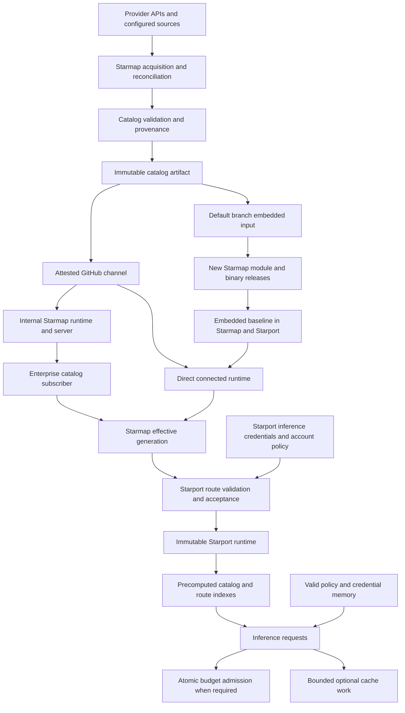

# Starmap and Starport catalog lifecycle specification

Starmap owns the catalog lifecycle. Starport supplies its storage and uses each
accepted generation to construct a complete inference runtime.

This draft specifies the target contracts for the [PRD](PRD.md).
The [repository findings](REPOSITORY_FINDINGS.md) record the inspected behavior.
Requirements in this document do not imply that the current code implements them.
New setting names and API concepts below are proposals unless marked existing.

Updated: 2026-09-10. Status: engineering draft after verified review.
The review resolution and canonical plan distinguish proposed contracts from implementation evidence.
The [storage review](STORAGE_REVIEW.md) records current file locations and backend behavior.
The [storage revision](../../plans/proof/starport-production-catalog/storage-revision-2026-09-05/REVIEW_RESOLUTION.md) maps its fourteen findings to the contracts below.
The accepted [latency target](LATENCY_REVIEW.md) adds the request-path contracts in section 8.9.
The [latency revision](../../plans/proof/starport-production-catalog/latency-revision-2026-09-05/REVIEW_RESOLUTION.md) maps each finding to implementation tasks and tests.

## Coordinated Go toolchain policy

D36 selects Go 1.27.1 for both products. Each module declares `go 1.27.1`. Build commands select `GOTOOLCHAIN=go1.27.1`.
Development environments, CI, Docker builders, and release tools must select that exact version.
The release owner qualifies future Go upgrades across both repositories and updates their pins together.
An actual product requirement must justify any additional supported Go family.

CSP6.1 removes the Go 1.25 and Go 1.26 compatibility jobs.
Race and native Linux, macOS, and Windows checks remain mandatory.
Real-storage, recovery, pure-Go, capacity, and performance checks also require Go 1.27.1.
Each behavioral or platform contract retains its own evidence. Duplicate compiler-version execution adds no support claim.

Final acceptance requires matching module and toolchain pins in both repositories.
Repository checks, native CI, required review, and merged-source verification must pass.
Earlier toolchain results remain historical evidence. They do not qualify Go 1.27.1.

Dependency budgets count product and third-party packages. The compiler owns standard-library package counts.
Forbidden-import checks must still inspect the complete dependency graph, including standard-library database adapters.

## Supported operating systems and processors

D39 defines five targets for both products:

| Operating system | Supported processors |
|---|---|
| macOS | Apple silicon (`arm64`) |
| Linux | x86-64 (`amd64`) and ARM64 (`arm64`) |
| Windows | x86-64 (`amd64`) and ARM64 (`arm64`) |

CI, native qualification, release archives, and installers must use this matrix.
New releases must omit `darwin/amd64`. Homebrew must reject Intel Macs without excluding Linux x86-64.
The catalog publisher must not require a retired Intel Mac check.
Keep race detection on supported targets where Go provides it. Preserve all distinct storage, recovery, pure-Go, capacity, and performance checks.

Historical Intel Mac releases and test evidence remain available. They do not define the current support boundary.
Go 1.27.1 remains the exact toolchain for every supported target.

## 1. Ownership and composition


```mermaid
flowchart TD
  Evidence[Provider APIs and configured sources] --> Build[Starmap acquisition and reconciliation]
  Build --> Verify[Catalog validation and provenance]
  Verify --> Artifact[Immutable catalog artifact]
  Artifact --> Channel[Attested GitHub channel]
  Artifact --> Promotion[Default branch embedded input]
  Promotion --> Release[New Starmap module and binary releases]
  Release --> Embedded[Embedded baseline in Starmap and Starport]
  Channel --> Central[Internal Starmap runtime and server]
  Channel --> Direct[Direct connected runtime]
  Embedded --> Direct
  Central --> Subscriber[Enterprise catalog subscriber]
  Direct --> Candidate[Starmap effective generation]
  Subscriber --> Candidate
  Candidate --> Accept[Starport route validation and acceptance]
  Credentials[Starport inference credentials and account policy] --> Accept
  Accept --> Runtime[Immutable Starport runtime]
  Runtime --> Indexes[Precomputed catalog and route indexes]
  Indexes --> Requests[Inference requests]
  Working[Valid policy and credential memory] --> Requests
  Requests --> Admission[Atomic budget admission when required]
  Requests --> Optional[Bounded optional cache work]
```

The diagram shows alternative direct and enterprise compositions. Enterprise
subscribers do not also contact the public channel.

The root `github.com/agentstation/starmap` package remains passive. It verifies
embedded data and reads caller-supplied storage. Explicit remote storage reads may use network connections and transport workers.
It starts no automatic source acquisition, provider acquisition, or refresh scheduler. Default construction remains offline.
The `runtime` package owns connected source and acquisition work.

The standalone CLI selects Starmap paths. Starport selects Starport paths and
injects a catalog store through the existing `WithCatalogStore` contract.

The owner approved native dependency budgets after measurement on 2026-09-06.
Read-only consumers permit 34 non-standard packages on Linux, 35 on Windows, and 37 on macOS.
Pinned-artifact consumers add their existing artifact reader, with limits of 35, 36, and 38 respectively.
The verifier retains forbidden-dependency checks. These build limits do not establish request latency or native platform qualification.

Construction must write no files.

Both constructors must preserve this rule with a durable store and workspace path.

`Client.RepairWorkspace(ctx)` explicitly repairs that workspace from the client's durable generation without publishing another generation.
It serializes repair with catalog publication and preserves operator changes. Connected runtime startup invokes this operation.

The owner approved explicit remote storage reads on 2026-09-06. The constructor calls the supplied store's `Current` method.
`NewContext` passes its context to that read. Network and worker acceptance must distinguish this explicit I/O from automatic acquisition and refresh.
The [decision record](../../plans/proof/starport-production-catalog/csp2/owner-decisions-2026-09-06.md) preserves this scope without claiming qualification.

Starmap owns credential contracts for catalog acquisition. Starport supplies a
deployment-scoped resolver when it embeds acquisition. This resolver must not
read account BYOK or shared inference credential repositories.

## 2. Catalog identities and state

Each catalog generation must bind a manifest, payload, full payload checksum,
schema version, validation result, and source evidence. A generation ID must
never name two different payloads. The semantic digest identifies catalog
facts. The payload checksum identifies exact transport and evidence bytes.

The following state has separate ownership:

| State | Owner and meaning |
| --- | --- |
| Embedded baseline | Immutable input compiled into the selected Starmap module |
| Selected source generation | Verified complete catalog from public, private, internal, or file source |
| Source observations | Scope-bound facts and completeness evidence from acquisition |
| Effective generation | Starmap's deterministic result under the authority policy |
| Candidate head | Durable generation awaiting Starport validation |
| Accepted head | Durable generation that Starport can activate |
| Runtime generation | Accepted catalog plus compatible connectors, credential handles, and routing policy |
| Runtime observations | Provider health and inference measurements, separate from catalog facts |

The runtime now keeps its compiled baseline separate from the accepted current head through `Client.EmbeddedCatalogState`.
Reconstruction never uses previously merged provider output as that baseline. The accessor reuses the verified immutable catalog without storage reads or decoding.
The constructor-free `EmbeddedGeneration` accessor remains the baseline-export contract.

An accepted head can remain the initial served state when no retained inputs exist under current startup behavior.
CSP3 must still apply authority and active revision checks to that choice. Explicit local inputs require separate source evidence during reconstruction.
A rebuild test that excludes a layer does not qualify operator revocation or restart admission policy.

Every request must retain one runtime generation until completion. A catalog
update must not change model identity, price selection, or credential placement
halfway through a request. Streaming requests retain their existing lease.

Generation status must carry the upstream identity and authority identity.
It must record the authority policy version and observation scope used for a
derived generation. A policy or credential-scope change must invalidate any
retained layer that no longer belongs to that scope.

The proposed `CATALOG_AUTHORITY_ID` names a stable authority independently of its
current URL. Both products use their own environment prefix for this setting.
Internal subscribers must verify that identity through the configured transport
and trust policy. A matching string alone does not prove authority.
An endpoint migration may preserve accepted state only when that trust still holds.

### 2.1 Client model identity and price changes

Canonical model IDs must remain stable. Never reuse a retired ID for a different model.
Starmap owns alias and deprecation metadata. Starport enforces it during request admission.
An alias must identify one canonical model and preserve the declared operation.
Reject cycles, ambiguous targets, cross-authority aliases, and targets outside permitted membership.

For a planned rename, publish the new canonical target and old-ID alias in the same generation that retires the old canonical definition.
D30 retains that alias until an operator or the replacement baseline explicitly removes it.
Elapsed time, provider omission, and ordinary refresh must not expire the alias.
Alias removal must follow the selected source authority and survive restart.

Retain the original rename edges after removal so a retired ID cannot later identify another model.
Resolve aliases consistently for discovery, cost checks, and routing within the request generation.
A removed alias must block convenience lookup. Reject ambiguous alias and provider-route names before activation.

Retaining an alias does not grant permission or restore an unavailable provider/account route.
The target must still pass current membership and admission checks.
Canonical model removals follow retained rename history to the current definition.
Preserve the original operator target for audit and explicit restore.
A08 tests must advance time beyond 30 days and cover restart, explicit removal, and baseline replacement.

Provider withdrawal, lost capability, and authority revocation can end availability earlier.
The UI and API must distinguish those events from a planned rename.
A successor suggestion must not silently select a different model, price, or capability.

New attempts use the currently permitted identity mapping and one runtime generation.
Existing streams retain their request snapshot, subject to the withdrawal rules in section 8.2.
Every retry and queued line must pass current admission again.
Price selection binds to the request generation. Actual provider charges can still differ from catalog estimates.
Report unknown or stale pricing explicitly instead of treating it as zero.

The compatibility matrix must define each route's error status, shape, and stable reason.
Cover unknown ID, removed ID, unavailable offering, and denied permission separately.
Do not reveal private catalog membership to unauthorized callers.
Fix the exact protocol mappings before CSP10 implements these errors.
Transition tests must cover both API families, SDKs, aliases, removals, and concurrent requests.

## 3. Bootstrap and persistence

### 3.1 Persistent application startup

1. Resolve product paths and the deployment authority policy.
2. Validate the configured storage locations and permissions.
3. Read and validate the accepted catalog from durable storage.
4. Verify the embedded generation through its passive accessor.
5. Persist the baseline under an immutable baseline identity before external catalog work.
6. Select serving readiness according to the startup policy.
7. Start source synchronization and permitted acquisition.

Baseline persistence must be idempotent. An existing valid generation must not
be overwritten. A baseline record must not count as an accepted internal
generation. Empty storage, corrupt storage, and unavailable storage are
different states and require different diagnostics.

Application startup must save an inspectable manifest and catalog payload in
the product's catalog directory. Starport also saves the required generation
record through its KV adapter. The filesystem copy is a managed baseline
export, not a second authority for the accepted head.

Starmap must expose a pure public accessor for its complete embedded generation.
The proposed signature is `EmbeddedGeneration() (catalogs.Generation, error)`.
Starport must use that contract instead of reconstructing an embedded manifest.
The accessor validates and returns caller-owned data without external I/O.

For a fleet, each node can materialize its own baseline export. It must not
publish that baseline over an existing shared accepted head. The first shared
baseline write uses compare-and-swap against absence.

An explicit ephemeral composition uses memory and declares that it cannot
survive restart. A read-only library consumer can remain entirely passive.
Persistent application startup must not silently switch to ephemeral mode
after a permission, capacity, or storage error.

Temporary Starport development uses in-memory Badger, in-memory SQLite, and one private scratch root for blobs and catalog runtime state.
The scratch root uses the operating system temporary directory and a unique `starport-dev-` name.
Reject explicit persistent KV, SQL, blob, or catalog-state selections before opening stores.
The error names conflicting settings and links to persistent setup. It must not silently ignore them.
Inference and catalog network access still follow their separate policies.

Normal shutdown removes owned scratch files. Crash cleanup validates ownership and excludes live processes before removing abandoned files.

The recovery record binds native filesystem identities and the lifetime lock. The host publishes that record only after application construction succeeds.
Failed or interrupted construction without a complete record requires manual recovery. Changed roots, children, metadata, and locks must survive cleanup.
Recovery scans at most 16,384 temporary entries and examines at most 256 candidate sessions. Warnings name preserved paths and report scan limits.

Development must not create or rotate a persistent local administrator token.
Existing read-only local authentication grants retain their separate authorization contract.
The current object-store and explicit catalog-state exceptions require migration diagnostics under A43.

### 3.2 Startup policies

| Mode | No accepted source catalog | Accepted source catalog exists |
| --- | --- | --- |
| Public or explicit local mode | Serve the saved baseline and refresh in the background. | Serve the retained catalog and refresh. |
| Internal authority | Keep diagnostics available and block inference until an approved catalog arrives. | Serve the retained internal catalog and reconnect. |
| Strict online source requirement | Require a successful source check before serving. | Require a successful source check before serving. |
| Verified file import | Accept the configured artifact after verification. | Keep the prior accepted artifact if the replacement fails. |

The existing `require_source` policy requires an online source read at open.
It is therefore not sufficient for the confirmed retained-internal behavior.
Add an authority-aware policy, proposed as `require_authority`, that accepts a
retained generation from the configured authority without requiring a new reply.

The CSP4 runtime candidate adds `STARMAP_CATALOG_SOURCE_AUTHORITY_ID` and `STARMAP_CATALOG_SOURCE_POLICY_ID`.
Both belong to the selected source group and require the `starmap` source with `require_authority`.
The complete authority catalog excludes retained local acquisition layers.
Local acquisition remains disabled in this mode until an explicit permission contract permits it.
Startup must align the publication client with the runtime's retained catalog before reporting authority readiness.

A subscriber with no lease must apply the same readiness rule. Another
instance's lease does not prove that an approved shared generation exists.

An internal authority has no implicit public fallback. Changing the configured
authority requires an explicit transition. A retained catalog from the previous
authority cannot satisfy the new authority's first-boot requirement.

The default retained-catalog policy has no hard expiry. It reports freshness
warnings. An operator can set a hard expiry that blocks new inference requests.
This metadata-retention default does not override permission freshness under section 8.2.
Expired inference credentials remain unusable regardless of catalog retention.

## 4. Product directories

### 4.1 Path contract

Each application owns configuration, data, state, and cache roots. Starmap's
library must accept caller-supplied paths and stores. It must not select a
Starmap home directory inside Starport.

The proposed default roots are below. `<product>` is `starmap` or `starport`.
Environment overrides use the corresponding uppercase product name.

| Platform | Configuration | Durable data | Process state | Cache |
| --- | --- | --- | --- | --- |
| Linux user | `$XDG_CONFIG_HOME/<product>` | `$XDG_DATA_HOME/<product>` | `$XDG_STATE_HOME/<product>` | `$XDG_CACHE_HOME/<product>` |
| macOS user | `~/Library/Application Support/<product>/config` | `~/Library/Application Support/<product>/data` | `~/Library/Application Support/<product>/state` | `~/Library/Caches/<product>` |
| Windows user | `%APPDATA%\<product>` | `%LOCALAPPDATA%\<product>\data` | `%LOCALAPPDATA%\<product>\state` | `%LOCALAPPDATA%\<product>\cache` |

Linux fallbacks are `~/.config`, `~/.local/share`, `~/.local/state`, and
`~/.cache`. Relative XDG values are invalid. The resolver must follow the
[XDG directory specification](https://specifications.freedesktop.org/basedir/0.8/).
The macOS mapping follows Apple's support and cache directory guidance.
[Apple directory guidance](https://developer.apple.com/library/archive/documentation/FileManagement/Conceptual/FileSystemProgrammingGuide/MacOSXDirectories/MacOSXDirectories.html)
The Windows mapping separates roaming configuration from local machine state.
[Windows known folders](https://learn.microsoft.com/en-us/windows/win32/shell/knownfolderid)

These exact product subdirectories are design choices. Platform documentation
defines the parent directory roles, not a mandatory Starmap or Starport layout.
Use platform directory APIs where available. Do not construct paths from an
assumed username, drive, or translated folder name.

Proposed precedence is explicit command or Go option, product-specific root
setting, product home, then platform default. Proposed `STARMAP_HOME` and
`STARPORT_HOME` group all roots under one configured directory. Root-specific
settings override only their corresponding child. Environment settings precede
configuration-file settings at the same specificity.

| Setting | Proposed contract |
| --- | --- |
| `<PRODUCT>_HOME` | New grouped root for configuration, data, state, and cache |
| `<PRODUCT>_CONFIG_DIR` | Configuration root. Starport already supports this name. |
| `<PRODUCT>_DATA_DIR` | New durable data root |
| `<PRODUCT>_STATE_ROOT` | New common parent for process state |
| `<PRODUCT>_CACHE_DIR` | Disposable cache root |
| `<PRODUCT>_INSTANCE_ID` | New bootstrap identity for one persistent process. Single-process recipes use `default`. Named replicas require distinct values. |
| `<PRODUCT>_DEPLOYMENT_ID` | Node-owned deployment identity. Local recipes use `local`. Fleet replicas use the same explicit deployment value. |
| `STARMAP_STATE_DIR` | Preserve the existing explicit runtime-directory meaning. |
| `STARPORT_CATALOG_STATE_DIR` | Preserve the existing explicit catalog runtime directory. |
| `STARMAP_CATALOG_STORE_PATH` | New explicit standalone catalog store path |
| `<PRODUCT>_CATALOG_WORKSPACE_PATH` | Preserve the existing explicit workspace selection. |
| `<PRODUCT>_RELATIVE_PATH_BASE` | Explicit `config` declaration for new relative legacy selectors. Empty values require absolute legacy selections. Node-owned and never inherited across products. |

`<PRODUCT>` means `STARMAP` or `STARPORT`. A leaf path override wins over its
parent root. Existing explicit directory settings must not silently gain new
child components during migration.

Starport must never inherit Starmap filesystem roots through environment
fallback. An explicit caller path can point to a shared read-only artifact.
It cannot silently share a writable catalog workspace or instance seed.

Grouped `<PRODUCT>_HOME` roots use exactly `config/`, `data/`, `state/`, and `cache/` children.
Root selectors must be absolute. Resolve relative leaf paths against the resolved configuration root, never the working directory.
Report that anchor with every relative input. Reject empty required paths in persistent mode, including the SQLite path.
Existing explicit runtime-directory overrides select that exact directory without extra children.

Migration must resolve prior relative inputs before adopting the new rule. If the old anchor is unknown, require an explicit absolute path.

Starmap enforces this boundary with `relative_path_base: config`, `STARMAP_RELATIVE_PATH_BASE=config`, or `--relative-path-base=config`.
Without that declaration, legacy relative selectors fail before primary-file selection or catalog initialization.
The declaration follows node-setting precedence. Empty values remove the declaration, and other values fail validation without value disclosure.
It does not move files or establish migration completion. Existing deployments must first replace old relative values with their previous absolute locations.

The guard covers primary configuration, runtime state, canonical and legacy workspace settings, and update workspace and source overrides.
File catalog sources also resolve `catalog_source_url` through this guard before baseline writes.
Runtime composition receives the absolute source filename, and the file inventory reports the same path and anchor as `source-file`.

A relative primary file needs bootstrap intent from flags, environment, or an explicitly selected dotenv file.
The selected file cannot authorize its own relative selection. Absolute primary files can declare intent for their relative leaf settings.
The new `catalog_store_path` has no prior anchor and continues to resolve relative values against the configuration root.
Starport must apply the same node-owned rule at its CSP8 integration boundary.

Choose the configuration root and selected file before parsing that file.
A value inside the selected file cannot relocate the file that supplied it.
Root, instance, storage-connection, and trust-bootstrap settings remain node-owned under shared configuration.

### 4.2 Directory contents

Starmap uses `config.yaml`. Starport retains `config.env` for bootstrap and local configuration.
Do not automatically search alternate formats or the other product's directory.
An explicitly selected Starmap file retains its supported format. A future format change needs a separate schema migration.

The following manifest defines proposed managed names. Existing explicit locations remain valid through migration.
`R` is the selected runtime directory. Its default is `<state>/catalog/runtime/<instance-id>/`.
Generation and operation directory components use lowercase SHA-256 hashes of their IDs. Manifests retain the original IDs.

| Owner | Root and path | Creation, lifetime, and recovery |
| --- | --- | --- |
| Starmap configuration | `<config>/config.yaml` | Explicit setup or operator input. Preserve settings and secret access. |
| Acquisition selection policy | `<state>/credentials/<deployment-id>/<instance-id>/{policy.json,provider-<provider-id-sha256>.json}` | Starmap startup creates owner-only policy state before catalog writes. Preserve through backup and migration. Each canonical record is limited to 4,096 bytes and contains no credential material. |
| Starport configuration | `<config>/config.env` | Persistent setup and local edits. Shared mode retains bootstrap values only as authority. |
| Starport setup transaction | `<configuration-parent>/.starport-setup/{.owner.lock,transaction.json}` | Private setup lock and pending transaction. The journal includes generated configuration and must remain owner-only. Preserve until verified completion. |
| Starport local storage guard | `<badger-parent>/.starport-setup-<badger-basename>/{.owner.lock,configuration.json}` | Exclude setup while a local gateway owns storage. The pending configuration binding survives process exit. Preserve stable locks. |
| Starport setup database stage | `<badger-parent>/.starport-init-<uuid>/` | Private initialization or rollback state. Remove only verified receipt entries. Preserve unknown or changed content. |
| Application baseline | `<data>/catalog/baseline/<generation-id-hash>/{manifest.json,catalog.json}` | Persistent startup creates an inspectable export. Preserve identity, or reproduce from the exact installed binary. |
| Baseline recovery | `<data>/catalog/baseline/.starmap-baseline/{.owner.lock,<operation-id>.json}` | Owner-only writer lock and versioned recovery records. Keep the lock for the directory lifetime. Remove only verified operation records after recovery. Preserve unknown or changed entries. |
| Human catalog workspace | `<data>/catalog/workspace/` | Optional explicit authoring. Preserve operator content. |
| Workspace preparation | `<workspace-parent>/.<workspace-name>.preparing-<id>/` | Private enclosure for rendering and access restoration. Descendants retain workspace policies. Preserve interrupted preparation until ownership checks permit cleanup. |
| Workspace replacement journal | `<workspace-parent>/.<workspace-name>.starmap-replacement.json` | Windows replacement intent. Preserve with its candidate and backup until verified recovery completes. |
| Workspace replacement backup | `<workspace-parent>/.<workspace-name>.backup-<id>/` | Previous directory retained through receipt publication. Preserve changed or unrecognized entries. |
| Starmap catalog store | `<state>/catalog/{current,.commit.lock,generations/<generation-id-hash>/}` | Preserve the accepted pointer, manifests, and payloads. Let the adapter manage locks. |
| Runtime ownership | `R/{owner.json,.owner.lock,instance-seed}` | Persistent initialization and process locking. Restore one identity to one active owner only. |
| Runtime evidence | `R/catalog-runtime/source.json`, `R/catalog-runtime/providers/<provider-id>.json`, and `R/catalog-runtime/providers/bindings/<key-digest>.json` | Preserve permitted source layers across restart. Fleet-required layers also need shared durable storage. |
| Runtime operator removals | `R/catalog-runtime/removals.json` | Owner-only snapshot bound to the accepted catalog through the publication journal. Preserve through restart, backup, and directory migration. Provider refresh cannot clear operator targets. |
| Runtime pin acceptance | `R/catalog-runtime/generation-pin.json` | Owner-only local record for the latest pin operation, limited to 32 KiB. Fleet publication also retains the authoritative receipt with recovery inputs. Configuration authority owns the pin setting. This receipt does not replace it. |
| Runtime manual history | `R/catalog-runtime/manual.json` | Owner-only head for accepted observation batches in `publication-inputs`. Preserve its full referenced history through restart and backup. |
| Runtime publication record | `R/catalog-runtime/publication.json` | Owner-only transaction state. Startup resolves prepared records or replays committed records before reading retained inputs. |
| Runtime publication inputs | `R/catalog-runtime/publication-inputs/<sha256>.json` | Owner-only immutable records for retention recovery. Preserve references from pending publication and accepted manual history. CSP5 owns safe compaction and collection. |
| GitHub discovery | `R/github-catalog-source/<channel-hash>.json` | Preserve replay floors and verified release references. ETags alone are disposable. |
| Badger | `<data>/badger/` | Embedded Starport KV. Back up through an engine-consistent method. |
| SQLite | `<data>/sqlite/starport.db` and engine sidecars | Embedded Starport SQL. Recover through a consistent snapshot that includes committed WAL data. |
| Local blob bytes | `<data>/files/objects/<prefix>/<prefix>/<key-hash>` | Preserve bytes referenced by KV metadata. The key hash does not promise content deduplication. |
| Blob staging | `<data>/files/staging/put-*` | Temporary upload state. Collect only abandoned writes after ownership checks. |
| Local console token | `<data>/local-admin-token.json` | Starport local authorization. Preserve privately or rotate through explicit recovery. No independent path selector. |
| Welcome marker | `<data>/welcomed` | Starport first-use state. Optional during recovery. |
| Starmap HTTP source cache | `<cache>/models.dev/{api.json,api.json.metadata.json}` | Rebuild from permitted source access. Accepted source evidence remains separate. |
| Starmap source checkout | `<cache>/sources/models.dev-git/` | Managed fetch/build input. Preserve source receipts outside this cache. Never delete an operator-selected checkout. |
| Catalog download staging | `<cache>/catalog/downloads/` | Disposable transfer files. Reverify completed bytes before acceptance. |
| Starmap administration identities | `<state>/admin/identities.json` | Standalone server initialization and recovery. Starport retains its token and identity repositories. |
| Local administration operations | `<state>/admin/{audit/events.ndjson,operations/<operation-id-hash>.json}` | Standalone Starmap and local Starport config operations. Shared Starport config uses transactional SQL audit and receipts. |
| Migration journal | `<state>/migrations/<operation-id-hash>/{manifest.json,journal.ndjson}` | Preserve intent, old and new paths, checksums, and completion state until recovery closes the operation. |
| Starport migration binding | `<selected-journal-root>/starport-runtime/<owner-operation-sha256>/catalog-binding.json` | Owner-only record bound to the original KV identity, backend selection, request, and accepted generation. Preserve private publication recovery records beside it. The operation result reports this directory as `host_journal_directory`. |
| Starport migration KV records | `catalog_migration:v1:store` and `catalog_migration:v1:<owner-operation-sha256>` in the selected KV backend | Preserve the logical store identity and matching operation checkpoint through retries and database restart. A different backend selection cannot resume the operation. |
| Migration initialization | `<migration-journal>/stage-initialization.json` | Owner-only record, limited to 16 KiB. Bind the manifest, parent, writer lock, and `.migration-build-<id>` stage. Resume only matching ownership. Preserve conflicts. |
| Runtime migration stage | `<target-parent>/.migration-<manifest-sha256>/` | Keep a private copy beside its final target for verification and later publication. |
| Pending migration marker | `<stage-or-target>/.migration-pending.json` | Bind the directory to its immutable manifest. Keep the marker through rename and refuse startup until activation. |
| Runtime migration receipt | `<target-runtime>/.migration-receipt.json` | Bind a published target to the immutable migration manifest. Retain it through later catalog refreshes. |
| Runtime completion record | `<target-runtime>/.migration-completed.json` | Bind completed selection to the migration manifest after the final journal event. Retain it while legacy-root acknowledgement is required. |
| Runtime retirement record | `<source-runtime>/.migration-retired.json` | Refuse startup from a migrated source. Keep older binaries stopped because they do not honor this record. |
| Partial migration copies | `<migration-stage>/.migration-work/<target-path-sha256>.partial` and sibling `.partial.json` | The immutable ownership record is limited to 16 KiB. Verify native identities, mode, and exact source-prefix bytes before removal. Preserve unrecorded or conflicting files. |
| Optional managed trust | `<config>/trust/<name>.pem` | Explicit operator import. Existing external trust paths remain operator-owned. Compiled trust remains in the binary. |
| Optional file logs | `<state>/logs/<product>.log` | Created only when file logging is selected without a leaf override. Rotation and retention follow the declared recipe. |
| Usage export | Explicit file or HTTP destination | No default file. External collector durability is a separate contract. |
| Backup bundle | Explicit destination containing `backup-manifest.json` and adapter outputs | Preserve store identities, checksums, references, secret recovery requirements, and authority evidence. No implicit backup directory. |

Badger internal file names and SQLite sidecars belong to their engines. The product manifest records the engine directory or consistent snapshot boundary.

Starport setup uses the parents of the selected configuration file and Badger directory. Explicit leaf overrides can select independent roots or filesystems.
Each publication rename stays within one parent. Setup publishes the closed database before configuration and retains a durable startup barrier until completion.
The private-record publisher owns `.record-publications/` beneath each directory where setup writes records.

Setup limits its journal to 1 MiB. Its database receipt covers at most 64 regular files, 64 MiB each, and 128 MiB total.
These bounds apply to initialization and rollback. They do not limit normal Badger growth.
The plaintext initial gateway API key stays in the process result. Configuration and its journal can contain the security master key.

Retrying initialization recovers matching pending work. Recovery preserves a completed configuration publication and its existing key record.
It cannot reproduce the original one-time plaintext key. Recovery can remove unpublished verified state before issuing a replacement initial key.

A nonempty preparation without a complete receipt requires operator inspection. Recovery must preserve changed files, malformed journals, and conflicting destinations.
The local storage guard spans application construction through store shutdown. Pending setup must block KV, SQL, and blob-store initialization.

Identifiers used in managed paths must reject traversal and invalid native components.
The channel hash preserves the existing repository, NUL separator, and channel hash convention.

Runtime enforcement and diagnostic declarations must consume one semantic file-role policy definition.
Platform adapters may inspect or enforce access differently, but they must not independently choose the expected access class.
Tests must preserve the editable-workspace boundary and detect drift between file-role declarations and enforcement.
Workspace replacement must preserve declared access restrictions and operator editing rights, including unrelated files, or refuse before publication.

Starmap now shares role declarations and POSIX classification through `pkg/productpaths/policy`.
Adapters refuse an incompatible declaration before file access. Starport adoption remains a CSP8 obligation.

Workspace replacement journals now use version 3 with native child identities, content, mode, ownership, and native ACL bindings.
Recovery preserves version 1 and 2 journals for explicit recovery because they lack required ownership evidence. It also refuses missing identity or access bindings.
Atomic replacement also checks the original access-bound tree before publication.

Private staging restores workspace access before candidate publication.
macOS and Linux component tests cover modes, ACLs, inheritance, operator notes, and interrupted replacement.
The [merged CSP2 qualification](../../plans/proof/starport-production-catalog/csp2/merged-qualification-2026-09-09/verification.json) passes all 22 assigned subcases and six native platform jobs.
This includes the required workspace access and interruption tests. It does not qualify power-loss durability.

See the [snapshot evidence](../../plans/proof/starport-production-catalog/csp2/workspace-access-snapshots.md) for limits and legacy recovery obligations.
The [preservation evidence](../../plans/proof/starport-production-catalog/csp2/workspace-access-preservation.md) records the initial checks and process-lock failure.
The [shared-policy record](../../plans/proof/starport-production-catalog/csp2/shared-file-policy.md) records its test-lifetime correction, shared policy, and subsequent verification.

Private configuration, credentials, runtime evidence, administration, and migration files require owner-only access by default.
Use `0700` private directories and `0600` private files on POSIX, with equivalent tested Windows ACLs.
Shared static baseline exports can use explicit read permissions. They contain no credential material.
Local `config.env` can contain the security master key today. Never classify all configuration files as secret-free.

D23 permits a checked exception for explicitly selected, administrator-owned primary configuration, such as `root:starmap` with mode `0640`.
The reader must verify trusted ownership, service read access, and absence of untrusted write access, including equivalent Windows ACL checks.
The exception requires explicit selection. A failed private-file check must not enable it automatically.

Catalog state and dotenv files retain their private-access requirements. CSP2 and CSP8 own implementation and qualification for Starmap and Starport.

Starmap selects this policy with `--config-access=service-managed` or `STARMAP_CONFIG_ACCESS=service-managed` and an explicit `--config` or `CONFIG` path.
The flag overrides the environment. YAML contents cannot select their own access policy.
The selected policy also governs migration configuration rereads and the file manifest. Starport implementation remains under CSP8.

Starmap permits POSIX ownership by root or the effective user, with no group or other write bits.
Windows permits the process account, SYSTEM, Administrators, or TrustedInstaller as owner and mutation principals.
Shared read grants remain valid. Native read operations establish service readability, and diagnostics retain uncertainty about effective access.
The 1 MiB bound and protected ancestor checks apply in both modes. Neither mode repairs input files.

The Starmap CLI applies the selected access policy to primary YAML and owner-only checks to every explicit dotenv file before parsing.
Each file permits at most 1 MiB. This input bound applies before and during the read.
Private read-only files remain valid. The reader resolves selected symlinks and validates the resulting regular file and supported native ACLs.

A missing selected target causes a conflict. A genuinely absent default primary file remains optional.

All dotenv files must pass access checks and parsing before any environment mutation.
Read failures retain typed causes without configuration values. Parse errors continue to omit parser input.
The shared record reader serves runtime evidence and configuration inputs. Directory policy stays with each caller.

Linux and macOS now enforce the ancestor policy below. Starport service configuration, other file roles, and native Windows qualification remain open.

Every manifest entry needs a descriptor for its override, applicability, access, retention, and recovery policy.
An unselected local backend must not create empty database directories during shared startup.
The path report must show effective absolute paths, origins, active backend, instance ownership, and whether each artifact exists or is applicable.
CLI text, JSON, authenticated API, UI, and generated docs use the same descriptor inventory.
Reports must resolve real leaf overrides. Merely printing default paths fails A03 and A24.

The current Starmap `config paths` command reports selected locations through `productpaths.FileManifest` schema version 1.
Its four roots and file entries retain origins and anchors. JSON and YAML also include creation conditions, recovery rules, and external destination roles.
The application resolves configuration without opening the catalog runtime or creating product files.

The current default inventory contains 28 file entries and seven external roles.
A selected file source adds one entry.
Six reserved entries carry `planned` availability because their writers remain unimplemented.

File patterns describe possible artifacts. The optional `--inspect` scan reports existence and bounded metadata without opening catalog state or creating files.
Its default budget covers 10,000 entries, including unmatched directory entries. The maximum explicit budget is 100,000 entries.
Budget exhaustion and metadata failures produce an incomplete report. These limits do not bound elapsed time on slow storage.

Linux and macOS report mode bits and numeric filesystem owners. Those values do not prove effective access or ACL safety.
The runtime owner observation compares at most 4,097 record bytes against the configured binding without reading the seed or acquiring locks.
A matching record does not prove active ownership. Windows permission and owner adapters remain unverified.

Each managed and external role now includes selectors, applicability, access class, retention class, and removal conditions.
JSON and YAML expose the full policy. Wide output exposes access and retention classes.
Unknown file roles cause a typed configuration error instead of receiving an implicit policy.
These descriptors state requirements. They do not certify file permissions or enable cleanup.

Private POSIX observations report access conflicts for group or other mode bits, or a different effective owner.
Other present observations remain unverified because metadata alone cannot qualify ACLs and effective access.
Absent or inapplicable roles report no assessment. Inspection preserves file bytes and permissions.
The exact embedded baseline permits explicit shared reads, although its current exporter creates private files and directories.

Complete enforcement, Starport integration, and API and UI reporting remain required before acceptance.
Retained runtime evidence and GitHub discovery now use shared private-file creation and access checks.
POSIX creation uses private modes. Windows creation uses an explicit owner and protected DACL.

Directory bindings compare filesystem identity before each operation. A lost binding is a conflict, not an absent record.
Existing records must be private regular files. Failed checks preserve their bytes and permissions.

The record reader enforces the existing byte limit before and during the read.
Writes use exclusive temporary creation, file flush, complete-record publication, and directory flush.
Only the recorded temporary file identity permits cleanup. Competing replacement files remain untouched.
Existing legacy temporary files do not become staging destinations.

Runtime migration validation binds existing directories without creating missing paths.
The existing native ACL checks now live in the shared private-file package. Runtime identity guards delegate to that package.
Older exposed child paths require explicit operator review and correction before use.
Ancestor policies, other file roles, orphan cleanup, and native durability qualification remain open.

Current POSIX startup also rejects exposed mode bits or another UID on the runtime directory, lock, owner record, and seed.
The application checks its configured runtime path before baseline export. Runtime ownership repeats the check before identity initialization.
Existing modes remain unchanged. Operators must verify the service identity and paths before correcting permissions and retrying startup or migration.

The macOS adapter also inspects descriptor-bound native ACL metadata on these four paths.
Every allow entry with nonzero rights must identify the file owner. This rule includes inherited and inheritance-only grants. Deny entries remain valid.
The adapter refuses unsupported or incomplete ACL metadata. It does not rewrite ACLs or evaluate ordered effective access.

Native calls use `libSystem` through `github.com/ebitengine/purego`, without a Cgo requirement or a runtime shell command.

The Windows adapter requires the process account SID as owner. It permits allow entries only for that SID, SYSTEM, and Administrators.
SYSTEM and Administrators retain privileged host access. This exception does not include ordinary groups or other service accounts.

Absent and null DACLs cause refusal. Empty DACLs deny access and remain distinct from null DACLs.
Unsupported ACE types cause refusal. Basic deny entries remain valid, and inherited allow entries use the same grant policy.

New Windows runtime directories, locks, and staged identity files receive an explicit owner and protected DACL during exclusive creation.
Migration staging roots use the same private creation primitive. Existing files and directories retain their security descriptors.
Native creation uses one child name relative to an open directory handle, with reparse traversal disabled.
These operations use the existing `golang.org/x/sys/windows` dependency and need no Cgo toolchain.

This guard does not qualify ancestor access, other file roles, or native Windows behavior.
The metadata inspection command still lacks ACL observations. Native macOS x64 and Windows qualification remain open.

#### POSIX ancestor access

Private directory bindings, private record operations, runtime startup, and configuration inputs now check existing ancestors on Linux and macOS.
Ancestors and selected symlinks must belong to root or the effective user. Group or other write bits require a trusted sticky directory.
Read and search permissions remain compatible with shared system ancestors.
Each intermediate symlink target must pass the same policy before Starmap uses its resolved path.

Linux applies its ACL mask through the group permission bits. Its sticky restriction protects directory entries from other unprivileged accounts.
See the Linux [ACL mapping](https://man7.org/linux/man-pages/man5/acl.5.html) and [sticky-directory contract](https://man7.org/linux/man-pages/man7/inode.7.html).
macOS checks native ACL grants separately. Read, search, and synchronization grants remain valid for other accounts.
Other nonzero grant rights require root or the effective user. Deny entries remain valid, and unknown metadata causes refusal.

Creation uses parent handles and validates each child before descent. It refuses replacement symlinks without writing into their targets.
Private record publication repeats ancestor checks before the record switch. Existing bytes, ownership, and permissions remain unchanged after an access refusal.

Configuration symlink checks preserve both the selected route and its intermediate target checks.
Runtime validation runs before baseline export. Baseline directory creation uses the same parent-handle creation primitive.

These controls do not qualify hostile mount replacement or every file role.
The merged CSP2 matrix later qualified its native ancestry and service-managed primary configuration tests.
The leaf policy still requires private owner access. Ancestor read permissions do not relax that policy.

#### Private filesystem catalog store

The filesystem adapter applies the private-state policy to its root, generation directories, JSON records, current pointer, and commit lock.
The file inventory declares this store `owner-only`, including its staging entries. POSIX inspection reports conflicting mode bits without changing existing files.

Its constructor remains passive. Operations refuse unsafe existing access without automatic permission or ownership changes.
The same refusal applies before legacy-store migration. Public YAML export permissions remain separate.

Candidate publication validates private access and exact staged bytes before a no-replace directory rename.
Current publication retains its original directory binding and checks cancellation and access before replacement.
Cleanup preserves changed files and replacement directories. CSP5 owns abandoned-stage collection.

The [CSP2 evidence](../../plans/proof/starport-production-catalog/csp2.md#private-filesystem-catalog-store) records local race and native Linux checks.
The [merged CSP2 qualification](../../plans/proof/starport-production-catalog/csp2/merged-qualification-2026-09-09/verification.json) includes native Windows access checks and the selected service-file exception.
Complete durability qualification remains separate.

The [Linux ownership fixture](../../plans/proof/starport-production-catalog/csp2/native-ownership-and-tooling.md) verifies refusal without ownership rights and successful preservation with authorized rights.

It includes supplementary-group updates without capabilities. This component evidence does not qualify other platforms or managed-service configurations.
These store checks do not add filesystem access to the active in-memory catalog lookup path.

Checkpoint `de8b5abe` classifies failed synchronization after current-pointer publication through `*errors.PublicationError`.
The [durability proof](../../plans/proof/starport-production-catalog/csp5/filesystem-durability-2026-09-11/verification.json) records first publication, replacement, reopen, and idempotent retry.
The pointer can already be visible when its directory flush fails. An arbitrary I/O error does not prove rollback.
An identical retry confirms directory durability without replacing the pointer or generation identity.

These operations occur during explicit publication and recovery. Active catalog lookups remain in memory.

#### Windows ancestor access

The shared ancestor boundary now selects native Windows ownership and DACL checks before private file access.
It validates component identities through handles that open reparse points without following them.
The guard checks trusted symlink routes and targets, including components before `..`.

Trusted ancestor principals are the process account, SYSTEM, Administrators, and TrustedInstaller.
An OWNER RIGHTS grant refers to the descriptor's current owner. Resolve it only after that owner passes the trusted-principal check.
Creator Owner does not identify the current owner and receives no equivalent exception.
Shared read, traversal, and subdirectory creation grants remain valid. Other mutation grants require a trusted principal.

Inheritance-only grants do not affect the current ancestor. Protected private creation excludes inherited grants from new private children.
Existing private leaf policy remains stricter. Unsupported entries, flags, and reparse points cause refusal.

The implementation accepts drive, UNC, extended filesystem, and volume GUID path forms for validation.
The merged CSP2 matrix passes the native Windows parser and filesystem tests on AMD64 and ARM64.

The [CSP2 evidence](../../plans/proof/starport-production-catalog/csp2.md#windows-ancestor-access) separates portable policy checks from native API qualification.
CSP19 still owns complete service procedures. CSP2 qualifies the selected service-managed primary configuration exception.
Complete platform durability remains separate.

#### Windows file inspection

File inspection now reads ownership and DACL metadata through a handle with metadata and security-read rights.
The handle opens the selected reparse point itself. Symbolic links and unsupported reparse points receive no target security observation.
The reader checks file identity before and after the security query. It does not request file-data access.

The native descriptor decoder belongs to `internal/runtimeacl/windows` and serves both inspection and enforcement.
Observations distinguish absent, null, empty, and populated DACLs. They include owner and process SIDs without account-name resolution.

The shared private policy determines known conflicts for owner-only file roles. Compatible descriptors still leave effective access unverified.
Other access classes retain their declared uncertainty. The merged CSP2 matrix includes native Windows inspection tests.

### 4.3 Services and migration

The proposed Linux service roots are `/etc/<product>`, `/var/lib/<product>/data`,
`/var/lib/<product>/state`, and `/var/cache/<product>` for configuration, data, state, and cache.
macOS services use `/Library/Application Support/<product>/{config,data,state}` and `/Library/Caches/<product>`.
Windows services use ACL-protected `%ProgramData%\<product>\{config,data,state,cache}`.
Container recipes select these roots explicitly. They must not depend on the image user's home directory.
Configuration mounts can be read-only. Required data and state mounts must remain writable and survive container replacement.

The current Compose recipe explicitly groups roots under `/home/nonroot/starmap` within its named volume.
This path uses the pinned base image's existing nonroot directory for initial volume ownership.
Resolution does not use the process `HOME` value. The ephemeral example selects `/var/lib/starmap` on a private temporary mount.
Changing these selectors does not migrate an existing volume. Operators must preserve old state and complete the corresponding migration first.

The Kubernetes example selects `/var/lib/starmap/instance` under a provisioned PVC mount.
It omits automatic recursive group-permission changes that can conflict with private retained files.
Its single-writer Deployment uses `Recreate` during upgrades and accepts the resulting availability gap.
Runtime locking remains necessary during other replacement paths. Cluster and storage-driver qualification remain open.


Each process needs a unique runtime directory, including two instances on one
developer machine. A fleet must not copy or share an instance seed. A shared
catalog store is separate from this process identity.

Validate instance IDs as single safe path components. Record the product, deployment, instance, and schema in `owner.json`.
Hold an exclusive runtime-directory lock for the process lifetime. Refuse a conflicting owner before changing state.

The owner record uses schema version 1 and contains `product`, `deployment`, and `instance`.
An explicit scheduler identity adds `scheduler_identity_sha256`. Changing or clearing that override requires ownership migration.

Starmap exposes this node override as `STARMAP_SCHEDULER_IDENTITY`, YAML `scheduler_identity`, and `--scheduler-identity`.
Its node configuration report includes the selected value and origin. The empty default derives identity from the seed and owner.

Migration preserves the observed identity through this explicit override and the selected `state_dir`.
Starport must not inherit Starmap node identity settings. CSP8 owns its product-local composition.
Deployment IDs use at most 256 UTF-8 bytes, with no control characters or surrounding whitespace.
The product generates the record. Manual changes require an explicit ownership migration.

Starport supplies its selected cache root to the metadata collector as well as its runtime directory to Starmap.
HTTP metadata uses `<cache>/models.dev/`. Managed Git input uses `<cache>/sources/models.dev-git/`.
Development substitutes its owned session cache. Source caches do not replace accepted evidence in runtime state or catalog generations in KV storage.

Both collectors remain available with `ACQUISITION_ENABLED=false`. Explicit refresh still applies source selection, offline restrictions, and internal authority.
An explicit empty acquisition-source set disables provider and metadata acquisition together.
The [CSP8 acquisition proof](../../plans/proof/starport-production-catalog/csp8/source-acquisition-2026-09-16/verification.json) records local implementation and its remaining qualification limits.

Persistent identity binds the seed to the recorded product, deployment, and instance. Host and port changes do not create another identity.
Startup refuses missing or invalid seeds in existing runtime state before catalog access.
A crash after owner creation but before initial seed creation can resume when no prior runtime state exists.


Shared deployments also reject duplicate active instance identities. A changed port does not establish isolation.
Restoring a seed to a replacement requires fencing its former owner. Creating another replica requires a new identity and seed.

The migration must detect existing `~/.starmap`, Starport configuration-root
data, and Starport's current XDG catalog state. It must preserve explicit paths.
If old and new roots both contain data, startup reports the conflict and does
not choose by modification time. A migration operation must copy, verify, and
switch roots before it removes any old files.

Starport now refuses recognized legacy paths before opening stores or creating local setup metadata.
`starport config paths --legacy` reports these conflicts without changing files. Explicit root and leaf selections remain authoritative.
The [local proof](../../plans/proof/starport-production-catalog/csp8/legacy-paths-2026-09-16/verification.json) qualifies the guard. Runtime migration and completed-receipt adoption remain open under CSP8.

Each runtime migration first records an immutable source inventory under its operation ID.
The inventory binds source and target paths, file sizes, SHA-256 digests, the source identity, and the requested owner.
Preparation holds the source-directory lock. Operators must also stop older binaries that do not honor that lock.

An existing owner record must verify the supplied source identity.
Legacy state without that record requires the identity observed in the old deployment and reports that identity as unverified.
The migration must preserve that identity explicitly. It must not infer the old identity from the seed, current hostname, or current port.

Journal events follow `prepared`, `copied`, `verified`, `promoted`, and `completed` in order.
Each event binds the preceding event digest. The first event binds the manifest digest.
Recovery preserves a partial final write before truncation. It refuses an invalid complete event or a suffix that differs from the next event.
The migration engine must finish each action and verify its result before it records the corresponding event.

A staged runtime must not start before publication. Its pending marker must cause refusal before owner, seed, or catalog initialization.
Copying files must not alter the configured roots or expose an incomplete final target.
Retries must verify existing staged files against the immutable inventory before they reuse those files.
Only operation-owned partial copies may restart. Conflicting complete files and unknown entries require explicit recovery.

Local commit `9e875a35` adds persistent ownership for initialization and partial copies.
The [migration recovery proof](../../plans/proof/starport-production-catalog/csp5/migration-recovery-2026-09-12/verification.json) records process exits, writer conflicts, changed content, replaced identities, and scan limits.
Initialization resumes its recorded stage. It never recursively removes a staging name, including a reused name after publication.
The record binds the manifest digest, parent, journal lock, and native stage identity.

A failed directory reopen returns its filesystem error. Deferred cleanup retains the original handle and preserves a moved stage.

Each mutable partial copy has an immutable ownership record.
That record binds the source entry, stage, work directory, lock, file identity, and mode.
Recovery requires partial bytes to remain an exact prefix of the checked source file.
It can resume after file removal while the ownership record remains. Unknown records and conflicting files remain preserved.

Source inventory permits 40,000 entries, including metadata and empty directories. The existing file limit remains 10,000.
The stage entry limit derives from its allowed manifest layout. Both scans read at most 128 entries per batch.
Aggregate path names cannot exceed 4 MiB.

Initialization permits two metadata files and an empty work directory. Its bounded read refuses a fourth entry before it writes missing files.
Unrecorded stages and interrupted atomic owner-record scratch remain preserved for explicit recovery.
Native identity changes after a storage move or restore require explicit recovery. Cross-compilation does not qualify native runtime or physical power-loss behavior.

Publication validates retained catalog layers before it renames the stage without replacement.

Baseline export and migration publication share an operation relative to the open parent directory.
The filesystem call must refuse every existing destination, including an empty directory.
An earlier existence check cannot establish this guarantee. The operation must not resolve paths from the parent's original name.
Atomic publication does not establish durable storage. File and directory synchronization remain separate requirements.

Baseline staging now retains directory identity and open file handles until publication or local cleanup.
Before publication, it verifies the exact file inventory, identities, metadata, and bytes. Cancellation must cause refusal before the rename call.
Cleanup repeats these checks and removes only unchanged files created by that export. It never recursively removes a staging path.

An added entry, changed file, or replaced directory causes a typed conflict. Cleanup preserves the original operation error as well.
After successful publication, cleanup must ignore the former staging name, even if another process reuses it.
Stages without verified persistent ownership remain untouched. Section 9.1 defines the baseline recovery journal and its limits.
These checks do not provide an atomic multi-file transaction against arbitrary external editors.

CSP5 owns abandoned-stage recovery and collection under its existing staged-write step.
It must cover baseline, migration, workspace, retained-evidence, and discovery scratch records, with writer exclusion and ownership checks.
CSP8 separately owns temporary Starport scratch cleanup under A43. Neither task can infer ownership from a filename prefix or process identifier alone.

Windows flush operations require writable handles. The directory adapter must reopen the directory under its existing handle and preserve access failures.
Unsupported directory flushes must cause an error. They must not count as successful durable writes.
Workspace staging must also use writable handles when it flushes regular files.

Native qualification must verify the selected filesystem. API success alone does not prove hardware power-loss recovery.

The target retains its pending marker until the source retirement record and target receipt are durable.
Each record binds the immutable migration manifest. Conflicting receipts cause refusal without replacement.
Retries after activation preserve catalog updates from the replacement runtime. A later migration binds the preceding receipt digest.

The replacement runtime confirms completion only when its active configuration selects the target directory, owner, and retained identity.
Completion records the final journal phase, then writes `R/.migration-completed.json` with the immutable manifest.
A retry repairs a missing completion record after a process exit. Conflicting records cause refusal.
Completion does not edit host configuration or remove source files.

The CLI exposes `migrate runtime prepare`, `stage`, `publish`, and `complete` through application-owned adapters.
Its default journal root is `<state>/migrations`. An explicit root must remain outside both runtime trees.
The application uses its selected product, deployment, and instance for the target owner.

CLI completion requires saved `state_dir` and `scheduler_identity` values that match the effective runtime selection.
Saved deployment and instance values must also match, including their documented defaults.
The loader hashes the exact bytes it parses. Completion checks that digest before and after opening its temporary runtime.
It verifies publication before runtime initialization and closes the temporary runtime after completion.

`runtime.WithPublishedDirectoryMigration` binds startup to the exact published operation.
The runtime verifies its receipts, owner, and seed under the target-directory lock before persistent initialization.
A directory replacement after preflight must not receive a new owner, seed, or catalog.

Operators persist the configuration selection through their existing configuration-management process.
The CLI does not modify configuration content or service definitions.

Default-root startup can acknowledge one recognized legacy runtime through a verified completion record.

`runtime.ReadDirectoryMigrationCompletion` checks the preserved source inventory and retirement record, target receipts, owner, and seed without writes.
The record must match the selected target, owner, and retained scheduler identity. Another recognized legacy runtime still requires explicit migration.

`runtime.WithCompletedDirectoryMigration` repeats that check under the target-directory lock before persistent initialization.
Verification permits later target catalog updates and does not read the operation journal.
The preserved source must remain intact while default-root startup needs this acknowledgement. Ordinary catalog reads do not hash that source inventory.
Known catalog-layer validation does not qualify every host setting, backend, or native filesystem.

Migration must preserve catalog identities, KV records, SQL records, and
credential encryption configuration. It must not overwrite a human catalog
workspace. Native tests must cover Windows rename behavior, ACLs, symlinks,
read-only homes, and interrupted migration.
Run native path and interrupted-migration checks before CSP2 and CSP8 complete.
Cross-compilation alone is insufficient. Repeat the checks against release artifacts in CSP22.

The current CSP2 source suite has native Linux ARM64 container evidence for all ten prepared filesystem and runtime packages.
Its 697 test and subtest results include process-exit recovery, with no failures or skips.
The [execution proof](../../plans/proof/starport-production-catalog/csp2.md#native-linux-arm64-package-execution) states the tested environment and limits.
This evidence does not qualify Windows APIs, service-manager recipes, hardware power loss, or the released product pair.

### Source directory composition

`productpaths.SourceDirectoriesAt` derives source parents from a clean absolute cache root.
`productpaths.DefaultSourceDirectories` selects native defaults for the named product and creates no files.
The HTTP parent is the cache root. The Git parent is `<cache>/sources`.

`acquisition.WithSourceDirectories` lets the host inject both parents without ambient product settings.
Starmap CLI update and server acquisition use the cache root from their resolved application configuration.
The path report includes the actual HTTP cache and Git checkout directories.

Per-operation `sync.WithSourcesDir` retains precedence over these defaults and selects one parent for both transports.
The Go option preserves its caller-owned path semantics. The Starmap CLI resolves its legacy source selectors before catalog access.
Absolute CLI selections keep their locations. Relative CLI selections require `relative_path_base: config` and use the configuration root.

Workspace projection reads logos from the same selected checkout parent.
Sync and release import must reject checkout overlap with the human catalog workspace before publication.
Projection repeats that separation check before workspace writes.

Invalid native defaults cause refusal before source acquisition or cleanup. Explicit paths do not require native home settings.
The source adapters do not migrate or delete old `.starmap` cache and checkout roots.
Accepted source evidence remains separate from these disposable files.

## 5. Publication and release embedding

The current workflow already uses `17 */4 * * *`. Keep one serialized producer
for each channel. A run must report required, optional, disabled, missing-key,
failed, and successful sources separately.

The proposed complete publication sequence is:

1. Read the current accepted publication and its source observations.
2. Collect all configured and eligible source evidence.
3. Reconcile a candidate under the versioned authority policy.
4. Validate identities, links, schema, completeness, provenance, and size bounds.
5. Stage the immutable artifact and generate its attestation.
6. Publish and verify the immutable artifact through its public download path.
7. Promote that exact generation into the default branch's embedded input through a checked bot PR.
8. Verify the merged branch's manifest and payload against the published generation.
9. Advance and attest the mutable channel pointer.
10. Record the run outcome and the promoted source revision.

A bot PR may merge automatically only after its configured gates pass. The
publisher must serialize catalog promotion and revalidate after a base-branch
change. Required human review can delay promotion and must appear in status.
This design does not authorize a repository write during this documentation task.

GitHub cannot atomically commit a branch and update an independent channel.
The run therefore records each transition. If promotion fails, the previous
channel remains selected. If channel publication fails, retry selects the
already verified artifact and promotion without rebuilding different bytes.

The success condition binds artifact digest, promoted source commit, and
channel sequence. A partial run must not report complete success. New source
checkouts contain the latest completed promotion, not an unfinished run.

An unchanged semantic catalog reuses its immutable artifact. The publisher
advances channel confirmation after successful validation. Per-source receipts
must distinguish fresh observations from retained evidence or skipped sources.
Channel freshness alone must not imply fresh provider observations.

Each new Starmap release embeds the verified catalog present in its source
revision. A release from an older branch must import and commit the selected
catalog before it tags the module. Release tooling must not rebuild different
embedded bytes under an existing tag.

Promotion must preserve provider membership records in `membership-scopes.yaml` and the complete accepted manifest in `generation-manifest.json`.
These files belong to the embedded catalog source directory. The bootstrap summary remains in `generation.json`.
Bootstrap must verify their matching generation identity, payload descriptor, and original source observation links.
It must preserve reviews and degraded status. It must not reconstruct provider evidence from model records or current time.

Manifest tooling can reuse retained evidence only when the exact catalog bytes still match.
Changed promoted input requires its newly committed generation. Missing or mismatched evidence blocks the proposed embedding.

Runtime startup must accept the exact compiled baseline independently of local acquisition bindings.
Runtime rebuilds must retain the original observations that support compiled membership scopes.
This exception does not admit unrelated stored local evidence without its required declarations or retained inputs.
Candidate validation must test passive access, runtime startup, explicit empty bindings, and restart against the proposed embedded catalog.

Starport embeds the baseline in its pinned Starmap module. Updating Starmap's
default branch does not update that pin. Starport's release process must select
a Starmap module containing the desired baseline and record its generation.
Ordinary Starport startup can still download newer catalogs independently.

### 5.1 Publication admission and source receipts

Every publication profile must name required sources, scope, maximum retained age,
and explicit operator removal policy. Record its policy version.
Missing credentials do not make a required source optional.

| Source result | Publication verdict |
| --- | --- |
| Required source succeeds completely | Use its validated scoped evidence. |
| Source has only isolated invalid records and its policy permits quarantine | Publish valid records, preserve rejected records' prior facts, and report degraded source quality. |
| Required source fails or has other partial evidence, with permitted retained evidence | Retain that scope within its age limit. Publish other valid changes and report retention. |
| Required source has no permitted retained evidence | Reject publication. Keep the current branch promotion and channel. |
| Optional source is absent or fails | Publish other valid scopes if the profile permits it. Do not invent freshness or deletions. |
| Complete accepted provider inventory omits a model | Record observed absence. Preserve the visible catalog entry and exclude the affected provider/account from automatic routing. |
| Explicit operator removal or replacement baseline | Remove only the entries selected by the explicit action or absent from the replacement baseline. Preserve unrelated entries. |
| Disabled source or revoked scope | Apply the explicit removal policy. Never treat its old evidence as a current observation. |
| No fresh source result | Confirm only the checks that actually completed. Reject any claim of a fresh acquisition. |

A first run with no required evidence must fail even if embedded facts exist.
A profile can explicitly select the embedded source as approved evidence.
Failed or incomplete replies must not establish new absence. Preserve prior availability and report stale evidence or the source error.
Record rejected candidates and their causes without advancing either mutable head.

Unchanged facts can reuse the immutable semantic artifact.
Store each new run receipt as a separate immutable, verified object.
Bind the receipt to the artifact digest, source scopes, observation ages, and admission policy.

The channel names both the artifact and the receipt digest.
Consumers verify both bindings. They must not substitute channel confirmation for provider freshness.
Do not alter historical manifest bytes to attach newer observation times.

The owner approved record quarantine on 2026-09-14. `allow_record_quarantine` defaults to false and applies to an explicit source scope.
Eligible quarantine requires accepted records, rejected records, and exclusively classified record failures.
Transport errors, schema failures, truncation, stale fallback, and wholly rejected input do not qualify.
An incomplete provider inventory never establishes absence or removes an offering.

Each admitted source receipt retains partial/degraded status, accepted and rejected counts, affected record identifiers, and reason codes.
Raw diagnostic messages remain outside public receipts. The original checkpoint evidence retains the observation's identity and supports replay.
Current catalog status derives source quality from the accepted run receipt. Source status exposes its own counts and diagnostics.
CLI, API, and console surfaces must expose those results consistently under P16. Their complete presentation remains subject to the operator-interface tasks.

The models.dev adapter trims surrounding whitespace from display names and preserves exact model IDs and original input bytes.
It logs `display_name_whitespace_trimmed` with run, source, provider, and model identity. General adapter normalization does not require model-specific YAML exceptions.
Quarantine logs identify the failed field and its validation reason.

The scheduled publisher retains recognized models.dev corrections in `acquisition-corrections.log` for each acquisition attempt, including failures and timeouts.
The report retains the workflow run, process outcome, source, provider, model, and correction code. It excludes raw messages and unknown fields.
The report stores at most 20,000 corrections and records total, omitted, and invalid-event counts.
The Actions job summary shows those counts. The `catalog-validation-<run ID>-<attempt>` artifact retains the report for 14 days.

The adapter accepts successfully normalized records. Invalid identities and remaining internal control characters stay quarantined.
A repaired update clears current quarantine. Historical receipts retain the original report, while repeated equivalent quarantine must retain bounded replay state.

### 5.2 Publisher identity and checks

The proposed bot uses a GitHub App installed only on the publishing repository.
Its installation token needs contents and pull-request write access for promotion.
Read access to administration, actions, attestations, and checks supports branch-rule and provenance verification.
The App key authenticates GitHub operations. It is not a checkpoint encryption key or a provider API key.

The release owner must verify the actual branch rules and required check identities.
The bot must not approve its own changes or bypass required reviews.

A controlled repository test must prove that bot updates run the required checks
and that only the verified generation can merge and advance the channel.
GitHub currently gives relevant GITHUB_TOKEN-created pull requests approval-required workflow runs.
Do not treat a created pull request as proof that all checks ran.
[GitHub workflow triggering](https://docs.github.com/en/actions/how-tos/write-workflows/choose-when-workflows-run/trigger-a-workflow)

The four-hour schedule remains the target. Delays and failed admission can extend catalog age.
Unchanged facts do not require an empty bot commit.
Record bot setup and publication authority before CSP6 exercises external writes.

### 5.3 Public publisher checkpoints

The owner confirmed the public publisher scope on 2026-09-14.
Its configured provider accounts expose public models. API keys remain in GitHub Actions secrets.
The checkpoint contains the baseline, accepted artifact, source observations, and retained model data.
It lets later runs retain accepted evidence after a source failure.
Saved run records support exact publication retries.

Store these public checkpoints on GitHub alongside the publication records.
This workflow requires no additional encryption key or private object store.
The encoder must exclude credential values and raw diagnostic messages.
Restore must verify a separately trusted checkpoint digest and validate the retained evidence before reuse.
Public access does not remove integrity or provenance checks.

The public profile selects models.dev over HTTP and twelve provider APIs.
The owner confirmed continued provider updates during prolonged models.dev outages on 2026-09-16 UTC.
A first publication still requires eligible models.dev evidence. Later runs can retain its last accepted evidence beyond 24 hours.

The public profile enables record quarantine for models.dev. Provider inventories retain their separate completeness requirements.
Provider failures remain optional and preserve prior catalog facts. Receipts distinguish missing credentials, failed attempts, and retained evidence.

The models.dev scope sets `allow_stale_retained: true` with `max_retained_age: 24h`.
The age becomes a freshness threshold for this scope. Older evidence requires `stale_retained` receipt status and preserves its original observation time.
Other scopes retain the default age refusal unless their reviewed profile explicitly permits stale retention.
A successful source refresh clears current staleness. Historical receipts remain unchanged.

Permission-bearing enterprise baselines remain outside this public publisher contract.

The scheduled workflow retains source outcomes, observation times, evidence ages in seconds, and stale flags in `source-status.log`.
Its job summary reports stale-source count and oldest stale evidence age. The validation artifact retains the per-source report.
CLI, API, and console source status must expose the same age and classification under P16.

Public bindings contain no account or project selectors and grant membership authority only within their own scope.
The `default-endpoint` region identifies the configured default endpoint. It does not declare coverage of every provider region.
DeepInfra uses its public acquisition profile. The other selected providers use their declared API-key acquisition profiles.
The source profile and its version remain explicit reviewed inputs to each scheduled run.

When restoring a checkpoint, the publisher must apply an explicitly trusted replacement baseline before collecting new evidence.
Validate alias history before accepting that replacement. Explicit alias removal keeps its historical rename record with the removed state.

Retain the separate original acquisition baseline when compiled input matches the publisher's own accepted catalog.
Otherwise, publishing provider results would make them permanent even after explicit removal of their acquisition scope.
Bind the selected baseline to saved run identity. Failed validation or admission must preserve the accepted checkpoint.

When authors modify a previously promoted catalog, distinguish their edits from unchanged acquisition results in that catalog.
Those unchanged results must not become permanent authored fields merely because another field changed.
Qualify this case together with explicit source removal before enabling automatic baseline selection in the workflow.

Apply field differences and explicit removals to the separate original baseline.
Treat membership scopes, removal policies, and alias records as complete records.
New authored records retain required IDs and references. Required display names fall back to exact IDs when no name change exists.

An active alias retains its required terminal definition. An unrelated edit must not retain an acquired unresolved review.
An initial checkpoint without publication or acquisition history retains the exact explicitly selected baseline.

Finish any pending artifact promotion and channel advancement before starting acquisition against a later baseline.
A runner failure after the default-branch merge must resume the same verified artifact, receipt, and checkpoint.
It must not treat that unpublished promotion as a new authored baseline.

A pending publication record must survive loss of the original runner before any public release write.
Bind it to the original workflow run, source commit, source profile, artifact, receipt, and checkpoint digests.
Retained Actions artifacts can recover incomplete initial publication. Public receipt and checkpoint releases provide later recovery without provider credentials.

An interrupted branch push followed by PR creation must reuse the verified branch.
Check results must belong to the exact proposed commit and the expected GitHub Actions app.
A newer incomplete result must prevent an older successful result from qualifying the same check.
Validate the proposed embedded catalog before publishing its immutable assets. Keep the existing generation checks and budget policy.

The channel must bind the exact accepted checkpoint, current run receipt, and promoted source commit.
Consumers retain the current receipt separately from the immutable catalog artifact.
A later run must not rewrite an older artifact's source times or review evidence.
Runtime status exposes a small summary. A separate accessor returns the full receipt for diagnostics.

Repeated unchanged polls must not retain another full input copy indefinitely.
Retain original inputs that establish current facts, availability, source changes, and unresolved model reviews.
Accept compaction only when replay preserves catalog values, provenance, membership, and current review records.

For repeated metadata reviews, retain the latest original evidence for each source, offering, and review code.
Omission preserves the last review. Provider reviews remain separate by account scope.
Historical publication records retain earlier evidence.

Qualify retained-input capacity against the actual public source profile over repeated runs.
Distinct changes can require additional history even when unchanged polls remain bounded.
If required evidence exceeds a capacity limit, reject the new publication and retain the accepted catalog.
Do not reset the baseline or remove catalog entries to recover space.

Enterprise publishers can collect private models and account selectors.
Those publishers use their deployment's configured private storage and access policy.
Their storage requirements do not apply to the public GitHub profile.

## 6. Sources, reconciliation, and deletion

One configured source kind selects the distribution base. Existing kinds are
`public`, `github`, `starmap`, `file`, and `embedded`. Selecting a private
source must not cause a fallback request to the public source.

The existing suffixes below use `STARMAP_CATALOG_` or `STARPORT_CATALOG_`.
The target contract preserves explicit false and zero values during translation.

| Suffix | Target default or behavior |
| --- | --- |
| `SOURCE` | `public` for an ordinary installation |
| `SOURCE_REPOSITORY` | `agentstation/starmap` for the public source |
| `SOURCE_CHANNEL` | `catalog/v2`. Explicit `catalog/v1` selects the legacy format. |
| `SOURCE_URL` | Required for internal Starmap or file sources |
| `SOURCE_POLL_INTERVAL` | `1h` |
| `SOURCE_MAX_AGE` | `6h` warning threshold, separate from hard expiry |
| `SOURCE_STARTUP_POLICY` | `prefer_source` for public mode, proposed `require_authority` for internal authority |
| `ACQUISITION_ENABLED` | `true` for ordinary connected mode, `false` for internal-authority subscribers |
| `ACQUISITION_INTERVAL` | `4h`. Explicit zero means one startup pass. |
| `STARTUP_SPREAD` | `15m` |
| `TRANSFER_IDLE_TIMEOUT` | `2m` |
| `TRANSFER_MAX_DURATION` | `60m` |
| `REFRESH_TIMEOUT` | `0s`, which adds no deadline beyond transfer and caller bounds |

Offline catalog mode selects `SOURCE=embedded` or `SOURCE=file` and disables
acquisition. Internal-authority mode selects `SOURCE=starmap`, names its URL,
and disables acquisition unless an explicit enrichment policy permits it.

Within acquisition, every registered source needs enablement, authority,
credential requirements, completeness semantics, and a timeout. The publisher
must distinguish source support from source eligibility in a particular run.

### 6.1 Deterministic rules

| Fact or event | Required selection rule |
| --- | --- |
| Complete source generation | Replace the fallback base as one validated snapshot. |
| Authored model identity | Use canonical Starmap identity. Provider identifiers remain exact and opaque. |
| Provider-owned endpoint or service fact | Select the latest valid observation from the authorized provider scope. |
| Intrinsic model facts | Use field authority from the canonical policy. Recency alone cannot override it. |
| Reviewed operator catalog fact | Apply explicit field authority and record its provenance. |
| Starport account allow or deny | Apply gateway policy after catalog reconciliation. |
| Empty or omitted field | Distinguish unknown, explicit null, zero, false, and deliberate deletion. |
| Failed or incomplete source reply | Preserve prior accepted facts. Do not infer global deletion. |
| Ordinary provider absence | Keep the entry visible with observed absence. Exclude that provider/account from automatic routing until accepted evidence restores availability. |
| Explicit scoped removal | Hide only the selected provider/account entry by default. Lower layers cannot restore it. Global canonical removal requires a separate action. |
| Unlinked new offering | Retain a review candidate. Exclude it from routable output until identity resolves. |

Pricing is one validated commercial record, including currency, units, tiers, validity, and provenance.
Do not combine price components from different observations. Explicit zero is a known value, not an absent field.
Preserve a valid linked offering when optional pricing or limits are absent.
Report any billing-related route exclusion separately from catalog membership.

The first acceptable source in the configured authority order wins. Authority scores do not define numeric averaging or generic operator weights.

D27 through D29 separate catalog identity, observed availability, and routing eligibility.
Ordinary provider acquisition must never convert absence into automatic catalog deletion, including a complete empty inventory.
Inventory replacement authority updates availability evidence for the declared scope. It does not grant permission to delete visible definitions or offerings.
A replacement Starmap baseline can remove entries no longer present in that baseline.

Explicit operator removal defaults to the affected provider/account entry. Canonical removal across providers remains a separate action.
Operator removal records must survive refresh and restart until an explicit restore or defined baseline transition clears them.

A complete accepted inventory can establish observed absence. Failed, incomplete, or stale fallback replies cannot establish new absence.
Starport retains the visible model and excludes the affected provider/account from automatic routing.
Other providers and accounts retain their own availability. Internal authoritative permission withdrawals retain their immediate enforcement contract under D1 and D13.


Starport currently pins Starmap v0.16.5. The candidate source tree contains newer canonical reconciliation and membership corrections.
CSP8 must adopt a compatible published module and repeat these contracts through Starport acquisition, restart, discovery, and inference admission.
A temporary workspace substitution does not qualify the committed dependency.

The current connected runtime validates retained provider payloads against their digest, canonical provider identifier, observation time, and storage filename.
It owns copied payload bytes and classified issue records and validates each supplied batch before retention.
Retained receipts bind source identity, revision, completeness, status, and record counts to the payload through the existing observation identity.
Original diagnostic messages are absent from receipts. These checks do not establish account scope or source authority.

New observations use versioned identities with byte-length fields and explicit record and issue counts.
Legacy identities remain readable only when their fields contain no NUL separators and the original hash matches.
The runtime rejects ambiguous legacy evidence instead of silently assigning a new identity.

Provider retention refuses time regressions and conflicting payloads at the same observation time before batch writes.
Within an unambiguous batch, the newest provider observation wins regardless of input order. Identical retained observations require no rewrite.

Retention forwards cancellation through ordered selection and private-file publication. It does not undo previously committed batch members.
Partial receipts produce degraded acquisition health. They do not authorize deletion or prove complete upstream coverage.

The connected runtime uses canonical Starmap reconciliation for provider layers.
Valid serving records can omit optional pricing and limits. They must reference reviewed authored definitions.
Provider observations cannot establish authored identity. Tests must prove each deliberate field-precedence change.

Every provider observation must identify its provider, account or project
scope, region, API surface, completeness, and credential role where applicable.
These identifiers must not expose credential material. Two scoped observations
cannot erase each other's offerings through a global replacement.

An acquisition binding has a stable deployment-owned identity and revision.
It declares the provider, account or project scope, region, API surface, and catalog-acquisition role.
The selected credential profile describes authentication. It does not identify the provider account.
The resolver's opaque material version describes credential lifecycle. It is not an account identity or a persistent scope key.

D25 requires an explicit link from each affected Starport inference profile to the acquisition scope that authorizes an account-specific removal.
A shared provider name, environment variable, or credential material does not establish that link.
The removal restricts the linked profile's eligible offerings. It preserves canonical model discovery and routes through unrelated accounts.
Partial or failed observations cannot authorize removal. Internal Starmap authority remains binding on all subscriber profiles.

The selected verified source supplies the authority for a received generation.
A scope publisher ID distinguishes publishers within that authority. The ID is not a signature or an independent authentication claim.
Built-in network sources must verify their configured transport or artifact trust policy. A custom Go source is an explicit caller-supplied trust boundary.

A source-chain entry detects loops. It does not independently authenticate a scope publisher.

Reserve the runtime's persistent publisher identity and configured aliases for its local acquisition evidence.
Reject upstream scope records that claim those identities before active or retained state changes.
Preserve other upstream publisher IDs and their original receipts through downstream publication. The accepted upstream authority vouches for those claims.

A Starport inference-profile link must bind the selected catalog authority, publisher ID, acquisition binding ID, and binding revision.
A change of catalog authority requires link revalidation before the new generation can authorize the profile.
A matching publisher or binding ID under a different authority must not reactivate the old link.

CSP4 owns authority selection and transition enforcement. CSP10 owns profile-link enforcement in the accepted inference snapshot.
These are control-plane checks. Requests use the already validated snapshot.

CSP3 owns the scoped evidence contract. Starport integration must enforce the link before applying an account-specific restriction.
Tests must cover linked and unrelated profiles, absent links, incomplete observations, restart, and profile-link changes.
This approved requirement has no implementation or acceptance credit yet.


Each observation must use the same binding and resolved credential material from preflight through its provider request.
Concurrent observations must not replace each other's selected material.

The provider source now uses one credential memo per observation run. Explicit binding calls restrict resolution to the declared acquisition profile.
A different resolved profile causes refusal before client creation. The acquirer retains the binding and the source receipt without publishing them.
A runtime with explicit bindings now uses the built-in binding-aware batch role for scheduled and manual acquisition.

The shared settings contract accepts `STARMAP_CATALOG_PROVIDER_BINDINGS` as a JSON array, or a list of objects in YAML.
An explicit empty list permits no provider acquisition in the connected runtime or manual application syncer. Omission retains legacy unscoped behavior.
The CLI update command and HTTP server share an application-owned acquisition factory. It passes the resolved binding set, credential resolver, and source directories.
Manual runtime retention, Starport adoption, and scoped deletion remain open.

Reconciliation now retains separate provider observations during collection and primary-source filtering.
It selects direct observations before stale fallback, then uses observation time to select shared provider records.
Selected models and providers retain their own observation receipts and health classifications.
Records with the same identity, time, and fallback classification must agree. Identical records select a receipt deterministically.

This selection applies within the provider source type. The existing field-authority table still governs precedence between source types.
The caller must select permitted bindings before reconciliation.
This change does not complete field-presence handling, scoped deletion, or active-policy enforcement in manual update adapters.

The manual acquisition package now accepts `acquisition.WithProviderBindings` during construction.
An explicit empty set disables provider acquisition. Source and provider filters can only restrict the declarations.
The pipeline validates selected provider profiles before source work, emits separate binding observations, and bounds concurrent provider calls.
Strict mode requires the exact selected bindings. Dry-run previews still avoid publication.

Field provenance now carries optional binding identity and revision through JSON and YAML.

Publication retains original observation links for unchanged provider membership when a candidate omits those links.
It must not use retained receipts to justify changed membership. Such changes require explicit source observations.
A custom update that retains membership records its own receipt and preserves retained review evidence. Repeated custom updates must not accumulate unrelated custom receipts.
YAML load optimizations must preserve scalar values, cross-entry references, duplicate-key rejection, and canonical catalog digests.

Volume checks compare only history from the same binding revision. They do not attribute unscoped or peer history to a selected binding.

Existing unscoped payloads omit the new fields. Missing models remain in the accepted baseline. Scoped deletion remains open.
CLI and HTTP composition now pass the shared settings. Their manual publication still needs coordination with runtime retention.

Runtime reconstruction now uses the canonical reconciler for active provider layers.
It restores each original observation and publishes its link and any review candidates with the effective generation.
Legacy provider layers retain separate record receipts. Binding selection still occurs before reconstruction.

Generated change timestamps derive from retained publication and observation times, so unchanged evidence produces stable bytes.
Each reconstruction checks pricing validity at the current time. Rejection evidence names the fixed interval boundary that caused refusal.
The primary-source filter applies before provider reconciliation, so unselected providers retain their existing field evidence.
Concurrent rebuilds serialize durable publication and activation. A rebuild checks cancellation before durable publication.

Provider observations cannot introduce authored model definitions. Serving records must link to reviewed definitions from the baseline or selected catalog source.
An unresolved record remains a review candidate with its original provider receipt.
The runtime retains source layers separately. Upstream manifest lineage and complete manual-source publication remain open.

The reconciler owns source selection and baseline enrichment for pipeline acquisition, explicit observation publication, release imports, and runtime reconstruction.
The function accepts supplied observations. It does not read sources or publish catalogs.
Runtime reconstruction supplies stable change timestamps.

Portable artifact merge must retain independent membership scopes and their original provider receipts.
Scope-only changes require publication. Repeated identical imports must preserve the current generation.
Conflicting records for one publisher and binding revision must fail before mutation.
`acquisition.ImportRelease` cannot choose replacement authority through low-authority fact merge.
A configured source or explicit trusted activation owns catalog replacement and its separate authority checks.

Source refresh and provider windows now stage immutable inputs before catalog publication.
A private transaction record binds the prior and candidate catalog identities and payload checksums.
Only catalog acceptance permits retained input replacement. A bounded completion attempt continues after caller cancellation.

Startup discards a prepared transaction only when the loaded catalog matches its prior identity and checksum.
A matching accepted candidate completes retention. A committed record requires replay, and an unresolved prepared record blocks startup.
Recovery validates every referenced input before it writes retained files. Migration refuses a pending transaction.

An accepted catalog remains active when later retention fails. Reports retain its generation ID and show degraded health.
Pending recovery blocks further updates in that process. Reopening the runtime resolves the recorded outcome or returns a conflict.
Unknown records remain unchanged. Shared fleet recovery and completed-input collection remain CSP11 and CSP5 work.

`Runtime.PublishObservations` now retains original caller-supplied observations in that transaction.
It validates receipts and active bindings, reads no source, and serializes distinct manual calls with refresh operations.
Without a reset, observations already in manual history do not append history, advance the catalog sequence, or broadcast another generation.

Accepted manual history retains complete original payloads and safe receipts, including aggregate provider observations.
Current active provider evidence enters that history when manual publication starts. Later provider windows append their selected observations.

Reconstruction applies reviewed metadata before provider facts. Provider facts follow the shared fallback and observation-time policy.
Earlier accepted facts survive a later omission unless an accepted reset clears that scope. Equal-priority conflicts still require corrected evidence.
The runtime excludes inactive binding observations after restart. Changed selectors require a new binding revision.

Publication version 2 records manual history. New readers accept version 1 records that contain no manual reference.
Version 2 idle markers prevent version 1 readers from silently rebuilding without manual history.
Recovery validates all referenced parent batches before replacing any retained source, provider, or manual head.
Native upgrade and downgrade qualification remains open.

D26 sets the canonical catalog limit to 32 MiB while raw source JSON keeps its default 16 MiB limit.

`EncodeCatalogPayload` and both catalog decoders enforce the same canonical byte limit and the shared 64-level JSON nesting limit.
Encoding failure returns no payload. Candidate validation must fail before changing the accepted generation or retained inputs.

The 64 MiB transport and serialized-layer envelopes remain separate limits. Serialized layers include base64 expansion and receipt metadata.
The embedded bootstrap review budgets remain unchanged. Configured backend limits can be narrower and must also govern publication.
The executor uses the proposed 32 MiB default while the owner preference remains pending.

Older readers with a 16 MiB limit cannot restore larger catalogs, even when the schema version matches.
The manifest compatibility range describes schemas, not reader capacity.
Before release, qualify the declared Starmap and Starport pair against the larger payloads.
A downgrade requires a retained catalog that the older reader accepts.

Provider binding removal must align the effective catalog, runtime-owned client, HTTP views, and durable head before startup completes.
This includes omission of the binding option, which permits only legacy unscoped acquisition.
Retained inputs allow the runtime to rebuild and publish the permitted baseline.
A failed publication must return no usable runtime and preserve the stored head.

If scoped stored facts lack retained inputs and an explicit binding set, startup returns a typed conflict.
The explicit empty set uses `runtime.WithProviderBindings()` and the normal baseline rebuild.
An unscoped store-only catalog remains available without retained observations.
The runtime must inspect provenance scope. An opaque generation ID cannot bypass that check.

An existing generation ID alone does not prove baseline-byte or retained-input continuity for legacy recovery.
The startup recovery design must verify that continuity separately. No unchecked legacy fallback follows from the provider-policy repair.
Source identity labels serve diagnostics and do not prove source authority. Different file paths both report the `file` identity.

This component bounds manual history at 4,096 batches and 64 MiB of encoded observations and reset scopes.
A full history rejects new observations before publication and preserves its accepted head.
CSP5 must provide tested compaction, collection, and operator recovery before production support.
CLI and HTTP acquisition still use direct client publication. Their runtime integration and complete D24 source reset semantics remain open.

`Runtime.ObservationInputs` now returns immutable current and selected-baseline snapshots from retained memory.
The selected baseline excludes this runtime's local observations. This method reads no source and writes no files.

`Runtime.UpdateObservations` holds operation ownership while a caller prepares original observations and the runtime publishes them.
Empty or failed preparation preserves accepted state. Shutdown or cancellation rejects a late callback result.
Callbacks must not request another mutation on the same runtime. Preview callers use the read-only input method.

Runtime manual reconciliation now checks the original scope of unchanged fields in a local projection.
A carried provider fact must match the active provider, binding identity, and revision. An explicit empty set permits no carried provider facts.
Without an explicit set, only unscoped provider facts retain legacy behavior.

Other source types keep their existing field authority.
A changed operator value no longer matches the carried value and keeps local source authority.
These field checks do not implement scoped membership deletion, reset masks, or complete authority enforcement.

The reconciler now supports provider record selection by original observation identity.
An omitted identity retains all its providers. An explicit empty list excludes all provider records from that observation.
It validates the original receipt before selection and rejects unknown observations, unknown providers, and duplicate providers.

Provider APIs and models.dev HTTP or Git observations support provider record selection.
Selection rejects embedded, release, and local operator observations.
The selection is an owned copy. Caller changes to the map or its slices cannot alter reconciliation.

Selection applies before record conflicts, provider and model collection, review-candidate evidence, and primary membership filtering.
Selected records retain their original observation identity and checksum. Neither payload nor receipt is rewritten to represent a smaller observation.
This permits one provider to be reset within a legacy aggregate observation without discarding another provider's records.
Baseline facts and reviewed authored definitions remain separate inputs.

Metadata reconciliation now builds a separate provider view after original receipt validation.
The view limits providers to the baseline and maps source aliases to canonical provider identities. Selection applies before that mapping.
The original metadata observation supplies receipts and authored definitions. Filtering no longer replaces its catalog payload.

Primary membership without a baseline also follows the selection. This prevents excluded records from reappearing through primary filtering.

This reconciler option does not derive, retain, or publish reset scopes. Runtime provider resets now use it. General source resets and adapter integration remain open.
Scoped membership and reset evidence still need checks that prevent old projections from restoring retired acquisition results.


Effective generation identity binds the payload, original source links, and review candidates.
A receipt change creates a new identity even when selected catalog values remain unchanged.
Evidence ordering and empty-slice representation do not change the identity. The payload checksum continues to describe only catalog bytes.

Changing scope selectors or credential role requires a new binding revision and invalidates retained evidence from the former binding.
Credential rotation permits retention only when the binding still describes the same scope.
If the runtime cannot establish scope continuity, it must require new scoped evidence before use. Never promote an unknown account scope into global authority.

The Go type `ProviderAcquisitionBinding` defines the current contract.
Version `1` requires a binding identity, revision, canonical provider, region, API surface, catalog-acquisition role, and declared credential profile.
Scope must explicitly name public coverage or account/project selectors. Validation bounds each selector and rejects control characters.
The binding is a deployment declaration. Its integrity does not authenticate account ownership, credential selection, or upstream completeness.

Scoped observation IDs use version 3 and bind every declared field. Unscoped observations retain version 2, and safe legacy identities remain readable.
Receipt decoding rejects unknown binding fields and unsupported schemas. Receipt copies and restart preserve the declared binding and reject altered metadata.

The runtime now indexes retained layers by provider, binding identity, and revision. Scoped records use a separate private directory with hashed filenames.
Changing selectors under one binding identity and revision causes refusal during retention and restart.

Refresh windows must track exact validated observations within each binding revision.
An early publication must not suppress another scope or a newer observation in the final result.
The runtime now validates final receipts before duplicate checks and preserves separate observations across windows.
Aggregate retained-provider reports include providers with any unanswered retained scope.

`runtime.WithProviderBindings` now selects one active declaration per binding identity. An explicit empty set permits no local provider evidence.
The runtime excludes inactive evidence from reconstruction and acquisition freshness. It rejects inactive publication batches before writes.

Startup with this option reconstructs and publishes the selected generation before the runtime or HTTP server can serve.
This mode supplies a memory store when the caller supplies none. A supplied store retains precedence.

The generation identity includes the complete active declarations, source identity, and payload checksum.
An explicit return to an earlier selection reuses its retained immutable generation. The identity itself grants no source or account authority.

The runtime requires `BindingAcquirer` for an explicit nonempty set and refuses unscoped provider I/O.
The built-in acquirer now implements this role. It validates the complete selected binding set before credential resolution or provider I/O.
An explicit empty set selects nothing. A provider filter restricts that set and rejects any requested provider without a binding.
Duplicate identities and invalid profile selections reject the batch before acquisition.

Attempt records include `BindingID` and `BindingRevision`. Legacy attempts omit both fields.
Eligible and terminal counts refer to bindings in this mode, so one provider can have several independent attempts.
Source attempt sinks preserve the same identifiers.

One shared coalescing loop tracks target positions, which prevents two bindings from sharing one completion slot.
An early publication receives its own payload and receipt copies. Cancellation closes the run without publishing late results.
Failures carry safe reason codes and leave permitted peer evidence available.
Operator configuration remains incomplete.

Legacy construction without the option still permits unscoped behavior. Configuration-omission guards and internal accepted-head policy remain under CSP4.

Operator integration and scoped deletion remain under CSP3 before support. CSP18 must qualify scoped receipt upgrades and downgrade limits.

A complete source update removes superseded evidence within the declared
source scope. Retained provider observations require an explicit retention or
expiry rule. Revoking a source or changing its scope must prevent its old
layer from reappearing after restart.

Under internal authority, the internal generation defines catalog membership.
Local acquisition is off by default. Explicitly permitted enrichment remains
inside the authority's membership and field permissions. Starport can further
restrict routing through its account policy.

### 6.2 Update controls and network access

The following controls describe different operations. The UI must show their
combined effect before a change. A zero interval must never serve as a general
offline switch.

| Intent | Required configuration and behavior |
| --- | --- |
| Follow public GitHub updates | Select `SOURCE=public`. Automatic source refresh defaults to hourly. Provider acquisition has its own schedule. |
| Stop GitHub reads but retain provider acquisition | Select a local distribution base, such as `embedded` or an approved `file`. Keep permitted acquisition enabled. |
| Use internal Starmap | Select `SOURCE=starmap` and an explicit URL. Subscribers make no public catalog fallback request. |
| Stop GitHub updates at internal Starmap | Select its approved local artifact or manual source mode. Starport subscribers continue to follow the internal server. |
| Stop automatic source changes | Proposed `SOURCE_REFRESH_MODE=manual` suppresses startup fetches, polling, and stream-driven activation. Explicit refresh remains subject to authority and network policy. |
| Stop scheduled provider observations | Existing `ACQUISITION_ENABLED=false` stops automatic acquisition. A manual request still needs a separate authority and network check. |
| Prohibit external catalog requests | Proposed `NETWORK_MODE=offline` rejects network source reads and provider acquisition through every trigger. Verified local imports remain available. |
| Freeze the effective catalog | Pin an accepted generation. Source refresh, provider observations, and workspace changes cannot activate another generation until an explicit unpin or replacement. |

New suffixes in this table use the product's `CATALOG_` prefix.
The proposed values for `SOURCE_REFRESH_MODE` are `automatic` and `manual`.
The proposed values for `NETWORK_MODE` are `configured` and `offline`.
These names are target contracts, not flags that the inspected release accepts.

Local CSP5 checkpoint `eeeba376` implements both controls on Starmap base `f9951ee6`.
The [control proof](../../plans/proof/starport-production-catalog/csp5/update-controls-2026-09-11/verification.json) records finite manual reads, offline acquisition refusal, and local-import restart checks.
This partial implementation does not qualify the complete controls contract or a Starport release.

Local checkpoint `48a9a6e5` adds explicit source ownership, failed-startup cleanup, and initial-read cancellation.
The [lifecycle proof](../../plans/proof/starport-production-catalog/csp5/cascade-lifecycle-2026-09-11/verification.json) records 27 passing focused race events.
Starmap transfers constructed cascades through `WithOwnedSource`. A caller retains sources selected through `WithSource`.

Checkpoint `52c84e28` corrects source-close timeout ownership with `Shutdown(context.Context)`.
The [shutdown proof](../../plans/proof/starport-production-catalog/csp5/source-shutdown-2026-09-11/verification.json) records 36 passing focused race events and complete remote/settings checks.

Runtime cleanup retains the directory until the source worker exits. The caller's five-second close limit does not end cleanup.
Standalone `Source.Close` keeps its configured timeout. Starport still needs the coordinated lifecycle through its module upgrade.

Checkpoint `32951a7b` adds `STARMAP_CATALOG_GENERATION_PIN` and `WithGenerationPin`.
The [pin proof](../../plans/proof/starport-production-catalog/csp5/generation-pins-2026-09-11/verification.json) records 86 passing focused race events and separate configuration checks.
The selected configuration authority owns the pin. Runtime replacement applies a changed value or an explicit empty unpin.
Selection precedes startup rebuilds, and independent permission observation continues.

Checkpoint `39922ecf` adds durable acceptance and origin rollback issuance.
The [acceptance proof](../../plans/proof/starport-production-catalog/csp5/pin-receipts-2026-09-11/verification.json) records failure recovery and repeated startup.
The private `catalog-runtime/generation-pin.json` file stores the latest operation beneath the selected runtime state directory.
It has a 32 KiB limit and records preparation, acceptance, or release. The selected configuration authority still owns the pin setting.

An origin rollback publishes older content under a new authority sequence. Identical retries preserve that sequence.
`Runtime.PinAcceptance` reads acceptance from memory. Checkpoint `de8b5abe` requires a pending pin to confirm its recorded commit before readiness.
Restart reasserts the same receipt without changing its operation ID or acceptance time.
An unresolved selection cannot change configuration or replace an unrelated head. Generation retention and full task qualification remain open.

Existing `SOURCE_POLL_INTERVAL=0` stops periodic polling, but watcher events can
still wake the source worker. Startup policy can also require a source read.

Offline mode applies to catalog operations. Inference, identity providers,
telemetry, and secret-manager access have separate network requirements.
An air-gapped recipe must account for every enabled subsystem.
Catalog credential resolution must remain lazy when offline mode prevents its use.

Manual source mode with no accepted catalog follows the startup authority rule.
It cannot grant an internal subscriber permission to serve the public baseline.
A pin remains bound to its authority and retention policy. A change of authority
must invalidate an incompatible pin before readiness can succeed.

A source change stages and validates the replacement before acceptance.
No source change may reintroduce retained observations from a revoked scope.
Offline selection and disabled acquisition must take effect before any worker
starts. A UI toggle cannot merely hide refresh controls.

#### Fresh manual acquisition

D24 changes fresh manual acquisition: `starmap update --force` in the current CLI and `sync.WithFresh` in Go.
Reset prior local acquisition results while preserving the embedded or selected upstream baseline.
Apply source and provider filters to the reset scope. Preserve unrelated scopes and reviewed operator inputs.
An internal authoritative catalog still controls membership. Fresh mode cannot activate public fallback when internal startup rules forbid it.

Prepare replacement observations before committing the reset. A failed, canceled, or degraded strict reset preserves the previous accepted inputs and generation.
Acceptance must atomically bind the reset scope, replacement observations, and resulting generation to retained recovery records.
Restart must reconstruct the same result. Retired binding revisions must not return through old local projections.
Previews show the reset scope and catalog changes without altering active or retained state.

`Runtime.UpdateObservations` accepts explicit `ObservationReset` scopes. `ProviderObservationReset` remains an alias.
A provider API scope names a provider and either legacy unscoped input or an exact binding identity and revision.
A metadata scope names models.dev HTTP or Git and either one original provider identity or the whole source.
Metadata resets preserve peer source records and independent authored definitions. Protected baseline and operator sources cannot be reset.

Each scope requires complete successful replacement evidence. Invalid scopes and failed preparation preserve accepted history.
The runtime owns the reset list before calling acquisition, so caller changes cannot alter the accepted scope.

Reset scopes share the manual batch and publication journal with replacement observations.
Earlier scheduled provider files enter a separate preceding batch before the first reset.
Replay excludes cleared records while preserving unrelated providers and peer bindings within original observations.
A reset can accept the same original receipt again. The operation retains it as a replacement instead of discarding it as a duplicate.

Reset operations contribute to generation identity even when payload bytes do not change.
Recovery can resolve a lost catalog commit reply and reconstruct the same scope decisions.
Manual head and batch version 3 retain metadata resets. Version 2 retains provider resets, and version 1 contains no reset scopes.
Readers accept these older records and reject reset fields that their version cannot describe.
The history byte limit includes encoded reset scopes, and one request permits at most 4,096 reset scopes.

Known cleared provider fields cannot return through unchanged local projections. Actual operator edits keep local field authority.

The acquisition factory (`acquisition.NewForRuntime`) connects manual source reads to retained runtime publication.
The runtime update (`Runtime.UpdateAcquisition`) derives reset scopes from completed source observations under one operation lock.
The preview (`Runtime.PreviewAcquisition`) uses a captured snapshot without writing catalog, workspace, or runtime state.

The CLI update and HTTP update use this composition. HTTP accepts `fresh=true`.
The CLI uses `--fresh`, with `--force` and `-f` as aliases.
A dry run asks no confirmation. An interactive apply asks once after the preview, and `--yes` skips confirmation.
Preview and completion report acquisition reset counts even when no model values change.

Fresh acquisition preserves the selected baseline and requires complete successful replacement observations.
Explicit reset permits source omissions. Normal refresh retains the volume-collapse guard, and strict non-reset publication still rejects an empty source.
The result reports reset count and generation identity even when the effective payload stays equal.
A root-only acquisition composition rejects Fresh because it lacks separate baseline and retained acquisition history.

Ten focused runtime race events now cover reset projections through restart.
An unchanged acquired-only offering disappears, and the baseline offering remains. Metadata acquisition cannot introduce a provider outside the selected baseline.

An unchanged acquired zero resets to the known baseline limit. An operator's explicit zero remains known zero.
Unknown and missing local limits permit the known baseline fallback under the existing authority policy.
These checks add coverage without a production change. They do not prove every membership or field-presence combination.

Scoped tombstones, complete deletion authority, other projection combinations, enterprise authority enforcement, native qualification, and released-pair acceptance remain open.
The [local developer milestone](../../plans/proof/starport-production-catalog/local-developer-flow.md) records working-pair integration evidence.

### 6.3 Acquisition across application compositions

Use the same registered source contracts in the CLI, publisher, Starmap server,
and Starport's embedded connected runtime. Application composition selects eligibility.
A provider-only connected acquirer does not satisfy this contract.

| Input | Target integration |
| --- | --- |
| Provider APIs | Collect scoped observations through the shared acquisition contract in all four compositions. |
| models.dev Git or HTTP | Support the selected registered form in all four compositions, subject to dependencies and egress policy. |
| Local human catalog workspace | Read the selected product-owned workspace under explicit authority in each composition. |
| Embedded or release artifact | Select a verified distribution base. Do not fetch it again as an independent provider observation. |

Alternative forms of one source must not count twice as independent authority.
Each composition reports supported, enabled, eligible, attempted, and accepted sources separately.
A missing dependency yields an actionable result. Installation remains an explicit operator policy.
Disabled inputs collect no evidence and cannot retain a revoked scope after restart.

A20 must change provider and non-provider fixtures and observe the resulting catalog.
Run it through each application entry point, including manual refresh and partial failure.
A list of configured source names cannot replace these ingestion checks.

## 7. Credentials and configuration

### 7.1 Roles

| Role | Owner | Permitted consumers |
| --- | --- | --- |
| Catalog distribution token | Deployment | GitHub or artifact transport |
| Internal catalog authentication | Deployment | Starmap server protocol |
| Provider acquisition credential | Starmap acquisition composition | Catalog and permitted status observations |
| Provider inference credential | Starport | Authorized inference attempts |
| Gateway API key | Starport | Caller authentication |
| Secret-manager identity | Deployment | Configured credential resolver backend |

One physical secret can serve two roles only through explicit configuration or
the documented conventional-key behavior. Logical role separation remains
mandatory. No resolver may inspect unrelated credential repositories.

### 7.2 Proposed environment precedence

An explicit credential reference wins before ambient lookup. Failure of that
reference is terminal except for an explicitly permitted not-configured
fallback. Authentication refusal, malformed material, and revoked material must
not cause an ambient fallback.

The proposed ambient precedence is:

| Consumer | Lookup order |
| --- | --- |
| Standalone Starmap acquisition | `STARMAP_<PROVIDER>_<FIELD>`, then catalog-declared conventional names |
| Acquisition embedded in Starport | `STARPORT_CATALOG_<PROVIDER>_<FIELD>`, `STARMAP_<PROVIDER>_<FIELD>`, `STARPORT_<PROVIDER>_<FIELD>`, then conventional names |
| Starport inference | `STARPORT_<PROVIDER>_<FIELD>`, conventional names, then explicitly enabled `STARMAP_<PROVIDER>_<FIELD>` fallback |

`STARPORT_CATALOG_<PROVIDER>_<FIELD>` is a proposed role-specific namespace.
For example, `STARPORT_CATALOG_OPENAI_API_KEY` selects acquisition while
`STARPORT_OPENAI_API_KEY` selects inference. A single `OPENAI_API_KEY` remains
a convenient ambient value for a developer who enables both operations.

Derived names must come from Starmap's credential field definitions. The
resolver must validate alias collisions before it reads values. Explicitly
empty settings disable a configured fallback instead of exposing another key.
An invalid selected value reports an error without trying a lower candidate.

The existing resolvers have different precedence. Migration must report which
variable wins before activation, using names and roles without secret values.
The target behavior must not silently change the charged inference identity.

For catalog configuration, Starport may inherit compatible `STARMAP_CATALOG_*`
settings only when no explicit Starport value exists. Section 7.4 defines the
allowlist, precedence, and source-credential binding. Do not inherit filesystem
roots, gateway authentication, inference policy, or deprecated settings.
Explicit false and zero values must retain their meaning.

#### Migrate credential precedence

Persist the resolver policy version for persistent installations.
Before an upgrade activates a changed precedence, compare the old and new selections locally.
Compare complete credential handles without printing values or retaining value hashes in diagnostics.
If both selections identify different material, block affected provider activation.
Name the competing variables and the explicit selection needed to resolve the conflict.
Unaffected providers and authenticated diagnostics can remain available.

An explicit role-specific reference or removal of the conflicting variable resolves the choice.
Do not silently retain old precedence forever or charge the newly selected credential.
Identical material does not require an unnecessary conflict prompt.
If legacy state has no policy marker, use the legacy migration path.
A fresh installation follows the documented new precedence.
Ephemeral sessions have no persisted migration history and must show their selected origins.

Tests must cover upgrades, fresh installs, explicit references, identical values,
multi-field credentials, terminal reference errors, and configuration changes after migration.

#### Starmap policy storage and embedding

Starmap initializes its policy before persistent catalog startup creates installation evidence.
An existing catalog pointer, instance seed, or baseline directory without a policy record selects legacy migration.
Passive library construction and catalog reads do not create policy files.
Accepted provider migrations use immutable per-provider records under the canonical state root.
The private-file publication protocol owns crash recovery and concurrent creation.
Owner mismatch, ambiguous encoding, or corrupt records cause refusal without resetting the policy.

`acquisition.OpenCredentialResolver` exposes the acquisition sources and explicit references to Go hosts.
The host can select policy storage with product, deployment, and instance ownership.
It must classify an installation without a policy record from its own retained deployment state.
An omitted state selection creates an ephemeral resolver. Construction reads no credential source.

The public resolver selects a product policy explicitly and defaults to standalone Starmap.
Starport supplies the loader's checked environment lookup for ambient values and explicit environment references.
Its catalog-role reference names use `STARPORT_CATALOG_<PROVIDER>_<FIELD>_REFERENCE`.
The `_FALLBACK_AMBIENT` suffix permits fallback only for a not-configured source.

Starport keeps acquisition policy history under `<state root>/credentials/catalog/<instance ID>`.
The file inventory reports this directory with owner-only access and the selected state-root origin.
Initialize that history before catalog startup creates baseline or runtime markers.
Existing accepted or candidate catalog pointers also select the legacy migration path.
Development sessions omit persistent policy history.

Starport stores inference policy under `<state root>/credentials/inference/<instance ID>`.
Initialize inference policy after storage opens and before catalog startup or provider activation.
The current policy selects Starport names before conventional names.
`STARPORT_CREDENTIAL_SOURCES_ALLOW_STARMAP_FALLBACK=true` permits Starmap names as the final fallback.
The default is false. Explicit empty selections stop fallback.

Compare complete profiles against the previous conventional-first policy before accepting migration.
Each comparison captures source inputs once and rejects mixed versions of one secret resource.
Persist accepted decisions without credential material. Owner mismatch and corrupt records refuse initialization.
Concurrent writers retry within a five-second bound and honor cancellation.

An uncertain publication remains an error. Request-time credential reads use cached material without policy-file access.

Shared configuration authority and qualification against published dependencies remain separate requirements.

### 7.3 Secret managers and rotation

Preserve the existing environment, file, AWS Secrets Manager, GCP Secret
Manager, Azure Key Vault, Vault, and OpenBao adapters. Preserve applicable
cloud identity chains. The embedded Starport acquisition resolver needs the
same supported deployment-secret capabilities without access to account stores.

Both products support environment injection by a secret agent. Process
environment values normally remain fixed. A file or direct secret-manager reference must
support refresh, version identity, cancellation, and bounded requests.

Resolvers must coalesce concurrent reads. A temporary backend outage may retain
still-valid material within its configured policy. Expired or revoked material
must not serve new requests. Rotation must publish complete credential handles
without mixing fields from different secret versions.

Denied, invalid, or removed source credentials invalidate cached inference material.
The resolver may retain still-valid prior material only after a transient source failure.
If runtime publication fails after a terminal credential failure, diagnostics must continue to report the credential failure.
A failed publication must not restore a ready status for denied credentials.

Catalog artifacts, source reports, status responses, and logs must contain no
secret values. Secret references require redaction when their resource paths
reveal sensitive deployment details. Catalog data may name credential fields
but must not introduce arbitrary environment reads or executable secret hooks.

Internal server-key rotation needs an overlap window with two accepted keys,
or an equivalent identity mechanism. Replacing one server key and one client
key in sequence cannot guarantee uninterrupted authentication.

### 7.4 Shared catalog configuration contract

Starport is a configuration superset for the supported catalog capability.
It adds gateway storage, routing, accounts, authentication, and operational policy.
It does not inherit the standalone Starmap server's listener, authentication,
filesystem roots, or administration rights.

Starmap publishes its versioned catalog settings contract in `pkg/catalogs/config`.
Starport still repeats settings and translation. CSP8 must adopt this public contract.
The contract must define semantic IDs, types, units, defaults, validation, and runtime options.
Environment parsing stays in application composition, outside passive library reads.

Each setting descriptor must also name its configuration key, environment aliases,
sensitivity, applicability, mutability, introduction version, and documentation anchor.
Both products must derive reference tables and configuration parity tests from
this contract. Starport must expose each supported catalog setting or state a
versioned restriction. Silent omission is invalid.

| Setting group | Inheritance and ownership |
| --- | --- |
| Source kind, identity, repository, channel, and trust | One source group. Starport can inherit the complete group or select an explicit replacement. |
| Source transport credentials | Bound to the selected source identity and host. Never borrow credentials from a replaced source group. |
| Refresh, acquisition, transfer, freshness, and hop policies | Allowlisted Starmap fallback after explicit Starport settings. |
| Provider and acquisition-source selection | Shared Starmap IDs, capabilities, dependencies, and field authority. Starport adds deployment scope. |
| Source aliases and coalescing | Shared catalog semantics. Expose in Starport or report a documented restriction. |
| Catalog workspace and process identity | Explicit product-local configuration. No ambient Starmap path or scheduler-identity inheritance. |
| Server listener, TLS, admin authentication, and product stores | Owned by the hosting product. No cross-product fallback. |
| Provider credentials | Resolve by the role contract in section 7.2. Do not apply generic configuration inheritance. |

Configuration values belong to bootstrap, node, or deployment scope.
A descriptor must name that scope before an application resolves precedence.
Provider credential material continues to follow sections 7.1 through 7.3.

| Scope | Authority and precedence |
| --- | --- |
| Bootstrap and node | Explicit flags or Go options, product environment, local bootstrap file, then defaults. No shared record supplies its own connection coordinates. |
| Local deployment settings | Explicit flags, product environment, product file, allowlisted Starmap fallback, then defaults. UI edits only unlocked file values. |
| Shared deployment settings | One persisted shared revision. Local copies and ambient deployment variables cannot override it after initialization. |
| Externally managed deployment settings | One designated controller applies versioned configuration. UI reports, validates, and exports changes without competing writes. |

Shared mode must report stale local deployment values as ignored with their origins.
An incompatible bootstrap identity or authority namespace must fail validation.
It must not silently connect the process to another deployment's configuration.
Source replacement clears inherited transport credentials and source-specific defaults before validation.

Presence is separate from value. Empty secrets disable fallback. Empty required URLs fail validation.
False and zero values retain their meaning. Unknown keys and removed aliases produce actionable errors.

Starmap accepts its supported catalog settings from its selected file, flags, and environment.
Starport retains config.env compatibility for bootstrap and local mode.
Service startup must not load an incidental working-directory .env file.

For explicit Starmap dotenv loading, preserve process values and give `.env.local` precedence over `.env`.
Changing the inspected reverse order needs a conflict diagnostic when duplicate values differ.
Do not expose secret values in that diagnostic. Complete YAML parity must use the same descriptors as flags and environment.
Resolve canonical catalog and application fields together before starting acquisition.

Starport owns storage and cache descriptors. Those settings do not belong in Starmap's shared catalog schema.
Each advertised setting must reach its adapter, fail as unsupported, or receive an explicit removal diagnostic.
Descriptor presence and struct tags alone do not prove effective configuration.
Cache enablement must name response, projection, extraction, and optional semantic behavior separately.
The existing main cache switch must not imply that extraction caching also stops unless its contract explicitly changes.

The effective report includes semantic ID, redacted value, scope, winning authority,
origin, ignored local values, desired revision, and applied revision.
It distinguishes absent, defaulted, inherited, explicitly empty, and unsupported values.
No product silently searches the other product's directory.

### 7.5 Configuration authority and activation

The user clarified that local deployments use local configuration files.
Configured shared deployments use shared configuration after initialization.
Availability does not select a new authority on every restart.
The proposed management modes are local, shared, and external.
The selector remains `<PRODUCT>_CONFIG_MANAGEMENT`, supplied through bootstrap settings.

For embedded local stores, the default is local management.
A complete shared recipe defaults to shared management unless an external controller owns it.
The primary proposal stores deployment settings in shared PostgreSQL.

It permits configuration revisions and their audit records to commit together.
Valkey owns catalog state, leases, and notifications, without becoming another configuration authority.
Redis or Valkey alone does not satisfy the complete replicated recipe.
A custom composition needs an explicit configuration owner and separate qualification.

Bootstrap settings include storage coordinates, deployment identity, node paths,
listener details, trust roots, and the secret identity needed to open those stores.
Shared settings include catalog source policy, acquisition schedules, and deployment-wide gateway policy.
Raw secrets stay in their role-owned credential stores or secret managers.
The configuration record contains references and semantic settings, not secret values.
Deployment configuration does not replace account, credential, budget, or catalog repositories.

Startup follows this sequence:

1. Resolve and validate local bootstrap settings.
2. Open the designated stores and complete required schema migration under one migration owner.
3. Read the deployment configuration authority and expected namespace.
4. If no record exists, require an explicit initialize or migration operation.
5. Create the initial revision and audit record atomically against an absent head.
6. Load the shared revision and prepare the local runtime.
7. Report the desired and applied revisions before claiming readiness.

An existing shared revision always wins over stale local deployment values.
An unavailable store is not an empty store. Do not seed it or fall back to local settings.
Two initializers cannot create independent heads for the same deployment.

A joining replica reads the existing revision without running initialization again.
A local-to-shared migration previews the seed, quiesces writers, and records the authority switch.
Returning to local management also requires an explicit migration.

A store outage may retain the last applied shared revision under its validity policy.
That retained revision is a cache of shared authority, not a new local-file authority.
D13 and D14 still govern request admission. Diagnostics and static recovery docs remain available.

Authorized UI saves write the active configuration authority.
Local mode uses atomic file replacement. Shared mode uses a SQL transaction with expected revision and audit.
External mode exports a validated diff for its designated controller.
The controller must apply through the same revision contract, not edit database rows directly.
Shared mode must reject isolated replica overrides of deployment-wide settings.

Commit a shared revision, audit event, and durable notification intent together.
Valkey notifications are hints. A replica recovers missed changes from the SQL revision head.
Serve requests from the applied configuration snapshot, without a new SQL configuration read per request.
Permission validity and request-specific budget checks remain separate admission requirements.

Local saving records durable intent before replacing the file and records the outcome afterward.
Reject a mutation if its initial audit write fails.
A crash after file replacement leaves a pending receipt, not a false success.
Recovery compares file revision and operation intent before completing or reverting the change.

| Change class | Required activation |
| --- | --- |
| Browser preferences | Apply in the browser and label that scope. |
| Source schedule and enabled acquisition inputs | Prepare and validate a replacement runtime. Cancel superseded workers before reporting application. |
| Authority, trust, pin, and credential role | Preview permission and egress effects. Require an authorized apply action. |
| Provider secret reference | Resolve one complete handle without automatically making a paid inference request. |
| Store coordinates, roots, encryption, or listener | Export a restart or migration procedure. A configuration save does not move records. |
| Shared deployment revision | Persist one desired revision. Every replica reports application or a concrete refusal. |

Limit first-release guided saves to descriptor-declared mutable settings.
Do not expose database migration as a dropdown action.
Show the controlling authority, validation result, affected replicas, and required restart before saving.
Secrets remain write-only. Redaction placeholders cannot overwrite stored material.

Configuration revisions require concurrency checks, operation receipts, and redacted audit evidence.
A successful write does not prove that every process applied the revision.
A failed activation keeps the prior runtime only while current permission allows it.
An authority change or offline policy must revoke old admission or network work before reporting success.
Readiness must identify configuration, catalog, permission, and storage failures separately.

Local console presence does not grant shared administrative authority.
Authorize each operation at deployment scope and protect request origins.
First-admin recovery must not grant access through an account-scoped gateway key.

### 7.6 Starmap server administration

The Starmap server owns incoming subscriber access and outgoing catalog acquisition
as separate configurations. A subscriber key grants only the configured read scope.
It must not authorize refresh, import, publication, trust changes, or provider secrets.
Administrative operations need separate authorization and durable audit records.

The proposed Starport UI manages its own deployment. It may show redacted
upstream capabilities and status, with a separate administration link.
Changing upstream Starmap configuration through Starport needs a separate product
decision and authorization contract. Never forward Starport's admin or inference
credentials to upstream Starmap.

| Starmap server concern | Required configuration and evidence |
| --- | --- |
| Listener and transport | Explicit bind address, advertised URL, proxy handling, TLS termination, and trusted CA configuration |
| Subscriber access | Reader identities, catalog audience, key rotation overlap, and revocation |
| Administration | Distinct authorization for refresh, import, pin, publication, and trust changes |
| Catalog input | Public GitHub by default, or an explicit internal, file, or embedded source |
| Acquisition | Enabled sources, provider scopes, source outcomes, credentials, and permitted field authority |
| Publication | Accepted immutable head, subscriber events, origin freshness, and retention |
| Operations | Resolved paths, writer ownership, liveness, readiness, transfer bounds, backup, and restore |

Starmap administration needs CLI and API contracts even when no dedicated web
console exists. The documentation must identify the actual administration surface.
Do not imply that Starport settings alter the upstream server.
Legacy `HTTP_HOST` and `HTTP_PORT` behavior needs a migration to product-owned
server names with explicit flag precedence and conflict diagnostics.

An internal catalog can contain private offerings and source metadata.
Its reader audience must match the deployment authority namespace.
The initial topology uses one approved catalog per authority namespace.
Account routing restrictions remain in Starport. Cross-tenant catalog redaction
or separate private catalogs require separate namespaces and authorization tests.

Publishing an internal generation requires admission under the server's authority
policy, even when its input comes from an embedded baseline.
A diagnostic baseline export alone does not establish internal approval.
Approval can follow a configured automatic policy. It does not require human
review for every ordinary catalog update.

#### Standalone Starmap administration state

T1 uses an operator-owned bootstrap file and private filesystem state, without SQL.
An explicit initialization command creates the first administrator identity locally.
There is no default network administrator credential.
Keep subscriber identities separate from administrator identities and permissions.

Store append-only audit events and operation receipts under the Starmap state root.
Use one writer, private permissions, durable append, bounded retention, and tested crash recovery.
A mutation must persist its intent before effects and its outcome before reporting success.
An audit-write failure rejects new administrative mutations while preserving authorized diagnostics.
Recovery reconciles incomplete operation receipts without replaying an unverified mutation.
Backup and restore must preserve identities, audit history, accepted authority, and operation revisions.

The implementation owner must prove restart, disk-full, concurrent operation, and key-rotation behavior.
Starport's shared SQL choice does not add a SQL requirement to T1.

### 7.7 Proposed configuration API

The following Starport routes are proposals under `/api/v1/admin/config`.
Starmap must expose the same semantic configuration report through its own
administrative surface. A subscriber read credential cannot use that surface.

The proposed Starmap CLI operations are `starmap config schema` and `starmap config effective --format json`.
Its administrative API exposes `GET /admin/config/schema` and `GET /admin/config/effective` with administrator authorization.
Both surfaces use the same descriptors, origins, presence states, path report, redaction, and schema version.
These reports work before an internal catalog becomes ready. CSP14 must prove positive parity and subscriber denial under A32.

| Operation | Contract |
| --- | --- |
| `GET /schema` | Return versioned descriptors, supported settings, management capabilities, and documentation anchors. |
| `GET /effective` | Return redacted values, origins, scope, desired revision, applied revision, and an ETag. |
| `POST /validate` | Validate a draft against an expected revision. Return errors, warnings, locked fields, effects, and restart requirements without mutation or network access. |
| `POST /test-connection` | Test one explicit target with its configured credential role. Return redacted transport and trust results without inference. |
| `PATCH /` | Apply permitted changes to the local or shared authority using `If-Match` and an idempotency key. Return an operation receipt. |
| `GET /operations/{id}` | Report saved, preparing, applied, restart-required, failed, or reverted state with desired and applied revisions. |

A draft identifies settings by semantic ID and carries an explicit set, clear,
or inherit operation. Clearing a secret differs from leaving it unchanged.
The UI must use role-specific credential operations for secret material.
Configuration exports contain secret references and required variable names only.
They must never substitute a redaction marker for an actual secret value.

Missing revision preconditions return `428`. Stale revisions return `412`.
Invalid drafts return `422` with field-specific errors. External management
rejects competing writes and identifies the controlling deployment method.

Shared-store failures return a retryable unavailable result without falling back to a file.
Repeating an idempotency key must return the same logical operation result.
Authorization applies on every request, including status and validation reads.

Configuration revision, catalog generation, and credential version are separate
identities. Changing a poll interval must not invent a new catalog generation.
Changing a catalog generation must not claim that deployment configuration changed.
Fleet status must bind each replica's applied revision to its active catalog
and authority policy, without exposing credential material.

## 8. Fleet storage and synchronization

### 8.1 Storage matrix

| Data | Single process | Shared deployment |
| --- | --- | --- |
| Catalog records, candidate head, accepted head, refresh lease | Badger through Starport's catalog adapter | Valkey through the same adapter |
| Gateway keys, credential records, budgets, presets, and usage | Concept repositories over local KV | Concept repositories over shared KV |
| Users, teams, memberships, grants, account templates, and audit records | SQLite | PostgreSQL primary, MySQL after compatibility qualification |
| Deployment configuration | Product-owned file with revisions | Shared PostgreSQL revision and transactional audit, or a designated external controller |
| Shared recovery authority | Explicit local recovery procedure | PostgreSQL recovery epoch, gate state, approved KV incarnation, and evidence references |
| File metadata | Concept repository | Shared concept repository |
| File bytes | Local filesystem | Shared object storage |
| Instance identity and local source receipts | Private local directory | Private directory for each replica |
| Active catalog and route snapshot | Immutable process memory | Immutable process memory on every replica |
| Response, projection, and extraction caches | Bounded process memory under the proposed cache contract | Bounded process memory, with optional dedicated shared cache service |

Valkey does not replace SQL. A fleet using shared KV and separate SQLite files
can disagree about users, teams, grants, or audit history. The supported Starport
fleet recipe must require shared SQL. A reduced custom composition is outside
that recipe and needs its own declared constraints.

The code has a Valkey adapter, not a separately verified Redis adapter.
Redis support must depend on the required command, transaction, Lua, TLS,
pubsub, and failover contract tests. A compatible URI does not prove parity.

Each deployment needs an isolated KV namespace. The primary recipe also uses a dedicated durable Valkey service.
Catalog, lease, and budget records require durable storage. Cache eviction
must never remove these records. Disposable caches use the separate contract in section 8.8.
All replicas need compatible schemas and credential encryption
keys from the deployment secret system.

### 8.2 Refresh ownership and acceptance

One lease owner collects shared source evidence. The existing lease has a
90-second lifetime and renews every 30 seconds. Preserve cancellation on lease
loss and deterministic startup spread.

The commit contract must atomically compare the lease holder, lease epoch,
lease validity, and expected catalog head. A local check followed by a separate
head write does not satisfy this contract. Include both conditions in one
backend transaction or multi-key compare-and-swap.

The grant also identifies the acquiring process session, deployment, approved backend incarnation, and recovery epoch.
Capture this complete grant before candidate production. Renewal can extend its lifetime but cannot change that identity.
A late renewal cannot replace a newer local grant or restore ownership after shutdown.

The expected head includes a publication revision and the selected recovery-input checksum.
Catalog generation identity alone cannot detect changes to retained inputs that leave the visible catalog unchanged.
Advance the publication revision when selecting those inputs. Compare the complete predecessor in the same transaction.
An identical retry preserves the original grant, predecessor, catalog, and recovery bytes.
Its result must identify the original accepted publication.

After takeover, a validated update must bind unchanged retained inputs to the new owner before route acceptance.
Advance the fleet publication revision while preserving the immutable catalog identity and bytes.
An identical retry under the same grant must not create another revision.
Do not relabel an already prepared publication with the new grant.

Recovery must validate the exact input checksum, supported format, baseline, and declared acquisition policy before leadership.
Preserve the difference between omitted source or provider selections and explicit empty selections.
Rebuild the effective catalog from those inputs and compare its checksum with the selected publication.

An accepted pin retains its original receipt and a separate checksum for the unpinned replay state.
The receipt binds the selected and accepted generation identities. An origin rollback can give the selected payload a newer authority sequence.
Recover those inputs and the receipt after local directory loss. A follower must not serve a different selection under an unaccepted pin.
A format, policy, or replay mismatch cannot grant refresh ownership.

Follower instances read the durable candidate or accepted head and validate
their own runtime compatibility. Pubsub and SSE are hints. After a missed
event, reconnect, or restart, a follower must recover from the durable head.

The shared accepted catalog does not imply that every replica has the same
compiled adapters or credentials. Each replica must report its activated
generation and unsupported offerings. An incompatible candidate can preserve
the prior runtime only while its permissions remain valid.
If an internal update withdraws permission, an incompatible replica must block
new inference until it can enforce that update. Diagnostics remain available.

The authority must publish a verifiable permission revision separately from catalog payload compatibility.
A minimal versioned envelope identifies authority, sequence, required permission revision, and validity.
Commit that required revision with the authority's publication head.
A subscriber must reject unsupported mandatory permission semantics, even if it can still read old model facts.

Each replica checks permission before route selection and before cache delivery.
A known withdrawal blocks new attempts until the replica can enforce the required revision.
The same rule covers new retries and queued batch lines.
Existing admitted streams may finish under their snapshot unless an explicit emergency policy requires cancellation.
That distinction must appear in the operation result and documentation.

A disconnected replica cannot know an unreceived withdrawal.
An internal production profile must name its maximum permission-staleness interval.
A verified authority receipt bounds that interval. Polling and notifications do not extend it by themselves.

After the bound expires, block new attempts until Starport can verify permission again.
A recipe without a finite bound cannot claim bounded revocation propagation.
Keep metadata retention and permission validity as separate reported values.
CSP0 records the selected interval and clock-skew assumptions before CSP4 implementation.

The initial internal production profile uses a five-minute permission-validity bound and at most 30 seconds of clock uncertainty.
Expiry checks subtract that uncertainty. A replica with unknown clock validity blocks new attempts.
The same bound applies to cached account and grant authorization unless a stricter policy applies.
Operators can select a shorter bound. Longer bounds require a separately qualified profile and an explicit revocation-delay claim.

Retain the highest authenticated requirement separately from the finite receipt.
A manifest can disclose a newer requirement before the matching receipt arrives.
That manifest must not manufacture or renew a receipt. Persist the requirement even when catalog activation fails.

A trusted current manifest must reach permission state before payload compatibility checks or transfer.
A stalled or incompatible payload must not postpone a known withdrawal. Addressed historical reads do not advance the current requirement.

The CSP4 runtime candidate stores both values in the private `catalog-runtime/permission.json` checkpoint beneath the configured runtime state root.
The checkpoint stays uncertain while source readers can learn new requirements.
A completed shutdown waits for those readers, then retains the complete state before clearing uncertainty.
A crash requires a fresh verified receipt before new attempts. Retained metadata remains available for diagnostics.
A completed shutdown permits offline restart while the retained receipt and qualified clock still permit it.

An unchanged permission revision can renew without interrupting the last confirmed lease.
Until the new receipt is durable, attempts use the previous receipt and its original expiry.
A changed requirement or unsupported permission semantics blocks new attempts immediately.
Diagnostics report the confirmed expiry, not the pending renewal expiry.

An authoritative runtime owns publication into its serving client.
Direct client update, activation, and rollback calls must pass the runtime publication guard before reading or preparing a candidate.
The guard composes with caller guards and does not run during passive construction or catalog reads.
Permission checks read the immutable runtime snapshot. They do not read a catalog store or reconstruct the catalog.

The serving catalog store must retain the original authority generation, including its manifest and exact payload bytes.
A runtime must not reconstruct an ordinary manifest from the same catalog facts.
An unchanged retained generation requires exact manifest and payload equality before startup skips the store write.

The root client exposes its committed authority head from memory through `CurrentAuthorityHead`.
That snapshot follows catalog publication under the same client lock. Failed publication preserves the previous head.
The snapshot does not prove publisher identity, fleet freshness, or permission validity.
The issuer must establish those conditions separately before it can return a receipt.

Use `CurrentCatalogState` for one atomic catalog and authority head read.
`CatalogState.AuthorityHead` travels with the immutable catalog through runtime publication and retained startup.
Separate catalog and head reads can observe different publications. Ordinary and embedded snapshots carry a zero head.
Starport must preserve this binding in its accepted routing snapshot.
It must check current permission for each attempt and cached response delivery.

Receipt issuance from shared storage requires a current-read guarantee.
The returned head must be current at some point between the read's invocation and completion.
That guarantee includes other writers' committed publications. Conditional writes and exact object-version tokens alone do not establish it.
An adapter without this guarantee cannot issue new permission receipts from its stored head.

The issuer starts receipt validity before the current-head read. Delayed completion consumes that original interval.
An expired interval requires refusal and a fresh observation. Receipt timing must account for issuer and consumer clock uncertainty.

The library API `permission.NewIssuer` selects a current-head reader, fixed authority and policy IDs, and a `ClockReading` callback.
Its constructor starts no I/O. Zero lifetime selects five minutes, and explicit positive lifetimes cannot exceed that bound.
The callback binds its time to cached qualification evidence and supports concurrent calls.

`Issuer.ReadPermission` samples the clock before and after the current-head observation.
Its interval starts at the earliest possible time from the first sample.
Unknown clock validity, excessive uncertainty, or an exhausted interval refuses the receipt.
A storage error returns no new receipt. A bounded clock correction can preserve an unchanged valid receipt with its original expiry.

The issuer retains the highest validated head in process memory, including when a subsequent clock check fails.
A delayed older read cannot replace a newer observation. Changed authority identity and conflicting publication sequences cause refusal.
The owning publisher must enforce durable publication order across issuer restart and authorize each issuer.
The library issuer alone does not qualify that publication contract, a production clock adapter, or the standalone server.

`permission.NewPublisher` selects one fixed authority and policy for a caller-owned catalog store.
Its atomic commit checks the durable predecessor before conditional publication. Every authority writer must use this contract.
A process restart does not clear the predecessor. Unsupported permission semantics refuse new publication.
The independent head remains observable for refusal diagnostics.

An empty store permits an initial authority commit.
An ordinary selected catalog requires explicit `Bootstrap` with the exact predecessor ID.
Bootstrap cannot replace an established authority. Exact retries preserve the underlying immutable-generation identity contract.
An unreadable predecessor cannot reset the sequence through an empty expectation.

Origin composition constructs generations and authorizes publishers and issuers.
`permission.PrepareGeneration` derives a revision from the complete permitted catalog after the origin applies its selected policy.
It binds authority, policy, permission schema, and every semantic catalog fact.
Provenance and manifest observation metadata do not affect this revision. Scope evidence and all other catalog facts remain part of it.
This conservative contract changes the revision even for metadata-only catalog changes. Incompatible replicas must then block new attempts.

Preparation validates schema agreement and accepted membership evidence. It refuses to relabel an existing authority generation.
A separate generation identity binds the complete source manifest and selected sequence. Exact retries preserve identity and exact payload bytes.

Elapsed publication time cannot expire an alias. Explicit operator or replacement-baseline removal changes its permission revision.
These operations run during publication and add no work to inference admission.

`Publisher.PublishCatalog` now selects the next sequence from durable state and atomically publishes the prepared catalog.
An exact retry keeps its generation and sequence after reopening the store. A changed proposal requires the exact predecessor.
`BootstrapCatalog` explicitly adopts an ordinary store and cannot reset an established authority.
Unknown permission semantics, failed predecessor reads, changed identity, and an exhausted sequence cause refusal.

`Client.PrepareGeneration` returns the ordinary manifest and payload without committing or activating them.
`Publisher.PrepareCatalog` selects the authority sequence without reserving it. The final commit retains the same predecessor expectation.
The runtime prepares the authority generation before staging its input journal. Recovery binds to that final identity and exact payload.
An ambiguous commit cannot make restart mint a different identity for the accepted inputs.

`runtime.WithAuthorityOrigin` selects one authority, policy, publication store, and qualified clock callback.
Its store takes precedence over stores in `WithClientOptions`, independent of option order. Other client options still apply.
This explicit origin setting authorizes origin behavior. The deployment must control every mutation API and prevent direct ungoverned writes to storage.
An authoritative subscriber cannot also be an origin.

The runtime activates the exact prepared generation through the guarded client commit.
Explicit bootstrap can adopt an ordinary store only inside that guarded commit. An unchanged restart preserves the accepted sequence.
Origin permission reads observe the current durable head, including a commit whose activation reply failed.
Unknown clock validity refuses receipts while catalog diagnostics remain available.

Candidate `8206a2a8` refuses ordinary runtime startup when the selected store contains an authoritative catalog.
Origin configuration or `require_authority` must remain explicit. A new runtime directory does not remove this requirement.
The check precedes workspace recovery, input publication, and background work. Refusal preserves the stored generation.
This guard does not implement an authority migration or govern direct writes outside the runtime.

Canonical server settings and native clock qualification remain separate requirements.
Candidate `bb28a0bd` adds replica restart ownership checks after follower startup and periodic adoption.
Missing retained inputs prevent initial ownership while the replica serves accepted state.

Candidate `5066856d` supports explicit subscriber authority and policy changes without carrying alias history across those contexts.
Native parent integration completes at `d1bb47e1`. Combined delivery qualification remains open.
Direct underlying writes, deleted state, and restored older backups require separate recovery procedures.

Permission metadata must bind to the same immutable generation before the accepted pointer changes.
Missing metadata, incompatible metadata, and an ordinary selected generation cannot renew a previous authority receipt.

Authority generations store a bounded version-1 `authority.json` record beside the manifest and payload before pointer promotion.
The record binds the complete authority head and contains no receipt timestamps. Existing current-pointer formats remain unchanged.
An explicit identical commit can repair missing metadata after validating the complete stored generation.
Reads never repair metadata. Conflicting records refuse publication without replacement.

The optional `storage.AuthorityHeadReader` role exposes current observations without loading catalog payloads.
Object adapters require a separate `CurrentObjectReader` guarantee. Arbitrary object reads remain insufficient.
Legacy relocation verifies and preserves existing authority records. Missing legacy records remain absent until an explicit commit repairs them.
The [storage contract](../../plans/proof/starport-production-catalog/csp4/issuer-storage-contract-2026-09-10.md) owns the representation and required evidence.

A relay forwards the original confirmed upstream receipt through `GET /catalog/permission`.
It does not renew the issue time or expiry and does not require catalog activation.
Unsupported permission semantics must remain visible to downstream consumers.
Unconfirmed retention, a newer unmatched manifest, expiry, or unknown clock validity prevents receipt delivery.
The endpoint uses `no-store`, ignores conditional renewal, and applies the configured API authentication.
Unavailable permission returns a generic 503 without private error details.

`runtime.WithPermissionClock` now supplies one complete `ClockReading` for each permission decision.
Admission, receipt relay, and permission status use its time and uncertainty together. The scheduler retains its separate clock.
The callback must read cached qualification evidence and support concurrent calls. It supplies no native adapter itself.

The legacy uncertainty callback remains available when it qualifies the time from `WithClock`.
Selecting both clock contracts causes a configuration error before runtime construction.

`permission.NewClockCache` now separates explicit time observations from cached permission checks.
Its constructor starts no observation.

The host supplies qualified source and elapsed-counter functions and selects their error bounds.
The cache serializes each observation through `Refresh(ctx)` and applies a finite deadline.
The `Read()` method advances one immutable UTC sample with a counter that includes system sleep.

The cache includes query delay, counter error, and bounded rate drift in its uncertainty.
Its actual-age upper bound cannot exceed the selected maximum age, which cannot exceed five minutes.
An uncertainty above 30 seconds refuses the sample. Expiry and unsafe counter evidence clear the cache.
Concurrent invalidation prevents an unfinished observation from restoring prior evidence.

A new process starts without qualified evidence.
This library contract does not select native adapters or their operational error bounds.

Candidate `ab84ba16` adds `permission.NewClockMonitor` for host-owned observation work.
Construction starts no I/O. The host explicitly calls `Start(ctx)` and `Close()`.
The refresh interval must be positive and below half the maximum sample age. Each interval starts after the previous query completes.

A failed observation clears cached evidence and records its error. The worker retries while diagnostics remain available.
Parent cancellation immediately makes cached reads unqualified. Close invalidates the cache and waits for its refresh worker.
A late observation cannot restore evidence after shutdown. A monitor starts at most once.

Successful cached reads allocate zero memory. Status reports worker activity, current validity, completed attempts, and the last observation error.
The [lifecycle proof](../../plans/proof/starport-production-catalog/csp4/clock-lifecycle-2026-09-11/verification.json) covers cancellation, expiry, recovery, and concurrent lifecycle calls.
The monitor alone does not select application settings or qualify native clock bounds.

Candidate `5f4ce61d` adds `runtime.WithPermissionClockMonitor` for explicit runtime ownership.
Option resolution starts no clock work and rejects a managed monitor alongside either external clock callback.
Open starts the selected monitor before source startup. A failed Open cancels a monitor it started.

A runtime cannot claim a monitor that another runtime owns. A rejected claim leaves the original owner intact.
Close joins the monitor worker inside the runtime's existing five-second shutdown bound.
An origin can supply the same monitor's `Read` method to `OriginConfig.Clock` for receipt issuance.

`Runtime.PermissionClockStatus` returns local diagnostics without a new observation. Public hosts must redact its error details.
The [runtime clock proof](../../plans/proof/starport-production-catalog/csp4/clock-runtime-2026-09-11/verification.json) covers ownership, cleanup, recovery, and receipt issuance.

Candidate `e97d7fc3` adds eight canonical host clock settings, a portable profile, and Starmap CLI composition.
The source defaults to disabled. Native mode requires explicit cache age, refresh interval, counter drift, and positive counter uncertainty.
Windows also requires synchronization source age, source drift, and additional source uncertainty.

These settings have node scope and require restart. They keep independent precedence when the catalog source changes.
The parser preserves partial values. Host composition validates the complete profile before runtime Open and starts no observation during construction.
An explicit disabled source clears earlier host clock selections. Absent source settings preserve injected host defaults.

The [clock settings proof](../../plans/proof/starport-production-catalog/csp4/clock-settings-2026-09-11/verification.json) records focused checks, fixture corrections, and all 41 full-verifier stages passing.
Configuration declares bounds but does not qualify them. Starport adoption and production time-service qualification remain open.

`hostclock.Observe` now supplies explicit Linux and macOS kernel observations.
`hostclock.Elapsed` reads a counter that includes system sleep without file or network I/O.
The [native observation proof](../../plans/proof/starport-production-catalog/csp4/host-clock-2026-09-11/verification.json) records local binding checks and refusals.

Windows now uses the Go runtime's interrupt-time counter through `time.Since`.
The supported runtime sources read that native counter on both Windows architectures.
The [counter proof](../../plans/proof/starport-production-catalog/csp4/windows-counter-2026-09-11/verification.json) records four cross-builds.
Native Windows execution remains UNVERIFIED.
The default `hostclock.Observe` still refuses Windows UTC observations without an explicit profile.

An isolated W32Time prototype passes twelve stream-contract tests on each supported Go toolchain.
It uses generated QueryStatus decoding with a fixed local stream, reply bounds, and cancellation.
Native pipe access, service identity checks, and a source-age error profile remain unqualified.
The prototype adds no product dependencies or production support claim.
The host must still qualify drift and error bounds, schedule refresh, and invalidate unsafe evidence.

Candidate `5418420c` now supplies `NewWindowsObserver(WindowsProfile)`.
The profile declares maximum source age, source drift, and additional UTC uncertainty. The constructor starts no I/O.
The [observer proof](../../plans/proof/starport-production-catalog/csp4/windows-observer-2026-09-11/verification.json) records the portable contracts and Windows cross-builds.
Native Windows execution and production clock qualification remain UNVERIFIED.

The observer checks the local time-service process and pipe before it requests status.
It derives time and age from one status, bounds both timestamp fields, and rejects unsafe or excessive uncertainty.
The two-second query limit bounds the caller's wait. A blocked Windows service-manager call retains the single native query slot until cleanup.
CI starts the existing service only on disposable runners. Application code starts no service and changes no time setting.

The library clock callback reads only cached evidence.
Each sample's uncertainty must bound its returned time.
The standalone candidate now selects and refreshes a declared native profile. Operational qualification remains required for an internal production recipe.
CSP4 must still qualify publisher receipts, replicas that read shared catalog state, and the required Starport acceptance cases.

Starport now forwards `STARPORT_CATALOG_SOURCE_AUTHORITY_ID` and `STARPORT_CATALOG_SOURCE_POLICY_ID` to the connected runtime.
Its loader requires both pins for `require_authority`, a `starmap` source, and disabled acquisition.
Other startup policies reject these pins. Starmap validates their exact bytes.
Cold construction keeps metadata diagnostics and refuses inference without a source request.
This configured behavior does not qualify warm authority startup or native clocks.

Test lost events, unsupported catalog schemas, restart, partition, and expired permission receipts.
Diagnostics must report required and enforced revisions and the remaining validity interval.

Failover must recover the last committed effective catalog and the evidence
needed for the next merge. Private source-layer files on the former leader
cannot be the only copy of required acquisition evidence.

Fleet ownership must check acquisition access before a grant and each renewal.
Explicit provider bindings define the required scopes.
Without bindings, implicit provider acquisition includes every current catalog provider and every retained provider scope.
The check must include providers without an earlier observation and must not fetch inventories.
A deployment that queries only some providers must select explicit bindings.

A failed standalone candidate-preparation read must retain the candidate for bounded background retry.
A newer pending candidate replaces the older pending candidate.
Unknown lease state cannot authorize acceptance. Idle standalone delivery must not poll storage.
These operations remain outside inference requests.

The [fleet review resolution](../../plans/proof/starport-production-catalog/csp11/review-repairs-2026-09-26/REVIEW_RESOLUTION.md) adds three requirements before CSP11 merge.
Fresh fleet approval needs an explicit operation that refuses existing, replaced, or uncertain state.
Fleet retention must bound staged and committed bytes while protecting selected, accepted, rollback, and pinned generations.

D41 separates binary upgrades, catalog updates, and acquisition-policy changes.
An established fleet retains its baseline, manifest, and reconstruction inputs independently of each binary.
A compatible new or rollback binary uses that retained baseline, regardless of its packaged baseline.
Missing or uncertain shared state requires recovery. It cannot authorize fresh initialization.
An independently approved fresh deployment may start from its permitted baseline.

When all catalog KV keys disappear, the independent witness must still distinguish an established fleet from an unused deployment.
An unchanged backend process identity does not prove that its catalog data remains.
CSP11 must retain that evidence in the independent witness and define first-publication crash and retry behavior.
A marker inside the same catalog KV namespace cannot establish prior use after that namespace disappears.
Unknown completion at a SQL/KV boundary requires recovery evidence, not a new embedded bootstrap.
The protocol must not claim an atomic transaction across independent stores.

The independent SQL row stores `bootstrap_allowed`, bound to the complete open recovery approval.
Only explicit fresh initialization grants this permission. Schema migration defaults existing rows to denied.
Closing or replacing approval clears the permission. Ordinary restart and approval cannot restore it.

Stage the pending publication before consuming this permission through a conditional SQL update.
Then publish through the native Valkey transaction with the original grant and exact predecessor.
If consumption commits without a durable head, require controlled recovery. A completed native write retains its exact retry receipt.

These operations remain outside inference requests. CSP13 owns recovery after an interrupted first publication and populated deployment adoption.
The [bootstrap contract](../../plans/proof/starport-production-catalog/csp11/retained-baseline-2026-09-26/consumer-review-rescope/BOOTSTRAP_CONTRACT.md) defines each SQL/KV failure boundary.

Accepted rollback history counts distinct generations. Input-only publications must not consume those history slots.
Publication receipts retain their separate bounded retry window. Collection must protect both contracts.

Configured GitHub and Starmap updates remain automatic under existing source settings, pins, and authority rules.
An embedded-only fleet promotes a packaged baseline through an explicit operation.
An acquisition-policy change requires one coordinated configuration apply that fences the previous policy.
Credential rotation within the same declared identity and scope does not change that policy.
Unsupported retained formats refuse acquisition without inventing catalog permissions.
Software rollback and catalog rollback remain separate operations.

The [approved transition contract](../../plans/proof/starport-production-catalog/csp11/upgrade-contract-2026-09-26/CONTRACT.md) defines required validation, native fencing, and retry evidence.
CSP11 owns retained baseline recovery. CSP16 owns coordinated policy apply, including native fencing.
CSP16.1 owns explicit baseline promotion. The transition contract assigns every acceptance condition to its owning task.
These operations must not add storage calls to inference requests.

Redis or Valkey Cluster requires every key in one atomic operation to share a
hash slot. The implementation must prove this layout before advertising
cluster support for catalog and lease transactions.
[Valkey cluster transactions](https://valkey.io/topics/cluster-spec/)

### 8.3 SQLite, migration, and recovery

The current SQLite backend uses WAL, foreign keys, a five-second busy timeout,
and one open connection. Keep SQLite on one host. WAL does not support a
multi-host network filesystem. [SQLite WAL](https://www.sqlite.org/wal.html)

Use SQLite's backup API or another documented consistent snapshot method.
Do not copy only a live database file while its committed data remains in WAL.
Backups must include the related KV state and encryption-key references at a
recoverable boundary. [SQLite backup](https://www.sqlite.org/backup.html)

An operator must migrate both KV and relational records before fleet cutover.
The migration procedure must follow this order:

1. Test rollback against a restored copy.
2. Quiesce application writes.
3. Export the source records.
4. Import the records into the target stores.
5. Verify record counts and cross-store references.
6. Switch the configured stores.

Changing `SQL_MODE` alone opens another database and does not move existing data.

Shared SQL startup requires one migration owner or a database migration lock.
The existing migration runner applies files sequentially within one process.
Add evidence for concurrent startup and version skew.
Run partial MySQL DDL checks before any MySQL support claim.
Backups require a restore test covering authentication, provider credentials,
catalog selection, audit records, and file references.

### 8.4 Supported architecture targets

These are production targets. Existing adapters do not establish that these
complete recipes already pass qualification. Redis and MySQL alternatives need
their own compatibility results before documentation labels them supported.

| ID | Architecture | Catalog authority and writer | Storage recipe | Availability boundary |
| --- | --- | --- | --- | --- |
| T1 | Standalone Starmap CLI or server | One Starmap writer follows GitHub or selected local input. | Filesystem generation store and private runtime directory. No SQL requirement. | One host with backup and tested restore. |
| T2 | Persistent local Starport | Embedded baseline, public source, and permitted local acquisition. | Badger, SQLite, and local file bytes. | One gateway process. Suitable for a developer or a small team. |
| T3 | Starport on one production server | Direct source or internal authority. | Badger and SQLite on durable local volumes, with explicit service paths. | One active gateway with tested recovery. |
| T4 | Replicated Starport with direct catalog updates | One acquisition owner per deployment, with a shared accepted head. | Durable Valkey, PostgreSQL, shared object storage for file bytes, and private process state. | One region. Controlled recovery and replica convergence require qualification. |
| T5 | Internal Starmap with one or several Starport deployments | Internal Starmap defines membership. Gateway subscribers do not acquire providers by default. | Starmap uses T1. Each gateway deployment uses T2, T3, or T4. | Gateways retain accepted internal catalogs during server recovery. |
| T6 | Restricted or air-gapped installation | Approved local import or internal Starmap with public catalog access disabled. | T1 through T5 storage, selected by process count. | Transfer, trust, secrets, and recovery must work inside the permitted network. |
| T7 | Ephemeral development composition | Embedded or explicitly selected source. | In-memory Badger, in-memory SQLite, and isolated scratch blobs and runtime state. | Explicit data loss on restart. Persistent storage selectors fail before access. |

An enterprise does not need several Starmap writers to serve several gateways.
The initial central-server recipe uses one active writer and tested recovery.
An optional standby needs fencing before promotion. Subscriber last-known-good
state supplies catalog continuity during that recovery.
Starmap reader replicas or active-active writers need an additional qualified
composition before documentation advertises them.

### 8.5 Backend selection and exclusions

| Technology | Use | Do not infer |
| --- | --- | --- |
| Local filesystem | Configuration, baseline exports, operator inputs, Starmap generation records, and private process state | A shared writable directory is a fleet coordinator. |
| Badger | Starport KV records on one host | Several processes can safely share one Badger directory. |
| Ristretto | Bounded in-process caches for derived results | It supplies durable KV records, fleet coordination, or catalog authority. |
| SQLite | Starport relational records on one host | Separate replica databases synchronize themselves, or WAL works across hosts. |
| Valkey | Shared Starport KV records and coordination after durability and concurrency qualification | It replaces SQL or can evict authoritative records like a cache. |
| Redis | Alternative for the Valkey contract after tested command and failure compatibility | URI acceptance establishes supported versions or deployment modes. |
| PostgreSQL | Primary shared relational backend for replicated Starport | Selecting it moves catalog heads or KV records into SQL. |
| MySQL | Alternative relational backend after migration and concurrency qualification | PostgreSQL migration guarantees automatically apply to MySQL DDL. |
| Object storage | Shared Starport file bytes and immutable catalog distribution artifacts | A bucket alone supplies lease ownership or atomic fleet acceptance. |
| Conditional object catalog adapter | Starmap library extension with injected storage and conditional writes | The default Starmap CLI exposes a complete highly available S3 deployment. |

Starmap's filesystem adapter already has a conditional head commit protected by
an advisory lock. That does not supply refresh-owner leasing, multi-host filesystem
guarantees, or a complete active-active server recipe.
The generic catalog store interface permits other adapters. It does not mean
Starport currently stores catalogs in SQLite, PostgreSQL, or MySQL.

Catalog generations, gateway credentials, and budgets require durable KV policy.
Production configuration must state its Badger write-sync or Valkey persistence
policy, failover behavior, and acknowledged-write loss bound.
Cache records need separate eviction treatment. Namespaces alone do not isolate
memory pressure or persistence failures within one backend process.
Backend connection limits, storage quotas, TLS, and encryption-key recovery belong
in each production recipe.

Shared catalog acceptance does not remove local state. Every replica still needs
a unique identity and scratch directory. Recoverable acquisition layers must also
exist in deployment-owned durable storage under the refresh contract.
Every replica eligible for acquisition ownership needs equivalent source policy
and access to the required acquisition credentials. A follower-only role must
not hold the lease until its capability checks pass.

Required acquisition credentials belong to retained provider scopes and explicit
bindings. Catalog membership alone does not make a provider a required scope.
An unobserved provider with no configured credentials remains optional. Invalid
selected credentials and lost required credentials refuse ownership.
Capability checks retain provider metadata and its referenced authors independently
of serving pins. They retain no model payloads and make no provider inventory requests.

A successful refresh under a new ownership grant must publish retained content
under that grant, even when the source reports no changes. Native acceptance
continues to check the original grant and exact predecessor. This publication
cannot extend permission or restore a withdrawal.

Check required acquisition profiles before taking and renewing ownership.
Loss of required access releases the grant and preserves follower reads.
These checks use acquisition credential resolution without provider inventory requests.
Declared scope equivalence does not prove upstream account ownership or require matching secret bytes.

The fleet adapter uses deployment-scoped durable polling. It has no catalog notification channel.
Catalog publication, recovery input references, and accepted-head selection share the same native transaction namespace.

A bounded history index does not bound immutable payload storage.
CSP15 must qualify publication retention and orphan cleanup before production storage claims.
Cleanup must preserve current, accepted, pinned, and recovery-required payloads.

### 8.6 Recipe format, migration, and disaster recovery

CSP11 retains the fleet baseline across binary upgrades under D41. CSP13 owns recovery from missing or unsupported retained state.
An incompatible replica can read a supported accepted catalog but cannot own acquisition.
Do not bypass replay checks to complete a rolling upgrade.
Qualify the migration and rollback path before declaring that upgrade supported.

Each recipe must include a diagram, supported release pair, prerequisites,
configuration, resolved paths, credential roles, network destinations, and validation commands.
It must also define startup, shutdown, upgrades, backup, restore, and diagnostics.
Examples must identify current settings and proposed settings separately.

Each container recipe must map every required file from section 4.2 to a mount or named external owner.
Test process restart separately. Another test must remove and recreate the application container.
Write linked KV, SQL, and blob records before replacement, then verify them through authenticated product APIs afterward.
Test a read-only root filesystem with only declared writable mounts.

The existing Starport Compose example is incomplete and cannot serve as the qualified fleet recipe.
An image environment variable that changes only the config parent does not establish the complete mount layout.

These existing settings select local catalog access without automatic acquisition:

```dotenv
STARPORT_CATALOG_SOURCE=embedded
STARPORT_CATALOG_ACQUISITION_ENABLED=false
```

They do not implement the proposed hard offline guard or pin semantics.
The corresponding Starmap settings use `STARMAP_CATALOG_`.
For an internal source, existing selectors are:

```dotenv
STARPORT_CATALOG_SOURCE=starmap
STARPORT_CATALOG_SOURCE_URL=https://catalog.example.internal
STARPORT_CATALOG_ACQUISITION_ENABLED=false
```

The example omits transport secrets. Production requires configured authentication
and trust. The confirmed retained-authority startup behavior also needs the new
authority policy. The current `require_source` policy is not a substitute.

The primary fleet recipe selects existing `STARPORT_STORAGE_MODE=valkey` and
`STARPORT_STORAGE_SQL_MODE=postgres`. Operators must also configure their endpoints,
credentials, durability, namespaces, and shared file storage.
These selectors alone do not prove a production deployment.

Migration from T2 or T3 to T4 must move KV, SQL, and file bytes together.
It must preserve references, credential encryption, accepted authority, and generation IDs.
A return to local stores requires an explicit reverse migration.
Never present a backend dropdown as a data-migration operation.

The initial disaster-recovery procedure restores one designated region or host.
It must fence old writers, restore matching stores, verify catalog authority,
recover secrets, and validate authentication before admitting requests.
The procedure must account for revocations and budget changes after the backup.
A restored snapshot cannot infer those missing changes.
Use independent durable records to reconstruct them, or keep affected access restricted.

An operator must reconcile the missing interval before lifting that restriction.
A recovery record names the evidence source, lost interval, affected identities, and admission result.
If the scope of lost changes is unknown, keep the deployment restricted.
Do not assert recovery beyond the tested acknowledged-write loss bound.
Record the actual recovery point and time against deployment-specific objectives.
Multi-region active-active writes remain outside initial support.

#### 8.6.1 Initial shared-store recovery protocol

The initial fleet recipe uses controlled Valkey restart and promotion. It does not advertise transparent automatic failover.
PostgreSQL holds a deployment recovery record with a monotonic epoch, gate state, approved KV process identity, and reconciliation evidence.
This record witnesses recovery authority. KV remains the owner of catalog, credential, budget, and reservation records.

The shared recovery concept lives in `internal/recovery`.
Fresh initialization also writes a persistent native record that binds the approved epoch and operation identity.
Budget writes compare that record in the same native transaction as their accounting changes.
They check the independent SQL approval before and after that transaction.
An error after commit cannot authorize dispatch or a refund.

Explicit recovery installs the reconciled native epoch before opening its SQL approval.
An exact retry can finish the same operation. Another operation cannot replace a partially applied epoch.
Startup never creates missing approval or reconstructs a missing native record.
These operations do not replace external fencing or reconcile lost history themselves.

Every gateway must verify the open recovery epoch and approved KV process identity before admitting its first request.
Each new or recovered KV connection must validate the approved server incarnation before application operations use that connection.
Backend process restart, role promotion, identity mismatch, or unknown connection identity invalidates admission on that connection.
An endpoint URL and records restored inside Valkey cannot establish process continuity.
Use the backend's process identity and replication metadata under the tested adapter contract.
[Valkey INFO fields](https://valkey.io/commands/info/)

CSP11 provides explicit operator initialization for a fresh deployment before its first shared startup.
Initialization must distinguish an empty deployment from existing, restored, or uncertain state.
It must refuse those states and direct the operator to CSP13 recovery.
Starting a gateway must never create its own missing approval.

Recovery follows this order:

1. Close the independent recovery gate and stop admission on every gateway.
2. Fence unreachable gateways and the former primary through process or network controls.
3. Restore or promote the selected KV process while its application endpoint remains isolated.
4. Reconcile acknowledged reservations, permission withdrawals, and uncertain work against independent evidence.
5. Record the verified history boundary and new KV incarnation in a new recovery epoch.
6. Reopen access only after every gateway verifies that epoch and rebuilds affected authorization state.

An acknowledgment from reachable gateways cannot substitute for fencing unreachable gateways.
The recovery procedure must account for admitted streams and potentially charged work before restoring available capacity.
If the missing interval has unknown scope, keep the whole deployment restricted.
Restoring the PostgreSQL witness also requires this procedure and an independently verified recovery boundary.
Never recover both the permission to reopen and its only evidence from the same older backup.

A fresh gateway that sees a closed, missing, or incompatible recovery record keeps diagnostics available and refuses new inference.
Existing gateways must not resume on an unvalidated replacement connection.
Backend access controls must prevent an automatic service manager or failover controller from bypassing the supported recovery sequence.
An operator who cannot enforce those controls cannot select this qualified recipe.

This protocol permits validated warm memory reads during ordinary operation. It does not add a SQL lookup to each inference request.
Any future automatic failover profile must prove equivalent admission fencing before it replaces controlled recovery.
Replication acknowledgments alone do not establish that guarantee. [Valkey WAIT limitations](https://valkey.io/commands/wait/)

CSP11 owns the recovery identity contract. CSP12.2 applies it to admission, CSP13 implements recovery, and CSP15 qualifies real failures.
A33 must test fresh replicas, recovered connections, lost acknowledged writes, SQL witness recovery, and an old primary that remains reachable.

### 8.7 Budget admission during storage failure

D14 selects refusal when Starport cannot determine whether required budgets permit a request.
Normal admission uses valid account, key, and team policy with atomic capacity decisions for applicable limits.
Use a coherent policy revision and recoverable reservation result for each chargeable attempt.
Do not introduce an external lookup where current verified request state already supplies that fact.

| Decision | Behavior |
| --- | --- |
| Confirmed absence of applicable budgets | Continue ordinary admission checks. |
| Known budget with available capacity | Continue only after the required capacity reservation succeeds. |
| Known exhausted budget | Preserve the documented quota refusal. Do not classify it as storage unavailability. |
| Unknown required policy or usage | Return a retryable 503-class unavailable error and a redacted diagnostic. Do not send the attempt upstream. |

A failed team lookup is unknown even when account and key records contain no budget.
Test policy reads separately from usage reads. Never replace either failure with an empty record.
A cache may supply a complete, still-valid policy under section 8.9.

Capacity requires an atomic reservation or a still-valid lease whose authority already reserved that capacity.
A cached usage total alone cannot authorize new spending.
Default local development with confirmed absent budgets needs no budget-total lookup.

Apply the rule to online requests, every queued batch line, and each retry attempt.
Queued work preserves a recoverable retryable state within its deadline and cancellation contract.
Do not discard unknown-budget work as an exhausted-budget failure.
Diagnostics distinguish policy lookup, usage lookup, exhausted budget, and recovery restriction.
The production recipe has no implicit fail-open fallback.

CSP12 owns complete refusal behavior and its qualification across online requests, batch work, and retries.
The current focused checks prove refusal for unknown usage and team policy. They do not qualify every retry path.
CSP12.2 owns atomic admission and reservation recovery under section 8.9.

### 8.8 Durable KV, connection settings, and caches

Badger is the embedded transactional KV database. Normal serving writes to disk and uses internal memory buffers and a block cache.
Explicit in-memory Badger is a separate development mode. Ristretto is a separate application cache.

Valkey replaces Badger for shared durable KV records. PostgreSQL replaces SQLite for relational records only.
Neither selection moves blob bytes or initializes shared configuration authority.

Production Badger recipes must set and report their write-sync policy.
The proposed durable default enables synchronous writes. Preserve existing choices through an explicit upgrade diagnostic and measured durability qualification.
The inspected normal default is false. That value still writes to disk but provides a different hard-reboot durability boundary.
Report block-cache, memtable, response-cache, projection-cache, and extraction-cache capacities separately from measured process memory.

Apply supported Badger compression, GC interval, and discard ratio settings to the actual engine.
Apply supported Valkey credentials, connection bounds, and timeout settings to the actual client.
Reject unsupported combinations before readiness. Tests must observe adapter behavior instead of checking only configuration struct fields.

Parse Valkey connection URLs with a real URL parser and explicit supported schemes.
Preserve existing `valkey://` and `redis://` forms through validated migration.
The target must support verified TLS with a configured CA, hostname verification, and a complete username/password contract.
An encrypted endpoint must never downgrade silently. Invalid certificates or malformed credentials fail before data operations.

Reject conflicting URL and separate credential values without exposing either value.
Record exact secure scheme names in the generated descriptor reference before CSP12 completes.

Catalog fleet isolation is a separate acceptance boundary from complete gateway isolation.
`A41.catalog_fleet_deployment_isolation` and `A41.catalog_fleet_atomic_layout` qualify the catalog adapter.
They do not qualify gateway API keys, inference credentials, budgets, jobs, or their notification channels.
CSP12 must satisfy the original deployment-wide isolation and atomic-layout cases. CSP15 repeats them against real supported backends.

Every deployment-scoped key and notification channel needs the same canonical deployment prefix.
Use an encoded deployment identity with an explicit schema version. Prevent another deployment from claiming an existing namespace.
Multi-key atomic operations must satisfy the required hash-slot layout.

Migrate existing unprefixed records with counts, reference checks, and an explicit switch. Do not dual-write indefinitely.

Unprefixed capture requires the explicit operator option `backup create --unprefixed-valkey` and a dedicated, fenced source database.
Ordinary startup and capture retain canonical deployment namespaces. They must never select unprefixed records as a fallback.
The manifest binds the source layout. Capture reports record counts and applies the same reference validation as ordinary backups.

Preparation imports into a separate canonical target namespace with startup barriers intact. Exact retries retain the original operation and expiration times.
Capture and preparation do not switch running gateways. Independent history reconciliation and controlled activation must precede that switch.

A logical key prefix does not isolate server memory, eviction, persistence, or failures.
Cluster, Sentinel, Redis, and MySQL support requires explicit mode-specific qualification before documentation claims it.

The primary durable Valkey service must never evict application records.
Its persistence and failover profile must declare the tested acknowledged-write loss bound.
Cache writes must not consume its capacity or change catalog, credential, account, budget, or usage retention.

The proposed default application caches use bounded process memory in local and replicated recipes.
Optional shared response or extraction caching uses a separately configured cache-only service.
The cache manager receives a cache-owned interface, separate from the durable KV handle.

Shared-cache credentials must restrict access to the versioned prefix derived from the canonical deployment identity.
The service administrator owns these ACL grants. The gateway cannot grant or widen namespace access.
Report the shared cache available only after its namespace read and write probe succeeds.

`STARPORT_CACHE_CA_FILE` selects an explicit trust bundle for the optional cache connection.
Its path follows the canonical relative-path policy. The file inventory reports the `cache-ca` role under deployment-controlled access.
Invalid trust files fail application startup. Server certificate failures leave the optional cache unavailable without changing admission policy.
Trust changes require restart.

Existing KV cache entries can expire or undergo a cache-prefix-only cleanup during migration.
Losing a cache entry cannot become an authentication, budget, or catalog-state deletion.

Each cache descriptor defines scope, key isolation, byte limit, maximum entry size, TTL, enablement, and outage behavior.

`STARPORT_CACHE_ENABLED=false` disables optional response, discovery, extraction, and semantic caching.
Independent flags `STARPORT_CACHE_CHAT_ENABLED`, `STARPORT_CACHE_EMBEDDINGS_ENABLED`, `STARPORT_CACHE_MODELS_ENABLED`, `STARPORT_CACHE_PROVIDERS_ENABLED`, and `STARPORT_CACHE_EXTRACTIONS_ENABLED` default to true.

Semantic caching also requires chat caching and its existing deployment and request opt-ins.
When operators disable both response kinds, discovery and extraction do not open a shared response-cache connection.
Cache controls do not disable authorization caches, catalog snapshots, or required budget admission. Settings take effect at restart.

Ristretto eviction and cache service failure produce a miss after ordinary permission and budget admission.
Projection keys bind the catalog generation. Response and extraction keys retain account and applicable credential/policy scope.
Optional semantic caches follow the same isolation and retention rules and retain their separate embedding-cost controls.

A cache refill must retain the original expiry. Its local TTL cannot exceed the backing entry's remaining lifetime.
Expired records never receive a new lifetime merely because a local cache missed.
If the backing cache cannot prove remaining lifetime, skip the local refill.

The value and remaining lifetime must describe the same record version. Separate value and TTL reads cannot prove this during replacement.
Anchor the local deadline before the backing read. Transfer delay consumes the lifetime rather than extending it.
Each retained entry checks that source deadline on hits, independently of delayed cache insertion or eviction.
Apply this contract to single reads, batch reads, and warming.

Tests cover expiry boundaries, repeated refill, concurrent replacement, delayed reads, invalidation, disabled caches, and account isolation.
Capacity tests must prove that cache pressure cannot evict durable records or bypass admission.

The storage screen reports backend roles, persistence mode, namespace, connection trust, effective settings, and capacity evidence.
It distinguishes observed health from unverified durability or failover guarantees.
Switching adapters, encryption keys, namespaces, or durable paths requires the migration contract in section 8.6.

### 8.9 Request latency, memory, and admission

P34 through P38 apply to local developers, single-server teams, and replicated deployments.
The uncached path is a primary performance target.
Starmap refresh and persistent catalog storage must not participate in individual inference lookups.
The same rule applies when operators disable GitHub pulls or an internal Starmap server owns catalog authority.

Persistent authority and request-serving memory have separate owners and lifetimes.
Warm means that the replica holds the required valid generation, policy records, and usable credential material.
It does not mean that a response-cache entry exists.
Cold loads remain explicit, bounded operations with separate measurements and refusal behavior.

| State | Durable owner | Request-serving contract |
| --- | --- | --- |
| Catalog facts and route structure | Accepted catalog store and generation manifest | Immutable indexes built before activation. No filesystem, KV, Starmap-server, or GitHub read during selection. |
| Effective configuration | Selected local file or shared SQL authority | Applied in-memory revision. Requests do not query SQL or reread config files. |
| Gateway key, account, team, and grants | Their KV or SQL concept repositories | Bounded validated records with revisions, dependency identity, and explicit authorization validity. |
| Operator, account, and shared credentials | Selected secret source or encrypted credential repository | Managed usable material in memory. No key derivation or external secret resolution on warm requests. |
| Required mutable limits | Atomic admission authority and recoverable reservations | Synchronous capacity decision or an explicitly reserved local lease. |
| Provider health and latency hints | Local runtime owner and optional shared advisory records | Immediate local decisions. Background peer refresh and publication. |
| Responses, projections, and extraction results | Disposable cache owner | Bounded memory by default. Optional cache service has separate capacity and deadlines. |
| Accounting and telemetry | Accounting authority and separate analytics sinks | Preserve required accounting evidence. Optional sinks cannot block or grow without a bound. |

Badger's internal caches do not remove transactions, record decoding, or value copies.
An in-memory Badger store still transacts, decodes records, and copies values.
Valkey reads still have network and serialization costs.
PostgreSQL and MySQL are durable SQL choices, not a reason to query stable configuration on every request.
SQLite persists local relational records while the gateway uses validated working state.

#### 8.9.1 Catalog indexes and runtime publication

Starmap must resolve canonical provider IDs and aliases through an immutable index.
An offering lookup must not copy unrelated provider models.
Preserve caller ownership for returned values and all alias, ambiguity, and missing-record behavior.
Do not expose mutable internal maps to eliminate copies.

The Starmap lookup now uses an immutable provider identity index. Commit `70f01b6a` completes CSP3.1 locally.
The two assigned A44 checks and 843 catalog race test events pass. Returned values remain caller-owned.

In the 10,000-model fixture, canonical lookup fell from 10.767 ms to 0.608 µs on the local macOS host.
Allocations fell from 160,047 to 11. The fixture now uses 1,104 bytes per lookup at each measured catalog size.

These are catalog API measurements. CSP10.1 still must qualify Starport request behavior and the remaining A44 subcases.

Starport must build static candidates, endpoint metadata, capability fields, and model indexes before publishing a runtime generation.
Exact model selection considers its matching offerings and explicit fallback set.
It must not enumerate all unrelated routes or rebuild endpoint maps for each request.
Broad `auto` selection and broad fallback remain explicit paths with their own scaling limits.
Current health, credential readiness, and request policy remain dynamic filters.

Keep accepted catalog identity, connector bindings, and static route facts coherent at activation.
Requests retain one generation lease through completion, including streams.
Current permission checks still govern new attempts and cache delivery. See section 2.

Retained old generations consume a measured memory budget and expire only after their users release them.
Bound simultaneous retained generations and update work without silently terminating valid streams or adopting an incomplete runtime.
Coalesce or delay ordinary updates under pressure. Known withdrawals still block affected new inference if safe activation fails.

CSP3.1 owns the Starmap lookup repair. CSP10.1 owns Starport's precomputed candidates and indexes.
Verify exact-model cost as unrelated routes grow, including the released embedded catalog and synthetic provider distributions.
Use profiles to reject repeated full-provider copies. Preserve broad-search behavior and generation consistency.

#### 8.9.2 Managed credential material

Extend the existing operator material lifecycle to stored account and shared credentials.
The memory key binds owner, credential record identity and revision, provider contract, and encryption-key version.
A cached shared secret does not establish an account grant.
Validate that grant through the current authorization state before use.

Populate material during setup or a bounded cold load. Refresh eligible material before expiry through lifecycle-owned workers.
Coalesce concurrent refreshes of the same credential and bound tenant concurrency.
Warm requests must not derive keys through Argon2, read encrypted records, or resolve external secrets.
Preserve encryption strength. An encryption-format migration requires a separate design and recovery contract.

Invalidate material on revocation, rotation, grant changes, and incompatible provider contract changes.
An older in-flight refresh must not restore revoked material.
Reject expired or unusable material. A transient refresh failure may use only material whose declared validity still holds.

Bound resident entries, secret bytes, refresh concurrency, and validity time.
Never serialize plaintext material into catalog state, diagnostics, profiles, or response-cache records.
CSP9.1 owns this lifecycle and its warm, cold, expiry, and rotation benchmarks.

The initial managed-material defaults permit 1,024 resident selections and 16 MiB of credential field bytes.
They permit four concurrent loads, with two per account scope.
Validity defaults to five seconds and cannot exceed five minutes.
Load timeout and refresh interval default to one second. Idle retention defaults to one minute.
`STARPORT_CREDENTIAL_SOURCES_MANAGED_` variables configure these limits.

Each request handle retains its original deadline after refresh.
A shared revocation fence invalidates outstanding handles after a known mutation or withdrawal.
Authentication and HTTP dispatch must check handle validity without external reads.
Validity failures must not count as provider outages or select another credential role implicitly.


#### 8.9.3 Validated configuration and authorization memory

The applied configuration revision resides in process memory and follows section 7.5.
Gateway key, account, team, and grant repositories retain their existing durable ownership.
Each replica keeps a bounded working set of validated records for active callers.
Do not require every tenant record to remain resident.

Identity sessions use only directly granted accounts or accounts granted through team membership.
Select the sole distinct granted account automatically. Require explicit selection when grants name several accounts.
API requests carry that selection in `X-Starport-Account-ID`. Missing selection returns `409 account_selection_required`.
Ungranted accounts return 403. No grant permits implicit access to the deployment's default account.

Identity sessions receive account scopes without deployment-admin access.
The console must provide an account picker and retain the selected account across its requests.

Each queued batch line resolves current policy while preserving its original caller and account ownership.
It rebuilds routing restrictions and checks required budgets before admission.
Its original permission receipt governs retries within that line. Another line cannot renew that receipt.

Each authorization bundle carries its record revisions, dependency identity, authority epoch, and validity deadline.
Activation must reject missing or incompatible dependencies rather than combine unrelated policy versions.
Confirmed absence is an explicit result with provenance and bounded validity.
Failed reads, unknown budgets, and an unavailable authority cannot create an absence entry.

Use invalidation events with durable revision catch-up or an equivalent recovery protocol.
Notifications alone cannot establish validity after a gap or reconnect.
A local restriction must fence affected admission before its mutation reports successful local activation.
Fleet diagnostics distinguish a durable write receipt from confirmed enforcement on replicas.

Known withdrawals immediately restrict affected new inference when the replacement state cannot activate.
Disconnected replicas may use retained authorization only until the permission-validity deadline permits.
Catalog metadata TTL and response-cache TTL cannot extend that deadline.

Coalesce bounded cold loads per identity without serializing unrelated tenants.
Recheck validity at admission and before retries or queued attempts.
Cache hits still require current permission and the documented budget checks.
Define clock skew, expiry, missed-event recovery, and revocation delay in the release profile.
Warm valid reads must avoid KV, SQL, file, and external secret access for stable data.

D38 assigns clock requirements to operations, independent of the configured storage backend.
Local and replicated gateway authorization use process-local monotonic deadlines.
The maximum disconnected permission lifetime is 60 seconds from the start of successful evidence verification.
A delayed response consumes that lifetime. Cache access, refresh failure, and retries cannot extend it.

Each cached permit also carries a native elapsed deadline that includes system sleep.
Anchor that deadline before source reads. Unknown counter evidence or a reading before the starting sample invalidates the permit.
Counter recovery cannot revive invalidated copies. Readiness refuses an unavailable counter.

The counter requires platform qualification but does not require qualified UTC.
Keep absolute key expiry and external catalog deadlines under their existing clock contracts.

The normal revocation-propagation target is two seconds while the owning authority is reachable.
This target requires fleet qualification. It is not a partition guarantee.

KV and SQL each retain their own epoch, revision, and mutation fence.
Known withdrawals restrict affected new admission immediately on the observing replica.
Failed refresh permits retained permission only within its original validity interval.
Expiry refuses affected new requests with a retryable error. Unknown caller authorization does not disable unrelated callers.
An admitted stream may finish under the existing stream contract.

Persisted key expiry cannot discard a receipt's monotonic deadline.
Wall-clock checks can shorten cached validity but cannot extend the original monotonic interval.
An observed deadline failure permanently invalidates that receipt, including its copies. Recovery requires fresh evidence.

Absolute key and session expiry trust a reasonably correct host clock. JWT, TLS, and cloud authentication retain their own clock requirements.
Receipts do not survive process restart. Reload current authority evidence before admission.

Internal authoritative catalogs retain their stricter qualified-UTC receipt contract.
A local duration can replace an external absolute deadline only when that authority's contract proves a conservative conversion.
This change does not introduce that conversion for Starmap receipts.
Qualified UTC is also required when an external policy or chosen distributed lease protocol depends on bounded clock error.
Loss of qualification blocks only operations dependent on that clock. Independent operations and diagnostics remain available.

Readiness checks common policy fences and the catalog's current admission permission in memory.
It reads no caller records, contacts no providers, and renews no receipt.
An unavailable common prerequisite returns HTTP 503 with `status: not_ready` and `Retry-After: 1`.
Liveness continues to respond. Readiness does not establish any particular caller's permission, credentials, or budget.

Operator diagnostics must identify the affected authority and operation, retained permission validity, and the required recovery action.
Do not report individual caller rejection as a gateway-wide failure.

The admin info response reports gateway-policy and identity-policy observations separately from catalog-authority status.
Report cached valid and invalid bundle counts without caller identities. Counts describe this replica at observation time.
Report fixed recovery codes without storage error strings or connection details.

Verified local-token and launch-ticket sessions retain read access to admin info and catalog status during policy failure.
These two reads require no inference budget. They do not permit inference, mutations, or other administrative reads.
Expired sessions, rotated tokens, identity grants, and explicit bearer keys cannot use that storage-independent recovery path.


A46 qualification covers forward and backward clock changes, suspend/resume, restart, delayed responses, missed notifications, partitions, expiry, and known withdrawals.
Test these across the actual KV/SQL ownership split.

D40 requires documented OS clock behavior, native adapter checks, and deterministic expiry, withdrawal, and clock-failure tests.
Physical OS suspend/resume testing supplies additional platform evidence and does not block task completion or release.
Actual suspend behavior remains UNVERIFIED until a controlled sleep/wake test records it.

Keep this optional qualification with CSP22. It must not delay independent product work.
The 60-second authorization limit and stricter Starmap authority-receipt requirements remain unchanged.
Warm checks read memory without allocating or querying a time service. Refresh and required admission operations remain bounded.

The initial authorization profile permits 64 KiB per encoded key, account, user, or team record.
Repository writes enforce this bound. Administrative policy writes return HTTP 413 when they exceed it.
KV reads check size before copying or returning payloads. SQL reads suppress oversized records before driver transfer and JSON decoding.

Oversized data remains an error, never confirmed absence. Reads of revision markers and selected account IDs are also bounded.

A combined authorization bundle contains at most 64 KiB of encoded data.
The cache holds at most 1,024 bundles and 16 MiB of encoded policy.
Cold loads remain limited to 16 globally and four per lookup tenant, with a one-second deadline.
Encoded byte limits are not total heap measurements. Capacity qualification must include decoded records and transient copies.

The dedicated `make test-authorization-capacity` job measures concurrent tenant churn with nested metadata.
Report retained heap after collection, sampled heap during churn, cumulative allocation, and memory after shutdown.
Sampled heap is not a guaranteed peak or process RSS. Isolated cache measurements do not qualify whole-gateway overhead.
Keep fast entry, byte, and load-boundary tests in the regular native suite.
Run the capacity profile explicitly once per CI qualification, with race detection and Go 1.27.1.

CSP10.2 owns authorization memory. CSP16 owns applied configuration memory and authority revisions.

#### 8.9.4 Atomic limits and recoverable reservations

The first production profile uses atomic per-attempt admission for strict limits.
One decision must account for every applicable account, key, and team meter before dispatch.
Use idempotent reservation identities that bind the request, attempt, policy revision, selected offering, and pricing basis.
Concurrent requests must not spend the same capacity.
Batch or combine meters where the backend can preserve this atomic contract.
Document actual storage operations and network round trips instead of assuming one call.

Before a chargeable attempt, reserve a defensible upper bound on its cost and token use.
Enforce the request limits that make that bound valid.
If Starport cannot establish the required bound, refuse the attempt under D14.
An approximation without a defensible bound does not prove strict budget enforcement.
Unsupported billing units must receive explicit refusal or unsupported status.

Starmap owns the complete billing-unit contract for each provider call purpose. Prices alone do not identify every applicable charge.
Starport must bind that contract to the prepared request, selected mode, catalog generation, and all required rates.
The contract must distinguish generation submission from independently charged follow-up calls.
A partial price record cannot establish a complete monetary bound.

Text-chat billing declares every input and output charge class and an explicit per-request charge decision.
Each group partitions its measured token total. A missing declaration cannot establish a free or supported operation.
Missing usage counts cannot mean zero prompt, completion, cached, or reasoning tokens.

Retain count presence through protocol normalization and serialization. Reject negative components and overflow before deriving totals.
Retain the exact declaration and rates until settlement, including across catalog refresh.
A supported declaration does not grant model capability or permit media and provider extensions outside its declared scope.

Declared provider token limits can supply a conservative bound when they cover the complete request.
A narrower bound requires qualified request limits or tokenization evidence. A local estimate cannot replace that evidence.

Reconcile provider usage once. Release capacity only after reconciliation establishes that the provider did not consume it.
Retries, fallback, cancellation, and stream termination must preserve the cost of any attempt that can incur provider charges.
A timeout or expired reservation cannot prove that the provider did no work.

A transport EOF cannot prove that a provider stream completed.
Each connector must identify its protocol completion evidence before partial usage can authorize a refund.
Missing completion evidence retains uncertain capacity, including when the last received chunk contains usage.

Quarantine uncertain capacity until authoritative evidence or operator reconciliation resolves it.
Other requests may use verified remaining capacity while the full uncertain reservation stays deducted.

Crash recovery and storage failover must preserve reservation identity and prevent duplicate releases or spending.
Apply section 8.6 restrictions when recovery lacks required evidence.

Retained measured usage needs background settlement through the original storage authority, independently of optional reporting and job maintenance.
Start recovery explicitly with the application runtime. Join its worker before storage closes.
Construction must start no scan or worker. Recovery must add no request-path scan.

Bound each pass by work and elapsed time. Preserve native scan continuation, unread page entries, and exact retry identities.
Corrupt records must not prevent unrelated settlement. Missing usage must retain the full reservation.
An expired request, completed job, or cancelled job cannot supply billing evidence.

Recovery must use the original prices and budget windows. A closed or changed independent approval must refuse mutations.
Concurrent settlement can change an attempt between its record and meter reads.
Retry that observation only after verifying the attempt changed. Unchanged inconsistent balances must remain an error.

The current worker permits 512 scan or record operations within a five-second pass.
Incomplete scans continue after one second. Complete scans restart after thirty seconds.
These intervals do not guarantee a fleet recovery deadline. Capacity qualification must measure full traversal with retained history and concurrent traffic.
Logs report pass counts without storage connection details or record contents.

`STARPORT_BUDGET_ADMISSION_MODE=atomic` is the default and the only supported admission mode.
The standard loader and direct application construction reject other values before storage or provider dispatch.
The same validation applies to standalone and shared deployments. Confirmed absent budgets still need no reservation.

Previously reserved local quota leases are an optional optimization after the same correctness tests pass.
The authority must deduct capacity before granting a lease.
Leases need fencing, expiry, bounded capacity, replica identity, and safe recovery without duplicate reallocation.
They cannot bypass a known withdrawal or extend authorization validity.
Ordinary cached balances are not quota leases.

Keep required admission and accounting synchronous or durably acknowledged before the transition they authorize.
Do not use a lossy usage or analytics queue as the spending authority.
Optional analytics can batch asynchronously within byte, entry, and deadline bounds.

The [reporting qualification](../../plans/proof/starport-production-catalog/csp12.2/reporting-operations-2026-09-27/verification.json) tests failed usage writes and exports through production dispatch.
The same proof counts nineteen budget backend calls before dispatch and nine during settlement with five meters.
These historical counts do not qualify latency.

The [grouped-read proof](../../plans/proof/starport-production-catalog/csp12.2/grouped-reads-2026-09-27/verification.json) reduces this path to ten calls before dispatch and five during settlement.
Each conditional-write attempt owns one bounded read snapshot. Conflicts require fresh reads.
Storage accepts at most sixteen unique keys and one MiB of possible payload. The caller supplies one per-record byte bound.

No snapshot grants write permission or survives into another request. All independent approval and mutation checks remain mandatory.

Confirmed absent budgets need no usage-total lookup.
Cache delivery retains its documented admission semantics without inventing a chargeable provider call.
CSP12.2 owns reservation semantics. CSP15 repeats their real-backend failure tests.

Each supported operation must appear in a chargeable-operation matrix before its acceptance test can pass.
The [paid-operation matrix](PAID_OPERATION_MATRIX.md) records current dispatch paths, required bounds, and missing qualification evidence.

Include chat, responses, embeddings, recognition, reranking, applicable moderation, image, audio, video, and asynchronous operations.
Internal gateway calls use the same admission owner as external calls.
Recognition before chat and semantic embeddings before a cache hit require separate reservations when they incur separate charges.
When an outer request stops, retain charged or uncertain inner operations.
An operation with unsupported billing units must refuse strict-budget dispatch before contacting its provider.

The Responses adapter uses the chat reservation once per provider attempt. Protocol conversion creates no additional provider charge.
Missing usage or a truncated provider stream retains uncertain capacity.

Transcription and translation require a verified duration or token bound before strict-budget dispatch.
Until that bound exists, refuse required spend and token budgets before provider contact.
Confirmed absent budgets permit dispatch. Preserve the multipart content type and boundary during provider authentication.
The [Responses and audio proof](../../plans/proof/starport-production-catalog/csp12.2/responses-audio-2026-09-28/verification.json) records focused local qualification.

Embedding admission requires a complete `billing.embeddings` declaration for monetary budgets.
The `input_tokens` basis charges all measured input tokens at the ordinary input rate.
An explicit `request_charge` decision states whether a per-call charge also applies.
The contract covers synchronous text and token-ID inputs. It excludes media inputs and provider-side batch discounts.

Reserve the declared provider input limit for every input item, with checked multiplication.
Local estimates cannot reduce this bound or authorize settlement.
Missing, null, negative, or inconsistent provider counts retain uncertain capacity.
Explicit complete zeros can settle a token-only charge at zero.
Semantic-cache embeddings retain caller routing policy and reserve independently against the same budget meters.

Preserve measured, estimated, and unknown token status through canonical responses and cache storage.
Public embedding responses omit unmeasured usage. Optional reports expose unknown tokens and unavailable cost.
Older cached vectors remain reusable, but absent provenance cannot establish measured usage.
A cache hit reports zero incremental provider cost.

Vertex text prediction preserves all input items and returned vectors. It disables truncation and requests the selected dimensions.
Complete per-input statistics establish measured token totals. Partial counts, truncation, negative counts, and overflow remain unknown.
Malformed vectors do not erase complete provider usage needed for settlement.
Provider-specific monetary declarations remain required before strict spend admission.

Budget amounts mean Starport-accounted usage under the reservation's pinned catalog prices, expressed in integer nano-USD.
They do not guarantee the provider's eventual invoice. Report that distinction in budget setup and usage exports.

Reserve with upward rounding. Reconcile nonnegative fractional nano-USD upward under the same versioned arithmetic contract.
Sum priced usage components with exact decimal arithmetic, then round once per attempt. Do not use binary floating-point for authoritative meter arithmetic.
Unknown price or cost bounds cannot become zero. An observed overrun records the full debt and restricts further admission until policy permits it.

A token-only budget requires a known token bound and measured token settlement.
Unknown monetary pricing remains null in that reservation. Starport can still enforce the known token limit.
If any spend meter applies, the reservation requires the complete monetary valuation.
The admission owner reads the original permission before reservation and checks it again around dispatch-permit consumption.
Confirmed absent budgets skip both billing projection and budget storage.

Application startup constructs the budget authority without starting a worker.
Team-history preparation runs during bounded authorization loads, before accepting the policy bundle.
The existing cache retry rereads all policy owners after a successful SQL grant changes its revision.
Missing or consumed grants return without a SQL revision change. Unknown team history cannot repeatedly revoke unrelated callers.
Warm policy reads do not repeat this preparation.

The current shared adapter adds two SQL approval reads and one native transaction per budget write.
The native epoch comparison shares that transaction. Ledger reads and authority-time queries add separate operations.
CSP12.2 must measure the complete admission sequence. These component contracts do not establish gateway latency.

Required settlement uses a bounded context after caller cancellation.
If settlement fails, retain measured evidence durably when storage permits that write.
Recovery retries retained evidence under the original valuation and windows.
If storage cannot retain the evidence, preserve the reserved capacity and report unresolved accounting.
An uncertain acknowledgement cannot authorize provider dispatch or a refund.

Bind each reservation to the applicable meter identities and fixed UTC day, ISO week, and month windows at admission.
The admission authority evaluates budget windows using its own time. Replicas cannot independently select conflicting windows.
Atomic reservations do not require qualified UTC on each replica. Unknown budget authority state still refuses affected admission.

Record the authority's time source and window semantics in the qualification profile.
Require bounded clock error only if the selected protocol depends on it, such as a clock-dependent distributed quota lease.
Local admission uses host time as its authority time.

Late usage reconciles the original reservation windows and pricing basis, even after midnight or a catalog update.
A retry is a new potentially charged attempt. It reserves against its own admission windows while preserving earlier reservations.

Policy revisions and limit edits do not reset accumulated spending.
Membership changes affect new admission but do not move an existing reservation to a different account, key, or team.
Newly applied meters retain applicable consumption history. Missing history is unknown capacity and requires reconciliation.

The policy owner assigns each budget a server-owned `history_id` and ignores caller-supplied values.
Limit edits preserve this identity when the interval stays unchanged.
Removing and restoring a budget, or changing its interval, requires reconciliation before new admission.
Account and API key creation establish fresh history in the same KV transaction as their policy records.
Retained holder identities prevent deletion and recreation from granting fresh capacity.

SQL-owned teams use an independent, one-use initialization grant in `team_budget_origins`.
The team creation transaction records this grant. Migration denies fresh grants to existing teams.

Budget initialization consumes the grant before the native KV transaction creates the holder marker, history, and receipt.
A verified receipt acknowledges an exact retry without resetting consumption.
If initialization consumes the grant but cannot verify a receipt, require recovery.
Do not claim an atomic transaction across SQL and KV.

Retain team origins after deletion and restore them with the accounting state.
Run initialization during bounded policy refresh, outside provider admission and warm requests.
An intact history permits an atomic rollover to the next authority-selected window.
A missing opened counter requires reconciliation. Late settlement updates the original window.
These contracts remain subject to complete CSP12.2 integration and CSP13 recovery qualification.

Keep unresolved reservation records until reconciliation closes them, regardless of the budget window's end.
Retain closed reservation identity for at least the longest supported provider reconciliation horizon and usage replay horizon.
The release profile must give those horizons concrete values for every supported asynchronous operation.
After evidence expires, a duplicate or late record cannot release capacity through an assumed fresh reservation.
Aggregate consumption, retained identities, and uncertain capacity must migrate and restore together under CSP13.

#### 8.9.5 Optional caches, streaming, and fleet hints

Section 8.8 still defines cache isolation, scope, capacity, and original expiry.
Optional cache reads must have a small explicit deadline within the request budget.
Adapters must honor cancellation or provide a bounded operation that can safely stop affecting the request.
After a miss, successful inference must not wait for optional cache persistence or cache population barriers.
Use lifecycle-owned workers with entry, byte, concurrency, and shutdown bounds.

Response and model byte fills share one queue. Extraction byte fills use an independent queue, including when response caching is off.
Each queue permits at most 1,024 queued or active jobs, 4 MiB of charged data, and two workers.
The combined defaults permit 2,048 jobs, 8 MiB, and four workers. These limits do not bound total process heap or serialization allocations.

Model invalidation prevents an older queued fill from restoring visible metadata.
The admin status reports limits, retained work, completions, failures, and drops for both queues.

Drop optional fills under pressure and report counts. Preserve the answer and required accounting evidence.
Do not create an unbounded goroutine for each cache write.

Measure cache-disabled requests, hits, misses, large entries, expired entries, and unavailable cache services separately.
Keep semantic caching opt-in and report its embedding latency and cost separately.
Every cache hit retains the current authorization and generation checks.
An optional cache failure cannot become permission to skip required admission.

Stream forwarding must not wait for the complete answer.
Bound retained bytes and events during accumulation, before encoding or checking the final cache item size.
When a stream exceeds its cache limit, discard accumulated cache data and continue delivery.
Use a bounded incremental accumulator where replay requires completed content.

Preserve cancellation, partial errors, usage events, and client backpressure.
Do not accelerate or buffer the stream merely to improve a benchmark result.
CSP12.1 owns optional cache and stream resource bounds.

Advisory health and latency peer reads, scans, and publications run in bounded background workers.
Inference callbacks use local observations and enqueue bounded updates without remote I/O.
Local breaker decisions remain immediate. Remote hints need explicit expiry and stale-hint behavior.
Separate advisory hint validity from required catalog and authorization validity.
Slow shared storage must not stall unrelated requests or create unbounded refresh work.

CSP10.3 owns this worker lifecycle and its failure tests.

#### 8.9.6 Performance profile and measurements

CSP0.4 creates a versioned performance profile and complete baseline before dependent optimization tasks.

The profile needs reviewed numeric limits before those tasks start.
Missing limits or environments keep A50 UNVERIFIED.
Do not treat the existing controller header or a synthetic routing mean as production percentile evidence.

| Profile field | Required content |
| --- | --- |
| Artifact and environment | Starport and Starmap versions, catalog digest, OS, architecture, CPU, actual binary toolchain and build identity, runtime settings, and observability configuration |
| Workload | Request and response bytes, token counts, operation, model distribution, catalog size, tenant count, concurrency, and offered load |
| State | Warm and cold records, cache disabled/hit/miss, authority validity, credential source, and connection reuse |
| Backend | Complete local or fleet recipe, exact service versions, topology, measured network RTT, TLS, and durability settings |
| Latency limits | Numeric p50, p95, p99, p99.9, first-byte delay, first-token delay, stream forwarding delay, and optional-work deadlines |
| Resource limits | Bytes and allocations per request/event, CPU, GC evidence, RSS, live heap, retained generations, queue bytes, and cold-load concurrency |
| Correctness limits | Authorization validity and skew, reservation bounds, refusal behavior, recovery restrictions, and cancellation deadlines |
| Evidence method | Controlled upstream timing, sample count, duration, repeated runs, uncertainty, raw data, profiles, and regression tolerance |

Measure the complete HTTP route through authentication, applicable limits, decoding, policy, planning, credential selection, protocol conversion, and encoding.
Keep provider request construction and response parsing in the measured gateway stages.
Do not subtract an entire connector call as though it contained only provider waiting.
Separate connection queueing, DNS, TCP/TLS setup, provider network/service wait, and client backpressure in the report.
Compare equivalent direct and proxied controlled requests. Never subtract unrelated percentile values.

Use submillisecond precision for internal durations.
The existing millisecond header can remain a compatible partial observation with an explicit boundary.
Completed-response metrics must include work after Starport sends headers.
Do not claim that the header contains final encoding or total stream overhead.
Report first byte, first token, per-event forwarding, and full completion as separate observations.
Slow client writes must not silently become a claim about provider or gateway compute.

Exercise local Badger/SQLite and replicated Valkey/PostgreSQL with actual middleware and declared observability enabled.
Add Redis/MySQL profiles only for their declared support scope.
Include tenant diversity, large inputs, long streams, retries, refresh pressure, cold starts, outages, and saturation.
Retain realistic tokenization and protocol work. Setup time belongs outside microbenchmarks but inside startup measurements.

Report allocation counts alongside bytes, live heap, and process memory.
Go benchmark `ns/op` under parallel workers is a throughput measure, not an individual request percentile.

Use allocation and CPU profiles to select changes before tuning GC settings or adding pools.
Pools need size limits and ownership rules that prevent cross-request data exposure.
Preserve HTTP transport reuse, connection pooling, and supported HTTP/2 behavior.
Test saturation, reconnects, and transport lifecycle during generation changes.
CSP22 qualifies the full profile. CSP24 verifies the evidence against shipped artifact identity and reruns affected measurements after changes.

## 9. Distribution trust and failures

The selected source must validate schema compatibility, manifest identity,
payload checksum, size bounds, and trust policy before activation. Public
artifacts must also verify the configured repository and signer workflow.
Checksum validation proves integrity, not publisher identity.

A channel must name immutable assets. Replay protection must use a sequence
within the selected authority. A generation timestamp is evidence, not a total
order across independently produced local and upstream generations.

Rollback requires an explicit operation that selects a prior verified artifact
and records a new acceptance event. It must not bypass checksum, schema, or
authority validation. A rollback pin prevents the next poll from immediately
undoing the operator's choice.

Transfers need cancellation, idle and total limits, retry bounds, proxy and
custom-CA support, redirect policy, and authentication isolation between hosts.
Respect source rate-limit headers and use jitter. Do not publish private
provider observations into the public channel without an explicit release policy.

Cascade sources must retain origin identity, observation times, and the hop
chain. Detect self-reference, cycles through aliases, and the maximum hop count.
A downstream health reply must not reset the origin's freshness timestamp.

### 9.1 Retention and crash recovery

Persistent stores must bound retained generations and transfer staging.
Garbage collection must preserve the embedded baseline, current candidate,
accepted head, rollback pins, and any generation with an active request lease.
Operators need a retention limit and a storage-capacity diagnostic.

Automatic maintenance defaults to an hourly interval, with 32 retained generations and 512 MiB of generation bytes as targets.
Required content can exceed these targets. Each scan defaults to 4,096 entries and 256 MiB of raw input bytes.
Scan bounds exclude decoder memory, filesystem overhead, and backend replication.

The canonical `CATALOG_RETENTION_*` settings own these limits and scheduling control in deployment scope.
Their suffixes are `ENABLED`, `INTERVAL`, `MAX_GENERATIONS`, `MAX_BYTES`, `SCAN_ENTRIES`, and `INPUT_MAX_BYTES`.
Both products must preserve their shared semantics and configuration-authority rules.
Readiness reports the last maintenance outcome without storage reads. A capacity warning does not revoke a usable catalog.

The [current candidate proof](../../plans/proof/starport-production-catalog/csp5/qualification-2026-09-12.md) records local integration and pending full qualification.
The owner approved Valkey or Redis coordination for shared S3 cleanup. S3-only cleanup requires a separate design.
The [coordinated-store proof](../../plans/proof/starport-production-catalog/csp5/coordinated-store-2026-09-15/verification.json) records local publication, reader protection, and process recovery at `03e2cb570`.
Shared runtime references, full product qualification, required review, native CI, and merge remain open.

Starport keeps catalog descriptors and payload chunks in its configured KV backend. Its 32-entry history index does not remove generation data.
The [storage-boundary probe](../../plans/proof/starport-production-catalog/csp5/shared-storage-boundary-2026-09-13.md) records 33 descriptors and 33 chunks after 33 accepted generations.
CSP8 must adopt catalog retention through that adapter, including both heads, readers, shared chunks, and pending writes.
CSP5 retains Starmap object-store coordination. Starport uploaded-file storage has its own byte-retention contract.

Filesystem publication must stage complete bytes, verify them, synchronize
durable writes, and atomically switch the selected head. Recovery must remove
or quarantine incomplete staging without selecting it. A failed catalog export
must not reverse an accepted durable generation.

New authority or scope metadata requires an explicit schema contract. Older
consumers must reject unsupported mandatory authority semantics rather than
silently ignoring them. Release tests must include overlapping binary versions
and incompatible artifact schemas.

#### Interrupted baseline export

Local commit `55c8bc19` adds recovery before baseline reuse or publication.
The [baseline recovery proof](../../plans/proof/starport-production-catalog/csp5/baseline-recovery-2026-09-11/verification.json) records its process-interruption tests and qualification limits.
The private `.starmap-baseline` directory retains one writer lock and a journal for each unfinished operation.
Journals bind that lock, native stage and file identities, metadata, and content digests.

Recovery holds the writer lock while it verifies and removes unchanged owned stages.
A durable cleanup phase permits restart after partial file removal. An already published baseline retains its files.
A replaced lock, unknown journal, changed entry, or unrecorded stage remains preserved.
`ExportResult.Recovery` reports recovered operations and preserved relative paths. File inspection declares the metadata owner-only.

The scan permits 4,096 combined baseline and metadata entries. An oversized scan stops before stage deletion.
A 64 MiB snapshot budget limits declared file content per pass. Repeated stability checks can reread those bytes.

This budget does not restrict valid catalog size. Oversized stages remain preserved.
Published generation retention and recovery for other staging roles remain separate CSP5 work.

#### Optional YAML workspace replacement

D22 permits Windows to replace the optional editable YAML workspace through a journaled operation.
This exception applies only to the workspace path. Catalog head publication retains the atomic activation contract above.
The existing Linux and macOS adapters exchange directory names in one operation on supported filesystems.
An atomic exchange does not copy each file and does not provide a snapshot for a reader that opens files separately.

The selected Windows rename operation cannot replace an existing directory.
[Microsoft documents this restriction](https://learn.microsoft.com/en-us/windows-hardware/drivers/ddi/ntifs/ns-ntifs-_file_rename_information).

The protocol must persist its intent before it moves the old tree to a backup.
It then moves the validated candidate to the workspace path.
The journal must bind the operation, paths, and expected contents before either move.
Recovery must verify those bindings before it restores the old tree or completes the replacement.

Starmap must coordinate complete workspace reads with replacement and recovery.
An interrupted or active replacement must produce a retryable conflict, never an empty or partial source observation.
External editors can briefly see the workspace path unavailable between moves.
A crash can extend that interval until recovery. Preserve conflicting operator edits and backups. Never overwrite an unexpected replacement path.

The accepted catalog remains available in process memory throughout workspace replacement.
Existing authority, permission, and budget checks still govern inference. A workspace outage cannot relax them.
Cancellation observed before publication leaves the workspace and its receipt unchanged.
Once publication starts, the implementation must finish its receipt or retain sufficient recovery evidence.

Native Windows tests must cover each interruption boundary, concurrent readers and writers, path collisions, and open editor handles.
Tests must also verify that operator files survive replacement and recovery.
An API success or cross-build does not qualify crash durability or a filesystem.

The local implementation uses the shared reader guard across startup, acquisition, rollback, and bootstrap-manifest input.
It uses shared locks for complete workspace reads and refuses an active writer.
Before the first lock file exists, readers create no files. They reject results if a writer creates its retained lock file during the read.

The Windows adapter now records replacement intent and refuses workspace reads while that journal exists.
Projection and repair recover under the writer lock. Connected runtime startup attempts repair when a durable current generation exists.
Go construction never attempts repair. Without a durable current generation, pending workspace input still causes a retryable conflict.
With a durable current generation, catalog reads remain available while the workspace remains pending.

The journal records root identities, bounded file inventories, and the expected catalog and endpoint receipt.
Each tree permits at most 10,000 entries, 256 MiB of file bytes, and 1 MiB of path-name bytes.
The journal limit is 4 MiB. The adapter accepts regular files and directories. Symlinks and special entries cause a conflict.

Recovery verifies the candidate before moving the old workspace and refuses unexpected directory identities.
It removes verified backup entries only after the installed catalog and receipt match.
Interrupted cleanup may resume with a verified subset of the old inventory. Recovery preserves changed or unknown backup entries.

The native suite includes an editor directory handle without delete sharing.
The [merged CSP2 qualification](../../plans/proof/starport-production-catalog/csp2/merged-qualification-2026-09-09/verification.json) passes its required Windows interruption and access tests.
Power-loss durability remains unqualified. CSP5 owns abandoned-stage cleanup and errors after publication.

Local commit `536791a0` replaces recursive cleanup of completed workspace candidates with checked removal.
It retains native file identities in memory and verifies content, access, and the remaining inventory before deletion.
Conflicting entries remain preserved. Cleanup has a separate 30-second limit after cancellation and returns its error with the operation error.
Native exchange permits removal only of the recorded old tree at the candidate path.

Repair now publishes one validated candidate without repeating its render and validation passes.
The [workspace proof](../../plans/proof/starport-production-catalog/csp5/workspace-cleanup-2026-09-12/verification.json) records 149 passing workspace race events and local application profiles.
The identity map does not change replacement-journal JSON or digest encodings.

Commit `a05ca541` extends checked cleanup to private preparation and verification trees.
`Builder.WriteYAML` emits records without filesystem access. The workspace writer records each created entry and its actual written bytes, including partial writes.
It preserves unknown entries and changed files. Assembly uses bounded directory reads with indexed expected child counts.
The [preparation proof](../../plans/proof/starport-production-catalog/csp5/workspace-preparation-2026-09-12/verification.json) records 1,424 passing workspace and catalog race events.

These ownership records remain in memory. Persistent workspace recovery and active-writer exclusion remain incomplete.

Commit `fcfda255` passes the recorded candidate inventory to legacy migration rollback.
Rollback checks native identities, bytes, and access before removing projected entries. It preserves unknown or changed files and replacement directories.
Both store moves check the original native identity and refuse an existing destination. Rollback preserves projection-marker paths and the stable writer-lock file.

Assembly also checks the finished tree against identities and bytes recorded during creation. It refuses a replacement file with identical bytes.
The [rollback proof](../../plans/proof/starport-production-catalog/csp5/legacy-rollback-2026-09-12/verification.json) records 177 passing workspace and CLI command race events.

Commit `9d8b4b8b` bounds fixed-layout preflight reads to four entries and retained-generation scans to 128-entry batches.
Cancellation checks precede each batch and generation. Preflight validates every retained generation without imposing a retention cap.
The filesystem adapter enforces 32 MiB payloads, 64 MiB manifests, and 16 KiB current pointers and authority records.
Its writer rejects records that its reader cannot restore before creating generation state or changing current.

The [preflight proof](../../plans/proof/starport-production-catalog/csp5/legacy-preflight-2026-09-12/verification.json) records 350 passing race test events.
It verifies unknown-file preservation, cancellation, exact pointer limits, and all 129 generations after migration.
These limits apply to the filesystem adapter. Other storage adapters retain their own contracts.

Commit `64f905db` gives marker and journal writers a shared temporary-file ownership contract.
The writer checks native identity, access, written bytes, destination stability, and cancellation before publication. Journal publication cannot replace an existing destination.
Cleanup preserves changed temporary files and includes cleanup errors with the original failure.

Markers and journals share the existing 4 MiB journal limit, including trailing newlines. Partial writes retain their actual byte count for cleanup.
The [record proof](../../plans/proof/starport-production-catalog/csp5/workspace-records-2026-09-12/verification.json) records 215 passing race test events.
Ownership remains in memory.

Commit `e2cbbc6b` binds journal completion to the accepted file's native identity, exact bytes, and access metadata.
Publication returns the original staged identity. Recovery binds decoded content and file state through one bounded read.
Cancellation preserves the journal for later recovery. That checkpoint retained version 2.

The [journal identity proof](../../plans/proof/starport-production-catalog/csp5/journal-identity-2026-09-12/verification.json) records 226 passing race test events.
Its separate probe showed that recovery deleted an identical replacement backup child. Commit `e7bfdf67` corrects that failure with version 3 journals.

Version 3 records `old_identities` and `new_identities`. Each map must cover exactly its corresponding inventory paths, including the root.
Each identity must be nonempty and at most 128 bytes. The existing 4 MiB journal limit covers both maps.
Recovery compares identities, content, and access before moving live or candidate trees and before deleting backup children.

The [child identity proof](../../plans/proof/starport-production-catalog/csp5/backup-children-2026-09-12/verification.json) records 245 passing race test events.
Cleanup also verifies the backup root's path binding before each child removal. Version 1 and 2 journals return `workspace_replacement.version` without changing workspace state.
Preserve those journals and their workspace, candidate, and backup for explicit recovery. Matching content and access cannot prove missing child ownership.

Commit `092bf7ce` binds workspace publication and replacement recovery to a checked writer lease.
The lease compares the existing lock path, held file, and current path. Directory moves, record publication, cleanup, and completion recheck that lease.
Version 3 journals require `lock_identity`. A missing or mismatched writer identity preserves the journal and its recovery state.

The [writer identity proof](../../plans/proof/starport-production-catalog/csp5/workspace-writer-2026-09-12/verification.json) records 257 passing race test events.
The writer retains its lock handle through the operation and leaves the stable lock file after release.
The baseline exporter provides the durable owner-record pattern. The preparation journal now binds its records to this checked writer identity.

Legacy relocation recovery remains incomplete, with evidence and discovery staging, retention, compaction, and full CSP5 qualification.

Starport must qualify its own composition under CSP8.

### 9.2 Inference credential destinations

Catalog acceptance establishes catalog facts. It does not grant unlimited permission to send inference credentials.
Starport owns destination authorization for provider credential handles.
A grant binds provider identity, credential role, origin, operation, and permitted credential placement.
Origins include scheme, host, and port. Path or template restrictions apply where credentials require them.

Initial provider setup previews its destinations and creates an explicit deployment grant.
For conventional-key quickstart, the installation profile can trust the bundled Starmap destination contracts.
This permission derives from that pinned catalog and must appear in effective diagnostics.
It is not a second authored provider roster in Starport.

A later catalog change outside the grant makes the affected route unavailable pending authorization.
Do not send a probe containing credentials before that authorization.
Bind account BYOK, shared credentials, operator overrides, streaming routes, and retries to the same check.
Local or private provider exceptions require explicit scope and must not authorize unrelated destinations.
Preserve the existing redirect refusal. A proxy does not extend the destination grant.

A25 must change host, scheme, port, and credential placement in an otherwise valid catalog.
Prove refusal before any secret leaves the process, then prove the explicitly approved transition.
These checks apply before normal routing and before any connection test using inference material.

## 10. OpenRouter compatibility and operator surfaces

Starport owns the OpenRouter-compatible API under `/api/v1` and the
OpenAI-compatible API under `/v1`. Starmap owns the underlying facts and may
provide catalog projections. It does not provide inference routing.

The compatibility matrix must name supported routes, request fields, response
fields, pricing units, error behavior, and streaming events. It must include
model and endpoint discovery, chat, embeddings, routing preferences, and each
declared media operation. Unsupported fields must receive defined behavior.

Model listing and endpoint listing have separate OpenRouter contracts.
Tests must preserve exact model identifiers and required response shapes.
[OpenRouter models](https://openrouter.ai/docs/api/api-reference/models/list-all-models-and-their-properties)
[OpenRouter endpoints](https://openrouter.ai/docs/api/api-reference/endpoints/list-all-endpoints-for-a-model)

A replacement test must change only the base URL, gateway key, and any
explicitly documented provider configuration. The test must exercise a real
HTTP server using raw requests and supported official SDK versions.
Catalog shape tests alone cannot prove inference compatibility.

The operator API and console must show:

- Product version, pinned Starmap module, and embedded generation.
- Selected authority, source kind, upstream generation, and channel sequence.
- Candidate, accepted, and locally activated generation identities.
- Provider, author, definition, offering, and endpoint counts from one snapshot.
- Routable counts with credential, policy, adapter, and availability reasons.
- Source check times, observation ages, retained layers, and fallback reason.
- Acquisition results, lease owner and epoch, and failed activation details.
- Resolved storage paths, backend choices, schema versions, and persistence readiness.
- Complete and partial latency measurements with their timing boundaries and sample windows.
- Cache and policy validity, cold-load counts, admission failures, queue pressure, and dropped optional work without secret disclosure.

### 10.0 Discovery and readiness projections

Keep four explicit projections:

| Projection | Contents and authority |
| --- | --- |
| Accepted catalog | Definitions and offerings from the selected catalog authority and permitted reconciliation. |
| Permitted discovery | Accepted membership after the viewer's disclosure policy. Missing inference credentials do not remove membership. |
| Structural support | Offering operations that registered adapters and transports can serve. This is independent of current credential material. |
| Caller readiness | Current policy, credential role and validity, destination grants, operation support, and required admission state. |

Provide authenticated console discovery through a dedicated projection when compatibility routes cannot express these distinctions.
Do not expand existing compatibility lists without tests for their declared membership and response contracts.
Use one snapshot for discovery counts, details, facets, and page cursors. Reject or restart a cursor after its snapshot expires.
Apply internal-authority exclusions before disclosure. Do not infer disclosure permission from structural routes or embedded membership.

Build immutable definition and offering indexes before publication. Apply bounded current caller filters to those indexes.
Do not probe every provider or secret manager during a list request.
An unknown credential state must remain unknown. An operator-wide usable-provider list does not establish readiness for every caller.

Personal credentials and shared grants retain their own scope and destination checks.
Inference admission must recheck current policy and budgets after a readiness result or cached response lookup.

Provider facets use distinct offering provider identifiers. Author facets use declared authorship.
The same predicate must drive facet counts, URL filters, detail links, and selected results.
The console must distinguish unsupported operations, missing credentials, denied access, expired credentials, and unknown readiness.
Chat defaults and comparison actions must respect the operation and caller context. Preserve browsing when no usable choice exists.

#### Discovery cache dependencies

CSP12.1 owns proxy discovery cache behavior with CSP10's snapshot and policy contracts.
Cache identities must include all facts that affect the projection, including structural availability and disclosure policy where applicable.
A process-local availability counter alone cannot identify shared entries across restarts or replicas.
Use a content identity or an explicitly scoped epoch that prevents collisions between distinct projections.
Bound retained entries and preserve original expiry during refill. Do not rely on TTL alone after a known withdrawal.

Tests must warm the production cache, change adapter availability without changing the catalog generation, and inspect all discovery responses.
Cover adapter removal and restoration, restart, replica identity collisions, caller isolation, and current-policy filtering on cache hits.
Endpoint tests must prove a useful cache hit through the real serialization path before they assert invalidation.
A stored entry that always misses does not prove correct cache behavior.
Keep response delivery, retry, and batch admission tests separate from discovery freshness tests.

### 10.1 Operator configuration screens

The catalog chip and panel remain the quick status entry point. They must link
to full catalog settings and the relevant documentation section.
The proposed settings navigation separates these concerns:

| Screen | Required information and actions |
| --- | --- |
| Deployment | Topology, configuration management mode, product versions, instance identity, and applied revision |
| Catalog source | Authority, selected source, trust, source refresh mode, pin, and startup policy |
| Acquisition | Enabled sources and providers, credential role, schedule, retained observations, and eligibility reasons |
| Credentials | Separate acquisition, inference, source-transport, and gateway-authentication roles with redacted origins |
| Storage | KV, SQL, file bytes, process-local paths, durability, capacity, and linked migration procedures |
| Updates and history | Source checks, acquisition runs, candidate validation, accepted generations, rollback, and failed configuration application |

A configuration field must show effective value, origin, scope, and editability.
The form must distinguish defaults from inherited values and local overrides.
An externally controlled field must provide the exact variable or configuration key,
a validated replacement example, and any restart requirement.
Its instructional text must remain readable even when external management locks the field.

The storage view must show each active file's absolute path, override origin, owner, and persistence lifetime.
Include tokens, SQL sidecars, runtime evidence, logs, and optional destinations in advanced details.
Inactive backends appear as not selected. Do not create their directories to render the view.
Explain Badger memory mode, disk mode, and Ristretto without requiring engine selection during ordinary setup.
Show bootstrap values separately from shared SQL configuration, with ignored stale values and their reasons.

The operator first selects a recipe and sees the active configuration authority.
Normal setup shows catalog access, inference access, and persistence before advanced controls.
Each visible unavailable state names its cause and the next authorized action.
An internal first boot links directly to the approving Starmap operation.

Local saves update the product file. Shared saves update the deployment revision.
Both flows validate, preview effects, apply, and verify each affected process's revision.
External management replaces apply with export and controller verification.

Do not use shared-store availability as a toggle between these flows.
Both flows must work when the catalog has no accepted internal generation.
Diagnostics stay authenticated. Static recovery instructions remain available separately.

A refresh action must name its scope: check the selected source, collect provider
observations, or run both. The UI must show the expected network destinations.
It must not label these different operations with an ambiguous refresh button.
Disabled controls must explain authority, offline, pin, permission, or owner restrictions.
Catalog status must distinguish disabled, paused, blocked, failed, unchanged, and unknown.

The UI must show upstream Starmap as a separate authority. Its status must
identify directly observed information and information reported by the upstream.
Local configuration changes cannot silently become upstream administrative requests.
Public catalog views must not expose internal URLs, source credentials, or private
provider observation scopes. Operator diagnostics may show redacted deployment details.

### 10.2 Documentation structure and versioning

One authored content tree in Starport must build the public site and embedded docs.
Generated configuration pages must use the shared settings contract from the
pinned Starmap module and Starport's own configuration descriptors.
Starmap owns catalog semantics and server procedures. Starport owns gateway recipes.
Published references must link to the applicable version, not an unpinned main branch.

| Documentation area | Required contents |
| --- | --- |
| Start | Local persistent setup, temporary development, key roles, and first successful catalog inspection |
| Choose an architecture | T1 through T7, diagrams, availability limits, storage selection, and migration triggers |
| Configure | Effective precedence, environment names, files, paths, secret references, and UI management modes |
| Catalog lifecycle | Baseline, selected source, observations, authority, acceptance, counts, and routability |
| Operate Starmap | Server configuration, source updates, GitHub disabled, imports, authentication, publication, and recovery |
| Operate Starport | Local and fleet settings, internal subscribers, update controls, upgrades, diagnostics, and recovery |
| Storage | Backend roles, supported versions, durability, backup sets, migration, and restore validation |
| API compatibility | Supported OpenRouter and OpenAI surfaces, SDK versions, limitations, errors, and examples |
| Troubleshoot | No credentials, no accepted authority, stale source, rejected generation, quota, disk, lease, and schema failures |

Each procedure must state its audience, prerequisites, expected outcome, verification,
failure handling, and related settings. Avoid instructions that assume enterprise
operators always have more replicas than developers.
Use two independent selectors: deployment topology and catalog update policy.
An internal server's public-source setting must not appear as a subscriber setting.

Generate a per-platform file inventory from section 4.2 and the effective path descriptors.
Each recipe must state its config file name, loading order, overrides, mounts, store ownership, and backup membership.
Explain why SQL, KV, and blob services remain separate and which local files a shared deployment still needs.
Include cache TTL, memory budgets, cache-only cleanup, and temporary-mode conflict diagnostics.
The tested container example must replace the incomplete persistence example before a production claim.

The embedded build must include prose, diagrams, fonts, styles, and a search index.
Static docs must load without gateway authentication, provider keys, catalog readiness,
or external requests. Dynamic deployment information remains behind authorization.
Installation and recovery documentation also needs an offline export path when
the main gateway cannot start. Public content must contain no deployment secrets.

The proposed public host is GitHub Pages for the Starport repository's static build.
The Starport release owner owns its deployment workflow, version paths, and availability checks.
Use stable /<release>/ paths under the configured base URL. Retain prior release content on each deployment.

The repository maintainer configures the protected Pages environment and required permissions before CSP23 publication.
Use the workflow's returned URL, not an assumed custom domain.
Keep the exact static artifact as a release asset for offline export and rollback.
[GitHub Pages workflow requirements](https://docs.github.com/en/pages/getting-started-with-github-pages/using-custom-workflows-with-github-pages)

The hosting choice remains an engineering proposal until the release owner verifies repository setup.
A29 must compare the public URL and embedded build against the same content manifest.
A failed site release must preserve the last published version and retain a retryable deployment record.

Each build must display the Starport release, Starmap module version, and content revision.
Runtime catalog updates must not replace documentation or code.
The public site must offer stable version URLs and a visible version selector.
It may link to newer documentation without silently changing the installed view.

Topics and headings need stable URLs. Reload, back, forward, and copied links
must preserve the selected topic and section. The table of contents must identify
the current section. Search must index documentation headings, prose, and setting names.
The console command palette may share the index. A link to the docs landing
page alone does not provide documentation search.

Code examples need copy controls, language labels, meaningful placeholders,
correct versioned configuration names, and key references without secret values.
Examples must distinguish catalog membership from a callable provider offering.
Release checks must validate embedded and public links, examples, settings, and
UI terminology. Screenshots must identify their version and avoid becoming
the only instructions for a procedure.

### 10.3 Documentation and settings UX targets

The following typography values are product targets. WCAG does not prescribe
a minimum font size or this exact column width.

| Element | Proposed target |
| --- | --- |
| Documentation body | 16 px equivalent, 26 px line height, relative units that preserve user enlargement |
| Reading column | Maximum `68ch`, with a desktop cap of 720 px and 16 px minimum narrow-screen gutters |
| Article title | 28 to 32 px equivalent with a visible hierarchy |
| Section heading | 20 px equivalent with anchors and sufficient separation |
| Code blocks | 14 px equivalent, 21 px line height, keyboard-accessible horizontal scroll when needed |
| Setting values, labels, and environment names | At least 14 px equivalent. Help text must meet normal-text contrast. |
| Touch controls | 44 by 44 CSS px product target, including copy and navigation controls |

Tables and code can use a wider local container when required.
Ordinary paragraphs must not cause horizontal page scrolling at 320 CSS px.
Long paths, URLs, and environment names must wrap or scroll within their own field.
Narrow screens must retain configuration origins, error messages, and apply status.
[W3C reflow guidance](https://www.w3.org/WAI/WCAG22/Understanding/reflow.html)

Target WCAG 2.2 AA. Normal text needs at least 4.5:1 contrast.
Read-only configuration instructions are meaningful text, not disabled control chrome.
Both themes must pass with the actual foreground and background colors.
[W3C contrast guidance](https://www.w3.org/WAI/WCAG22/Understanding/contrast-minimum.html)

Verify 200 percent text enlargement and the WCAG text-spacing overrides without
clipped content or lost functions. Verify keyboard navigation, visible focus,
skip links, heading structure, form labels, and announced validation results.
Native screen-reader and browser zoom checks supplement DOM tests.
[W3C text enlargement](https://www.w3.org/WAI/WCAG22/Understanding/resize-text.html)
[W3C text spacing](https://www.w3.org/WAI/WCAG22/Understanding/text-spacing.html)

The current review measures selected rendered states. It is not a full
accessibility certification. Section UX in the findings records the measurements
and the remaining verification work.

### 10.4 README and demonstration

Starport's README must show the user outcome before detailed architecture.
Keep installation commands near the beginning. Separate temporary `starport dev`
state from persistent initialization and service operation.
Show catalog inspection without keys, then one provider credential and a
gateway-authenticated inference request. Link to the relevant T1 through T7 recipes.
Verify every advertised installation path against the selected release and platform.

Early documentation must disclose the current development object-store and catalog-state exceptions.
Record early demonstrations with those persistent selectors absent from the process environment.
Final documentation must match A43's isolated development behavior and show the resolved persistent setup paths.

The demo's first product result is an immediately usable catalog view.
Its main result is a successful streamed answer through the local gateway,
using the documented OpenAI or OpenRouter client contract.
Finish by showing the selected provider or route and the next command to try.
Do not imply that catalog membership grants inference access.

An early first-use recording can use a currently published release with its actual behavior.
CSP21 binds rehearsal to an immutable candidate artifact before CSP22 qualification.
CSP24 records the final demonstration against the published artifact and advertised installation path.
Setup, UI, inference, or installation changes invalidate affected recording evidence.
CSP24 verifies that the published README still matches the shipped bytes and paths.

Capture the final UI and installed release. Retain a script, fixture description,
storyboard, release identity, catalog generation, and recording settings.
Use fixture data only for rehearsal. The published successful-request scene needs
a real supported inference path. A local provider can supply that path.
Remote provider use requires available authorized credentials and a recording budget.

The proposed pacing target is 35 to 45 seconds. Human review can accept a different duration with a recorded reason.
The project size target remains below 10 MiB. It is not a verified renderer limit.

Use at least 1280 px source width and readable text at a 900 px rendered width.
Use two seconds as the proposed instruction-frame hold target. Review actual reading time. Label shortened installation
or network waits. Retain a static poster and a text transcript.

Provide reduced-motion and pause behavior where the host supports it.
Use a poster link when the host cannot provide an accessible animated presentation.

Never record credential values, launch tickets, session cookies, or private account data.
Prepare demo credentials outside the captured region and disclose the setup step.
Do not fabricate a provider answer, latency number, route, or catalog count.
Keep captions, alt text, README commands, and recording behavior consistent.

Link every performance claim to the qualified profile, artifact, workload, and timing definition. See section 8.9.
Early documentation must qualify or remove the current whole-gateway claim that relies only on the controller benchmark.

Keep the inference scene at real speed. Disclose cuts in installation or unrelated waits without implying measured gateway latency.

## 11. Acceptance matrix

Implementation must pass the tests below. The evidence report lists the
smaller set of existing tests run during this investigation.

| ID | PRD | Test and expected result |
| --- | --- | --- |
| A01 | P02, P03 | Cold persistent start with denied egress and no keys writes a valid baseline and serves the same digest after restart. |
| A02 | P02 | Construction writes no files and starts no automatic acquisition or refresh. Default construction stays offline. Explicit remote storage reads may use transport workers. |
| A03 | P04, P31 | Native platform runs verify the complete file manifest, effective overrides, relative anchors, permissions, and distinct process ownership. |
| A04 | P04, P31 | Interrupted path migration preserves the old installation, journals, secret access, and human catalog workspace. |
| A05 | P05, P06 | A publisher failure at each transition preserves the previous channel. Retry completes the same publication without duplicate artifacts. |
| A06 | P06 | A clean checkout and new release embed the exact promoted generation. A pinned old module keeps its original baseline. |
| A07 | P07, P17 | Public download and activation succeed without provider keys. Invalid trust, checksums, sizes, schemas, or replay preserve the accepted head. |
| A08 | P08, P09 | Conflicting fields, zero values, tombstones, partial replies, and failed sources follow the declared authority policy. |
| A09 | P10 | Internal exclusions survive a baseline union attempt, stale provider layers, restart, and authority changes. |
| A10 | P10 | Cold internal startup blocks inference. Warm offline startup accepts only retained state from the configured authority. |
| A11 | P11, P12 | Roles follow precedence without cross-role lookup. Upgrades cannot silently change the payer. Fresh installs and identical values avoid migration conflicts. |
| A12 | P12 | Secret rotation, expiry, revocation, backend outage, and mixed-field versions produce the specified result without secret disclosure. |
| A13 | P14 | Two real processes race for a lease and head. A stale owner loses an atomic backend transaction. |
| A14 | P14 | A follower misses events, restarts, and takes leadership without losing accepted state or required acquisition evidence. |
| A15 | P14 | Primary backend failure tests preserve required state. Unknown budget policy or usage refuses online requests and queued attempts with retryable results. |
| A16 | P15 | SQLite backup and restore recover committed WAL data. Shared SQL migration preserves references and serializes concurrent startup. |
| A17 | P13 | Raw HTTP and official SDK tests pass the versioned OpenRouter compatibility matrix across catalog refresh. |
| A18 | P16, P29 | Counts, prices, aliases, removals, and errors remain consistent across refresh. Retry and queued admission enforce current permission. |
| A19 | P17 | Authorized rollback selects a verified prior catalog and remains pinned across restart and polling. |
| A20 | P01, P09 | Each application ingests provider and non-provider fixtures. Publication verdicts and immutable receipts distinguish fresh, retained, disabled, partial, and failed evidence. |
| A21 | P10, P14, P16 | Mixed-version replicas reject unsupported candidates and report activation lag. A replica that cannot enforce an internal permission withdrawal blocks new inference. |
| A22 | P18 | Offline mode rejects catalog network work through startup, polling, streams, manual actions, and secret resolution. Inference follows its separate policy. |
| A23 | P17, P18 | Manual source mode and pins survive restart. Watcher events and provider observations cannot bypass either control. |
| A24 | P19, P20, P31 | Configuration and generated file descriptors agree with CLI reports, including loading order, explicit values, and inherited catalog settings. |
| A25 | P11, P19 | Source credentials remain bound to their source. Unapproved inference destination changes send no credentials. Product paths and server authentication remain isolated. |
| A26 | P20, P21 | Local file and shared SQL edits reject stale revisions. Failed saves or activation report the correct desired and applied state. |
| A27 | P21 | Local and shared writes enforce authorization, origin checks, audit, and redaction. External settings stay locked. Migration remains a separate operation. |
| A28 | P14, P20, P35, P38 | A fleet reports configuration drift and rejects incompatible authority policies before leadership or activation. |
| A29 | P22, P23 | Embedded docs load and search without internet, credentials, or catalog readiness. Public and embedded content revisions agree. |
| A30 | P20, P22, P24, P31 | Storage screens match effective path reports. Topic links, narrow layouts, zoom, keyboard, text spacing, and contrast pass both themes. |
| A31 | P15, P23, P26, P38 | Each claimed production recipe passes deployment, upgrade, migration, and restore checks on its declared backend versions. |
| A32 | P25 | Starmap bootstrap separates readers and administrators. Audit failure rejects mutations. Rotation, incomplete receipts, and restore preserve authority without SQL. |
| A33 | P14, P26 | Restore a backup taken before revocation and spending. Fence old writers and restrict affected access until independent evidence or operator reconciliation permits recovery. |
| A34 | P27, P38 | README commands distinguish temporary and persistent state, catalog access, provider credentials, and gateway authentication. |
| A35 | P27 | Each advertised platform installs the selected artifact. A clean quickstart reaches the catalog and the documented inference response. |
| A36 | P28 | The recording shows installation, catalog discovery, provider setup, and a successful streamed answer in that order. |
| A37 | P28 | The capture record identifies release, catalog, provider path, and timing cuts. No secret or fabricated result appears. |
| A38 | P24, P28 | The GIF stays below 10 MiB and remains readable at 900 px. Human review accepts pacing and records any duration exception. |
| A39 | P22, P28 | README media links, static poster, descriptive alt text, transcript, and supported reduced-motion presentation work in the target renderer. |
| A40 | P19, P20, P21, P30 | Two replicas use the shared configuration revision despite conflicting local values. Initialization races and store outages never create a local fallback authority. |
| A41 | P14, P26, P32 | Real backend tests prove secure connections, deployment isolation, effective options, durable write policy, and unprefixed-record migration. |
| A42 | P16, P32 | Cache pressure, outages, cleanup, and refill preserve durable records, original expiry, generation binding, and account isolation. |
| A43 | P23, P27, P33 | Temporary development isolates all stores, rejects persistent selectors before access, and cleans only owned scratch state. |
| A44 | P02, P10, P29, P34 | Catalog lookup and exact-model selection avoid unrelated provider copies and candidate construction while preserving aliases, fallback, authority, and generation leases. |
| A45 | P11, P12, P35 | Warm operator, account, and shared credential requests use valid material without external reads or repeated key derivation. Rotation and revocation remain enforceable. |
| A46 | P10, P20, P35 | Validated authorization records avoid warm database reads while preserving revision coherence, bounded validity, grant changes, and missed-event recovery. |
| A47 | P14, P26, P36 | Atomic admission reserves required capacity across applicable meters before dispatch and recovers uncertain attempts without duplicate spending or releases. |
| A48 | P10, P32, P37 | Optional cache reads, fills, and stream accumulation obey latency and memory bounds without delaying answers or weakening admission. |
| A49 | P14, P37 | Advisory health and latency exchange runs outside inference callbacks with bounded worker resources and explicit stale-hint behavior. |
| A50 | P26, P38 | A reviewed numeric profile measures complete gateway requests and streams on declared runners and recipes, with allocation evidence and truthful timing surfaces. |

The acceptance map names the required subcases for each primary case.
A case passes only when every required subcase has valid evidence for the declared profile.
The verifier must fail missing test matches, absent services, stale artifacts, and unreviewed measurements.
Candidate qualification requires 43 complete primary cases. Seven cases depend on publication.

The candidate gate also requires eight local subcases from A06, A29, and A35 against the exact candidate artifact and documentation manifest.
These cover promoted checkout, unchanged old pins, offline docs, recovery access, private-data isolation, native archives, catalog access, and inference.
They are additional prerequisites, not complete parent-case passes. Changed candidate inputs invalidate their earlier evidence.

A06, A29, and A35 through A39 remain UNVERIFIED until their released-artifact checks finish.
Only the final 50-case result supports the complete production claim.
Native platform subcases run at the owning task and repeat during final qualification.
A test suite that omits backend tests when environment variables are absent cannot count as backend evidence.

## 12. Implementation boundaries

The existing distribution and runtime work is the starting point. It does not
need replacement. The remaining changes have these owners and dependencies:

| Change | Primary owner | Dependency |
| --- | --- | --- |
| Baseline materialization and platform roots | Starmap application paths and Starport configuration | Settled path migration contract |
| Checked default-branch promotion | Starmap publication workflow | Existing verified artifact and channel |
| Authority-aware retained startup | Starmap runtime and Starport acceptance | Authority identity and readiness contract |
| Field-authority provider layers | Starmap acquisition and reconciliation | Presence, completeness, and scope semantics |
| Credential parity and role precedence | Starmap acquisition resolver and Starport credential composition | Explicit role policy |
| Atomic fleet commits and recoverable layers | Catalog store adapters and runtime lease | Real shared-store contract tests |
| SQL and KV migration and recovery | Starport concept repositories and deployment tooling | Quiesced migration and restore evidence |
| Compatibility and status alignment | Starport protocols, API, and console | One accepted runtime generation |
| Shared settings and override semantics | Starmap public catalog contract and Starport configuration | Versioned descriptors and source-bound credential inheritance |
| Configuration authority and UI | Starport bootstrap, configuration repository, admin API, and console | Local files, shared SQL revisions, external controller ownership, and activation receipts |
| Starmap administration | Starmap server and CLI | Reader and administrator authorization boundary |
| Embedded and public documentation | Starport docs build and console, with Starmap-owned references | Shared content, generated reference, and offline search |
| Supported deployment recipes | Product owners and deployment documentation | Real backend, migration, failure, and recovery qualification |
| Indexed catalog and static candidates | Starmap catalog readers and Starport routing | CSP0.4 baseline, ownership checks, and generation lifecycle |
| Valid memory records and material | Starport authorization and credential concepts | Revocation, dependency revisions, bounded refresh, and encryption strength |
| Atomic admission and accounting | Starport limits and durable reservation authority | Cost bounds, concurrent meters, idempotency, and recovery |
| Optional cache and advisory workers | Starport cache and availability concepts | Lifecycle, cancellation, byte bounds, and admission separation |
| Complete latency measurements | Starport telemetry, benchmark harness, UI, and docs | Reviewed profile, actual recipes, and artifact-bound evidence |

The [canonical plan](../../plans/starport-production-catalog-plan.html) owns implementation order and evidence.
Its early first-use tasks preserve the final production qualification boundary.
The review does not activate that plan, create commits, or authorize external publication.

### Windows authentication candidate

Candidate `437dc13c` requests the local service principal after the pipe identity check.
It uses Windows SSPI Negotiate with packet privacy and identification-only access. Authentication failure produces no unauthenticated status fallback.
Windows host policy can require domain services. The RPC transport retains its fixed pipe, byte bounds, and observation deadline.

The [authentication proof](../../plans/proof/starport-production-catalog/csp4/windows-authentication-2026-09-11/verification.json) records portable checks and required native tests.
Both Windows runners pass the native SSPI privacy, tampering, replay, and cleanup tests at this source.
Both service reads fail the principal check. Authenticated status reads, service-account privileges, and production clock bounds remain unqualified.

A successful empty principal reply selects a null SSPI target only on the verified local service pipe.
A failed principal query still refuses authentication. Required privacy and replay checks apply to both named and unnamed endpoints.
The [unnamed-endpoint proof](../../plans/proof/starport-production-catalog/csp4/windows-unnamed-2026-09-11/verification.json) records this correction and its remaining native qualification.

Candidate `75ac9d07` permits local RPC impersonation after the verified peer check. The named pipe retains identification-only access.
The [diagnostic proof](../../plans/proof/starport-production-catalog/csp4/windows-security-2026-09-11/verification.json) shows that this RPC setting resolves native status access on both Windows architectures.
Packet privacy and replay protection remain required. The connector refuses delegation and anonymous authentication.
Product code enables no privilege and changes no time setting.

The [production proof](../../plans/proof/starport-production-catalog/csp4/windows-rpc-2026-09-11/verification.json) records the reviewed publication and both passing Windows access preflights.
All six native runtime jobs pass. The repository Verification Gate remains in progress.

### Authority origin configuration contract

The Starmap host accepts `catalog_authority_origin` as one YAML object.
`STARMAP_CATALOG_AUTHORITY_ORIGIN` and `--catalog-authority-origin` accept the same declaration as JSON.
The declaration contains `enabled`, `authority_id`, `policy_id`, `bootstrap`, and `permission_lifetime`.
Each higher-priority declaration replaces the complete lower declaration.
Unknown fields, duplicate JSON fields, null values, and incomplete enabled declarations fail validation.

An enabled origin requires both identities, the application's canonical catalog store, and an explicitly configured native clock.
An origin cannot adopt an existing ordinary catalog without explicit bootstrap permission.
An omitted receipt lifetime selects five minutes. An explicit lifetime must exceed zero and cannot exceed five minutes.
An unknown clock prevents receipt issuance while catalog diagnostics remain available.
The host starts and closes the clock with its runtime.

An explicit disabled declaration contains only `enabled: false`.
It clears origin issuance but retains the selected store and its authority requirements.
It does not authorize an ordinary catalog fallback or replace stored authority with a public baseline.
Omitting the setting preserves origin options that a library host supplies.
Subscriber authority pins remain separate from the origin declaration.

The [implementation proof](../../plans/proof/starport-production-catalog/csp4/origin-settings-2026-09-11/verification.json) records local verification and remaining delivery gates.
The [follower adoption proof](../../plans/proof/starport-production-catalog/csp4/origin-adoption-2026-09-11/verification.json) records local startup, periodic adoption, and running-follower input checks.
The [restart proof](../../plans/proof/starport-production-catalog/csp4/origin-restart-2026-09-11/verification.json) records local ownership checks with missing and matching retained inputs.

The [transition proof](../../plans/proof/starport-production-catalog/csp4/authority-transition-2026-09-11/verification.json) records replacement approval, failed publication, recovery, and retained restart.
A changed source authority or policy starts a new permission context. Its predecessor remains diagnostic until the replacement supplies valid approval.
Alias history remains mandatory within one authority and policy. A separately authorized replacement supplies its own complete alias inventory.
Combined delivery qualification remains incomplete.

CSP11 retains shared input recovery, acquisition capability equivalence, and atomic fleet fencing.
Starport must adopt the compatible published contract and pass its consumer acceptance checks before production qualification.

## Starport permission clock composition candidate

Candidate `9669b61d` reads clock settings through Starmap's canonical descriptors and parser.
Process environment values precede files. Within each source, Starport names precede their Starmap aliases.
An explicit empty value does not select an alias. Clock settings remain independent of catalog source selection.

The application passes one portable profile to its catalog composition. Starmap validates the native profile before catalog store construction.
The connected runtime starts and closes its monitor. The application owns explicit runtime shutdown after construction-context cancellation.
Admission keeps the existing cached clock reads without native observation queries.

The [Starport clock proof](../../plans/proof/starport-production-catalog/csp4/starport-clock-2026-09-11/verification.json) records local integration against combined Starmap `d1bb47e1`.
The published dependency still needs an update. Delivery checks, required review, native CI, and merge remain open.

The [integrated task gate](../../plans/proof/starport-production-catalog/csp4/integrated-task-2026-09-11/verification.json) passes eight selected subcases against Starmap `d1bb47e1` and Starport `9669b61d`.
It records 54 race events and no skips. The complete task race command also passes 986 events without failures or skips.

The repository verifier later failed production lint. The [portable query correction](../../plans/proof/starport-production-catalog/csp4/windows-portable-entry-2026-09-11/verification.json) passes all six native jobs.
Its 11,704 passing events include both Windows clock preflights. PR #151 merged as `76b91d34` after fifteen passing checks.

Combined source `6419ea85` passes all 41 repository stages across two invocations and all eight CSP4 subcases.
The original verifier failed only an ignored PR draft prose check. The continuation passes the remaining stages without changing tracked source.

Both runtime reviewers report zero findings. GitHub serves reviewed `6419ea85`, and Starport `a8708e03` pins that public module.
Starport passes all 33 repository commands with `GOWORK=off`. Runtime integration `33118919` preserves the tested `6419ea85` tree.
The published pair passes all eight CSP4 subcases with 54 race events. Both runtime publication reviewers report zero findings.

Starmap PR #152 merged as `f9951ee6` after all fifteen CI checks passed.
Starport correction `ba9b0d8e` fixes the startup-test race and lets Starmap create its state directory with native access rules.
All 33 required repository commands, eight task subcases, and both review panels pass.

Starport PR #373 merged as `cb6f03a2` after all ten CI checks passed.
The [completion proof](../../plans/proof/starport-production-catalog/csp4/merged-qualification-2026-09-11/verification.json) confirms both merged trees equal their reviewed source.
The final pair records 56 mapped race events with no failures or skips. CSP4 is complete.
Full released-pair, fleet, and production latency qualification remain separate plan work.

## Private preparation recovery: 2026-09-12

Starmap `873a53c5` persists private workspace preparation records in `.preparation.jsonl`.
Records bind the target, enclosure, journal identity, writer-lock identity, and each entry's identity, contents, and access settings.
Projection and repair recover unchanged entries under the checked writer lease. Unknown files, changed entries, and invalid journals remain preserved.

The [preparation recovery proof](../../plans/proof/starport-production-catalog/csp5/preparation-journal-2026-09-12/verification.json) records 278 passing race test events.
Process-exit tests cover initialized staging, partial writes, and completed render.
Other tests cover active writers, changed files, replaced journals and locks, malformed records, cancellation, partial cleanup, and bounded scans.

Journals have a 32 MiB limit, a 120,000-event limit, and at most four trees. The parent scan stops at 4,096 entries before cleanup.
Linux and Windows test binaries compile. Native execution remains unqualified until the required platform checks pass.

Candidate handoff, temporary records, legacy relocation, other staging, retention, compaction, and full CSP5 qualification remain open.
A process exit without a complete receipt preserves uncertain state, including an empty enclosure after journal removal.

## Candidate handoff and recovery: 2026-09-12

Starmap `042b261e` retains preparation journals through candidate publication and cleanup.
Version 2 handoff records bind the candidate path, prepared inventory, original workspace inventory, and native child identities.
Version 1 journals remain readable for private preparation cleanup only.

Publication verifies the original journal receipt and complete candidate inventory before changing the workspace.
The replacement protocol repeats the candidate check before recording its ownership.
Changed bytes, identities, or journal receipts prevent publication. Recovery preserves changed files and never selects the live workspace for cleanup.

Workspace recovery settles replacement journals before collecting preparation and candidate state.
The [candidate recovery proof](../../plans/proof/starport-production-catalog/csp5/candidate-journal-2026-09-12/verification.json) records 314 passing race test events.
Eight process-exit cases cover first installation, replacement, prepared and installed states, and four replacement-journal phases.
Other checks cover invalid handoffs, partial cleanup, changed files, active writers, and version compatibility.

The proof preserves the original test-method error, corrected crash failures, changed-ownership failures, and one recovery integration failure.
Final policy, prose, and compilation checks pass. Native Linux and Windows execution remains subject to the required platform checks.

A concurrent goago migration remains outside this catalog commit. Its additional policy check passes, and the proof preserves both tooling states.

Unknown enclosures after journal removal remain preserved. Temporary records, legacy relocation, other staging, retention, compaction, and full CSP5 qualification remain open.

## Temporary publication record recovery: 2026-09-12

Starmap `2a4454fd` adds durable ownership for temporary projection markers and replacement journals.
Version 3 preparation receipts bind each temporary file's destination, basename, native identity, contents, size, and access metadata.
The publisher records empty files and returned partial or complete writes. It checks the original receipt before publication.

Recovery removes only the recorded temporary name when its identity, contents, and access still match.
It preserves unknown files, changed state, and incomplete receipts. A missing temporary file permits journal cleanup to resume.
Cleanup does not select the published destination. Older preparation and candidate journals retain their original contracts.

The [temporary-record proof](../../plans/proof/starport-production-catalog/csp5/record-journal-2026-09-12/verification.json) preserves four original crash failures.
The expanded tests cover twelve process-exit scenarios, changed ownership, malformed receipts, interrupted cleanup, and version compatibility.
The focused race run passes 80 events. The full suite passes 347 race test events without failures or skips.

Policy, prose, and Linux/Windows compilation checks pass. Native execution remains subject to the required platform checks.
The proof archives the concurrent goago module inputs, which remain outside the catalog commit.
Legacy relocation, other staging, retention, compaction, and full CSP5 qualification remain open.

## Legacy relocation recovery: 2026-09-12

Starmap `57bb6d17` records legacy relocation before moving the catalog store.
Version 4 preparation receipts bind both parents, store metadata, retained generations, workspace entries, and the optional Windows lock alias.
Explicit migration retry checks those receipts and both advisory locks before restoring the store and retrying migration.
Ordinary projection and repair refuse pending relocation. Changed files, unknown entries, and incomplete ownership remain preserved.

The [relocation proof](../../plans/proof/starport-production-catalog/csp5/relocation-journal-2026-09-12/verification.json) preserves three original crash failures.
Five process-exit scenarios and separate ownership, cancellation, writer, scan-limit, alias, and rollback checks cover recovery.
The full suite passes 384 race test events without failures or skips. Go policy, prose, and Linux/Windows compilation checks pass.
Native execution remains subject to the required platform checks. The proof archives the concurrent tooling inputs outside the catalog commit.

A completed migration removes its journal. Repeating that completed command reports the existing destination.
Unrecorded enclosures and incomplete receipts remain preserved for explicit recovery.
Evidence and discovery staging, retention, compaction, and full CSP5 qualification remain open.

## Private record recovery API: 2026-09-12

Starmap `9f82730e` adds an opt-in private record publication and recovery API.
The writer records native identity, access, mode, timestamp, size, and digest before publication.
A private `.record-publications` directory holds its stable writer lock and bounded JSONL receipts.
Recovery excludes active writers, preserves changed or unrecognized files, and never deletes accepted destinations.

The [private record proof](../../plans/proof/starport-production-catalog/csp5/private-record-recovery-2026-09-12/verification.json) preserves the original process-exit failure.
Nine process-exit scenarios and separate ownership, cancellation, scan-limit, flush, and retry checks cover the new API.
All 502 final race test events pass without failures or skips. Policy, prose, dependency, and Linux/Windows compilation checks pass.
Native Linux and Windows execution remains unverified. The proof archives concurrent tooling inputs outside the catalog commit.

At that API checkpoint, runtime evidence and GitHub discovery still used the ordinary writer. The next section records their integration.
Integration must preserve passive inspection, migration receipts, canonical file reporting, and replay floors across source instances.
Generation retention, history compaction, and full task qualification also remain open.

## Runtime record integration: 2026-09-12

Local Starmap commit `d0009a18` connects durable private record publication to runtime evidence and GitHub discovery.
Startup recovers records before reading retained layers. Discovery compares prior state bytes under the writer lock before advancing its replay floor.
A conflicting refresh preserves the newer accepted state and returns a retryable conflict. Source construction recovers local records without network acquisition.

Migration checks pending receipts only at declared runtime and discovery paths. A copied native identity cannot authorize recovery.
Recover in the original directory before migration. Unrelated directories with the reserved metadata name remain ordinary migration input.
File inspection reports the private files without reading their contents into its output or starting recovery.

The [integration proof](../../plans/proof/starport-production-catalog/csp5/record-integration-checkpoint-2026-09-12/verification.json) records focused passing tests and preserved failures.
The corrected broad race suite remains active. Generation retention, history compaction, mapped acceptance, full verification, review, native CI, and merge remain open.

## Discovery construction cancellation: 2026-09-12

Local Starmap commit `91b4fbc6` passes the runtime caller context through GitHub construction and local record recovery.
Cancellation before construction creates no discovery state. Cancellation during recovery preserves accepted records and unfinished receipts for a later retry.
The legacy constructor retains its background context. Runtime cleanup releases ownership after failed construction.

The [cancellation proof](../../plans/proof/starport-production-catalog/csp5/discovery-context-2026-09-12/verification.json) records 153 passing race test events and five original failures.
Policy, prose, dependency, and Linux/Windows compilation checks pass. Native execution and full CSP5 qualification remain open.

## Repeated provider history: 2026-09-12

Local Starmap commit `cdcf4fff` compacts repeated provider inventories before a new acquisition exceeds the retained history limit.
It retains the first and latest successful observations for each identical payload and complete binding declaration.
Those original receipts preserve model change times and current evidence. Distinct inventories preserve omitted offerings.
Partial observations and equal-time evidence also remain intact.

The [history proof](../../plans/proof/starport-production-catalog/csp5/repeated-history-2026-09-12/verification.json) records 57 passing race test events, including both capacity limits and reload.
It preserves the original capacity failure, fixture errors, and a corrected timestamp defect. Policy, prose, and Linux/Windows compilation checks pass.
The earlier broad suite ended with a known fixture failure and runtime timeout. Full task qualification remains open.

Metadata histories and reset operations retain their existing boundaries and still require compaction support.
Immutable observation files and catalog generations remain subject to the separate collection contract.
CSP5 retains these requirements and its complete acceptance scope.

## Bounded history checkpoints: 2026-09-12

Local Starmap commit `964f1c36` adds version 4 checkpoints for metadata, provider, and mixed histories with ordered resets.
Checkpoints share distinct payload bytes and retain original receipts, batch order, and reset scopes.
Each checkpoint permits 64 MiB encoded data and 65,536 ordered observation references. Later linked records also count toward the history byte limit.
Versions 1, 2, and 3 remain readable. Older readers reject version 4 heads.

The [checkpoint proof](../../plans/proof/starport-production-catalog/csp5/checkpoint-history-2026-09-12/verification.json) records 166 passing race test events across two disjoint selections.
Cases cover both history limits, mixed replay, replacement baselines, reset exclusions, later appends, invalid records, and publication recovery.
Policy, prose, and Linux/Windows compilation pass. Native execution and full task qualification remain open.

Checkpoints do not retire distinct superseded inventories or collect predecessor files and catalog generations.
Required distinct data can still exceed capacity, which preserves the accepted catalog and returns a conflict.
CSP5 retains safe compaction, collection, and its complete acceptance contract.

## Catalog serialization and immutable provenance: 2026-09-12

Local Starmap commit `c8ec797a` implements the following changes.

Immutable catalogs cache one validated encoded payload within the existing 32 MiB limit. Warm encoding returns one caller-owned byte slice.
Construction snapshots nested provenance and rejection records. Read methods return independent values, so published facts cannot diverge from cached bytes.
Typed and restored evidence use canonical JSON comparison with existing field-scoped YAML aliases.
Original control-record receipts and policy refusal survive both payload and workspace reloads.

The [runtime cost proof](../../plans/proof/starport-production-catalog/csp5/runtime-cost-2026-09-12/verification.json) records 2,120 passing race test events across four packages.
Policy and prose checks pass. The proof preserves the original failures and all intermediate source snapshots.
The import/restart profiles estimate 6,092,786,599 allocated bytes before the change and 5,066,953,937 bytes afterward.
These sampled totals are cumulative allocation, not resident memory or Starport request overhead.

Distinct-inventory retirement, collection, full task verification, required review, native CI, and merge remain open.

## Explicit memory retention: 2026-09-12

Local Starmap commit `78102bca` implements the following changes.

The optional `RetainingStore` contract adds `AcquireGeneration` and `Collect` without changing the existing `Store` interface.
Memory implements the contract. Callers supply required generation IDs and coordinate those requirements with collection.
The current generation and active read leases remain protected. Count and byte limits cannot remove required content.

Dry runs preserve content and report projected usage. Missing requirements, stale heads, cancellation, and incomplete scans refuse deletion.

The [retention proof](../../plans/proof/starport-production-catalog/csp5/memory-retention-2026-09-12/verification.json) records 112 passing storage race test events on each Go toolchain.
These macOS runs repeat the same cases on Go 1.26.6 and 1.25.12. Policy, package lint, and prose pass.
The proof preserves the original failures and exact tested source inputs.

Persistent generation collection, observation-file collection, distinct-inventory retirement, full task verification, required review, native CI, and merge remain open.

## Recoverable filesystem retention: 2026-09-12

Local Starmap commit `199cdaaf` implements the following changes.

Filesystem collection now coordinates native readers and publishers through the existing publication lock.
Explicit generation leases use independent native shared locks. Retirement journals bind file identities, access policy, metadata, and content digests.
The collector moves a generation before deleting files. Recovery preserves unknown or changed retired content.
A preparation that never moved the directory permits a fresh retention decision, including new readers or pins.

The [retention proof](../../plans/proof/starport-production-catalog/csp5/filesystem-retention-2026-09-12/verification.json) records 250 passing race test events on each Go toolchain.
These macOS runs repeat the same storage and private-file cases on Go 1.26.6 and 1.25.12.
Policy, package lint, and prose pass. Linux and Windows test binaries compile. Native platform execution remains unverified for this change.

Object storage, runtime adoption, observation-file collection, history retirement, full task verification, required review, native CI, and merge remain open.

Follow-up commit `b10721b8` makes empty filesystem collection succeed and normalizes missing generation and requirement errors.
A nonempty expected head conflicts with an absent store.
The [empty-store proof](../../plans/proof/starport-production-catalog/csp5/filesystem-empty-store-2026-09-12/verification.json) records 257 passing race test events on each Go toolchain.
It preserves the original four failing subcases, their failing parent, and the direct probe. Existing qualification limits remain unchanged.

## Object collection backend operations: 2026-09-12

Local Starmap commit `8f76544d` adds bounded object inventory and conditional deletion.
The memory reference backend and S3 adapter implement these operations through an optional interface.
The minimum object storage interface remains unchanged.

Generation retirement still requires coordinated publication and read protection. Inventory pages lack snapshot isolation, and validators can repeat.

The owner selected Valkey or Redis coordination for shared S3 cleanup on 2026-09-14. S3-only cleanup requires a separate design.
The coordinator decision permits implementation and qualification. It does not establish collection safety or complete CSP5.

The [backend proof](../../plans/proof/starport-production-catalog/csp5/object-collection-2026-09-12/verification.json) records 223 passing storage race events on each Go toolchain.
Package lint, policy, and source prose pass. Object generation collection, runtime adoption, and full CSP5 qualification remain open.

## Runtime pin retention: 2026-09-12

Local Starmap commit `03590139` holds a read lease on the original generation selected by a running pin.
Origin publication can issue the same payload at a new generation ID while the original selection remains protected.
The client preserves configured store reads. The authority publisher forwards a read-only capability.

Failed startup releases protection. Shutdown releases it after owned work stops. Collectors must separately retain configured pins after shutdown.
The [pin proof](../../plans/proof/starport-production-catalog/csp5/pin-retention-2026-09-12/verification.json) records 62 passing pin events and 240 passing recovery events on each Go toolchain.
These selections overlap. Object retirement, runtime collection, history retirement, and full CSP5 qualification remain open.

## Checked private record removal: 2026-09-12

Local Starmap commit `98961b9f` adds checked private record removal under native publication ownership.
A directory synchronization failure after unlink reports visible removal. Retry verifies directory ownership and synchronizes an absent record.

The runtime collector must trace accepted history and pending publications before selecting removal candidates.
It must exclude input writers and preserve unknown and changed files. The removal primitive does not establish reachability.

The [removal proof](../../plans/proof/starport-production-catalog/csp5/record-removal-2026-09-12/verification.json) records 116 passing private-file race events on each Go toolchain.
Policy, package lint, and source prose pass. Runtime collection and full CSP5 qualification remain open.

## Runtime input collection: 2026-09-12

Local Starmap commit `bbd01f43` adds explicit runtime input collection under publication ownership.
The collector traces accepted history and pending publications before deleting unreachable records.
It preserves original filenames, checkpoint payloads, and required observations. Missing or invalid required references cause refusal before deletion.

Entry and raw-byte limits bound each scan. Offline and pinned modes permit local collection without source reads or shared lease acquisition.
Cancellation and shutdown retain runtime directory ownership until the operation stops.
Automatic invocation, retention settings, capacity diagnostics, and complete generation collection remain required CSP5 work.

The [collection proof](../../plans/proof/starport-production-catalog/csp5/input-collection-2026-09-12/verification.json) records 42 passing race events on each Go toolchain.
Policy, package lint, and source prose pass. Full CSP5 qualification remains open.

## Current provider review evidence: 2026-09-12

Local Starmap commit `8f8951bf` selects current provider review evidence during manual replay.
Each review remains bound to its original observation ID, revision, and checksum.
Provider, binding revision, opaque model ID, and review code define independent review identities.
Omission supplies no replacement. Direct evidence outranks stale fallback. Metadata-source reviews keep their existing selection rules.

Repeated-history compaction must preserve the current review set when a replacement baseline lacks a previously known canonical model.
This selection changes current generation evidence. Durable observations and older generations remain unchanged.
Distinct-inventory retirement, automatic collection, and complete generation collection remain required CSP5 work.

The [review retention proof](../../plans/proof/starport-production-catalog/csp5/review-retention-2026-09-12/verification.json) records 74 passing race events on each Go toolchain.
Policy, package lint, and source prose pass. Full CSP5 qualification remains open.

## Configured controls and qualification scope: 2026-09-12

Local Starmap commit `2af77d76` qualifies the twelve mapped CSP5 component subcases.
The tests exercise configured controls through startup, timers, watcher events, explicit calls, and two runtime openings.
Manual source mode preserves automatic provider acquisition. Offline and pinned modes preserve the selected generation.

Eight A22 and A23 checks apply only to the producer task. They cannot qualify Starport or a release.
CSP8 and qualification commands still require consumer evidence. Missing consumer bindings remain unverified.
The inference transport check covers the Starmap caller boundary. CSP8 owns Starport routing and authentication evidence.

The [component controls proof](../../plans/proof/starport-production-catalog/csp5/component-controls-2026-09-12/verification.json) records 42 passing task race events and 78 passing verifier tests.
Policy, package lint, and source prose pass. Complete CSP5 implementation and qualification remain open.

## Provider history retirement: 2026-09-12

Local Starmap commit `292fe261` uses one provider history compactor when an ordinary update reaches capacity.
It retains original payloads and receipts needed for current fields, omitted offerings, and later source or account selection.
Cross-account reports preserve the final model change time. Canonical links, prices, unions, deep fields, and unknown data remain in replay context.

Reset batches and metadata retain their order. Provider observations follow the shared replay priority.
The compactor does not delete predecessor files or generations. Input and generation collection retain their separate ownership requirements.
Incoming reset requests still use the checkpoint path at capacity. Retirement on that path remains required.

The [retirement proof](../../plans/proof/starport-production-catalog/csp5/provider-retirement-2026-09-12/verification.json) records source identities, commands, failures, and final results.
Full CSP5 verification, review, native CI, and merge remain open.


## D37: Document billing and operation facts

Document recognition must declare its billing basis independently of capability and endpoint selection.
A fixed page price applies only when the provider bills by the page.
Token-billed recognition uses the selected offering’s token rates and the provider’s measured usage, including applicable output and modality dimensions.
A derived per-page estimate must identify its assumptions and source rates. It must not populate a fixed-charge field or replace measured usage.

Starport must retain recognition usage through routing, extraction, accounting, and persistent usage records.
A cached document read must not charge the original provider work again.
Missing usage or prices must remain unknown. They must not become a zero charge or a successful budget check.
Required budget admission must use the selected route and a justified reservation. The cheapest unrelated offering is not a safe bound.

Operation and protocol eligibility must not depend on pricing presence or the units used to express a price.
An audio token rate does not prove support for chat completions. Explicit service facts must distinguish realtime-only models from chat models that support audio.
Catalog refresh must preserve these facts without retaining obsolete or mixed pricing records.

CSP6.2 owns billing units, operation facts, and accounting across both products. CSP6 publication remains dependent on its qualification.
CSP12.2 owns atomic budget reservations and must qualify both document billing bases.
The repair must preserve atomic pricing selection, currency, validity intervals, and provenance.


### Billing record and usage evidence

Schema 10 adds `billing.recognition` as an independent catalog record.
Its `basis` is `pages` or `tokens`. Missing billing remains unknown.
An optional `input_page_estimate` carries `tokens`, `source`, and `assumptions`.
This estimate describes input only and excludes output charges.
Catalog and OpenRouter offering views retain these fields separately from fixed prices.

Schema 13 adds complete recognition charge declarations.
`request_charge` states whether a per-request charge applies. Token contracts declare disjoint `input` and `output` classes.
Basis-only records retain an unknown complete contract. Estimates cannot establish a reservation or settle paid work.

Recognition admission retains the selected valuation and enforces its declared output cap.
The provider-call boundary settles raw measurements before response conversion or document completeness checks.
Missing or inconsistent evidence retains capacity. A later chat failure cannot refund recognition work.

The provider must report the number of processed pages for page billing. Returned text length does not establish that measurement.
A page contract without a token bound cannot satisfy a required token budget.

The Mistral OCR transport sends an explicit page selection for the counted PDF.
Its standard OCR contract excludes annotation and batch options. The exact catalog offering supplies its price.

A missing provider page ceiling remains unknown. The request selection enforces the reserved page count.
Optional reports retain document pages and measured processed pages separately. Missing processed-page usage cannot produce an exact cost.
A measured zero remains valid. Partial extraction cannot erase a measured page charge.

Token-only admission needs complete token totals. Monetary settlement also needs every declared billing dimension.
Optional extraction records preserve missing totals and missing cached-token counts independently.
Known totals remain visible when missing detail prevents exact pricing.

Document parsing retains one runtime generation across recognition, cache identity, and the outer chat call.
This ownership applies when settings disable chat-response caching. Streams retain ownership until closure or terminal read.
A cached extraction cannot create a second provider reservation.
Quota and gateway-admission failures retain their original error identities through document parsing.

Starport records one `extractions` entry for each fresh recognition call.
The entry retains its start time, offering, generation, billing basis, measured tokens, and known cost or failure reason.
Rate validity uses the call start time. A selected context tier replaces the base tier's rates.
Settlement includes a published request fee once for that call.
Billed thinking tokens count within output once, with a separate reasoning rate when the offering supplies one.

Empty or absent usage remains unknown. Explicit zero measurements remain distinct from missing measurements.
Known extraction charges survive partial recognition, later chat failure, stream completion, and cancellation.
A known subtotal does not prove complete settlement. CSP12.2 owns admission, retries, and uncertain provider work.


### Moderation admission and guardrail identity

Schema 14 adds `billing.moderations` with the `requests` basis.
The declaration covers every charge for one synchronous text moderation request, independent of its input count.
`pricing.operations.request` supplies the USD rate. An explicit zero rate establishes free service. An absent price remains unknown.

A completed provider call supplies one request unit. A provider failure retains uncertain capacity.
The reservation keeps its selected generation and valuation. Optional reporting uses the same charge declaration.
Neither a request rate nor a free price establishes token consumption.
A required token budget refuses dispatch when the contract cannot establish a token bound.

Guardrail child calls preserve the caller's routing restrictions and admitted account, key, and team budget identity.
Each classification receives a separate reservation, including request and response checks around one chat call.
An unavailable budget bound remains a retryable admission failure through the guardrail pipeline.
A content refusal remains a policy refusal. Known zero cost and unknown token usage remain distinct in optional reports.


### Rerank admission and measured usage

Schema 15 adds `billing.rerank` with the `query_document_tokens` basis and an explicit `request_charge` boolean.
The contract covers synchronous text reranking. Account credits and provider-native batch discounts remain outside this contract.
`ContextWindow` bounds each query-document pair. `InputTokens` bounds the complete request. `MaxDocuments` bounds the submitted document count.

Reserve the smaller of the complete request limit and the document count multiplied by the pair limit.
The calculation saturates before multiplication can overflow. It counts the query for every submitted document.
`top_n` changes the number of returned results. It cannot reduce the reservation.
An unsupported document-token cap refuses strict admission before dispatch.

Starmap supplies the billing declaration, limits, and prices. Starport reads them from the selected immutable generation.
The valuation includes input tokens and any explicitly declared request fee. Missing or conflicting pricing evidence refuses required spend admission.
The shared input-token calculation also serves embeddings. Each operation validates its own complete billing contract.

Rerank decoders preserve exact whole measurements, including zero. Missing, null, negative, fractional, and excessive counts remain unknown.
Bounded decimal parsing prevents fractional rounding and negative underflow. Both public API formats omit unknown usage and retain measured zero.

An invalid ranking result does not discard measured provider usage. Required settlement retains the attempt's selected valuation.
Unknown usage retains uncertain reserved capacity.

The embedded catalog declares verified token contracts for Voyage rerank-2.5 and rerank-2.5-lite.
Cohere search-unit admission still requires a complete charge and bound contract.
Its optional usage reports do not establish strict admission support. Media and asynchronous recovery remain required under CSP12.2.


### Character-priced speech admission

Schema 16 adds `billing.speech` with the `unicode_code_points` basis, `max_input_characters`, and an explicit `request_charge` boolean.
`pricing.operations.character_input` supplies the price per input character. This complete contract excludes audio-output charges.
A provider with other billed units requires a separate complete contract. A character count does not establish token consumption.

Starport counts the submitted Unicode code points, including whitespace, punctuation, and combining marks.
Required spend admission reserves that count and any declared request fee before provider dispatch.
Input beyond the catalog limit refuses strict admission. Required token budgets refuse this contract because token consumption remains unknown.
Confirmed absence of required budgets preserves ordinary provider access.

The connector records input length after a complete successful HTTP response. This measurement comes from the submitted request, not provider-reported usage.
An empty completed audio response retains its charge and refuses delivery as a successful result.
A failed or incomplete response retains uncertain reserved capacity. Response conversion cannot refund a provider attempt.

Optional usage records preserve character counts and unknown token consumption. Their cost uses the request's catalog snapshot.

TTS-1 and TTS-1-HD declare character pricing and a 4,096-character input limit.
Their catalog output modality is audio. Their generated endpoints include speech and exclude chat.
The code-point interpretation follows published character pricing and JSON string semantics. Provider invoice verification remains absent.
Token-priced speech, other media contracts, and asynchronous settlement remain open under CSP12.2.


### Image-count and pixel-iteration admission

Schema 17 adds `billing.images` and `pricing.operations.image_unit`.
The contract names its supported image operations, default image count, billing basis, and explicit request fee policy.
Pixel billing also declares default dimensions, fixed iterations, and the reference pixels and iterations for one price unit.
This contract excludes separate input charges and quality or style price changes. Other billing variants require a separate complete contract.

A unit price without its billing declaration cannot imply a flat per-image charge.
Starport derives each bound from the selected offering, submitted count, and requested dimensions.
Omitted values use declared defaults. Invalid dimensions, multiplication overflow, or unknown token consumption refuse the affected required budget before dispatch.
Generation and edit operations require separate declarations. A generation declaration cannot authorize edit pricing.

Settlement uses returned image count and submitted dimensions after complete successful HTTP framing.
Empty result entries, missing images, provider failures, truncated bodies, and trailing JSON retain uncertain capacity.
Nonempty provider result fields establish count evidence. Starport does not inspect image pixels or claim provider-reported billing usage.
Optional usage preserves requested dimensions, the edit distinction, and unknown token consumption.

Four DeepInfra generation offerings declare these contracts. Twenty-four embedded image-unit prices preserve their numerical values under the explicit unit field.
Public documentation supplies the billing formulas and defaults. Fixed iterations through the compatible endpoint follow those documented defaults.
Provider invoice verification remains absent. Token-priced images, image edits, other media, and asynchronous settlement remain required under CSP12.2.


### Usage replay and concurrent job updates

Optional usage reporting commits each immutable record and its aggregate changes in one native conditional batch.
The identity contains the gateway key, event timestamp, and request ID. An exact replay changes no totals or expiration.
Different contents for that identity refuse. Counter corruption and arithmetic overflow refuse the complete batch.
All account, key, team, and deployment counters participate in that batch.

The event timestamp fixes the retention deadline at whole-second precision. An absent record after that deadline refuses replay.
The receipt TTL rounds up to milliseconds so storage precision cannot open an early replay gap.
These analytics rules do not approve budget capacity or settle a required reservation.
An asynchronous reporter must preserve its original event timestamp and valuation across retries.
The new write contract does not repair historical partial records or inflated totals.

Job replacement binds the caller's complete observed record through compare-and-swap.
A concurrent asset, state, or accounting change requires a new read before another update.
An ambiguous asset-publication result retains the bytes. A read that confirms the stored asset resolves the lost acknowledgement.
Only a definite conflict or missing job permits immediate candidate deletion.
Unreferenced assets after an unresolved publication still require bounded recovery and collection evidence.

Durable submission, pinned valuation, required settlement, and idempotent slot release remain mandatory. CSP12.2 owns those contracts.

The existing terminal stamp still precedes optional accounting and slot release. These foundational repairs do not qualify that recovery sequence.


### Durable asynchronous submission

Before provider dispatch, persist the gateway job with its selected offering, catalog generation, and required reservation ID.
Recheck current permission after this write. A failed durable write must prevent dispatch.
A provider response must persist its accepted handle before Starport returns success.
That bounded write survives caller cancellation and resolves a lost acknowledgement through a confirming read.

After attempted dispatch, an uncertain response must not trigger automatic retry or fallback.
Keep the job and its capacity until provider evidence resolves the outcome.
Polling, cancellation, restart, and an expired polling window cannot infer provider refusal.
Both HTTP protocols report the gateway job ID and lookup location. Listings expose an unconfirmed submission without its private provider handle.

Consumer `c270de27` implements this submission boundary. The [component proof](../../plans/proof/starport-production-catalog/csp12.2/async-submission-2026-09-27/verification.json) records production HTTP and real-storage checks.
Required video budgets still refuse before dispatch because their billing contract remains unqualified.
Pinned valuation, recoverable required settlement, idempotent slot release, and complete enumeration remain CSP12.2 requirements.


### Outstanding job ownership

Video jobs and batches share one account-level outstanding-work bound.
Unbounded work must still reserve and release its own slot. Otherwise, its completion can reduce another job's count.

Durable claims replace anonymous increments and decrements. Each claim binds the account, work kind, and gateway job ID.
Claim creation and count changes require one atomic operation. Exact retries must preserve the original result.

A released claim cannot become active through a delayed reserve retry.
Unknown write outcomes require reconciliation against the same claim identity. They cannot authorize another decrement.

Release must remain recoverable after process loss and must not depend on optional analytics.
A batch and a video must retain their common account bound through this change.
Existing counters cannot prove which jobs own their values. Populated-state migration must use the recovery rules before enabling new admission.
The required evidence includes lost acknowledgements, concurrent release, restart, and an unbounded batch beside an active video.


### Durable slot implementation

Consumer `f5788320` uses one claim repository for videos and batches.
A native conditional batch commits each claim, account count, and history marker together.
Exact reservation retries preserve capacity. Repeated releases cannot decrement another job's count.
Released claims remain closed. Unknown claims cannot authorize a release.

Job and batch records use schema version 2 and retain their claim IDs.
The counter retains its existing key with a versioned value, which older scalar writers reject.
Legacy scalar counters and schema 1 records require migration. CSP13 owns that populated-state procedure.
Missing counts or history markers refuse admission when retained ownership exists. Complete storage loss still requires the independent recovery authority.

Video polling and the existing sweep retry slot release independently of optional accounting.
A batch records RunFinished only after its admitted lines drain and its final outcome persists.
A cancelled state alone cannot release its slot. A later batch read retries release after a lost acknowledgement.
Batch replacement binds the complete caller-observed record and preserves completed ownership fields.

The [component proof](../../plans/proof/starport-production-catalog/csp12.2/slot-claims-2026-09-27/verification.json) records real-storage concurrency, interrupted writes, duplicate IDs, and Badger close/reopen.
Claims have no automatic expiry. Safe collection still requires a qualified recovery and replay horizon.
Unconfirmed claims without job records, complete recovery enumeration, and automatic recovery of unread finished batches remain open.
Pinned valuation and required budget settlement also remain incomplete. Slot release does not refund required spending reservations.

Claim retries use stored identities. Separate client submissions create new identities.
This component does not deduplicate inbound Idempotency-Key values.


### Cursor-based asynchronous recovery

Consumer `3d14fb65` replaces the limited video sweep with native cursor scans.
The application also recovers finished batch claims through its existing job-maintenance loop.
A cancelled batch retains its claim until its admitted lines finish.

Each invocation has a 30-second work budget. An in-flight slot release can use its separate five-second cleanup bound.
The service retains unprocessed records and continuation between invocations. Restart repeats earlier records through conditional writes and idempotent release.
Corrupt records produce diagnostics without blocking valid records. Failure reports retain one sample and a count.

Valkey can return empty intermediate pages and duplicate keys. Recovery follows the cursor and preserves every key in each native response.
Its count argument controls work but does not impose a strict response-size limit.
The scan covers continuously present records. Concurrent additions can require another cycle.

The [recovery proof](../../plans/proof/starport-production-catalog/csp12.2/recovery-scans-2026-09-27/verification.json) qualifies Badger, Valkey, cancellation, corruption, and production batch recovery.
Disabled job maintenance still requires reads or explicit sweeps. This change adds no independent scheduler.
Orphan claims, running batches after process loss, pinned valuation, required settlement, and safe collection remain open.


### Atomic claim attachment and pending recovery

Consumer `a8137780` binds job publication to its outstanding-work claim.
Video and batch repositories commit claim attachment and the new record in one native conditional batch.
Plain record creation refuses a claim ID. A released or attached claim cannot authorize another publication.

The existing job-maintenance loop closes unattached claims after a ten-minute preparation grace.
Recovery and publication compare the same claim preimage. Only one can win.
A delayed submitter cannot publish after recovery releases its capacity.
Attached claims remain held, including submissions whose provider acceptance is uncertain.

The grace controls recovery eligibility. It does not extend permission, refund spending, or delete a claim.
A wall-clock jump can interrupt preparation early or delay recovery. Atomic attachment refusal preserves safety in either case.
Creation timestamps remain fixed across reservation retries. Released claims remain durable until a qualified collection policy exists.

Claim, counter, and history payloads now require version 3. Their storage keys remain unchanged.
Job and batch payloads remain schema 2. CSP13 must qualify populated-state migration before deployment across these formats.
Older records cannot imply zero ownership. Mixed-version operation remains unqualified.

The [attachment proof](../../plans/proof/starport-production-catalog/csp12.2/claim-attachment-2026-09-27/verification.json) covers lost writes, competing publication and recovery, restart of service objects, and native Badger and Valkey operations.
Required asynchronous settlement, provider reconciliation, running batches after process loss, and safe collection remain open.


### Confirmed asynchronous cancellation outcomes

Consumer `e0b4b237` retains the provider state after a cancellation request.
A queued or running response cannot release the outstanding claim. A missing or mismatched provider identifier cannot establish an outcome.
A confirmed completion that races cancellation remains completed. A confirmed failure retains its failure reason.
The [cancellation proof](../../plans/proof/starport-production-catalog/csp12.2/cancellation-outcomes-2026-09-27/verification.json) records native storage and production HTTP evidence.

Cancellation state does not establish the provider charge. Required settlement still needs pinned valuation and authoritative billing evidence.
Each provider contract must separately declare submission, polling, cancellation, content retrieval, billing units, and usage evidence.
A generic DELETE route cannot prove cancellation support. A deletion acknowledgement cannot prove that execution stopped.

Local polling exhaustion is also insufficient to prove provider completion.
Consumer `1143dfb0` retains the last provider state and outstanding claim after the local polling window.
The sweep reports unresolved accepted work without synthesizing failure or accounting.
Uncertain provider work must retain capacity until reconciliation establishes the result.

### Explicit reconciliation after polling pauses

The job API separates `polling_status: "paused"` from the last provider state.
Single-job GET stops provider checks after the polling window. Listings remain storage reads.
`POST /v1/videos/{video_id}/reconcile` explicitly checks the existing provider handle.
The OpenRouter family exposes the same Starport extension under `/api/v1/videos`.
Both routes require `videos:write` and enforce the current account and provider access policy.

Each reconciliation operation has a 30-second timeout. It never resubmits generation or restarts the original polling window.
Provider errors retain capacity. Confirmed terminal outcomes permit outstanding-slot release, separately from spending settlement.
Unconfirmed submissions refuse reconciliation until separate evidence establishes a provider handle.
The Jobs page exposes **Check provider** and reports the provider's actual response.

The [polling proof](../../plans/proof/starport-production-catalog/csp12.2/polling-recovery-2026-09-27/verification.json) records the failed timeout regression and repaired storage and HTTP behavior.
The records retain schema 2 for jobs and batches, and payload version 3 for claims.
CSP13 must address older records that local timeout previously marked failed, including mixed-version deployment.
An explicit check does not establish background recovery, provider billing, or a reconciliation horizon.
Those contracts remain required under CSP12.2.

### Media duration price facts

Catalog schema 18 adds `pricing.operations.input_second` and `output_second`.
Each rate names one second in the declared pricing currency. The fields do not declare a complete billing contract or grant an operation.
The OpenAI-compatible acquisition adapter preserves the corresponding metadata units without deriving them from output modality.
Copies, reconciliation, YAML, and payload encoding preserve these rates. Older schemas reject the new fields.

Starport cannot price a generated-video count from a duration rate.
If retained data also contains a per-video rate, optional accounting must report unknown cost until a complete contract resolves all components.
Strict admission still requires verified quantity bounds, option selection, currency scaling, additional charges, and settlement evidence.
One scalar duration rate does not represent the full OpenRouter SKU inventory.

The embedded correction changes twelve DeepInfra records while preserving their numeric prices.
Eleven have matching current fixture evidence. The retained FastVideo record uses historical acquisition evidence and does not claim current availability.
The OCR identity supplement preserves the historical identity map. Unverified Boolean capabilities remain explicit `null` values.
Fixed-page recognition uses the decoded request page count without inventing an undocumented provider page ceiling.

### Required job settlement boundary

Before dispatch, the reservation ledger binds one attempt to one gateway job.
Validate its account, gateway key, selected offering, catalog generation, and operation against the durable job.
Another job cannot reuse that reservation, including after settlement. Binding changes no balances and grants no dispatch permission.

A terminal job can release its concurrency slot while its spending reservation remains unresolved.
The job service must confirm required settlement before it marks optional accounting complete.
A previous optional mark cannot bypass this check. Recovery reports unresolved settlement and preserves capacity until reliable charge evidence permits reconciliation.

Shared settlement requires the original independent approval, including when the reservation already contains a final charge.
A closed or changed approval refuses the old owner. A new owner must open the explicitly approved recovery state.

Reservation attempts use payload version 2. Window and history records remain version 1.
Older attempt records require explicit migration. CSP13 owns that procedure and mixed-version refusal.
Job records now use schema 4. Batch records remain schema 2. Claim payloads remain version 3.

The [job settlement proof](../../plans/proof/starport-production-catalog/csp12.2/job-settlement-boundary-2026-09-27/verification.json) qualifies this boundary only.
Complete video billing, pinned optional reports, provider reconciliation, interrupted batches, and production fleet qualification remain required under CSP12.2.


### Terminal job reporting and notification

Required settlement, concurrency-slot release, optional reporting, and terminal notification have separate completion conditions.
A failed optional report must remain pending. Store its acknowledgement only after the idempotent usage recipient accepts the report.
Concurrent retries and a lost acknowledgement must preserve one usage contribution. Retries must retain the original timestamp, measured quantities, and pinned valuation.

Changing catalog prices cannot change a retry. The job reporter now reads retained valuation and measured quantities.

Terminal notification must proceed while required settlement or optional reporting remains pending.
The current webhook adapter accepts one best-effort notification attempt per job. It does not acknowledge durable recipient delivery.
A crash after the attempt claim can lose the notification. The durable job remains available for polling.

Do not describe this adapter as exactly-once delivery. A future guaranteed-delivery contract requires a durable outbox and recipient deduplication.

Job schema 3 introduced separate notification claims and reporting acknowledgements. Schema 4 retains that separation and adds native receipts and pinned valuation.
Migration must not treat an older accounting mark as evidence that its optional report reached storage.
CSP13 owns that migration. This component does not qualify complete video billing or released-pair operation.


### Offering-specific native video execution

The selected offering owns its video endpoint and complete billing contract.
An exact provider-model endpoint override takes precedence over author and provider defaults. Model IDs remain exact and case-sensitive.
Catalog schema 19 carries these overrides and the output-duration contract. Older schemas must reject those fields.

Resolve permitted seconds and dimensions from the submitted catalog generation before dispatch.
Reserve measured output seconds at the pinned rate, including any explicit request charge.
An estimate from a provider cannot replace measured usage. Missing duration remains unknown, while explicit zero remains zero.
A malformed asset or failed job write must not discard valid usage from the provider response.

Native video inference and provider-managed asynchronous jobs have different transport contracts.
The gateway job service must own background execution, durable dispatch identity, asset storage, and recovery for native inference.
A native request ID does not establish a poll or cancellation API. Do not invent those operations.
Retain uncertain dispatched work after interruption. Recovery must not submit it again without evidence that the first dispatch did not occur.

A provider asset URL grants no download permission. Authorize that destination separately and never forward inference credentials to it.
Bound both the provider response and stored asset. Preserve usage even when asset validation or persistence fails.

The native adapter now participates in production routing. Each replica defaults to two submission workers and a ten-minute execution deadline.
`STARPORT_JOBS_MAX_WORKERS` and `STARPORT_JOBS_EXECUTION_TIMEOUT` configure those bounds.
The ordinary request deadline remains unchanged. A saturated worker set refuses work before dispatch.

Native submission returns a job after durable dispatch ownership. Caller disconnection cannot cancel that owned work.
Shutdown cancels workers before closing provider and storage dependencies.

The response receipt binds account, job, provider, model, generation, request identity, measured usage, and bounded asset bytes.
Persist this receipt before terminal job publication. Persist usage before the separate final asset write.
Recovery consumes retained bytes without another inference call. Corrupt receipts cannot establish completion or a charge.
The submitted asset bound and retention window survive configuration changes.

Missing provider usage remains unknown. Provider failure does not prove a zero charge.

Credential grants include exact-model endpoint overrides from the approved contract.
These grants cannot authorize other model paths or invent polling operations for native inference.

The [native job proof](../../plans/proof/starport-production-catalog/csp12.2/native-job-flow-2026-09-27/verification.json) qualifies the inline response flow with local provider fixtures.
External downloads use `STARPORT_JOBS_ASSET_DOWNLOAD_ORIGINS`. Empty configuration denies downloads.

Grants name exact HTTPS origins. Explicit literal-loopback HTTP origins support local development.
The separate client follows no redirects and uses no environment proxy. It sends no inference credentials, cookies, or referrer.

Each transfer has a 30-second deadline and the submitted byte bound. Replica worker capacity also bounds native recovery concurrency.

The first accepted asset digest and media type bind subsequent publication. Recovery refuses changed bytes after an interrupted write.
Publication preserves concurrent accounting and diagnostic updates. Asset failures cannot prevent required settlement from retained usage.
The original retention deadline bounds every download retry. Expiry removes the retained URL receipt and any interrupted asset write.

Both API families expose safe `asset_status` values. Neither exposes the provider URL, query, or request identifier.
Budget exhaustion cannot prevent job reads, content retrieval, cancellation, or reconciliation. Authentication and ownership checks remain mandatory.
Keep budget prechecks on every route that starts paid work. Atomic admission remains mandatory for every paid dispatch.

The [external asset proof](../../plans/proof/starport-production-catalog/csp12.2/external-assets-2026-09-27/verification.json) records local transport, concurrent recovery, and production HTTP checks.
Missing-response recovery, PostgreSQL, process loss, failover, capacity, and final paired qualification remain required.


### Administrator reconciliation of uncertain native jobs

On September 27, 2026, the owner approved administrator reconciliation from provider usage or explicit no-charge evidence.
The action must preserve an immutable audit record. It must never submit generation again.
Without sufficient evidence, retain the uncertain reservation.

Expose this action through an administrator-only API, separate from caller-requested provider reconciliation.
Bind each decision to the account, job, original reservation, provider, model, catalog generation, and submitted valuation.
Record the authenticated actor, decision identity, evidence reference, reason, disposition, and decision time before releasing capacity.
The ordinary job response must not disclose private evidence or provider identifiers.

Treat a no-charge decision as an explicit billing disposition. Do not fabricate provider-measured output duration to represent it.
A usage decision must state the actual units required by the pinned valuation.
Neither decision may infer completion or a charge from elapsed time, job state, or a cost estimate.

Exact retries must return the accepted decision without another release. Conflicting evidence must require explicit correction rather than silently replacing prior evidence.
Preserve independent provider evidence that arrives after a manual decision. Report a conflict instead of discarding it or silently changing the audit record.
Qualification must cover authorization, replay, conflicting decisions, late responses, storage failures, restart, and concurrent replicas.

Consumer `7551e8d4` implements inspection and reconciliation under `/api/v1/admin/accounts/{account_id}/videos/{video_id}/reconciliation`.
GET inspects the bound identity and private evidence. POST records a usage or no-charge decision.

Both require an authenticated administrator. Anonymous administrator scope does not establish an audit actor.
The server assigns actor and decision time. Unknown request fields, duplicate fields, and trailing JSON fail validation.

The job record owns the required audit in Badger or shared KV. Optional SQL audit storage cannot authorize capacity release.
Repository mutation refuses changes to an accepted decision. Deletion refuses any job with an administrator decision.
Usage reports carry `administrator_usage` or `administrator_no_charge`. Provider measurements remain separate.

Late provider evidence remains private. A conflicting or incomplete response requires review against the accepted decision.
Before publishing that conflict, atomically flag the original reservation and its budget windows.
New admission in those windows returns a retryable error. Preserve accepted charges, reserved amounts, and the first administrator decision.

Matching provider evidence leaves normal operation available. Unrelated budget populations remain available.

Retain the private response through its original asset deadline. Retain its billing summary and administrator audit after asset expiry.
An audited correction procedure remains required. The current endpoint cannot overwrite a decision or remove a dispute fence.
The [administrator recovery proof](../../plans/proof/starport-production-catalog/csp12.2/administrator-reconciliation-2026-09-27/verification.json) records local qualification and remaining work.
It does not complete CSP12.2, A47, or fleet qualification.


### Durable batch line claims

Consumer `0683b733` adds batch schema 3 and line schema 1.

Before invoking the line runner, atomically compare the current batch state and record the next sequential claim.
The claim binds account, batch, ordinal, input digest, and request identity. The production runner uses that retained request identity.
Batch updates cannot change the original caller, input file, endpoint, creation time, or claimed count.

An acknowledged cancellation prevents subsequent claims across replicas. Previously admitted lines can finish.
A failed or ambiguous claim acknowledgment permits no dispatch. A retained claim never grants permission to execute again.
Claims do not expire automatically. Existing current-policy authorization and per-attempt budget admission remain mandatory.

The [claim proof](../../plans/proof/starport-production-catalog/csp12.2/batch-line-claims-2026-09-27/verification.json) covers concurrent claim winners, cancellation through another worker, and failed write acknowledgments.
Durable result references, interrupted-run recovery, and process-loss qualification remain incomplete.
The September 28 policy below permits recovery of proven-unstarted lines. CSP13 owns schema migration.


### Recoverable batch output and byte claims

CSP12.2 requires the [output recovery contract](../../plans/proof/starport-production-catalog/csp12.2/batch-output-recovery-2026-09-27/CONTRACT.md).
It owns prepared output identities, retained result references, aggregate reconstruction, and exactly-once storage release.
The file owner retains byte and expiry semantics. The limit owner retains durable storage claims shared by ordinary files and batch checkpoints.

Consumer `0683b733` does not satisfy this contract.
The [failing proof](../../plans/proof/starport-production-catalog/csp12.2/batch-output-recovery-2026-09-27/verification.json) shows completed output loss after process death and duplicate byte release during concurrent retirement.
These failures block complete batch recovery qualification. They do not invalidate the separate claim and cancellation checks.
The owner decision about untouched lines does not prevent this storage repair.


### Durable file byte accounting

Consumer `e2e85607` implements the byte-accounting part of the output contract.
Each file has a durable claim. Reservation and aggregate changes use atomic conditional writes.
Pending metadata and claim attachment publish together.

Settlement records one measured size.
Deletion removes bytes, closes the claim once, then deletes metadata. A failed acknowledgment leaves recoverable state.

Unattached preparation recovery uses native scan pages and a thirty-second work limit.
It closes claims older than ten minutes through the same conditional write that fences attachment.
Attached files retain their normal lifecycle. Missing or invalid accounting refuses new storage.
CSP13 owns file schema 2 and byte-accounting schema 2 migration.

The [storage proof](../../plans/proof/starport-production-catalog/csp12.2/storage-claims-2026-09-27/verification.json) passes the concurrent-retirement regression and lost-acknowledgment cases on memory, Badger, and Valkey.
It does not qualify durable batch output, process loss, shared-object storage, or complete A47.


### Durable line output and retirement boundary

Consumer `d93432d0` retains each line's output identity before execution.
It records result intent before the blob write and confirms stored bytes before releasing the worker slot.
Conflicting results fail. Missing bytes cannot become a confirmed empty result.
The [output proof](../../plans/proof/starport-production-catalog/csp12.2/durable-results-2026-09-27/verification.json) passes the original Badger process-loss assertion.

File schema 3 retains output identity, digest, and storage bound. Line schema 2 retains file identity, expiry, result intent, and completion evidence.
Internal checkpoints stay out of public file listings. File scans reach later pages.
Storage failure stops new dispatch and retains the outstanding batch claim. CSP13 owns migration.

The same proof fails delayed-publication retirement on all three metadata backends.
A blob can reappear after cleanup deletes the file and releases its charge.
The [retirement contract](../../plans/proof/starport-production-catalog/csp12.2/durable-results-2026-09-27/RETIREMENT_CONTRACT.md) requires a backend fence before quota release.
Aggregate reconstruction, stable aggregate publication, and interrupted-run recovery remain incomplete.


## File publication retirement: September 27, 2026

Consumer `4a0de8d5` uses immutable blob publication for uploaded files and batch outputs.
File schema 4 selects the `retained-v1` namespace. CSP13 owns migration.
Cleanup confirms durable retirement before releasing the byte claim and file record.
A lost acknowledgment retains both. Exact output retries verify existing content.

Filesystem publication uses a flushed staged file and a hard link without replacement.
Retirement replaces the identity with a flushed marker and flushes its directory ancestors.
Shared publication requires conditional creation for single-part writes and multipart completion.
Retirement writes a real object because S3 delete markers permit conditional creation.

The [local proof](../../plans/proof/starport-production-catalog/csp12.2/retirement-2026-09-27/verification.json) passes the original delayed-writer assertion on all three metadata backends.
It also tests separate processes, versioned MinIO, and delayed multipart completion.
Each cleanup pass handles at most 256 records and preserves its page continuation.
The 30-second deadline remains unchanged.

Current retirement markers require indefinite retention in backups and object lifecycle policy.
Payload quotas exclude markers, staging, multipart parts, and noncurrent versions.
CSP13 must prove that old writers cannot resume before reclaiming markers.
Native platforms, restore behavior, storage readiness, video retirement, and full batch recovery remain required.


## Video publication ownership: September 27, 2026

Consumer `e0aae1c7` moves all video receipts and assets to immutable blob publication.
Job schema 5 requires coordinated migration. CSP13 owns that work.
An exact native callback retry retains the first receipt timestamp. A conflicting callback returns a reconciliation conflict.
Recovery verifies retained asset bytes before another download.

Provider-polled jobs persist an asset key, digest, measured size, expiry, and pending state before byte publication.
Refresh and startup recovery verify existing bytes and complete that same identity.
Replacement configuration cannot alter a prepared size bound or deadline.
Expiry confirms backend retirement before clearing pending state. Repository deletion refuses an asset awaiting retirement.

The [proof](../../plans/proof/starport-production-catalog/csp12.2/video-publication-2026-09-27/verification.json) covers actual process death after receipt and asset publication.
It also covers versioned MinIO with memory, Badger, and Valkey metadata.
Conditional-write readiness must precede affected paid dispatch without blocking independent gateway operations.
Native platforms, restore, staging cleanup, noncurrent versions, batch aggregates, and full A47 remain open.

## Conditional publication readiness

The blob owner exposes `EnsurePublicationReady`. File allocation and the video dispatch recorder call this contract before creating durable work ownership. Batch result preparation checks it before provider execution. The constructor does not probe the bucket.

An object-store client coalesces the first probe and caches success in process memory. Waiters honor cancellation. Failed checks permit another probe after one second. Each probe has a 30-second deadline, with separate five-second multipart abort deadlines.

Require successful single-part and multipart creation. Verify that both reject replacements of live bytes and retirement markers. Read retained bytes before accepting capability. A fresh configured client repeats qualification. Keep warm checks local and allocation-free.

Probe attempts retain up to four identities. Preserve retirement markers and configure incomplete-upload cleanup. Do not interpret probe success as proof of physical erasure, restore safety, backend-wide consistency, or future availability. File and video HTTP failures return 503 with a recovery message. Detailed causes remain in logs.

## Batch aggregate recovery: September 27, 2026

Consumer `7ba266a9` reconstructs complete output and error aggregates from retained line files.
Recovery has no provider runner. Each pass verifies exact line sizes and digests in input order with bounded buffers.
Stable aggregate identities bind account, batch, and result category. Retries preserve the first digest, expiry, and storage bound.

Batch schema 4 retains the original storage bound and the cleanup marker.
File schema 5 separates internal checkpoints from public aggregate files. CSP13 owns migration.
The worker and background sweep publish aggregate references before public exposure and checkpoint retirement.
Cleanup verifies every result count and reference before deleting any checkpoint. Exact cleanup retries preserve unrelated byte charges.

Status reads do not reconstruct files. Incomplete failed batches retain their outstanding claims.
After cancellation, recovery publishes results from previously admitted lines. Unknown dispatches never authorize another provider call.
The owner decision about untouched lines remains pending.

The byte meter belongs to `internal/limits/storedbytes`. Its storage format remains schema 2.
The limits vocabulary remains independent of storage. `internal/jobs/fileio` connects batch recovery and HTTP submission to the same file owner.

The [local proof](../../plans/proof/starport-production-catalog/csp12.2/batch-aggregates-2026-09-27/verification.json) records process-loss, concurrent recovery, corruption, expiry, quota, and production sweep checks.
Shared backends, capacity, native CI, full A47, and bounded shutdown drain remain required.
Terminal status promises readable aggregate bytes. It does not mean that checkpoint cleanup finished.

## Batch shutdown drain: September 27, 2026

Consumer `fa321e95` registers batch workers before submission writes and retains ownership through final cleanup.
Close rejects new batches and stops later line dispatch. Admitted calls retain their execution context and can store results.
An incomplete run retains its durable claims for restart recovery. Shutdown does not authorize untouched lines.

Application Close waits for batch workers before it closes dependencies.
A deadline returns an error without consuming the final cleanup guard. Dependencies remain open until a successful retry.
The HTTP controller maps a closed batch service to 503. Forced process termination remains a crash-recovery case.

The [local proof](../../plans/proof/starport-production-catalog/csp12.2/batch-shutdown-2026-09-27/verification.json) qualifies metadata-write, admitted-call, and checkpoint-cleanup boundaries.
It records 91 batch race results with 15 skips, seven lifecycle results, and five pure-Go results.
The earlier aggregate proof remains tied to consumer `7ba266a9`. Shared backends and full task qualification remain open.

### Atomic correction ledger: September 27, 2026

Consumer `3e1729c7` adds `reservation.Correct` and `InspectCorrection`.
A correction binds the complete inspected attempt state. Its immutable receipt stores the previous record and links to the preceding correction.
The transaction updates all original windows, the effective charge, and the receipt together.

Each window counts active disputed attempts. Correction decrements only the current attempt's contribution.
A retained resolved-evidence identity makes repeated observations idempotent. Other disputes continue to restrict admission.
Corrections preserve the original valuation, window identities, unrelated reserved amounts, and initial consumption.
Unknown monetary cost remains null for token-only usage.

Missing audit history, invalid counts, replaced window history, and overflow refuse correction without partial changes.
An overflowed aggregate requires explicit window repair. This operation cannot infer its exact value from a saturated counter.

Attempt payload 3, window payload 2, and correction payload 1 are current. History payload 1 remains unchanged.
CSP13 owns migration. The readers reject older attempt and window records.

The [proof](../../plans/proof/starport-production-catalog/csp12.2/correction-ledger-2026-09-27/verification.json) qualifies Badger and Valkey component behavior.
The [review](../../plans/proof/starport-production-catalog/csp12.2/correction-ledger-2026-09-27/REVIEW.md) records the source boundary and remaining integration.
The administrator endpoint still cannot issue a correction.

Job integration must retain the correction intent before calling the ledger. Recovery must finish a retained intent without another provider request.
Job inspection must preserve the first decision, late evidence, and correction history. Jobs without budget reservations still need audit retention.
Optional reporting must use explicit adjustments because the usage repository refuses changed reuse of its original request identity.
Required settlement must remain independent of adjustment delivery.

### Usage adjustments and correction integration: September 27, 2026

Consumer `27983f87` adds `usage.AdjustmentWriter` and `jobs.CorrectionAccountant`.
The usage transaction preserves original bytes and request counts. It stores an immutable adjustment receipt, current adjustment, and corrected totals together.
Corrections affect the original day, week, and month windows. Retention uses the original event deadline.
Missing counters, stale predecessors, corrupt data, and overflow refuse the complete write.

The reporter hashes private decision identifiers before public usage storage. Activity JSON, CSV, and NDJSON retain original billing values beside effective values.
Provider measurements remain unchanged. Adjustment metadata exists only in read projections, never in the original record.
Usage record schema 1 remains unchanged. Adjustment schema 1 defines the new receipts.

The job service does not yet call the correction reporter. Job correction needs durable intent, immutable history, and a separate reporting acknowledgement.
Late provider evidence and its budget dispute must commit with the job state. Correction must compare the same state before clearing that dispute.
Separate job and budget writes can lose a restriction. Deterministic tests must cover both commit orders, retries, and lost acknowledgements.

Consumer `0db2fbcd` now commits late evidence and its dispute together through `Repository.Replacement` and `FlagDisputeWith`.
The correction operation must still bind its budget write to the inspected job state.

The [review](../../plans/proof/starport-production-catalog/csp12.2/usage-adjustments-2026-09-27/REVIEW.md) defines this remaining transaction contract.
Required settlement must survive expired optional reporting history. Recovery must not recreate expired usage or repeat provider generation.

### Correction publication transaction: September 27, 2026

Consumer `00dfff81` adds `reservation.CorrectWith` for job and audit publication with required budget correction.
The transaction compares every owner record and updates the correction receipt, attempt, and original windows together.
A stale owner record prevents all changes. A receipt binds the canonical publication digest, so changed publication cannot reuse a prior decision identifier.

Correction receipt schema 2 replaces schema 1. The operation permits up to eight persistent owner records, with 4,096-byte keys and 64-KiB values.
It refuses deletion, expiry, duplicate keys, and writes inside the budget namespace. CSP13 owns migration.

The [review](../../plans/proof/starport-production-catalog/csp12.2/correction-publication-2026-09-27/REVIEW.md) records both late-evidence commit orders and process interruption evidence.
Job-owned intent, immutable correction history, effective billing state, reporting acknowledgement, and administrator routes remain required.
A pending decision must not silently adopt evidence that the operator did not inspect.

### Audited job correction integration: September 27, 2026

Consumer `0e3e3aba` implements durable intent, private correction inspection, and authenticated administrator correction routes.
The job and budget ledger share one KV authority. Applying a decision commits the job, audit outcome, report link, reservation, receipt, and original windows together.

Intent alone changes no charge. A new decision can supersede pending intent while preserving both decisions.
Changed evidence requires another inspection. Exact retries cannot reverse a newer applied decision.

Required settlement uses effective corrected evidence. Optional reporting preserves original evidence and applies ordered adjustments without another request count.
The forward report cursor bounds each recovery call to sixteen adjustments. Outcomes distinguish delivered, expired, and disabled reports.
An expired original report retains `reporting_expired_at` without setting `accounted`. Recovery stops delivery retries without changing required settlement.

Job schema 6 and job correction history schema 1 replace the previous job-only record contract. CSP13 owns populated migration.
The [review](../../plans/proof/starport-production-catalog/csp12.2/job-corrections-2026-09-27/REVIEW.md) records local evidence and remaining fleet qualification.

### Shared batch aggregate qualification: September 27, 2026

Consumer `07578301` qualifies aggregate recovery against real Valkey and versioned MinIO after process loss.
Two fresh processes recover after either object publication or batch metadata publication.
The assertions preserve output identities, both output bodies, checkpoint retirement, and the exact retained-byte total.
The publication path has no inference runner. This test does not qualify SQL identity or provider dispatch.

The first run exposed a shutdown-order race in an older restart test. The test now drains the original worker before starting recovery.
All original output and accounting assertions remain. Final checks pass 34 race results, forty repeated-test results, and three pure-Go results without skips.

The [proof](../../plans/proof/starport-production-catalog/csp12.2/shared-aggregates-2026-09-27/verification.json) preserves failures and commands.
The task gate still has 23 unregistered checks. Full A47, interrupted-line policy, and paired merges remain open.

### Admission qualification: September 27, 2026

Producer `ab86b3ca2` and consumer `1d9b328f` qualify fourteen CSP12.2 checks. Nine required checks remain unverified.
The [proof](../../plans/proof/starport-production-catalog/csp12.2/admission-qualification-2026-09-27/verification.json) records 134 race results, fifteen pure-Go results, and 99 verifier tests without skips.
The [coverage map](../../plans/proof/starport-production-catalog/csp12.2/admission-qualification-2026-09-27/coverage-map.json) names each remaining requirement.

Separate gateway processes share five applicable meters through real Valkey and PostgreSQL.
Process loss after dispatch retains uncertain capacity. A replacement gateway cannot spend that capacity or repeat the provider call.
This evidence does not qualify storage replacement or background recovery workers.

Production tests also retain recognition charges after caller cancellation and charge embeddings on semantic-cache hits.
Fallback tests retain earlier uncertain capacity. UTC tests cover exact window boundaries and leap February.
The remaining matrix, storage failover, backend operation counts, retention horizons, capacity, native CI, and paired merges remain required.
The September 28 decision below permits automatic recovery of proven-unstarted lines.

### Catalog adoption prerequisite: September 28, 2026

CSP12.2 requires successful gateway recovery after the operator replaces the budget backend.
The catalog and budget share that backend and the independent recovery epoch.
Budget authority approval cannot authorize catalog records from the previous identity.

The [catalog recovery contract](../../plans/proof/starport-production-catalog/csp12.2/catalog-recovery-prerequisite-2026-09-28/CONTRACT.md) is part of CSP12.2 acceptance.
It requires controlled adoption under a closed recovery epoch, complete publication validation, preserved authority restrictions, and bounded crash recovery.
Partial recovery cannot admit requests. Exact retries cannot renew catalog permission or release uncertain budget capacity.
CSP13 retains complete backup tooling, populated migration, and operator procedures.

The production replacement test must pass through the supported adoption operation.
Its successful restart, five retained meters, explicit reconciliation, and exact provider dispatch count remain mandatory.

### Controlled adoption implementation: September 28, 2026

Starmap `FleetAdoption` separates the original acquisition grant from approval to use a recovered catalog.

`ValidateFleetRecovery` checks retained inputs.

`ValidateFleetReplay` checks the selected deployment policy without starting acquisition or local publication.
The original generation, source times, authority head, and private input bytes remain unchanged.

Starport `AdoptFleet` requires an explicit source approval, closed recovery record, original head, replacement backend, operation ID, and reconciliation evidence.
It validates retained data before atomically changing catalog descriptors, inventory, selection, acceptance, and the adoption receipt.
It then installs native budget authority before opening SQL approval.
A lost response requires an exact retry. Partial recovery keeps admission closed.

Recovery removes the copied refresh lease. It preserves the durable lease epoch and requires a new grant for subsequent publication.

The [implementation proof](../../plans/proof/starport-production-catalog/csp12.2/catalog-adoption-2026-09-28/verification.json) qualifies production replacement and native interrupted recovery on macOS arm64.

It does not complete the broader recovery contract or CSP12.2.

Native Linux and Windows qualification, remaining adoption cases, and the complete task gate remain required.


### Approved batch restart and correction policy: September 28, 2026

Starport automatically resumes batch lines that durable records prove never started.
It retains completed results and never repeats uncertain attempts automatically.
Each resumed line requires current authorization and normal budget admission.

Administrators can correct settled charges for 90 days after original settlement.
Corrections do not extend that horizon. Exact accepted retries remain idempotent.
Unresolved reservations remain until reconciliation and never expire through retention cleanup.
The [decision record](../../plans/proof/starport-production-catalog/csp12.2/owner-decisions-2026-09-28/DECISIONS.md) owns these policies.

CSP12.2 implements both policies locally. Complete qualification and paired merges remain required.


### Correction horizon implementation: September 28, 2026

Consumer `1fecf04` records original settlement time in budget attempt payload version 4.

The storage authority refuses new corrections after 90 days. Atomic publication checks the deadline.
Corrections retain the original timestamp. Accepted retries remain idempotent after expiry.
Unresolved reservations and audit evidence remain persistent.

Jobs without required reservations use the original administrator decision time.
Inspection reports `correction_horizon_expired` after the deadline. New expired requests return HTTP 409.
Settlement adds one storage-authority time read. Its latency requires measurement before task completion.
The [proof](../../plans/proof/starport-production-catalog/csp12.2/correction-horizon-2026-09-28/verification.json) records local checks and remaining qualification.


### Batch restart implementation: September 28, 2026

Consumer `501cb0d` stores private recovery authorization in batch payload version 5.
A bearer caller contributes its hash. A console session contributes a receipt scoped to the account and batch.
The receipt preserves the original session expiry and signing-key boundary.
No bearer secret or reusable console cookie enters the batch record.

Recovery validates current permission before claiming untouched lines.
Every newly claimed line also passes normal authorization and budget admission.
Completed results survive restart. Uncertain claims never authorize automatic replay.
A replica that cannot validate a session receipt leaves untouched lines pending.
Cancellation prevents new claims, while admitted work drains.

The [restart proof](../../plans/proof/starport-production-catalog/csp12.2/batch-resume-2026-09-28/verification.json) records process-loss, native storage, and production checks.
Its operation profile retains ten admission calls and adds one settlement-time read, for six settlement calls.
Production latency and capacity remain unqualified.


### Portable KV transfer: September 28, 2026

Consumer `e6cf20934` adds private KV snapshots and conditional import for Badger and Valkey.
The [component proof](../../plans/proof/starport-production-catalog/csp13/kv-transfer-2026-09-28/verification.json) records all four backend pairs.
Source and target writers must remain stopped and fenced. Valkey operations verify the selected process identity.
The coordinator still owns cross-store consistency and external fencing.

The SQLite interchange image preserves exact keys, values, and absolute expiry.
It deduplicates identical scan records and refuses changed duplicates.
Import verifies the complete private image before it claims the target namespace.
Badger rounds millisecond expiry down to whole seconds and reports the adjustment. It never extends the original deadline.

A persistent import barrier survives successful writes, failed acknowledgments, interruption, and process loss.
Ordinary storage startup refuses that barrier. Exact retries require the same operation and archive.
Raw backend constructors supply recovery access without approving admission.
The coordinator must retain the barrier until all deployment components and independent evidence pass verification.

The [transfer contract](../../plans/proof/starport-production-catalog/csp13/kv-transfer-2026-09-28/CONTRACT.md) records the representation limits and evidence boundaries.
Full manifests, blob transfer, credential verification, operator commands, independent reconciliation, native CI, and merge remain CSP13 requirements.
This component does not complete A16 or A33.


### Portable blob transfer: September 28, 2026

Consumer `3a0331b07` aligns filesystem and object-store addresses by the digest of each logical key.
Decision CSP13-BLOB-01 requires this alignment because retired filesystem entries can outlive the records that held their original keys.
The [transfer contract](../../plans/proof/starport-production-catalog/csp13/blob-transfer-2026-09-28/CONTRACT.md) records the migration and recovery boundaries.

Existing object prefixes require explicit export into a new destination. The exporter leaves the source unchanged.
A layout receipt prevents an upgraded process from silently treating legacy objects as absent.
The archive preserves live bytes, empty publications, mutable objects, and permanent retirement markers.
It excludes incomplete uploads and noncurrent object versions.

Import verifies the full private archive before destination writes.
Filesystem restore publishes only a new directory. Object-store restore permits exact retries under a durable operation claim.
Readback verifies bytes and metadata. Final enumeration rejects objects outside the selected image.

Barriers remain until the complete deployment recovery procedure approves activation.
Existing clients must remain externally fenced. Cached readiness is not a writer fence.

The [component proof](../../plans/proof/starport-production-catalog/csp13/blob-transfer-2026-09-28/verification.json) records 91 race passes and 25 pure-Go passes.
Both cohorts have no failures or skips. Native Linux and Windows execution remains UNVERIFIED.
The test-only barrier removal proves byte and retirement behavior, not production admission approval.
Full manifests, credential access, independent history, operator commands, native CI, review, and merge remain CSP13 requirements.


### Backup bundle capture: September 28, 2026

Consumer `08f3e1e38` captures portable stores and selected files under one private manifest.
The coordinator verifies a closed SQL epoch before capture and before final publication.
Capture never approves admission. A changed epoch prevents manifest publication.

The manifest binds exact artifact bytes, capture times, build identity, fencing evidence, and external recovery requirements.
Verification requires an independently retained manifest digest and access to the selected encryption key.
Known empty publication locks remain outside the payload inventory. Unexpected control contents cause refusal.

The [component contract](../../plans/proof/starport-production-catalog/csp13/bundle-capture-2026-09-28/CONTRACT.md) retains the complete application inventory and reference checks as required work.
The key challenge proves selected-key access. Credential owners must also validate their historical records before recovery approval.
The [proof](../../plans/proof/starport-production-catalog/csp13/bundle-capture-2026-09-28/verification.json) records sixteen race passes, sixteen pure-Go passes, and 66 full recovery passes.
All three cohorts have no failures or skips.
Operator commands, independent history reconciliation, native CI, review, and merge remain CSP13 requirements.


### Deployment inventory and capture commands: September 28, 2026

Consumer `a01d8c44b` derives backup files from the canonical path manifest and its access policies.
Database and blob adapters own their snapshots. Portable file mappings preserve original names and workspace recovery paths.
Loaded configuration must match its loader digest during capture. Missing optional default configuration remains valid.

`backup close` changes only the SQL recovery record. Operators must separately stop and fence all writers.

`backup create` requires existing stores, a closed recovery epoch, key access, and operator evidence references.

`backup verify` opens no live stores and grants no permission.
The [capture contract](../../plans/proof/starport-production-catalog/csp13/inventory-capture-2026-09-28/CONTRACT.md) records the exact boundary.

Badger uses read-only capture on Linux and macOS.
Windows requires a native exclusive open, which can recover engine state. Application maintenance remains disabled.
Capture refuses an empty source directory without a Badger manifest.
Native Windows execution remains UNVERIFIED despite successful cross-compilation.

The [proof](../../plans/proof/starport-production-catalog/csp13/inventory-capture-2026-09-28/verification.json) records 50 race passes and 50 pure-Go passes without skips.
Reference checks, historical credential validation, independent later history, restore commands, native CI, review, and merge remain CSP13 requirements.


### Backup reference validation: September 28, 2026

Consumer `339883cfa` adds owner-specific backup checks.

Backup verification now decrypts every retained provider credential through its owner.
File and job owners check published bytes, lengths, digests, and native response receipts.
Batch validation requires every retained execution claim and its parent.
Missing execution claims cause refusal. Deleted batch files remain explicit reconciliation evidence.
An interrupted result digest with pending output remains valid until its ready transition.

Verification uses private immutable copies and streams payload checks.
The CLI reports unfinished lines, unconfirmed submissions, and missing file references.
It never contacts a provider, opens a live store, approves admission, or authorizes a retry.
SQL identity and budget references, independent later history, and restore activation remain required.

The [reference proof](../../plans/proof/starport-production-catalog/csp13/reference-validation-2026-09-28/verification.json) records 47 focused race passes, 47 pure-Go passes, and 939 full owner-suite race passes.
All three cohorts have no failures or skips.


### SQL identity reference validation: September 28, 2026

Consumer `31616bb68` validates captured SQL identities.

The importer and backup inspector share a verified read-only relational image.
Identity owners validate users, teams, memberships, and account grants.
Account owners validate retained accounts and template identities and revisions.
Missing principals cause refusal. Deleted-account grant references remain diagnostics without granting access.
The captured SQL recovery state must match the closed manifest boundary with bootstrap permission disabled.

User, team, and account records retain the 64 KiB authorization-record bound.
Templates use the 64 MiB portable-record bound. A regression preserves valid templates larger than 64 KiB.
Gateway API-key references, budget records, independent later history, and restore activation remain required.

The [SQL reference proof](../../plans/proof/starport-production-catalog/csp13/identity-references-2026-09-28/verification.json) records 35 focused race passes, 35 pure-Go passes, and 318 broader passes.
All three cohorts have no failures or skips.


### Gateway-key and budget references: September 28, 2026

Consumer `e02671ac9` validates captured key and accounting references.

Gateway-key validation checks both hash-index directions, collection counts, and original storage expiry metadata.
Missing owner references remain diagnostic. Deleted initial keys retain their markers.

Budget owners validate attempts, windows, correction references, and captured history.
Completed KV team initialization requires the matching consumed SQL grant, including after team deletion.
Current policies with missing or different history remain unknown. Verification cannot create fresh budget capacity.
CLI output reports missing references, held reservations, and unknown history counts.

Aggregate accounting checks, complete correction ancestry, independent later history, and restore activation remain required.

The [reference proof](../../plans/proof/starport-production-catalog/csp13/security-references-2026-09-28/verification.json) records 623 race passes and 72 pure-Go passes.
Both cohorts have no failures or skips.


### Accounting consistency: September 28, 2026

Consumer `bca519227` validates captured balances and correction chains.

A private on-disk index compares window totals with contributions from all retained attempts.
The budget owner checks seeded consumption, reserved capacity, active disputes, and retained overflow.

Each correction edge must reproduce its successor. Cycles and orphan receipts cause refusal.
Every correction retains its original deadline. Immutable state bindings establish order despite backward absolute time within that interval.
Verification cannot repair a mismatched balance or authorize new spending.

Internal consistency does not establish later history completeness.
Cross-store execution links, independent evidence, and restore activation remain required.

The [accounting proof](../../plans/proof/starport-production-catalog/csp13/accounting-consistency-2026-09-28/verification.json) records test counts, retained failures, and final qualification scope.


### Job accounting links: September 28, 2026

Consumer `1e69e4f16` validates captured job and correction links.

Each retained metered job must match its reservation identity and pinned dispatch facts.
Completed reporting requires settled accounting. Independent budget evidence remains valid without duplication in the job.
Missing jobs remain diagnostics because binding precedes creation and permitted deletion can remove jobs.
Their reservations remain intact.

Correction inspection verifies immutable intent, applied decisions, report progress, and paired budget decisions.
Original publication digests remain evidence. Inspection does not reconstruct historical transaction bytes.
Pending and superseded intents remain unapplied. Conflicts and missing chain records cause refusal.
Independent later history and restore activation remain required.

The [job accounting proof](../../plans/proof/starport-production-catalog/csp13/job-accounting-links-2026-09-28/verification.json) records exact results and retained fixture failures.


### Restricted SQL restore: September 28, 2026

Consumer `f5d5558ff` retains transactional SQL import receipts.

Relational import publishes a durable receipt with copied records and recovery restrictions in one transaction.
The receipt binds the operation, snapshot, and complete restriction-policy identity.
An exact retry verifies the image and receipt without applying restrictions twice.
The caller must keep target writers fenced.

SQL preparation validates the complete bundle first.
It advances retained epochs, closes all recovery gates, and disables bootstrap and unused team initialization grants.
Ordinary startup and backup capture refuse the import barrier.
Preparation cannot approve admission or replace independent later history.
Complete target verification and activation remain required.

The [SQL restore proof](../../plans/proof/starport-production-catalog/csp13/restricted-sql-restore-2026-09-28/verification.json) records exact results and qualification limits.


### Restricted bundle preparation: September 28, 2026

Consumer `2a4e9216d` connects the retained storage adapters.

`PrepareBundle` validates the complete backup before importing SQL, KV, and blobs.
Each component claim binds the operation and complete manifest digest.
Retries retain SQL restrictions, original KV expirations, blob retirement markers, and all import barriers.
The coordinator rechecks SQL restrictions before final publication.

Selected files retain portable artifact names in an inactive staging directory.
The directory and completion receipt publish together after all component imports succeed.
Exact retries verify inventory and contents. Unexpected files, directories, and symlinks cause refusal.
Native path identity checks prevent aliases into backup and scratch trees.

Canonical placement must use target configuration ownership rules. Source absolute paths cannot select active destinations.

Independent later history, operator commands, activation, and native release qualification remain open.
A completion receipt proves preparation only. All target writers must remain fenced through activation.

The [bundle preparation proof](../../plans/proof/starport-production-catalog/csp13/bundle-prepare-2026-09-28/verification.json) records exact results and qualification limits.


### Operator restore preparation: September 28, 2026

Consumer `7237a692c` exposes restricted preparation.

`starport backup prepare` selects isolated targets from current product configuration.
It verifies the complete source and encryption-key access before target creation or connection.
The target deployment ID must match the backup.
A private verified-source object avoids a repeated full reference scan. Native importers still recheck component bytes.

The required fencing reference binds component claims and the preparation receipt.
An exact retry preserves that reference. The reference does not itself fence any writer.
The command starts neither the gateway nor catalog acquisition.
SQL setup refuses populated incompatible schemas. Native KV import access retains barriers without application maintenance.

Canonical file placement, independent later history, and activation remain required before admission.

The [operator preparation proof](../../plans/proof/starport-production-catalog/csp13/restore-command-2026-09-28/verification.json) records exact results and qualification limits.


### Restore inventory validation: September 28, 2026

Consumer `3c48670d5` validates product inventory before target access.

Preparation validates canonical file inventory before creating or connecting to target stores.
Every payload requires one role, portable relative name, stable artifact identity, and verified digest.
The metadata reader enforces a byte bound and rechecks its retained digest.
Unknown metadata, incomplete roles, unsafe names, and lexical target collisions cause refusal.

The `file_plan` result derives destinations from current target configuration.
Source absolute paths cannot select targets. Environment-file indexes cannot identify target environment files.
Configuration, trust, administrator tokens, runtime identity, and journals retain explicit recovery procedures.
A new replica requires a distinct runtime identity. Disabled target roles retain inactive captured files.

The report does not publish files or approve admission.
Native alias checks, owner-specific publication, independent later history, and activation remain required.

The [inventory proof](../../plans/proof/starport-production-catalog/csp13/file-plan-2026-09-28/verification.json) records exact results and remaining requirements.


### Canonical inference-policy publication: September 28, 2026

Consumer `b4b83664` adds `backup publish-files --role inference-credential-policy`.
The command verifies or resumes restricted preparation before publishing a canonical policy tree.
Current target configuration selects the destination. The credential owner validates the captured deployment and replica identity.
Unsupported roles, conflicting targets, pending journals, and different replica identities cause refusal.
Exact retries verify the complete existing tree without replacing it.

The operation preserves accepted provider choices and the legacy default.
KV, SQL, and blob barriers remain closed. Administrator credentials and other file roles retain their separate owner procedures.
Independent later history and activation remain required. This local checkpoint does not qualify complete recovery.

The [owner publication proof](../../plans/proof/starport-production-catalog/csp13/owner-publication-command-2026-09-28/verification.json) records source, tests, and remaining requirements.

### Acquisition-policy recovery: September 28, 2026

`backup publish-files --role credential-policy` publishes the separate catalog-acquisition selection policy.
Current target configuration selects the destination. Starmap inspects every retained record without creating state or resolving credentials.
The retained default takes precedence over installation hints. Accepted provider decisions retain their current policy family.
Missing defaults, different owners, invalid records, extra files, and pending publications cause refusal.

The caller must fence writers and verify the complete inventory before and after owner inspection.
An exact publication retry verifies the existing tree. KV, SQL, and blob barriers remain closed.
This procedure does not restore other file roles, approve independent recovery history, or permit inference.

The [acquisition-policy proof](../../plans/proof/starport-production-catalog/csp13/credential-policy-publication-2026-09-28/verification.json) binds the producer and consumer checks.

### Local administrator recovery: September 28, 2026

Keep captured administrator tokens inactive during restore. Use the local authentication owner to create a fresh target token.
`starport auth rotate --no-secret --json` reports the path, generation, and rotation time without printing either secret.
Confirm the target path before rotation. Preserve the service account and path-selection environment across recovery commands.
Each successful rotation replaces the secret again. After an output failure, inspect status before another rotation.

Old tokens and their signed console sessions fail against the new token.
Running gateways retain their old in-memory token until restart, so external fencing remains required.
Rotation does not open KV, SQL, blob, or recovery approval barriers. Preparation retries preserve the fresh target token.
Record only rotation metadata with the recovery incident. Gateway keys, provider credentials, and SSO grants retain their separate recovery requirements.

The [local-access proof](../../plans/proof/starport-production-catalog/csp13/local-access-recovery-2026-09-28/verification.json) records command tests and the native local-storage procedure.

### Completed baseline export recovery: September 28, 2026

CSP13 adds a separate owner check for completed baseline exports.
Starmap inspects a private tree without writes, acquisition, or activation.
Each child must use the SHA-256 name derived from its generation ID and contain exactly its manifest and catalog payload.
The catalog generation decoder verifies the payload digest, schema agreement, semantic validity, and source membership evidence.
The check accepts a retained generation when the current reader supports it. It does not require the installed binary's generation ID.

Starport's `backup publish-files --role baseline` uses current target paths after restricted preparation.
It publishes the complete verified tree without replacing a conflicting destination. An exact retry verifies the existing tree.
The selected baseline is inspectable evidence, not an accepted catalog head or authority receipt.
All KV, SQL, and blob import barriers remain closed.

Captured `.starmap-baseline` journals remain in inactive recovery storage with an outstanding owner disposition.
Their recorded filesystem identities cannot authorize recovery at a new path.
An unfinished baseline stage causes publication refusal and requires separate owner recovery.
After controlled activation, the installed binary can verify or add its own baseline export and create fresh journal ownership.
That startup changes the inventory, so a later publication retry must not replace it.

Source and target writers must remain fenced throughout publication.
The caller verifies the complete backup inventory before and after component validation.
This procedure does not establish independent post-backup history or authorize inference.

### Retained runtime publication: September 28, 2026

Starmap's read-only retained-directory inspection owns runtime record validation.
Require the expected product, deployment, replica, scheduler override, and retained instance seed.
Validate source and provider inputs, manual ancestry, removal policy, generation pins, permission checkpoints, and pending input references.
The GitHub source owner validates retained discovery records, including their sequence floors and content identities.
An unsupported discovery schema must cause an error. It must not reset the source to an empty replay floor.

Starport's `backup publish-files --role runtime-evidence` composes this inspection with complete inventory checks and native private-tree publication.
Select the configured target path and require the captured replica's owner action.
Refuse different replicas and scheduler overrides before publication. Preserve exact retries and conflicting destinations.
Keep every storage import barrier closed. The procedure does not establish accepted-catalog consistency or current authority permission.

Validate and preserve pending semantic input publications without applying them.
Refuse unknown files, incomplete references, unowned or malformed native publication evidence, and incomplete or conflicting migration records.
Keep those records for their separate owner recovery procedures. Validated completed migrations follow the historical-record contract below. Do not copy native filesystem identity as portable authority.
Independent post-backup history and controlled activation remain required before inference.

The [runtime evidence proof](../../plans/proof/starport-production-catalog/csp13/runtime-evidence-recovery-2026-09-28/verification.json) records the current checks and remaining qualification.

### Completed migration history during restore: September 28, 2026

A completed runtime directory move leaves a receipt and completion record tied to its original paths.
Do not install those records as native authority at a new restore location.
Starmap validates the matching canonical records against the captured directory, configured owner, explicit scheduler identity, and retained seed.
The validated inventory must contain the same seed digest. Mutable catalog layers still require their current owner checks.

Treat historical paths as opaque identities. Compare the captured target path exactly without opening former source or target locations.
Do not apply the current host's path rules to another platform's historical strings.
The restore owner reads bounded records from the verified backup. It does not discover or trust arbitrary host files.

Starport leaves both validated records in the original backup and inactive preparation.
Report their disposition as `verified-history`, with no active destination.
Publish the remaining runtime tree through its full inventory and owner checks.
An exact retry must select the same files and retain the same historical dispositions.
Missing or conflicting completion stops before target preparation. Other pending migration markers still prevent publication.

This procedure does not complete an interrupted move or open admission.
The native journal procedure below handles captured runtime publications. Accepted-catalog consistency, independent later history, and controlled activation remain separate requirements.

The [completed migration restore proof](../../plans/proof/starport-production-catalog/csp13/completed-migration-restore-2026-09-28/verification.json) records checks, the actual prerequisite merge, and remaining qualification.

### Native runtime publication restore (September 28, 2026)

Starmap `05501c597` validates bounded canonical journals and their runtime-owned destinations. Starport `100cd6c2b` composes this check with the verified backup inventory.

Captured staging bytes must match the journal size and digest. The captured writer record must be present and empty.
Keep validated journals and staging files in the verified backup and inactive preparation. Report `verified-staging` without an active destination.

Never promote staging bytes or use historical native identities as current cleanup authority. Validate all destination records through their owners before publication.
Changed or unowned staging evidence causes refusal before target preparation. Exact retries retain the same selection, and admission barriers remain closed.
Other journal owners, interrupted moves, independent history, controlled activation, and full native qualification remain open.

The [native publication restore proof](../../plans/proof/starport-production-catalog/csp13/native-publication-restore-2026-09-28/verification.json) records source commits, final pinned tests, review, and remaining work.

### Credential publication recovery (September 29, 2026)

Local Starmap `5aefe198a` owns shared native publication inspection and journaled acquisition-policy writes. Each caller still defines its permitted destinations and staging prefixes.
Restore preserves accepted acquisition and inference policy. Validated journals and matching staged bytes stay in the verified backup and inactive preparation.
Complete legacy acquisition stages require the captured deployment, instance, and policy family. Partial, changed, or foreign stages cause refusal before preparation creates target stores.

Exact retries retain the same selection. Publication does not accept a policy migration or authorize credential use. All admission barriers remain closed.

The consumer implementation passes development and real-storage checks against a local module replacement. Published-module qualification and native checks remain open.
The [credential publication proof](../../plans/proof/starport-production-catalog/csp13/credential-publication-journals-2026-09-29/verification.json) records source hashes, test counts, review scope, and remaining work.

### Baseline publication recovery (September 29, 2026)

Starmap `9ab700ad9` validates the captured baseline and journal inventory. Starport `f8f69220a` uses that published module with workspace overrides disabled.
Canonical journals and an empty writer record identify matching stage files by name, size, and digest. Complete journal updates and interrupted collection retain their evidence.
Completed exports require separate owner validation. Historical native identities never authorize cleanup, and staging bytes never become an active catalog.

Keep staged files as `verified-staging` and journal records as `verified-history`, with no active destination. Exact retries preserve selection and every admission barrier.
Unknown, malformed, or changed stages cause refusal before target preparation. Interrupted path migration, independent history, controlled activation, and full qualification remain open.

The [baseline publication proof](../../plans/proof/starport-production-catalog/csp13/baseline-publication-journals-2026-09-29/verification.json) records the actual #196 merge, new #197, source commits, and final pinned qualification.

### Captured catalog consistency (September 29, 2026)

Starport `d96a11fff` checks catalog references during backup capture, verification, and restore preparation. It reads a verified private KV image before target creation.
Standalone checks bind catalog pointers, chunk descriptors, payloads, and acceptance history. Fleet checks also bind deployment identity, publication receipts, recovery inputs, and adoption records.

Incomplete fleet uploads retain matching bytes as inactive evidence. Durable catalog records cannot expire. Captured leases preserve their recorded expiration and grant no new permission.
These checks establish captured-state consistency. Independent later history, deployment replay, controlled activation, and interrupted path recovery remain separate requirements.

The [catalog reference proof](../../plans/proof/starport-production-catalog/csp13/catalog-reference-validation-2026-09-29/verification.json) records fail-before results, source commits, the actual #197 merge, and native qualification.

### Server TLS during recovery activation (September 29, 2026)

When the operator enables server TLS, composition must read the selected certificate and private key through their native file-access policies.
Each read must have a size bound and an unchanged native identity. The parser must reject an invalid or mismatched pair.
This validation must finish before storage opening, local setup, or recovery activation effects.

The HTTP runtime must serve HTTPS with the validated pair. It must refuse an incomplete pair and never fall back to plaintext after TLS failure.
Disabled server TLS permits HTTP, including explicit external TLS termination. Recovery checks must validate the selected deployment configuration without substituting captured TLS material.

Required evidence covers the actual HTTPS listener, plaintext refusal, invalid material before storage effects, native access policies, and disabled TLS.
The [activation findings](../../plans/proof/starport-production-catalog/csp13/activation-findings-2026-09-29/verification.json) record the runtime defect and repair state.

### Guarded catalog transfer and final activation (September 29, 2026)

Catalog transfer must preserve the full retained inventory, accepted and candidate generations, history order, pin, rollback evidence, and original reconstruction inputs.
Historical retention does not prove semantic replay under current settings. Both selected generations require that separate replay check.
A local descriptor digest and an exported reconstruction digest name different bytes. Preserve both identities and the original descriptor evidence.

Starmap retains bounded batches without intermediate active selection. Each batch binds one whole transfer manifest and its exact contiguous range.
Final selection requires complete retained coverage. Missing original capsules cause refusal, and current directory inputs cannot replace historical evidence.

The fleet limit remains 96 entries and 2 GiB. Each producer batch remains bounded, and the history payload limit remains 64 MiB.
Stream larger capsule bytes through independently retained assets or chunks. Never raise a limit silently or truncate the inventory.

Catalog stages and materialization must finish before final authorization rotations. No catalog mutation follows completed history.
Each bounded KV mutation must retain native SQL ownership and lock the exact closed recovery record.
The guard checks the original SQL import claim, replay cursor, full record, and disabled bootstrap before and after the callback.
External writer fencing must cover the whole operation between guards. A callback error or lost reply does not undo an independent KV commit.

Native activation must bind the final KV, SQL, and blob replay positions inside their release procedures.
Release KV and blob components while the SQL witness remains closed. Final SQL activation installs approval and removes its import barrier atomically.
A durable private decision must support phase-specific restart checks after earlier barriers disappear.
An exact completed retry must retain its original receipt without restoring an older selection or clearing a later revocation.

Recovery preflight must run before maintenance, inference-policy writes, token creation, or setup effects. Normal fresh standalone startup retains its existing behavior.
These guards belong to recovery. Warm inference continues to use its existing memory and admission contracts.
Complete topology transfer, coordinated activation, native qualification, and deployment recovery objectives remain open.

### Passive evidence during complete recovery (September 29, 2026)

Before the first native release, the application must seal original checked history, operator inputs, canonical publications, catalog selection, and permission.
The recovery owner retains catalog stages and original native receipts before final authorization rotations.
Every catalog stage uses the exact closed SQL owner guard and original KV cursor. A lost reply cannot recapture target preimages.

After a component release, passive checks must reopen those same sealed records.
Canonical files require their original leaf and parent native identities, exact bytes, role selection, and current owner semantics.
No preparation, publication, repair, source refresh, or permission issuance belongs to passive inspection.
Structural catalog evidence remains separate from current permission.

Starmap owns passive current-permission validation. Its [local proof](../../plans/proof/starport-production-catalog/csp13/catalog-permission-inspection-2026-09-29/verification.json) records the separate API.
Internal authority retains its original qualified-clock expiry contract and uncertain-checkpoint refusal.
Ordinary embedded or public permission requires no custom qualified UTC. Shared storage does not change that rule.
A changed or renewed permission record cannot replace evidence in a pending immutable decision.

Local completion must use the actual persistent writable Badger target and exact final KV and SQLite positions.
The final SQLite transaction retains the native completion receipt and opens approval together. A lost commit reply requires an exact retry.
A historical completion receipt cannot clear a later withdrawal.
These components remain prerequisites for the complete coordinator and its fresh-process interruption tests.

## Original permission evidence during recovery

The recovery decision retains the producer's original native permission record. The host derives source policy through canonical options and the accepted authority head through the checked catalog inventory. The host separately checks materialization, selection, and writer fencing.

After a component release, passive inspection must compare current evidence with the sealed original record. It must preserve receipt expiry and uncertainty. It must refuse changed native identities, source policy, owner, or selected authority. It must start no acquisition and issue no permission. Ordinary catalogs require no qualified UTC sample. Internal authority receipts retain their qualified-clock contract.

The application retains each canonical role's actual publication result. The same role selectors and semantic validators govern publication and passive inspection. Current configuration, source files, credentials, TLS, and administrator inputs receive explicit target dispositions. An unresolved selected owner role prevents activation.

The full embedded-catalog workload remains mandatory. Run its race qualification separately with the existing 30-minute verification bound. A short combined process timeout does not justify smaller fixtures or weaker assertions. Complete recovery, maximum capacity, and deployment RPO/RTO require separate acceptance evidence.

## Original backup catalog inputs during recovery

The host must derive catalog evidence from the verified original backup. Current target directories, source refresh, and renewed permission cannot substitute for missing historical inputs. Starmap owns the private descriptor and retention-envelope codecs. Their portable inspection APIs check immutable identities, size bounds, strict structure, complete baseline identity, and the separately retained generation binding. These checks prove neither complete archive coverage nor current selection or permission.

The bounded compilation record binds the complete file census, verified backup manifest, original closed boundary, and original KV state. It also binds ordered catalog stages and distinct selected-publication identity. Passive reopen must reproduce that record from the same checked backup. It must not recapture target preimages or fetch sources. Original private history with no activation proof remains inactive. Ambiguous selected descriptors cause refusal.

A prepared SQL boundary can have no backend identity before activation. Preserve that original record unchanged. Validate the future fleet identity separately against the deployment, epoch, and actual Valkey incarnation. An established original backend identity must still match. Shared storage does not justify replacing the original boundary.

Passive target settings use the canonical Starmap configuration parser and inert replay options. They must create no directories, transports, scheduler, runtime, acquisition, or clock monitor. Native publication and current permission remain separate activation requirements.

The existing retention format permits an encoded and decoded envelope of 512 MiB because JSON expands bounded raw inputs. The checked backup payload reader must support that exact owner limit with an explicit caller bound. Descriptor and baseline readers retain their 256 MiB limits. Configuration and metadata retain their smaller limits. This does not raise the fleet's 2 GiB inventory or 64 MiB history payload limits.

Complete same-backend recovery and both cross-topology directions remain required. Component test results cannot satisfy full recovery, process-loss, maximum-capacity, or deployment RPO/RTO criteria.

## Exact recovery phase publication after a crash

After native release, the host must inspect the original sealed decision while an exact phase write remains pending. The file owner supplies passive pending-write inspection and checked stage names. The host must reject foreign stages and validate the original native completion receipt before publication cleanup.

The file owner can complete only the same destination, expected prior value, stage identities, and exact canonical phase bytes. It checks the host decision and native receipt under the writer lock before cleanup and before the final write. It never invokes generic publication recovery. Callback changes to caller buffers cannot change the retained phase bytes. Missing or incomplete stage ownership requires refusal and explicit operator recovery.

Original writer leases retain their absolute expiry in a backup. Native import omits an already-expired value. Ordinary persistent-record comparison cannot retire expiring leases.

A separate deletion-only native retirement contract must preserve original value, expiry, claim, incarnation, and replay cursor. It must accept absent records only when the native owner proves their original expiry passed. It must never renew or recreate a lease, or weaken generic persistent comparison. Complete coordinator qualification must exercise this contract against actual stores.

## Original backup compiler qualification

The integrated compiler derives every selected catalog input from the checked original backup. It seals the complete file census and ordered stage identities. Local restore preserves accepted and candidate selection separately. Fleet restore archives original authority and creates the future identity without a refresh grant. These compiler contracts cover same-backend and cross-topology directions. Actual native activation remains a separate requirement.

The checked source now supports the producer's 512 MiB retained-envelope bound. Smaller descriptor, baseline, and metadata bounds remain in effect. The actual persistent embedded-catalog fixture captures Badger, SQLite, blobs, and canonical files. Its passing results prove reconstruction and passive reopening. They do not prove maximum capacity or recovery-time objectives.

Initial preparation may retain the private compiled capability from the same checked source. Its canonical record must match the sealed decision exactly. A restart without that capability must recompile the original checked backup. This avoids repeated initial decoding without permitting digest-only validation or target preimage replacement.

## Typed native expiry stages

The compiler seals lease and maintenance retirement as distinct stages with original keys, values, value presence, and absolute expiry. Each stage retains the existing 128-record and 4 MiB raw limits. The native owner advances its durable receipt chain before a separate persistent marker stage. Final selection requires the retired controls to remain absent.

JSON normalization must not merge nil and empty value identities in a receipt or retained asset. Explicit value-presence fields preserve the original contract. Generic transfer encoding and persistent receipts retain their existing format. The full application must qualify these stages under its SQL guard before releasing admission.

## Prepared catalog inspection

Original backup inspection retains the original closed SQL boundary and its prior fleet identity. Final prepared catalog inspection requires the sealed compiler from that verified backup. It checks the exact destination boundary, staged bytes, retired absences, final controls, stage marker, and selection receipt. The future fleet identity must equal the compiled identity at the closed epoch.

The destination SQL record can retain an empty backend identity until coordinated activation. Inspection must not rewrite that record or relax the original backup inspector. The host separately verifies native incarnation, materialization, permission, and final SQL approval. Inspection grants no admission permission.

## Recovery retention packing and operator activation

The producer owns raw and decoded recovery size accounting. Both dimensions must fit each retained batch independently. The host must use producer-owned passive inspection before packing original capsules. Final retention must revalidate the complete batch. Input count, raw bytes, and decoded bytes use separate bounds. Encoded JSON size alone cannot establish those bounds.

Operator activation must use a bounded private request and current target configuration. Sealed retries and status require the independently retained original decision digest. Historical completion and current admission permission remain separate results. Fresh gateway readiness remains a separate check after coordinated native release. Complete CSP13 qualification remains required.
