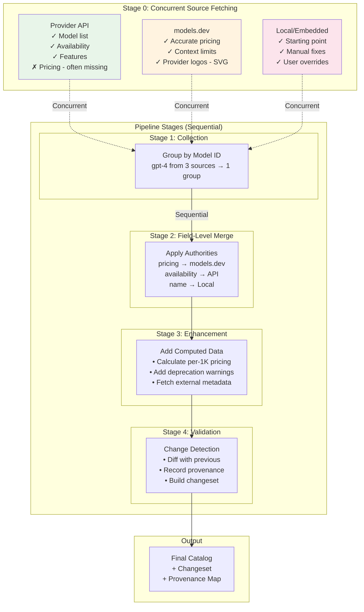
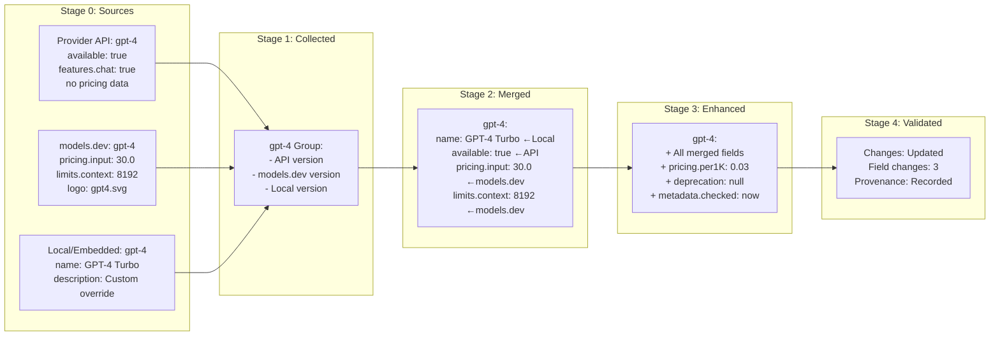

# Reconcile Package

> A staged pipeline for intelligently merging AI model catalogs from multiple incomplete sources

**Note**: For simple catalog operations and two-catalog merging, see the [catalogs package](../catalogs/README.md). This reconcile package is for complex multi-source scenarios.

## Table of Contents
- [Problem Statement](#problem-statement)
- [Key Concepts](#key-concepts)
- [Architecture: The Staged Pipeline](#architecture-the-staged-pipeline)
- [Design Decisions & Trade-offs](#design-decisions--trade-offs)
- [Usage Examples](#usage-examples)
- [API Reference](#api-reference)

## Problem Statement

In the real world of AI model management, we face a fundamental challenge:

**No single source has complete, accurate data for all models.**

- **Provider APIs** are the source of truth for which models exist and their availability, but many don't publish pricing
- **models.dev** provides community-verified pricing data and provider logos (SVGs) that providers don't offer
- **Embedded catalog** gives us a starting point with manual fixes and corrections built into the binary
- **Files catalog** enables local users to store and modify catalog data on disk
- **External services** might have additional metadata or specialized information

This package solves the problem of reconciling these complementary data sources into a single, authoritative catalog.

## Key Concepts

These concepts build on each other - understand them in order:

### 1. Source
A **Source** is any provider of catalog data. Each source serves a specific purpose:
- `ProviderAPI` - The authoritative source for model existence and availability (but often lacks pricing)
- `ModelsDevGit` - Community-maintained database with accurate pricing and provider logos
- `EmbeddedCatalog` - Built-in starting point with manual corrections compiled into the binary  
- `FilesCatalog` - Local disk storage for user modifications and overrides

### 2. Field
A **Field** is a specific data attribute of a model:
- `pricing.input` - Cost per input token
- `features.available` - Is the model currently available?
- `limits.context_window` - Maximum context size

### 3. Authority
An **Authority** determines which source is trusted for a specific field:
```go
FieldAuthority{
    FieldPath: "pricing.*",
    Source:    ModelsDevGit,
    Priority:  100,  // Higher number wins
}
```

### 4. Merge vs Enhance

This is a critical distinction:

- **Merge**: Choose the best value from EXISTING data across sources
  - Example: Choose pricing from models.dev over provider API
  - Deterministic: Same inputs always produce same output
  
- **Enhance**: Add NEW data that doesn't exist in any source
  - Example: Calculate cost per 1K tokens from per-million pricing
  - May be non-deterministic: Could call external APIs

### 5. Provenance
**Provenance** is the audit trail showing where each piece of data came from:
```
models.gpt-4.pricing.input: 
  source: ModelsDevGit
  timestamp: 2024-01-15T10:30:00Z
  value: 30.0
```

### 6. Strategy
A **Strategy** is the algorithm for resolving conflicts between sources:

- **`AuthorityBased`** - Uses field-level authorities to determine winners (recommended)
  - Each field can have a different winning source
  - Falls back to first non-empty value if no authority is defined
  
- **`SourcePriority`** - Fixed source precedence for ALL fields
  - Example: Always prefer LocalCatalog > ModelsDevGit > ProviderAPI
  - Simple but less flexible than field-level authorities
  
- **`Union`** - Takes first non-empty value in deterministic order
  - Order: LocalCatalog → ModelsDevHTTP → ModelsDevGit → ProviderAPI → others alphabetically
  - No conflict resolution, just combines data
  - Useful for initial imports or when you trust all sources equally
  
- **`ThreeWay`** - Git-style merge with base version
  - Detects what changed from a common base
  - Can auto-merge non-conflicting changes

## Understanding Data Sources

Each source type serves a complementary role in building a complete catalog:

### Provider APIs (Source of Truth)
Provider APIs are authoritative for **model existence and availability**. They tell us:
- Which models are currently offered
- What features/capabilities are available
- Current availability status

However, they often **lack critical information**:
- Many providers don't publish pricing via API
- Documentation may be incomplete or outdated
- No visual assets (logos, icons)

### models.dev (Community Intelligence)
The models.dev repository fills the gaps with **community-verified data**:
- **Accurate pricing** - Crowd-sourced and verified by actual usage
- **Real limits** - Context windows and rate limits tested by users
- **Provider logos** - SVG assets for UI display
- **Historical data** - Tracks changes over time

### Embedded Catalog (Starting Point)
The embedded catalog compiled into the binary provides:
- **Baseline data** - A working catalog out of the box
- **Manual corrections** - Fixes for known issues
- **Stability** - Consistent data between releases

### Files Catalog (User Control)
The files catalog on disk enables:
- **Local modifications** - Users can override any data
- **Custom models** - Add private or experimental models
- **Persistence** - Changes survive application updates
- **Version control** - Track changes with Git

## Architecture: The Staged Pipeline

The reconciler implements a **staged pipeline** where each stage has a specific responsibility and stages execute in sequence:



### Stage Details

#### Stage 0: Concurrent Source Fetching (Parallelizable)
**Purpose**: Gather raw data from all sources
- Sources are independent - can fetch simultaneously
- Each provides a complete catalog (though with missing fields)
- No data transformation happens here

#### Stage 1: Collection (Sequential)
**Purpose**: Organize data for processing
- Group all versions of each model by ID
- Prepare for field-by-field comparison
- Build index of what sources have what models

#### Stage 2: Field-Level Merge (Sequential)
**Purpose**: Combine existing data using authorities
- For each field, consult authority configuration
- Select value from winning source
- Handle conflicts according to strategy
- **This is choosing, not computing**

#### Stage 3: Enhancement (Sequential)
**Purpose**: Add computed or external data
- Generate data not in any source
- Apply business logic (e.g., mark deprecated models)
- Call external APIs for additional metadata
- **This is adding, not choosing**

#### Stage 4: Validation & Tracking (Sequential)
**Purpose**: Quality control and audit
- Compare with previous catalog version
- Generate changeset (added/updated/removed)
- Record provenance for every field
- Build comprehensive result

### Example: GPT-4 Through the Pipeline

Let's trace a single model through all stages:



## Design Decisions & Trade-offs

### Why Separate Merge and Enhance?

**Merge** is about **selection**:
- Choose the best existing value
- Deterministic and reproducible
- Based on static configuration (authorities)
- Fast and reliable

**Enhance** is about **computation**:
- Generate new values
- May call external services
- Can fail or timeout
- Optional (can be disabled)

This separation allows you to:
- Run merge without enhancement for speed
- Retry enhancement without re-merging
- Test merge logic independently
- Add enhancers without touching merge code

### Why Field-Level Authorities?

Real-world observation shows different sources are authoritative for different data:

| Field | Best Source | Why |
|-------|------------|-----|
| `pricing.*` | models.dev | Community-verified since providers often don't publish pricing |
| `features.available` | Provider API | They're the source of truth for what models exist |
| `limits.*` | models.dev | Thoroughly tested by community, more reliable than provider docs |
| `name`, `description` | Local/Embedded | Preserves manual corrections and customizations |
| `logo` | models.dev | Provides SVG logos that providers don't offer via API |

Model-level authorities would force choosing ALL fields from one source, losing accuracy.

### Why a Pipeline, Not Parallel Processing?

We chose a **staged pipeline** over parallel processing for:

1. **Predictability**: Same execution order every time
2. **Debuggability**: Can inspect state after each stage
3. **Dependencies**: Enhancement may need merged data
4. **Provenance**: Sequential tracking is simpler

Trade-off: Slower than parallel, but more maintainable.

### Why Not Event-Driven?

We considered an event-driven architecture but chose a pipeline because:

1. **Simplicity**: Easier to understand and debug
2. **Testing**: Straightforward to test each stage
3. **Consistency**: All models processed the same way

Trade-off: Less flexible for complex workflows.

## Usage Examples

### Basic Reconciliation

```go
// Create reconciler with default settings
r, err := reconcile.New()
if err != nil {
    return fmt.Errorf("creating reconciler: %w", err)
}

// Prepare sources (can fetch concurrently!)
var wg sync.WaitGroup
var apiCatalog, devCatalog, localCatalog catalogs.Catalog

wg.Add(3)
go func() { 
    // Fetch current model list and availability from provider
    apiCatalog = fetchFromAPI() 
    wg.Done() 
}()
go func() { 
    // Get community-verified pricing and logos
    devCatalog = fetchFromModelsDev() 
    wg.Done() 
}()
go func() { 
    // Load user overrides and manual corrections
    localCatalog = loadLocalCatalog() 
    wg.Done() 
}()
wg.Wait()

// Run the pipeline
sources := map[reconcile.SourceName]catalogs.Catalog{
    reconcile.ProviderAPI:  apiCatalog,  // Source of truth for model existence
    reconcile.ModelsDevGit: devCatalog,  // Accurate pricing and logos
    reconcile.LocalCatalog: localCatalog, // User customizations
}

result, err := r.ReconcileCatalogs(context.Background(), sources)
```

### Custom Field Authorities

```go
// Define which source wins for each field
authorities := []reconcile.FieldAuthority{
    // Pricing from models.dev (providers often don't publish it)
    {FieldPath: "pricing.*", Source: reconcile.ModelsDevGit, Priority: 200},
    
    // Context limits from models.dev (community-tested)
    {FieldPath: "limits.*", Source: reconcile.ModelsDevGit, Priority: 150},
    
    // User customizations from local catalog
    {FieldPath: "description", Source: reconcile.LocalCatalog, Priority: 100},
    {FieldPath: "name", Source: reconcile.LocalCatalog, Priority: 100},
    
    // Model availability from provider API (source of truth)
    {FieldPath: "features.available", Source: reconcile.ProviderAPI, Priority: 90},
    
    // Everything else from provider API
    {FieldPath: "*", Source: reconcile.ProviderAPI, Priority: 50},
}

r, err := reconcile.New(
    reconcile.WithAuthorities(reconcile.NewCustomAuthorities(authorities)),
)
if err != nil {
    return fmt.Errorf("creating reconciler: %w", err)
}
```

### Adding Enhancement

```go
// Enhancer adds data not in any source
type PricingEnhancer struct{}

func (e *PricingEnhancer) Enhance(ctx context.Context, model catalogs.Model) (catalogs.Model, error) {
    // Add calculated field
    if model.Pricing != nil && model.Pricing.Tokens != nil {
        model.Pricing.Per1K = model.Pricing.Tokens.Input.Per1M / 1000
    }
    
    // Add external data
    if metadata := fetchExternalMetadata(model.ID); metadata != nil {
        model.Metadata = metadata
    }
    
    return model, nil
}

r, err := reconcile.New(reconcile.WithEnhancers(&PricingEnhancer{}))
if err != nil {
    return fmt.Errorf("creating reconciler: %w", err)
}
```

### Three-Way Merge for Conflicts

```go
// When you have base version + two conflicting changes
merger := reconcile.NewThreeWayMerger(authorities, strategy)

base := loadPreviousVersion()
ours := loadOurChanges()
theirs := loadTheirChanges()

merged, conflicts, err := merger.MergeModels(base, ours, theirs)

// Resolve conflicts
for _, conflict := range conflicts {
    if conflict.CanMerge {
        // Auto-resolved
        fmt.Printf("Auto-merged: %s\n", conflict.Path)
    } else {
        // Manual resolution needed
        fmt.Printf("Conflict: %s (ours=%v, theirs=%v)\n", 
            conflict.Path, conflict.Ours, conflict.Theirs)
    }
}
```

## API Reference

### Core Types

```go
// Main reconciler interface
type Reconciler interface {
    ReconcileCatalogs(ctx context.Context, sources map[SourceName]Catalog) (*Result, error)
    WithStrategy(strategy Strategy) Reconciler
    WithAuthorities(authorities AuthorityProvider) Reconciler
    WithEnhancers(enhancers ...Enhancer) Reconciler
}

// Field authority configuration
type FieldAuthority struct {
    FieldPath string     // Pattern to match (supports wildcards)
    Source    SourceName // Which source is authoritative
    Priority  int        // Higher wins
}

// Enhancement interface
type Enhancer interface {
    Name() string
    Priority() int
    CanEnhance(model Model) bool
    Enhance(ctx context.Context, model Model) (Model, error)
}
```

### Result Structure

```go
type Result struct {
    Success    bool
    Catalog    Catalog         // Merged catalog
    Changeset  *Changeset     // What changed
    Provenance ProvenanceMap  // Where data came from
    Statistics ResultStatistics
}
```

## Performance Characteristics

| Operation | Time (Apple M2) | Notes |
|-----------|-----------------|-------|
| Merge 100 models | ~10ms | Field-level authorities |
| Enhance 100 models | ~78ms | With 5 enhancers |
| Full pipeline | ~138ms | Complete reconciliation |
| Three-way merge | ~1μs/model | Conflict detection |

## When to Use Catalog.MergeWith vs Reconcile Package

### Use `catalog.MergeWith()` (Simple Cases)

For basic two-catalog merging scenarios, the built-in catalog methods are sufficient (see [catalogs package documentation](../catalogs/README.md)):

```go
import "github.com/agentstation/starmap/pkg/catalogs"

// Last-write-wins - complete replacement
catalog.MergeWith(source, catalogs.WithStrategy(catalogs.MergeReplaceAll))

// Smart merging - fill empty fields only
catalog.MergeWith(source, catalogs.WithStrategy(catalogs.MergeEnrichEmpty))  

// Append only - just add new items
catalog.MergeWith(source, catalogs.WithStrategy(catalogs.MergeAppendOnly))
```

✅ **Use catalog.MergeWith when:**
- Merging two catalogs
- Simple replacement or enrichment logic
- No need for audit trails
- No field-level authority requirements
- Single source is newer/better than another

### Use `pkg/reconcile` (Complex Cases)

For multi-source reconciliation with advanced features:

```go
import "github.com/agentstation/starmap/pkg/reconcile"

reconciler, err := reconcile.New(
    reconcile.WithStrategy(reconcile.NewAuthorityBasedStrategy(authorities)),
    reconcile.WithProvenance(true),
)
if err != nil {
    return nil, fmt.Errorf("creating reconciler: %w", err)
}

result, err := reconciler.ReconcileCatalogs(ctx, sources)
```

✅ **Use pkg/reconcile when:**
- Multiple incomplete data sources (3+)
- Different sources are authoritative for different fields
- Need for audit trails (provenance)
- Need enhancement pipelines
- Need three-way merge with conflict detection
- Complex merge requirements beyond simple replacement

❌ **Don't use pkg/reconcile when:**
- Single authoritative source
- Simple last-write-wins is sufficient (use `catalog.MergeWith`)
- No need for provenance tracking

## Future Enhancements

### Near-term Improvements (v2.0)

#### Parallel Processing Optimization
Currently, stages 1-4 execute sequentially. We could parallelize:
- **Stage 2 (Merge)**: Process models in parallel with goroutine pool
- **Stage 3 (Enhancement)**: Run enhancers concurrently when independent
- **Benefit**: 10x performance improvement for large catalogs (10,000+ models)

#### Streaming Pipeline
Replace batch processing with streaming for memory efficiency:
```go
type StreamingReconciler interface {
    ReconcileStream(ctx context.Context, sources <-chan SourceData) (<-chan Model, error)
}
```
- **Benefit**: Handle infinite catalogs without memory constraints

#### Conflict Resolution UI
Interactive conflict resolution for manual intervention:
```go
type ConflictResolver interface {
    ResolveInteractive(conflict Conflict) (Resolution, error)
}
```
- **Benefit**: Human-in-the-loop for complex conflicts

### Mid-term Enhancements (v3.0)

#### Machine Learning Integration
Use ML to predict authorities based on historical accuracy:
```go
type MLAuthorityProvider interface {
    LearnFromProvenance(history ProvenanceMap) error
    PredictAuthority(field string) FieldAuthority
}
```
- Train on provenance data to learn which sources are most accurate
- Dynamically adjust authorities based on prediction confidence

#### Distributed Reconciliation
Support reconciliation across multiple nodes:
```go
type DistributedReconciler interface {
    JoinCluster(nodes []string) error
    DistributeWork(catalog Catalog) []WorkUnit
    CollectResults() (*Result, error)
}
```
- **Use case**: Enterprise-scale catalogs with millions of models
- **Technology**: Implement with Raft consensus or etcd coordination

#### Real-time Streaming Updates
WebSocket/gRPC streaming for live catalog updates:
```go
type RealtimeReconciler interface {
    Subscribe(ctx context.Context, filters []Filter) (<-chan Update, error)
    PublishChange(change Change) error
}
```
- Push updates to subscribers as reconciliation happens
- Support filtering by provider, model type, or field paths

### Long-term Vision (v4.0+)

#### Semantic Reconciliation
Understanding context and meaning, not just values:
```go
type SemanticMerger interface {
    UnderstandContext(field string, value interface{}) Meaning
    ReconcileMeanings(meanings []Meaning) interface{}
}
```
- **Example**: Recognize "GPT-4 Turbo" and "gpt-4-turbo" as same model
- **Example**: Understand "8K context" means 8192 tokens

#### Time-Travel Reconciliation
Full historical tracking with point-in-time recovery:
```go
type TemporalReconciler interface {
    ReconcileAt(timestamp time.Time) (*Result, error)
    GetHistory(modelID string, field string) []Change
    Rollback(to time.Time) error
}
```
- Query catalog state at any point in history
- Understand how and why data changed over time
- Rollback bad reconciliations

#### Federated Catalog Network
Decentralized catalog sharing between organizations:
```go
type FederatedReconciler interface {
    ShareCatalog(peers []Peer, filters []Filter) error
    TrustPeer(peer Peer, trustLevel float64) error
    ReconcileFederated(catalogs map[Peer]Catalog) (*Result, error)
}
```
- Organizations share catalog subsets
- Web-of-trust for authority determination
- Privacy-preserving reconciliation

### Implementation Priorities

1. **Performance** (v2.0): Parallel processing and streaming
2. **Intelligence** (v3.0): ML-based authorities and semantic understanding  
3. **Scale** (v3.0): Distributed reconciliation for enterprise
4. **Innovation** (v4.0): Temporal and federated capabilities

These enhancements maintain backward compatibility while extending the reconciler's capabilities for future use cases.

## Further Reading

- [Three-Way Merge Algorithm](https://en.wikipedia.org/wiki/Merge_(version_control)#Three-way_merge)
- [Pipeline Architecture Pattern](https://www.enterpriseintegrationpatterns.com/patterns/messaging/PipesAndFilters.html)
- [Data Provenance](https://en.wikipedia.org/wiki/Data_lineage)

<!-- gomarkdoc:embed:start -->

<!-- Code generated by gomarkdoc. DO NOT EDIT -->

# reconcile

```go
import "github.com/agentstation/starmap/pkg/reconcile"
```

Package reconcile provides advanced multi\-source data reconciliation for AI model catalogs with field\-level authority and provenance tracking.

## Index

- [func MatchesPattern\(fieldPath, pattern string\) bool](<#MatchesPattern>)
- [type ApplyStrategy](<#ApplyStrategy>)
- [type AuthorChangeset](<#AuthorChangeset>)
  - [func \(a \*AuthorChangeset\) HasChanges\(\) bool](<#AuthorChangeset.HasChanges>)
  - [func \(a \*AuthorChangeset\) Print\(\)](<#AuthorChangeset.Print>)
- [type AuthorUpdate](<#AuthorUpdate>)
- [type AuthorityBasedStrategy](<#AuthorityBasedStrategy>)
  - [func \(s \*AuthorityBasedStrategy\) ResolveConflict\(field string, values map\[SourceName\]interface\{\}\) \(interface\{\}, SourceName, string\)](<#AuthorityBasedStrategy.ResolveConflict>)
- [type AuthorityProvider](<#AuthorityProvider>)
  - [func NewDefaultAuthorities\(\) AuthorityProvider](<#NewDefaultAuthorities>)
  - [func NewDefaultAuthorityProvider\(\) AuthorityProvider](<#NewDefaultAuthorityProvider>)
- [type ChainEnhancer](<#ChainEnhancer>)
  - [func NewChainEnhancer\(priority int, enhancers ...Enhancer\) \*ChainEnhancer](<#NewChainEnhancer>)
  - [func \(e \*ChainEnhancer\) CanEnhance\(model catalogs.Model\) bool](<#ChainEnhancer.CanEnhance>)
  - [func \(e \*ChainEnhancer\) Enhance\(ctx context.Context, model catalogs.Model\) \(catalogs.Model, error\)](<#ChainEnhancer.Enhance>)
  - [func \(e \*ChainEnhancer\) EnhanceBatch\(ctx context.Context, models \[\]catalogs.Model\) \(\[\]catalogs.Model, error\)](<#ChainEnhancer.EnhanceBatch>)
  - [func \(e \*ChainEnhancer\) Name\(\) string](<#ChainEnhancer.Name>)
  - [func \(e \*ChainEnhancer\) Priority\(\) int](<#ChainEnhancer.Priority>)
- [type ChangeType](<#ChangeType>)
- [type Changeset](<#Changeset>)
  - [func \(c \*Changeset\) Filter\(strategy ApplyStrategy\) \*Changeset](<#Changeset.Filter>)
  - [func \(c \*Changeset\) HasChanges\(\) bool](<#Changeset.HasChanges>)
  - [func \(c \*Changeset\) IsEmpty\(\) bool](<#Changeset.IsEmpty>)
  - [func \(c \*Changeset\) Print\(\)](<#Changeset.Print>)
  - [func \(c \*Changeset\) String\(\) string](<#Changeset.String>)
- [type ChangesetSummary](<#ChangesetSummary>)
- [type Conflict](<#Conflict>)
- [type ConflictInfo](<#ConflictInfo>)
- [type ConflictResolution](<#ConflictResolution>)
- [type ConflictResolver](<#ConflictResolver>)
- [type ConflictType](<#ConflictType>)
- [type CustomAuthorities](<#CustomAuthorities>)
  - [func NewCustomAuthorities\(\) \*CustomAuthorities](<#NewCustomAuthorities>)
  - [func \(ca \*CustomAuthorities\) AddAuthority\(resourceType ResourceType, authority FieldAuthority\)](<#CustomAuthorities.AddAuthority>)
  - [func \(ca \*CustomAuthorities\) GetAuthorities\(resourceType ResourceType\) \[\]FieldAuthority](<#CustomAuthorities.GetAuthorities>)
  - [func \(ca \*CustomAuthorities\) GetAuthority\(fieldPath string, resourceType ResourceType\) \*FieldAuthority](<#CustomAuthorities.GetAuthority>)
- [type CustomStrategy](<#CustomStrategy>)
  - [func \(s \*CustomStrategy\) ResolveConflict\(field string, values map\[SourceName\]interface\{\}\) \(interface\{\}, SourceName, string\)](<#CustomStrategy.ResolveConflict>)
- [type DefaultAuthorities](<#DefaultAuthorities>)
  - [func \(da \*DefaultAuthorities\) GetAuthorities\(resourceType ResourceType\) \[\]FieldAuthority](<#DefaultAuthorities.GetAuthorities>)
  - [func \(da \*DefaultAuthorities\) GetAuthority\(fieldPath string, resourceType ResourceType\) \*FieldAuthority](<#DefaultAuthorities.GetAuthority>)
- [type Differ](<#Differ>)
  - [func NewDiffer\(opts ...DifferOption\) Differ](<#NewDiffer>)
- [type DifferOption](<#DifferOption>)
  - [func WithDeepComparison\(enabled bool\) DifferOption](<#WithDeepComparison>)
  - [func WithIgnoredFields\(fields ...string\) DifferOption](<#WithIgnoredFields>)
  - [func WithProvenanceTracking\(enabled bool\) DifferOption](<#WithProvenanceTracking>)
- [type Enhancer](<#Enhancer>)
- [type EnhancerPipeline](<#EnhancerPipeline>)
  - [func NewEnhancerPipeline\(enhancers ...Enhancer\) \*EnhancerPipeline](<#NewEnhancerPipeline>)
  - [func \(p \*EnhancerPipeline\) Enhance\(ctx context.Context, model catalogs.Model\) \(catalogs.Model, error\)](<#EnhancerPipeline.Enhance>)
  - [func \(p \*EnhancerPipeline\) EnhanceBatch\(ctx context.Context, models \[\]catalogs.Model\) \(\[\]catalogs.Model, error\)](<#EnhancerPipeline.EnhanceBatch>)
  - [func \(p \*EnhancerPipeline\) WithProvenance\(tracker ProvenanceTracker\) \*EnhancerPipeline](<#EnhancerPipeline.WithProvenance>)
- [type FieldAuthority](<#FieldAuthority>)
  - [func AuthorityByField\(fieldPath string, authorities \[\]FieldAuthority\) \*FieldAuthority](<#AuthorityByField>)
  - [func FilterAuthoritiesBySource\(authorities \[\]FieldAuthority, sourceName SourceName\) \[\]FieldAuthority](<#FilterAuthoritiesBySource>)
- [type FieldChange](<#FieldChange>)
- [type FieldProvenance](<#FieldProvenance>)
- [type Merger](<#Merger>)
- [type MetadataEnhancer](<#MetadataEnhancer>)
  - [func NewMetadataEnhancer\(priority int\) \*MetadataEnhancer](<#NewMetadataEnhancer>)
  - [func \(e \*MetadataEnhancer\) CanEnhance\(model catalogs.Model\) bool](<#MetadataEnhancer.CanEnhance>)
  - [func \(e \*MetadataEnhancer\) Enhance\(ctx context.Context, model catalogs.Model\) \(catalogs.Model, error\)](<#MetadataEnhancer.Enhance>)
  - [func \(e \*MetadataEnhancer\) EnhanceBatch\(ctx context.Context, models \[\]catalogs.Model\) \(\[\]catalogs.Model, error\)](<#MetadataEnhancer.EnhanceBatch>)
  - [func \(e \*MetadataEnhancer\) Name\(\) string](<#MetadataEnhancer.Name>)
  - [func \(e \*MetadataEnhancer\) Priority\(\) int](<#MetadataEnhancer.Priority>)
- [type ModelChangeset](<#ModelChangeset>)
  - [func \(m \*ModelChangeset\) HasChanges\(\) bool](<#ModelChangeset.HasChanges>)
  - [func \(m \*ModelChangeset\) Print\(\)](<#ModelChangeset.Print>)
- [type ModelUpdate](<#ModelUpdate>)
- [type ModelsDevEnhancer](<#ModelsDevEnhancer>)
  - [func NewModelsDevEnhancer\(priority int\) \*ModelsDevEnhancer](<#NewModelsDevEnhancer>)
  - [func \(e \*ModelsDevEnhancer\) CanEnhance\(model catalogs.Model\) bool](<#ModelsDevEnhancer.CanEnhance>)
  - [func \(e \*ModelsDevEnhancer\) Enhance\(ctx context.Context, model catalogs.Model\) \(catalogs.Model, error\)](<#ModelsDevEnhancer.Enhance>)
  - [func \(e \*ModelsDevEnhancer\) EnhanceBatch\(ctx context.Context, models \[\]catalogs.Model\) \(\[\]catalogs.Model, error\)](<#ModelsDevEnhancer.EnhanceBatch>)
  - [func \(e \*ModelsDevEnhancer\) Name\(\) string](<#ModelsDevEnhancer.Name>)
  - [func \(e \*ModelsDevEnhancer\) Priority\(\) int](<#ModelsDevEnhancer.Priority>)
- [type Option](<#Option>)
  - [func WithAuthorities\(authorities AuthorityProvider\) Option](<#WithAuthorities>)
  - [func WithEnhancers\(enhancers ...Enhancer\) Option](<#WithEnhancers>)
  - [func WithProvenance\(enabled bool\) Option](<#WithProvenance>)
  - [func WithStrategy\(strategy Strategy\) Option](<#WithStrategy>)
- [type ProvenanceAuditResult](<#ProvenanceAuditResult>)
- [type ProvenanceAuditor](<#ProvenanceAuditor>)
- [type ProvenanceInfo](<#ProvenanceInfo>)
- [type ProvenanceMap](<#ProvenanceMap>)
- [type ProvenanceReport](<#ProvenanceReport>)
  - [func GenerateReport\(provenance ProvenanceMap\) \*ProvenanceReport](<#GenerateReport>)
  - [func \(r \*ProvenanceReport\) String\(\) string](<#ProvenanceReport.String>)
- [type ProvenanceTracker](<#ProvenanceTracker>)
  - [func NewProvenanceTracker\(enabled bool\) ProvenanceTracker](<#NewProvenanceTracker>)
- [type ProviderChangeset](<#ProviderChangeset>)
  - [func \(p \*ProviderChangeset\) HasChanges\(\) bool](<#ProviderChangeset.HasChanges>)
  - [func \(p \*ProviderChangeset\) Print\(\)](<#ProviderChangeset.Print>)
- [type ProviderUpdate](<#ProviderUpdate>)
- [type Reconciler](<#Reconciler>)
  - [func New\(opts ...Option\) \(Reconciler, error\)](<#New>)
- [type Resolution](<#Resolution>)
- [type ResourceProvenance](<#ResourceProvenance>)
- [type ResourceType](<#ResourceType>)
- [type Result](<#Result>)
  - [func \(r \*Result\) HasChanges\(\) bool](<#Result.HasChanges>)
  - [func \(r \*Result\) HasErrors\(\) bool](<#Result.HasErrors>)
  - [func \(r \*Result\) HasWarnings\(\) bool](<#Result.HasWarnings>)
  - [func \(r \*Result\) IsSuccess\(\) bool](<#Result.IsSuccess>)
  - [func \(r \*Result\) Report\(\) string](<#Result.Report>)
  - [func \(r \*Result\) Summary\(\) string](<#Result.Summary>)
  - [func \(r \*Result\) WasApplied\(\) bool](<#Result.WasApplied>)
- [type ResultBuilder](<#ResultBuilder>)
  - [func NewResultBuilder\(\) \*ResultBuilder](<#NewResultBuilder>)
  - [func \(b \*ResultBuilder\) Build\(\) \*Result](<#ResultBuilder.Build>)
  - [func \(b \*ResultBuilder\) WithAppliedChanges\(changeset \*Changeset\) \*ResultBuilder](<#ResultBuilder.WithAppliedChanges>)
  - [func \(b \*ResultBuilder\) WithCatalog\(catalog catalogs.Catalog\) \*ResultBuilder](<#ResultBuilder.WithCatalog>)
  - [func \(b \*ResultBuilder\) WithChangeset\(changeset \*Changeset\) \*ResultBuilder](<#ResultBuilder.WithChangeset>)
  - [func \(b \*ResultBuilder\) WithDryRun\(dryRun bool\) \*ResultBuilder](<#ResultBuilder.WithDryRun>)
  - [func \(b \*ResultBuilder\) WithError\(err error\) \*ResultBuilder](<#ResultBuilder.WithError>)
  - [func \(b \*ResultBuilder\) WithProvenance\(provenance ProvenanceMap\) \*ResultBuilder](<#ResultBuilder.WithProvenance>)
  - [func \(b \*ResultBuilder\) WithSources\(sources ...SourceName\) \*ResultBuilder](<#ResultBuilder.WithSources>)
  - [func \(b \*ResultBuilder\) WithStatistics\(stats ResultStatistics\) \*ResultBuilder](<#ResultBuilder.WithStatistics>)
  - [func \(b \*ResultBuilder\) WithStrategy\(strategy Strategy\) \*ResultBuilder](<#ResultBuilder.WithStrategy>)
  - [func \(b \*ResultBuilder\) WithWarning\(warning string\) \*ResultBuilder](<#ResultBuilder.WithWarning>)
- [type ResultMetadata](<#ResultMetadata>)
- [type ResultStatistics](<#ResultStatistics>)
- [type SourceName](<#SourceName>)
  - [func \(sn SourceName\) String\(\) string](<#SourceName.String>)
- [type SourcePriorityStrategy](<#SourcePriorityStrategy>)
  - [func \(s \*SourcePriorityStrategy\) ResolveConflict\(field string, values map\[SourceName\]interface\{\}\) \(interface\{\}, SourceName, string\)](<#SourcePriorityStrategy.ResolveConflict>)
- [type StrategicMerger](<#StrategicMerger>)
  - [func NewStrategicMerger\(authorities AuthorityProvider, strategy Strategy\) \*StrategicMerger](<#NewStrategicMerger>)
  - [func \(sm \*StrategicMerger\) MergeField\(fieldPath string, values map\[SourceName\]interface\{\}\) \(interface\{\}, SourceName\)](<#StrategicMerger.MergeField>)
  - [func \(sm \*StrategicMerger\) MergeModels\(sources map\[SourceName\]\[\]catalogs.Model\) \(\[\]catalogs.Model, ProvenanceMap, error\)](<#StrategicMerger.MergeModels>)
  - [func \(sm \*StrategicMerger\) MergeProviders\(sources map\[SourceName\]\[\]catalogs.Provider\) \(\[\]catalogs.Provider, ProvenanceMap, error\)](<#StrategicMerger.MergeProviders>)
  - [func \(sm \*StrategicMerger\) WithProvenance\(tracker ProvenanceTracker\)](<#StrategicMerger.WithProvenance>)
- [type Strategy](<#Strategy>)
  - [func NewAuthorityBasedStrategy\(authorities AuthorityProvider\) Strategy](<#NewAuthorityBasedStrategy>)
  - [func NewCustomStrategy\(name, description string, resolver ConflictResolver\) Strategy](<#NewCustomStrategy>)
  - [func NewSourcePriorityStrategy\(priority \[\]SourceName\) Strategy](<#NewSourcePriorityStrategy>)
  - [func NewStrategyChain\(strategies ...Strategy\) Strategy](<#NewStrategyChain>)
  - [func NewUnionStrategy\(\) Strategy](<#NewUnionStrategy>)
- [type StrategyChain](<#StrategyChain>)
  - [func \(s \*StrategyChain\) Description\(\) string](<#StrategyChain.Description>)
  - [func \(s \*StrategyChain\) GetApplyStrategy\(\) ApplyStrategy](<#StrategyChain.GetApplyStrategy>)
  - [func \(s \*StrategyChain\) Name\(\) string](<#StrategyChain.Name>)
  - [func \(s \*StrategyChain\) ResolveConflict\(field string, values map\[SourceName\]interface\{\}\) \(interface\{\}, SourceName, string\)](<#StrategyChain.ResolveConflict>)
  - [func \(s \*StrategyChain\) ShouldMerge\(resourceType ResourceType\) bool](<#StrategyChain.ShouldMerge>)
  - [func \(s \*StrategyChain\) ValidateResult\(result \*Result\) error](<#StrategyChain.ValidateResult>)
- [type ThreeWayMerger](<#ThreeWayMerger>)
  - [func NewThreeWayMerger\(authorities AuthorityProvider, strategy Strategy\) ThreeWayMerger](<#NewThreeWayMerger>)
- [type UnionStrategy](<#UnionStrategy>)
  - [func \(s \*UnionStrategy\) ResolveConflict\(field string, values map\[SourceName\]interface\{\}\) \(interface\{\}, SourceName, string\)](<#UnionStrategy.ResolveConflict>)
- [type ValidationError](<#ValidationError>)
- [type ValidationResult](<#ValidationResult>)
  - [func \(v \*ValidationResult\) HasWarnings\(\) bool](<#ValidationResult.HasWarnings>)
  - [func \(v \*ValidationResult\) IsValid\(\) bool](<#ValidationResult.IsValid>)
  - [func \(v \*ValidationResult\) String\(\) string](<#ValidationResult.String>)
- [type ValidationWarning](<#ValidationWarning>)


<a name="MatchesPattern"></a>
## func [MatchesPattern](<https://github.com/agentstation/starmap/blob/master/pkg/reconcile/authority.go#L99>)

```go
func MatchesPattern(fieldPath, pattern string) bool
```

MatchesPattern checks if a field path matches a pattern \(supports \* wildcards\)

<a name="ApplyStrategy"></a>
## type [ApplyStrategy](<https://github.com/agentstation/starmap/blob/master/pkg/reconcile/changeset.go#L306>)

ApplyStrategy represents how to apply changes

```go
type ApplyStrategy string
```

<a name="ApplyAll"></a>

```go
const (
    // ApplyAll applies all changes including removals
    ApplyAll ApplyStrategy = "all"

    // ApplyAdditive only applies additions and updates, never removes
    ApplyAdditive ApplyStrategy = "additive"

    // ApplyUpdatesOnly only applies updates to existing items
    ApplyUpdatesOnly ApplyStrategy = "updates-only"

    // ApplyAdditionsOnly only applies new additions
    ApplyAdditionsOnly ApplyStrategy = "additions-only"
)
```

<a name="AuthorChangeset"></a>
## type [AuthorChangeset](<https://github.com/agentstation/starmap/blob/master/pkg/reconcile/changeset.go#L67-L71>)

AuthorChangeset represents changes to authors

```go
type AuthorChangeset struct {
    Added   []catalogs.Author // New authors
    Updated []AuthorUpdate    // Updated authors
    Removed []catalogs.Author // Removed authors
}
```

<a name="AuthorChangeset.HasChanges"></a>
### func \(\*AuthorChangeset\) [HasChanges](<https://github.com/agentstation/starmap/blob/master/pkg/reconcile/changeset.go#L116>)

```go
func (a *AuthorChangeset) HasChanges() bool
```

HasChanges returns true if the author changeset contains any changes

<a name="AuthorChangeset.Print"></a>
### func \(\*AuthorChangeset\) [Print](<https://github.com/agentstation/starmap/blob/master/pkg/reconcile/changeset.go#L271>)

```go
func (a *AuthorChangeset) Print()
```

Print outputs author changes in a human\-readable format

<a name="AuthorUpdate"></a>
## type [AuthorUpdate](<https://github.com/agentstation/starmap/blob/master/pkg/reconcile/changeset.go#L45-L50>)

AuthorUpdate represents an update to an existing author

```go
type AuthorUpdate struct {
    ID       catalogs.AuthorID // ID of the author being updated
    Existing catalogs.Author   // Current author
    New      catalogs.Author   // New author
    Changes  []FieldChange     // Detailed list of field changes
}
```

<a name="AuthorityBasedStrategy"></a>
## type [AuthorityBasedStrategy](<https://github.com/agentstation/starmap/blob/master/pkg/reconcile/strategy.go#L66-L69>)

AuthorityBasedStrategy uses field authorities to resolve conflicts

```go
type AuthorityBasedStrategy struct {
    // contains filtered or unexported fields
}
```

<a name="AuthorityBasedStrategy.ResolveConflict"></a>
### func \(\*AuthorityBasedStrategy\) [ResolveConflict](<https://github.com/agentstation/starmap/blob/master/pkg/reconcile/strategy.go#L89>)

```go
func (s *AuthorityBasedStrategy) ResolveConflict(field string, values map[SourceName]interface{}) (interface{}, SourceName, string)
```

ResolveConflict uses authorities to resolve conflicts

<a name="AuthorityProvider"></a>
## type [AuthorityProvider](<https://github.com/agentstation/starmap/blob/master/pkg/reconcile/authority.go#L8-L14>)

AuthorityProvider determines which source is authoritative for each field

```go
type AuthorityProvider interface {
    // GetAuthority returns the authority configuration for a specific field
    GetAuthority(fieldPath string, resourceType ResourceType) *FieldAuthority

    // GetAuthorities returns all authorities for a resource type
    GetAuthorities(resourceType ResourceType) []FieldAuthority
}
```

<a name="NewDefaultAuthorities"></a>
### func [NewDefaultAuthorities](<https://github.com/agentstation/starmap/blob/master/pkg/reconcile/authority.go#L31>)

```go
func NewDefaultAuthorities() AuthorityProvider
```

NewDefaultAuthorities creates a new DefaultAuthorities with standard configurations

<a name="NewDefaultAuthorityProvider"></a>
### func [NewDefaultAuthorityProvider](<https://github.com/agentstation/starmap/blob/master/pkg/reconcile/authority.go#L40>)

```go
func NewDefaultAuthorityProvider() AuthorityProvider
```

NewDefaultAuthorityProvider is an alias for NewDefaultAuthorities

<a name="ChainEnhancer"></a>
## type [ChainEnhancer](<https://github.com/agentstation/starmap/blob/master/pkg/reconcile/enhancer.go#L307-L310>)

ChainEnhancer allows chaining multiple enhancers with custom logic

```go
type ChainEnhancer struct {
    // contains filtered or unexported fields
}
```

<a name="NewChainEnhancer"></a>
### func [NewChainEnhancer](<https://github.com/agentstation/starmap/blob/master/pkg/reconcile/enhancer.go#L313>)

```go
func NewChainEnhancer(priority int, enhancers ...Enhancer) *ChainEnhancer
```

NewChainEnhancer creates a new chain enhancer

<a name="ChainEnhancer.CanEnhance"></a>
### func \(\*ChainEnhancer\) [CanEnhance](<https://github.com/agentstation/starmap/blob/master/pkg/reconcile/enhancer.go#L335>)

```go
func (e *ChainEnhancer) CanEnhance(model catalogs.Model) bool
```

CanEnhance checks if any enhancer in the chain can enhance

<a name="ChainEnhancer.Enhance"></a>
### func \(\*ChainEnhancer\) [Enhance](<https://github.com/agentstation/starmap/blob/master/pkg/reconcile/enhancer.go#L345>)

```go
func (e *ChainEnhancer) Enhance(ctx context.Context, model catalogs.Model) (catalogs.Model, error)
```

Enhance applies all enhancers in sequence

<a name="ChainEnhancer.EnhanceBatch"></a>
### func \(\*ChainEnhancer\) [EnhanceBatch](<https://github.com/agentstation/starmap/blob/master/pkg/reconcile/enhancer.go#L360>)

```go
func (e *ChainEnhancer) EnhanceBatch(ctx context.Context, models []catalogs.Model) ([]catalogs.Model, error)
```

EnhanceBatch enhances multiple models

<a name="ChainEnhancer.Name"></a>
### func \(\*ChainEnhancer\) [Name](<https://github.com/agentstation/starmap/blob/master/pkg/reconcile/enhancer.go#L321>)

```go
func (e *ChainEnhancer) Name() string
```

Name returns the enhancer name

<a name="ChainEnhancer.Priority"></a>
### func \(\*ChainEnhancer\) [Priority](<https://github.com/agentstation/starmap/blob/master/pkg/reconcile/enhancer.go#L330>)

```go
func (e *ChainEnhancer) Priority() int
```

Priority returns the priority

<a name="ChangeType"></a>
## type [ChangeType](<https://github.com/agentstation/starmap/blob/master/pkg/reconcile/changeset.go#L11>)

ChangeType represents the type of change

```go
type ChangeType string
```

<a name="ChangeTypeAdd"></a>

```go
const (
    ChangeTypeAdd    ChangeType = "add"
    ChangeTypeUpdate ChangeType = "update"
    ChangeTypeRemove ChangeType = "remove"
)
```

<a name="Changeset"></a>
## type [Changeset](<https://github.com/agentstation/starmap/blob/master/pkg/reconcile/changeset.go#L74-L79>)

Changeset represents all changes between two catalogs

```go
type Changeset struct {
    Models    *ModelChangeset    // Model changes
    Providers *ProviderChangeset // Provider changes
    Authors   *AuthorChangeset   // Author changes
    Summary   ChangesetSummary   // Summary statistics
}
```

<a name="Changeset.Filter"></a>
### func \(\*Changeset\) [Filter](<https://github.com/agentstation/starmap/blob/master/pkg/reconcile/changeset.go#L323>)

```go
func (c *Changeset) Filter(strategy ApplyStrategy) *Changeset
```

Filter filters the changeset based on the apply strategy

<a name="Changeset.HasChanges"></a>
### func \(\*Changeset\) [HasChanges](<https://github.com/agentstation/starmap/blob/master/pkg/reconcile/changeset.go#L96>)

```go
func (c *Changeset) HasChanges() bool
```

HasChanges returns true if the changeset contains any changes

<a name="Changeset.IsEmpty"></a>
### func \(\*Changeset\) [IsEmpty](<https://github.com/agentstation/starmap/blob/master/pkg/reconcile/changeset.go#L101>)

```go
func (c *Changeset) IsEmpty() bool
```

IsEmpty returns true if the changeset contains no changes

<a name="Changeset.Print"></a>
### func \(\*Changeset\) [Print](<https://github.com/agentstation/starmap/blob/master/pkg/reconcile/changeset.go#L177>)

```go
func (c *Changeset) Print()
```

Print outputs a detailed, human\-readable view of the changeset

<a name="Changeset.String"></a>
### func \(\*Changeset\) [String](<https://github.com/agentstation/starmap/blob/master/pkg/reconcile/changeset.go#L121>)

```go
func (c *Changeset) String() string
```

String returns a human\-readable summary of the changeset

<a name="ChangesetSummary"></a>
## type [ChangesetSummary](<https://github.com/agentstation/starmap/blob/master/pkg/reconcile/changeset.go#L82-L93>)

ChangesetSummary provides summary statistics for a changeset

```go
type ChangesetSummary struct {
    ModelsAdded      int
    ModelsUpdated    int
    ModelsRemoved    int
    ProvidersAdded   int
    ProvidersUpdated int
    ProvidersRemoved int
    AuthorsAdded     int
    AuthorsUpdated   int
    AuthorsRemoved   int
    TotalChanges     int
}
```

<a name="Conflict"></a>
## type [Conflict](<https://github.com/agentstation/starmap/blob/master/pkg/reconcile/threeway.go#L26-L34>)

Conflict represents a merge conflict

```go
type Conflict struct {
    Path      string      // Field path (e.g., "pricing.input")
    Base      interface{} // Original value
    Ours      interface{} // Our change
    Theirs    interface{} // Their change
    Type      ConflictType
    CanMerge  bool        // Whether automatic merge is possible
    Suggested interface{} // Suggested resolution
}
```

<a name="ConflictInfo"></a>
## type [ConflictInfo](<https://github.com/agentstation/starmap/blob/master/pkg/reconcile/provenance.go#L146-L151>)

ConflictInfo describes a conflict that was resolved

```go
type ConflictInfo struct {
    Sources        []SourceName  // Sources that had conflicting values
    Values         []interface{} // The conflicting values
    Resolution     string        // How the conflict was resolved
    SelectedSource SourceName    // Which source was selected
}
```

<a name="ConflictResolution"></a>
## type [ConflictResolution](<https://github.com/agentstation/starmap/blob/master/pkg/reconcile/threeway.go#L46>)

ConflictResolution defines how to resolve conflicts

```go
type ConflictResolution string
```

<a name="ResolutionOurs"></a>

```go
const (
    ResolutionOurs      ConflictResolution = "ours"      // Always take our changes
    ResolutionTheirs    ConflictResolution = "theirs"    // Always take their changes
    ResolutionMerge     ConflictResolution = "merge"     // Try to merge if possible
    ResolutionBase      ConflictResolution = "base"      // Keep original value
    ResolutionNewest    ConflictResolution = "newest"    // Take the newest change
    ResolutionAuthority ConflictResolution = "authority" // Use field authorities
)
```

<a name="ConflictResolver"></a>
## type [ConflictResolver](<https://github.com/agentstation/starmap/blob/master/pkg/reconcile/strategy.go#L260>)

ConflictResolver is a function that resolves conflicts

```go
type ConflictResolver func(field string, values map[SourceName]interface{}) (interface{}, SourceName, string)
```

<a name="ConflictType"></a>
## type [ConflictType](<https://github.com/agentstation/starmap/blob/master/pkg/reconcile/threeway.go#L37>)

ConflictType describes the type of conflict

```go
type ConflictType string
```

<a name="ConflictTypeModified"></a>

```go
const (
    ConflictTypeModified ConflictType = "modified" // Both sides modified the same field
    ConflictTypeDeleted  ConflictType = "deleted"  // One side deleted, other modified
    ConflictTypeAdded    ConflictType = "added"    // Both sides added different values
)
```

<a name="CustomAuthorities"></a>
## type [CustomAuthorities](<https://github.com/agentstation/starmap/blob/master/pkg/reconcile/authority.go#L243-L245>)

CustomAuthorities allows for custom field authority configurations

```go
type CustomAuthorities struct {
    // contains filtered or unexported fields
}
```

<a name="NewCustomAuthorities"></a>
### func [NewCustomAuthorities](<https://github.com/agentstation/starmap/blob/master/pkg/reconcile/authority.go#L248>)

```go
func NewCustomAuthorities() *CustomAuthorities
```

NewCustomAuthorities creates a new CustomAuthorities

<a name="CustomAuthorities.AddAuthority"></a>
### func \(\*CustomAuthorities\) [AddAuthority](<https://github.com/agentstation/starmap/blob/master/pkg/reconcile/authority.go#L255>)

```go
func (ca *CustomAuthorities) AddAuthority(resourceType ResourceType, authority FieldAuthority)
```

AddAuthority adds a field authority for a resource type

<a name="CustomAuthorities.GetAuthorities"></a>
### func \(\*CustomAuthorities\) [GetAuthorities](<https://github.com/agentstation/starmap/blob/master/pkg/reconcile/authority.go#L269>)

```go
func (ca *CustomAuthorities) GetAuthorities(resourceType ResourceType) []FieldAuthority
```

GetAuthorities returns all authorities for a resource type

<a name="CustomAuthorities.GetAuthority"></a>
### func \(\*CustomAuthorities\) [GetAuthority](<https://github.com/agentstation/starmap/blob/master/pkg/reconcile/authority.go#L260>)

```go
func (ca *CustomAuthorities) GetAuthority(fieldPath string, resourceType ResourceType) *FieldAuthority
```

GetAuthority returns the authority configuration for a specific field

<a name="CustomStrategy"></a>
## type [CustomStrategy](<https://github.com/agentstation/starmap/blob/master/pkg/reconcile/strategy.go#L254-L257>)

CustomStrategy allows custom conflict resolution logic

```go
type CustomStrategy struct {
    // contains filtered or unexported fields
}
```

<a name="CustomStrategy.ResolveConflict"></a>
### func \(\*CustomStrategy\) [ResolveConflict](<https://github.com/agentstation/starmap/blob/master/pkg/reconcile/strategy.go#L280>)

```go
func (s *CustomStrategy) ResolveConflict(field string, values map[SourceName]interface{}) (interface{}, SourceName, string)
```

ResolveConflict uses custom resolver

<a name="DefaultAuthorities"></a>
## type [DefaultAuthorities](<https://github.com/agentstation/starmap/blob/master/pkg/reconcile/authority.go#L24-L28>)

DefaultAuthorities provides standard field authorities

```go
type DefaultAuthorities struct {
    // contains filtered or unexported fields
}
```

<a name="DefaultAuthorities.GetAuthorities"></a>
### func \(\*DefaultAuthorities\) [GetAuthorities](<https://github.com/agentstation/starmap/blob/master/pkg/reconcile/authority.go#L63>)

```go
func (da *DefaultAuthorities) GetAuthorities(resourceType ResourceType) []FieldAuthority
```

GetAuthorities returns all authorities for a resource type

<a name="DefaultAuthorities.GetAuthority"></a>
### func \(\*DefaultAuthorities\) [GetAuthority](<https://github.com/agentstation/starmap/blob/master/pkg/reconcile/authority.go#L45>)

```go
func (da *DefaultAuthorities) GetAuthority(fieldPath string, resourceType ResourceType) *FieldAuthority
```

GetAuthority returns the authority configuration for a specific field

<a name="Differ"></a>
## type [Differ](<https://github.com/agentstation/starmap/blob/master/pkg/reconcile/differ.go#L13-L25>)

Differ handles change detection between resources

```go
type Differ interface {
    // DiffModels compares two sets of models and returns changes
    DiffModels(existing, new []catalogs.Model) *ModelChangeset

    // DiffProviders compares two sets of providers and returns changes
    DiffProviders(existing, new []catalogs.Provider) *ProviderChangeset

    // DiffAuthors compares two sets of authors and returns changes
    DiffAuthors(existing, new []catalogs.Author) *AuthorChangeset

    // DiffCatalogs compares two complete catalogs
    DiffCatalogs(existing, new catalogs.Catalog) *Changeset
}
```

<a name="NewDiffer"></a>
### func [NewDiffer](<https://github.com/agentstation/starmap/blob/master/pkg/reconcile/differ.go#L36>)

```go
func NewDiffer(opts ...DifferOption) Differ
```

NewDiffer creates a new Differ with default settings

<a name="DifferOption"></a>
## type [DifferOption](<https://github.com/agentstation/starmap/blob/master/pkg/reconcile/differ.go#L51>)

DifferOption is a functional option for configuring Differ

```go
type DifferOption func(*differ)
```

<a name="WithDeepComparison"></a>
### func [WithDeepComparison](<https://github.com/agentstation/starmap/blob/master/pkg/reconcile/differ.go#L63>)

```go
func WithDeepComparison(enabled bool) DifferOption
```

WithDeepComparison enables/disables deep structural comparison

<a name="WithIgnoredFields"></a>
### func [WithIgnoredFields](<https://github.com/agentstation/starmap/blob/master/pkg/reconcile/differ.go#L54>)

```go
func WithIgnoredFields(fields ...string) DifferOption
```

WithIgnoredFields sets fields to ignore during comparison

<a name="WithProvenanceTracking"></a>
### func [WithProvenanceTracking](<https://github.com/agentstation/starmap/blob/master/pkg/reconcile/differ.go#L70>)

```go
func WithProvenanceTracking(enabled bool) DifferOption
```

WithProvenanceTracking enables provenance tracking in diffs

<a name="Enhancer"></a>
## type [Enhancer](<https://github.com/agentstation/starmap/blob/master/pkg/reconcile/enhancer.go#L13-L28>)

Enhancer defines the interface for model enrichment

```go
type Enhancer interface {
    // Name returns the enhancer name
    Name() string

    // Enhance enhances a single model with additional data
    Enhance(ctx context.Context, model catalogs.Model) (catalogs.Model, error)

    // EnhanceBatch enhances multiple models efficiently
    EnhanceBatch(ctx context.Context, models []catalogs.Model) ([]catalogs.Model, error)

    // CanEnhance checks if this enhancer can enhance a specific model
    CanEnhance(model catalogs.Model) bool

    // Priority returns the priority of this enhancer (higher = applied first)
    Priority() int
}
```

<a name="EnhancerPipeline"></a>
## type [EnhancerPipeline](<https://github.com/agentstation/starmap/blob/master/pkg/reconcile/enhancer.go#L31-L34>)

EnhancerPipeline manages a chain of enhancers

```go
type EnhancerPipeline struct {
    // contains filtered or unexported fields
}
```

<a name="NewEnhancerPipeline"></a>
### func [NewEnhancerPipeline](<https://github.com/agentstation/starmap/blob/master/pkg/reconcile/enhancer.go#L37>)

```go
func NewEnhancerPipeline(enhancers ...Enhancer) *EnhancerPipeline
```

NewEnhancerPipeline creates a new enhancer pipeline

<a name="EnhancerPipeline.Enhance"></a>
### func \(\*EnhancerPipeline\) [Enhance](<https://github.com/agentstation/starmap/blob/master/pkg/reconcile/enhancer.go#L62>)

```go
func (p *EnhancerPipeline) Enhance(ctx context.Context, model catalogs.Model) (catalogs.Model, error)
```

Enhance applies all enhancers to a single model

<a name="EnhancerPipeline.EnhanceBatch"></a>
### func \(\*EnhancerPipeline\) [EnhanceBatch](<https://github.com/agentstation/starmap/blob/master/pkg/reconcile/enhancer.go#L89>)

```go
func (p *EnhancerPipeline) EnhanceBatch(ctx context.Context, models []catalogs.Model) ([]catalogs.Model, error)
```

EnhanceBatch applies all enhancers to multiple models

<a name="EnhancerPipeline.WithProvenance"></a>
### func \(\*EnhancerPipeline\) [WithProvenance](<https://github.com/agentstation/starmap/blob/master/pkg/reconcile/enhancer.go#L56>)

```go
func (p *EnhancerPipeline) WithProvenance(tracker ProvenanceTracker) *EnhancerPipeline
```

WithProvenance enables provenance tracking for enhancements

<a name="FieldAuthority"></a>
## type [FieldAuthority](<https://github.com/agentstation/starmap/blob/master/pkg/reconcile/authority.go#L17-L21>)

FieldAuthority defines source priority for a specific field

```go
type FieldAuthority struct {
    FieldPath string     `json:"field_path" yaml:"field_path"` // e.g., "pricing.input", "metadata.knowledge_cutoff"
    Source    SourceName `json:"source" yaml:"source"`         // Which source is authoritative
    Priority  int        `json:"priority" yaml:"priority"`     // Priority (higher = more authoritative)
}
```

<a name="AuthorityByField"></a>
### func [AuthorityByField](<https://github.com/agentstation/starmap/blob/master/pkg/reconcile/authority.go#L77>)

```go
func AuthorityByField(fieldPath string, authorities []FieldAuthority) *FieldAuthority
```

AuthorityByField returns the highest priority authority for a given field path

<a name="FilterAuthoritiesBySource"></a>
### func [FilterAuthoritiesBySource](<https://github.com/agentstation/starmap/blob/master/pkg/reconcile/authority.go#L120>)

```go
func FilterAuthoritiesBySource(authorities []FieldAuthority, sourceName SourceName) []FieldAuthority
```

FilterAuthoritiesBySource returns only the authorities for a specific source

<a name="FieldChange"></a>
## type [FieldChange](<https://github.com/agentstation/starmap/blob/master/pkg/reconcile/changeset.go#L20-L26>)

FieldChange represents a change to a specific field

```go
type FieldChange struct {
    Path     string     // Field path (e.g., "pricing.input")
    OldValue string     // Previous value (string representation)
    NewValue string     // New value (string representation)
    Type     ChangeType // Type of change
    Source   SourceName // Source that caused the change (for provenance)
}
```

<a name="FieldProvenance"></a>
## type [FieldProvenance](<https://github.com/agentstation/starmap/blob/master/pkg/reconcile/provenance.go#L139-L143>)

FieldProvenance contains provenance history for a single field

```go
type FieldProvenance struct {
    Current   ProvenanceInfo   // Current value and its source
    History   []ProvenanceInfo // Historical values
    Conflicts []ConflictInfo   // Any conflicts that were resolved
}
```

<a name="Merger"></a>
## type [Merger](<https://github.com/agentstation/starmap/blob/master/pkg/reconcile/merger.go#L17-L29>)

Merger performs the actual merging of resources

```go
type Merger interface {
    // MergeModels merges models from multiple sources
    MergeModels(sources map[SourceName][]catalogs.Model) ([]catalogs.Model, ProvenanceMap, error)

    // MergeProviders merges providers from multiple sources
    MergeProviders(sources map[SourceName][]catalogs.Provider) ([]catalogs.Provider, ProvenanceMap, error)

    // MergeField merges a single field using authorities
    MergeField(fieldPath string, values map[SourceName]interface{}) (interface{}, SourceName)

    // WithProvenance sets the provenance tracker
    WithProvenance(tracker ProvenanceTracker)
}
```

<a name="MetadataEnhancer"></a>
## type [MetadataEnhancer](<https://github.com/agentstation/starmap/blob/master/pkg/reconcile/enhancer.go#L248-L250>)

MetadataEnhancer adds metadata from various sources

```go
type MetadataEnhancer struct {
    // contains filtered or unexported fields
}
```

<a name="NewMetadataEnhancer"></a>
### func [NewMetadataEnhancer](<https://github.com/agentstation/starmap/blob/master/pkg/reconcile/enhancer.go#L253>)

```go
func NewMetadataEnhancer(priority int) *MetadataEnhancer
```

NewMetadataEnhancer creates a new metadata enhancer

<a name="MetadataEnhancer.CanEnhance"></a>
### func \(\*MetadataEnhancer\) [CanEnhance](<https://github.com/agentstation/starmap/blob/master/pkg/reconcile/enhancer.go#L270>)

```go
func (e *MetadataEnhancer) CanEnhance(model catalogs.Model) bool
```

CanEnhance checks if this enhancer can enhance a model

<a name="MetadataEnhancer.Enhance"></a>
### func \(\*MetadataEnhancer\) [Enhance](<https://github.com/agentstation/starmap/blob/master/pkg/reconcile/enhancer.go#L276>)

```go
func (e *MetadataEnhancer) Enhance(ctx context.Context, model catalogs.Model) (catalogs.Model, error)
```

Enhance enhances a single model

<a name="MetadataEnhancer.EnhanceBatch"></a>
### func \(\*MetadataEnhancer\) [EnhanceBatch](<https://github.com/agentstation/starmap/blob/master/pkg/reconcile/enhancer.go#L293>)

```go
func (e *MetadataEnhancer) EnhanceBatch(ctx context.Context, models []catalogs.Model) ([]catalogs.Model, error)
```

EnhanceBatch enhances multiple models

<a name="MetadataEnhancer.Name"></a>
### func \(\*MetadataEnhancer\) [Name](<https://github.com/agentstation/starmap/blob/master/pkg/reconcile/enhancer.go#L260>)

```go
func (e *MetadataEnhancer) Name() string
```

Name returns the enhancer name

<a name="MetadataEnhancer.Priority"></a>
### func \(\*MetadataEnhancer\) [Priority](<https://github.com/agentstation/starmap/blob/master/pkg/reconcile/enhancer.go#L265>)

```go
func (e *MetadataEnhancer) Priority() int
```

Priority returns the priority

<a name="ModelChangeset"></a>
## type [ModelChangeset](<https://github.com/agentstation/starmap/blob/master/pkg/reconcile/changeset.go#L53-L57>)

ModelChangeset represents changes to models

```go
type ModelChangeset struct {
    Added   []catalogs.Model // New models
    Updated []ModelUpdate    // Updated models
    Removed []catalogs.Model // Removed models
}
```

<a name="ModelChangeset.HasChanges"></a>
### func \(\*ModelChangeset\) [HasChanges](<https://github.com/agentstation/starmap/blob/master/pkg/reconcile/changeset.go#L106>)

```go
func (m *ModelChangeset) HasChanges() bool
```

HasChanges returns true if the model changeset contains any changes

<a name="ModelChangeset.Print"></a>
### func \(\*ModelChangeset\) [Print](<https://github.com/agentstation/starmap/blob/master/pkg/reconcile/changeset.go#L198>)

```go
func (m *ModelChangeset) Print()
```

Print outputs model changes in a human\-readable format

<a name="ModelUpdate"></a>
## type [ModelUpdate](<https://github.com/agentstation/starmap/blob/master/pkg/reconcile/changeset.go#L29-L34>)

ModelUpdate represents an update to an existing model

```go
type ModelUpdate struct {
    ID       string         // ID of the model being updated
    Existing catalogs.Model // Current model
    New      catalogs.Model // New model
    Changes  []FieldChange  // Detailed list of field changes
}
```

<a name="ModelsDevEnhancer"></a>
## type [ModelsDevEnhancer](<https://github.com/agentstation/starmap/blob/master/pkg/reconcile/enhancer.go#L184-L187>)

ModelsDevEnhancer enhances models with models.dev data

```go
type ModelsDevEnhancer struct {
    // contains filtered or unexported fields
}
```

<a name="NewModelsDevEnhancer"></a>
### func [NewModelsDevEnhancer](<https://github.com/agentstation/starmap/blob/master/pkg/reconcile/enhancer.go#L190>)

```go
func NewModelsDevEnhancer(priority int) *ModelsDevEnhancer
```

NewModelsDevEnhancer creates a new models.dev enhancer

<a name="ModelsDevEnhancer.CanEnhance"></a>
### func \(\*ModelsDevEnhancer\) [CanEnhance](<https://github.com/agentstation/starmap/blob/master/pkg/reconcile/enhancer.go#L208>)

```go
func (e *ModelsDevEnhancer) CanEnhance(model catalogs.Model) bool
```

CanEnhance checks if this enhancer can enhance a model

<a name="ModelsDevEnhancer.Enhance"></a>
### func \(\*ModelsDevEnhancer\) [Enhance](<https://github.com/agentstation/starmap/blob/master/pkg/reconcile/enhancer.go#L215>)

```go
func (e *ModelsDevEnhancer) Enhance(ctx context.Context, model catalogs.Model) (catalogs.Model, error)
```

Enhance enhances a single model

<a name="ModelsDevEnhancer.EnhanceBatch"></a>
### func \(\*ModelsDevEnhancer\) [EnhanceBatch](<https://github.com/agentstation/starmap/blob/master/pkg/reconcile/enhancer.go#L235>)

```go
func (e *ModelsDevEnhancer) EnhanceBatch(ctx context.Context, models []catalogs.Model) ([]catalogs.Model, error)
```

EnhanceBatch enhances multiple models

<a name="ModelsDevEnhancer.Name"></a>
### func \(\*ModelsDevEnhancer\) [Name](<https://github.com/agentstation/starmap/blob/master/pkg/reconcile/enhancer.go#L198>)

```go
func (e *ModelsDevEnhancer) Name() string
```

Name returns the enhancer name

<a name="ModelsDevEnhancer.Priority"></a>
### func \(\*ModelsDevEnhancer\) [Priority](<https://github.com/agentstation/starmap/blob/master/pkg/reconcile/enhancer.go#L203>)

```go
func (e *ModelsDevEnhancer) Priority() int
```

Priority returns the priority

<a name="Option"></a>
## type [Option](<https://github.com/agentstation/starmap/blob/master/pkg/reconcile/reconcile.go#L58>)

Option configures a Reconciler

```go
type Option func(*reconciler) error
```

<a name="WithAuthorities"></a>
### func [WithAuthorities](<https://github.com/agentstation/starmap/blob/master/pkg/reconcile/reconcile.go#L270>)

```go
func WithAuthorities(authorities AuthorityProvider) Option
```

WithAuthorities sets the field authorities

<a name="WithEnhancers"></a>
### func [WithEnhancers](<https://github.com/agentstation/starmap/blob/master/pkg/reconcile/reconcile.go#L296>)

```go
func WithEnhancers(enhancers ...Enhancer) Option
```

WithEnhancers adds model enhancers to the pipeline

<a name="WithProvenance"></a>
### func [WithProvenance](<https://github.com/agentstation/starmap/blob/master/pkg/reconcile/reconcile.go#L285>)

```go
func WithProvenance(enabled bool) Option
```

WithProvenance enables field\-level tracking

<a name="WithStrategy"></a>
### func [WithStrategy](<https://github.com/agentstation/starmap/blob/master/pkg/reconcile/reconcile.go#L259>)

```go
func WithStrategy(strategy Strategy) Option
```

WithStrategy sets the merge strategy

<a name="ProvenanceAuditResult"></a>
## type [ProvenanceAuditResult](<https://github.com/agentstation/starmap/blob/master/pkg/reconcile/provenance.go#L322-L329>)

ProvenanceAuditResult contains audit findings

```go
type ProvenanceAuditResult struct {
    Valid       bool
    Issues      []string
    Warnings    []string
    Coverage    float64  // Percentage of fields with provenance
    Conflicts   int      // Number of unresolved conflicts
    MissingData []string // Fields without provenance
}
```

<a name="ProvenanceAuditor"></a>
## type [ProvenanceAuditor](<https://github.com/agentstation/starmap/blob/master/pkg/reconcile/provenance.go#L310-L319>)

ProvenanceAuditor validates provenance tracking

```go
type ProvenanceAuditor interface {
    // Audit checks provenance for completeness and consistency
    Audit(provenance ProvenanceMap) *ProvenanceAuditResult

    // ValidateAuthority ensures authority scores are valid
    ValidateAuthority(provenance ProvenanceMap) []string

    // CheckCoverage verifies all required fields have provenance
    CheckCoverage(provenance ProvenanceMap, requiredFields []string) []string
}
```

<a name="ProvenanceInfo"></a>
## type [ProvenanceInfo](<https://github.com/agentstation/starmap/blob/master/pkg/reconcile/provenance.go#L11-L20>)

ProvenanceInfo tracks the origin and history of a field value

```go
type ProvenanceInfo struct {
    Source        SourceName  // Source that provided the value
    Field         string      // Field path
    Value         interface{} // The actual value
    Timestamp     time.Time   // When the value was set
    Authority     float64     // Authority score (0.0 to 1.0)
    Confidence    float64     // Confidence in the value (0.0 to 1.0)
    Reason        string      // Reason for selecting this value
    PreviousValue interface{} // Previous value if updated
}
```

<a name="ProvenanceMap"></a>
## type [ProvenanceMap](<https://github.com/agentstation/starmap/blob/master/pkg/reconcile/provenance.go#L23>)

ProvenanceMap tracks provenance for multiple resources

```go
type ProvenanceMap map[string][]ProvenanceInfo // key is "resourceType:resourceID:fieldPath"
```

<a name="ProvenanceReport"></a>
## type [ProvenanceReport](<https://github.com/agentstation/starmap/blob/master/pkg/reconcile/provenance.go#L127-L129>)

ProvenanceReport generates a human\-readable provenance report

```go
type ProvenanceReport struct {
    Resources map[string]ResourceProvenance // key is "resourceType:resourceID"
}
```

<a name="GenerateReport"></a>
### func [GenerateReport](<https://github.com/agentstation/starmap/blob/master/pkg/reconcile/provenance.go#L154>)

```go
func GenerateReport(provenance ProvenanceMap) *ProvenanceReport
```

GenerateReport creates a provenance report from a ProvenanceMap

<a name="ProvenanceReport.String"></a>
### func \(\*ProvenanceReport\) [String](<https://github.com/agentstation/starmap/blob/master/pkg/reconcile/provenance.go#L250>)

```go
func (r *ProvenanceReport) String() string
```

String generates a string representation of the provenance report

<a name="ProvenanceTracker"></a>
## type [ProvenanceTracker](<https://github.com/agentstation/starmap/blob/master/pkg/reconcile/provenance.go#L26-L41>)

ProvenanceTracker manages provenance tracking during reconciliation

```go
type ProvenanceTracker interface {
    // Track records provenance for a field
    Track(resourceType ResourceType, resourceID string, field string, info ProvenanceInfo)

    // GetProvenance retrieves provenance for a specific field
    GetProvenance(resourceType ResourceType, resourceID string, field string) []ProvenanceInfo

    // GetResourceProvenance retrieves all provenance for a resource
    GetResourceProvenance(resourceType ResourceType, resourceID string) map[string][]ProvenanceInfo

    // Export returns the complete provenance map
    Export() ProvenanceMap

    // Clear removes all provenance data
    Clear()
}
```

<a name="NewProvenanceTracker"></a>
### func [NewProvenanceTracker](<https://github.com/agentstation/starmap/blob/master/pkg/reconcile/provenance.go#L50>)

```go
func NewProvenanceTracker(enabled bool) ProvenanceTracker
```

NewProvenanceTracker creates a new provenance tracker

<a name="ProviderChangeset"></a>
## type [ProviderChangeset](<https://github.com/agentstation/starmap/blob/master/pkg/reconcile/changeset.go#L60-L64>)

ProviderChangeset represents changes to providers

```go
type ProviderChangeset struct {
    Added   []catalogs.Provider // New providers
    Updated []ProviderUpdate    // Updated providers
    Removed []catalogs.Provider // Removed providers
}
```

<a name="ProviderChangeset.HasChanges"></a>
### func \(\*ProviderChangeset\) [HasChanges](<https://github.com/agentstation/starmap/blob/master/pkg/reconcile/changeset.go#L111>)

```go
func (p *ProviderChangeset) HasChanges() bool
```

HasChanges returns true if the provider changeset contains any changes

<a name="ProviderChangeset.Print"></a>
### func \(\*ProviderChangeset\) [Print](<https://github.com/agentstation/starmap/blob/master/pkg/reconcile/changeset.go#L236>)

```go
func (p *ProviderChangeset) Print()
```

Print outputs provider changes in a human\-readable format

<a name="ProviderUpdate"></a>
## type [ProviderUpdate](<https://github.com/agentstation/starmap/blob/master/pkg/reconcile/changeset.go#L37-L42>)

ProviderUpdate represents an update to an existing provider

```go
type ProviderUpdate struct {
    ID       catalogs.ProviderID // ID of the provider being updated
    Existing catalogs.Provider   // Current provider
    New      catalogs.Provider   // New provider
    Changes  []FieldChange       // Detailed list of field changes
}
```

<a name="Reconciler"></a>
## type [Reconciler](<https://github.com/agentstation/starmap/blob/master/pkg/reconcile/reconcile.go#L37-L46>)

Reconciler is the main interface for reconciling data from multiple sources

```go
type Reconciler interface {
    // ReconcileCatalogs merges multiple catalogs from different sources
    ReconcileCatalogs(ctx context.Context, sources map[SourceName]catalogs.Catalog) (*Result, error)

    // ReconcileModels merges models from multiple sources
    ReconcileModels(sources map[SourceName][]catalogs.Model) ([]catalogs.Model, ProvenanceMap, error)

    // ReconcileProviders merges providers from multiple sources
    ReconcileProviders(sources map[SourceName][]catalogs.Provider) ([]catalogs.Provider, ProvenanceMap, error)
}
```

<a name="New"></a>
### func [New](<https://github.com/agentstation/starmap/blob/master/pkg/reconcile/reconcile.go#L61>)

```go
func New(opts ...Option) (Reconciler, error)
```

New creates a new Reconciler with options

<a name="Resolution"></a>
## type [Resolution](<https://github.com/agentstation/starmap/blob/master/pkg/reconcile/threeway.go#L58-L63>)

Resolution represents a conflict resolution decision

```go
type Resolution struct {
    Conflict Conflict
    Decision ConflictResolution
    Value    interface{}
    Reason   string
}
```

<a name="ResourceProvenance"></a>
## type [ResourceProvenance](<https://github.com/agentstation/starmap/blob/master/pkg/reconcile/provenance.go#L132-L136>)

ResourceProvenance contains provenance for a single resource

```go
type ResourceProvenance struct {
    Type   ResourceType
    ID     string
    Fields map[string]FieldProvenance
}
```

<a name="ResourceType"></a>
## type [ResourceType](<https://github.com/agentstation/starmap/blob/master/pkg/reconcile/reconcile.go#L28>)

ResourceType identifies the type of resource being merged

```go
type ResourceType string
```

<a name="ResourceTypeModel"></a>

```go
const (
    ResourceTypeModel    ResourceType = "model"
    ResourceTypeProvider ResourceType = "provider"
    ResourceTypeAuthor   ResourceType = "author"
)
```

<a name="Result"></a>
## type [Result](<https://github.com/agentstation/starmap/blob/master/pkg/reconcile/result.go#L11-L35>)

Result represents the outcome of a reconciliation operation

```go
type Result struct {
    // Success indicates if reconciliation completed successfully
    Success bool

    // Catalog is the reconciled catalog (if successful)
    Catalog catalogs.Catalog

    // Changeset contains all changes that were detected
    Changeset *Changeset

    // AppliedChanges contains changes that were actually applied
    AppliedChanges *Changeset

    // Errors contains any errors that occurred
    Errors []error

    // Warnings contains non-critical issues
    Warnings []string

    // Metadata about the reconciliation
    Metadata ResultMetadata

    // Provenance information for audit trail
    Provenance ProvenanceMap
}
```

<a name="Result.HasChanges"></a>
### func \(\*Result\) [HasChanges](<https://github.com/agentstation/starmap/blob/master/pkg/reconcile/result.go#L97>)

```go
func (r *Result) HasChanges() bool
```

HasChanges returns true if any changes were detected

<a name="Result.HasErrors"></a>
### func \(\*Result\) [HasErrors](<https://github.com/agentstation/starmap/blob/master/pkg/reconcile/result.go#L87>)

```go
func (r *Result) HasErrors() bool
```

HasErrors returns true if there were errors

<a name="Result.HasWarnings"></a>
### func \(\*Result\) [HasWarnings](<https://github.com/agentstation/starmap/blob/master/pkg/reconcile/result.go#L92>)

```go
func (r *Result) HasWarnings() bool
```

HasWarnings returns true if there were warnings

<a name="Result.IsSuccess"></a>
### func \(\*Result\) [IsSuccess](<https://github.com/agentstation/starmap/blob/master/pkg/reconcile/result.go#L82>)

```go
func (r *Result) IsSuccess() bool
```

IsSuccess returns true if the reconciliation was successful

<a name="Result.Report"></a>
### func \(\*Result\) [Report](<https://github.com/agentstation/starmap/blob/master/pkg/reconcile/result.go#L131>)

```go
func (r *Result) Report() string
```

Report generates a detailed report of the reconciliation

<a name="Result.Summary"></a>
### func \(\*Result\) [Summary](<https://github.com/agentstation/starmap/blob/master/pkg/reconcile/result.go#L107>)

```go
func (r *Result) Summary() string
```

Summary returns a human\-readable summary of the result

<a name="Result.WasApplied"></a>
### func \(\*Result\) [WasApplied](<https://github.com/agentstation/starmap/blob/master/pkg/reconcile/result.go#L102>)

```go
func (r *Result) WasApplied() bool
```

WasApplied returns true if changes were applied

<a name="ResultBuilder"></a>
## type [ResultBuilder](<https://github.com/agentstation/starmap/blob/master/pkg/reconcile/result.go#L228-L230>)

ResultBuilder helps construct Result objects

```go
type ResultBuilder struct {
    // contains filtered or unexported fields
}
```

<a name="NewResultBuilder"></a>
### func [NewResultBuilder](<https://github.com/agentstation/starmap/blob/master/pkg/reconcile/result.go#L233>)

```go
func NewResultBuilder() *ResultBuilder
```

NewResultBuilder creates a new ResultBuilder

<a name="ResultBuilder.Build"></a>
### func \(\*ResultBuilder\) [Build](<https://github.com/agentstation/starmap/blob/master/pkg/reconcile/result.go#L312>)

```go
func (b *ResultBuilder) Build() *Result
```

Build finalizes and returns the Result

<a name="ResultBuilder.WithAppliedChanges"></a>
### func \(\*ResultBuilder\) [WithAppliedChanges](<https://github.com/agentstation/starmap/blob/master/pkg/reconcile/result.go#L261>)

```go
func (b *ResultBuilder) WithAppliedChanges(changeset *Changeset) *ResultBuilder
```

WithAppliedChanges sets the applied changes

<a name="ResultBuilder.WithCatalog"></a>
### func \(\*ResultBuilder\) [WithCatalog](<https://github.com/agentstation/starmap/blob/master/pkg/reconcile/result.go#L249>)

```go
func (b *ResultBuilder) WithCatalog(catalog catalogs.Catalog) *ResultBuilder
```

WithCatalog sets the reconciled catalog

<a name="ResultBuilder.WithChangeset"></a>
### func \(\*ResultBuilder\) [WithChangeset](<https://github.com/agentstation/starmap/blob/master/pkg/reconcile/result.go#L255>)

```go
func (b *ResultBuilder) WithChangeset(changeset *Changeset) *ResultBuilder
```

WithChangeset sets the detected changes

<a name="ResultBuilder.WithDryRun"></a>
### func \(\*ResultBuilder\) [WithDryRun](<https://github.com/agentstation/starmap/blob/master/pkg/reconcile/result.go#L294>)

```go
func (b *ResultBuilder) WithDryRun(dryRun bool) *ResultBuilder
```

WithDryRun marks this as a dry run

<a name="ResultBuilder.WithError"></a>
### func \(\*ResultBuilder\) [WithError](<https://github.com/agentstation/starmap/blob/master/pkg/reconcile/result.go#L267>)

```go
func (b *ResultBuilder) WithError(err error) *ResultBuilder
```

WithError adds an error

<a name="ResultBuilder.WithProvenance"></a>
### func \(\*ResultBuilder\) [WithProvenance](<https://github.com/agentstation/starmap/blob/master/pkg/reconcile/result.go#L300>)

```go
func (b *ResultBuilder) WithProvenance(provenance ProvenanceMap) *ResultBuilder
```

WithProvenance sets the provenance map

<a name="ResultBuilder.WithSources"></a>
### func \(\*ResultBuilder\) [WithSources](<https://github.com/agentstation/starmap/blob/master/pkg/reconcile/result.go#L282>)

```go
func (b *ResultBuilder) WithSources(sources ...SourceName) *ResultBuilder
```

WithSources sets the sources that were reconciled

<a name="ResultBuilder.WithStatistics"></a>
### func \(\*ResultBuilder\) [WithStatistics](<https://github.com/agentstation/starmap/blob/master/pkg/reconcile/result.go#L306>)

```go
func (b *ResultBuilder) WithStatistics(stats ResultStatistics) *ResultBuilder
```

WithStatistics sets the result statistics

<a name="ResultBuilder.WithStrategy"></a>
### func \(\*ResultBuilder\) [WithStrategy](<https://github.com/agentstation/starmap/blob/master/pkg/reconcile/result.go#L288>)

```go
func (b *ResultBuilder) WithStrategy(strategy Strategy) *ResultBuilder
```

WithStrategy sets the reconciliation strategy

<a name="ResultBuilder.WithWarning"></a>
### func \(\*ResultBuilder\) [WithWarning](<https://github.com/agentstation/starmap/blob/master/pkg/reconcile/result.go#L276>)

```go
func (b *ResultBuilder) WithWarning(warning string) *ResultBuilder
```

WithWarning adds a warning

<a name="ResultMetadata"></a>
## type [ResultMetadata](<https://github.com/agentstation/starmap/blob/master/pkg/reconcile/result.go#L38-L59>)

ResultMetadata contains metadata about the reconciliation process

```go
type ResultMetadata struct {
    // StartTime when reconciliation started
    StartTime time.Time

    // EndTime when reconciliation completed
    EndTime time.Time

    // Duration of the reconciliation
    Duration time.Duration

    // Sources that were reconciled
    Sources []SourceName

    // Strategy used for reconciliation
    Strategy Strategy

    // DryRun indicates if this was a dry-run
    DryRun bool

    // Statistics about the reconciliation
    Stats ResultStatistics
}
```

<a name="ResultStatistics"></a>
## type [ResultStatistics](<https://github.com/agentstation/starmap/blob/master/pkg/reconcile/result.go#L62-L79>)

ResultStatistics contains statistics about the reconciliation

```go
type ResultStatistics struct {
    // Number of resources processed
    ModelsProcessed    int
    ProvidersProcessed int
    AuthorsProcessed   int

    // Number of conflicts resolved
    ConflictsResolved int

    // Number of resources skipped
    ResourcesSkipped int

    // Performance metrics
    MergeTimeMs int64
    DiffTimeMs  int64
    ApplyTimeMs int64
    TotalTimeMs int64
}
```

<a name="SourceName"></a>
## type [SourceName](<https://github.com/agentstation/starmap/blob/master/pkg/reconcile/reconcile.go#L12>)

SourceName represents the name/type of a data source

```go
type SourceName string
```

<a name="ProviderAPI"></a>Common source names

```go
const (
    ProviderAPI   SourceName = "Provider APIs"
    ModelsDevGit  SourceName = "models.dev (git)"
    ModelsDevHTTP SourceName = "models.dev (http)"
    LocalCatalog  SourceName = "Local Catalog"
)
```

<a name="SourceName.String"></a>
### func \(SourceName\) [String](<https://github.com/agentstation/starmap/blob/master/pkg/reconcile/reconcile.go#L15>)

```go
func (sn SourceName) String() string
```

String returns the string representation of a source name

<a name="SourcePriorityStrategy"></a>
## type [SourcePriorityStrategy](<https://github.com/agentstation/starmap/blob/master/pkg/reconcile/strategy.go#L214-L217>)

SourcePriorityStrategy uses a fixed source priority order

```go
type SourcePriorityStrategy struct {
    // contains filtered or unexported fields
}
```

<a name="SourcePriorityStrategy.ResolveConflict"></a>
### func \(\*SourcePriorityStrategy\) [ResolveConflict](<https://github.com/agentstation/starmap/blob/master/pkg/reconcile/strategy.go#L237>)

```go
func (s *SourcePriorityStrategy) ResolveConflict(field string, values map[SourceName]interface{}) (interface{}, SourceName, string)
```

ResolveConflict uses source priority to resolve conflicts

<a name="StrategicMerger"></a>
## type [StrategicMerger](<https://github.com/agentstation/starmap/blob/master/pkg/reconcile/merger.go#L32-L36>)

StrategicMerger implements strategic three\-way merge

```go
type StrategicMerger struct {
    // contains filtered or unexported fields
}
```

<a name="NewStrategicMerger"></a>
### func [NewStrategicMerger](<https://github.com/agentstation/starmap/blob/master/pkg/reconcile/merger.go#L39>)

```go
func NewStrategicMerger(authorities AuthorityProvider, strategy Strategy) *StrategicMerger
```

NewStrategicMerger creates a new StrategicMerger

<a name="StrategicMerger.MergeField"></a>
### func \(\*StrategicMerger\) [MergeField](<https://github.com/agentstation/starmap/blob/master/pkg/reconcile/merger.go#L139>)

```go
func (sm *StrategicMerger) MergeField(fieldPath string, values map[SourceName]interface{}) (interface{}, SourceName)
```

MergeField merges a single field using authorities

<a name="StrategicMerger.MergeModels"></a>
### func \(\*StrategicMerger\) [MergeModels](<https://github.com/agentstation/starmap/blob/master/pkg/reconcile/merger.go#L52>)

```go
func (sm *StrategicMerger) MergeModels(sources map[SourceName][]catalogs.Model) ([]catalogs.Model, ProvenanceMap, error)
```

MergeModels merges models from multiple sources

<a name="StrategicMerger.MergeProviders"></a>
### func \(\*StrategicMerger\) [MergeProviders](<https://github.com/agentstation/starmap/blob/master/pkg/reconcile/merger.go#L91>)

```go
func (sm *StrategicMerger) MergeProviders(sources map[SourceName][]catalogs.Provider) ([]catalogs.Provider, ProvenanceMap, error)
```

MergeProviders merges providers from multiple sources

<a name="StrategicMerger.WithProvenance"></a>
### func \(\*StrategicMerger\) [WithProvenance](<https://github.com/agentstation/starmap/blob/master/pkg/reconcile/merger.go#L47>)

```go
func (sm *StrategicMerger) WithProvenance(tracker ProvenanceTracker)
```

WithProvenance sets the provenance tracker

<a name="Strategy"></a>
## type [Strategy](<https://github.com/agentstation/starmap/blob/master/pkg/reconcile/strategy.go#L9-L27>)

Strategy defines how reconciliation should be performed

```go
type Strategy interface {
    // Name returns the strategy name
    Name() string

    // Description returns a human-readable description
    Description() string

    // ShouldMerge determines if resources should be merged
    ShouldMerge(resourceType ResourceType) bool

    // ResolveConflict determines how to resolve conflicts
    ResolveConflict(field string, values map[SourceName]interface{}) (interface{}, SourceName, string)

    // ValidateResult validates the reconciliation result
    ValidateResult(result *Result) error

    // GetApplyStrategy returns how changes should be applied
    GetApplyStrategy() ApplyStrategy
}
```

<a name="NewAuthorityBasedStrategy"></a>
### func [NewAuthorityBasedStrategy](<https://github.com/agentstation/starmap/blob/master/pkg/reconcile/strategy.go#L72>)

```go
func NewAuthorityBasedStrategy(authorities AuthorityProvider) Strategy
```

NewAuthorityBasedStrategy creates a new authority\-based strategy

<a name="NewCustomStrategy"></a>
### func [NewCustomStrategy](<https://github.com/agentstation/starmap/blob/master/pkg/reconcile/strategy.go#L263>)

```go
func NewCustomStrategy(name, description string, resolver ConflictResolver) Strategy
```

NewCustomStrategy creates a new custom strategy

<a name="NewSourcePriorityStrategy"></a>
### func [NewSourcePriorityStrategy](<https://github.com/agentstation/starmap/blob/master/pkg/reconcile/strategy.go#L220>)

```go
func NewSourcePriorityStrategy(priority []SourceName) Strategy
```

NewSourcePriorityStrategy creates a new source priority strategy

<a name="NewStrategyChain"></a>
### func [NewStrategyChain](<https://github.com/agentstation/starmap/blob/master/pkg/reconcile/strategy.go#L297>)

```go
func NewStrategyChain(strategies ...Strategy) Strategy
```

NewStrategyChain creates a new strategy chain

<a name="NewUnionStrategy"></a>
### func [NewUnionStrategy](<https://github.com/agentstation/starmap/blob/master/pkg/reconcile/strategy.go#L140>)

```go
func NewUnionStrategy() Strategy
```

NewUnionStrategy creates a new union strategy

<a name="StrategyChain"></a>
## type [StrategyChain](<https://github.com/agentstation/starmap/blob/master/pkg/reconcile/strategy.go#L292-L294>)

StrategyChain combines multiple strategies with fallback

```go
type StrategyChain struct {
    // contains filtered or unexported fields
}
```

<a name="StrategyChain.Description"></a>
### func \(\*StrategyChain\) [Description](<https://github.com/agentstation/starmap/blob/master/pkg/reconcile/strategy.go#L313>)

```go
func (s *StrategyChain) Description() string
```

Description returns a human\-readable description

<a name="StrategyChain.GetApplyStrategy"></a>
### func \(\*StrategyChain\) [GetApplyStrategy](<https://github.com/agentstation/starmap/blob/master/pkg/reconcile/strategy.go#L349>)

```go
func (s *StrategyChain) GetApplyStrategy() ApplyStrategy
```

GetApplyStrategy returns the first strategy's apply strategy

<a name="StrategyChain.Name"></a>
### func \(\*StrategyChain\) [Name](<https://github.com/agentstation/starmap/blob/master/pkg/reconcile/strategy.go#L304>)

```go
func (s *StrategyChain) Name() string
```

Name returns the strategy name

<a name="StrategyChain.ResolveConflict"></a>
### func \(\*StrategyChain\) [ResolveConflict](<https://github.com/agentstation/starmap/blob/master/pkg/reconcile/strategy.go#L328>)

```go
func (s *StrategyChain) ResolveConflict(field string, values map[SourceName]interface{}) (interface{}, SourceName, string)
```

ResolveConflict tries each strategy in order

<a name="StrategyChain.ShouldMerge"></a>
### func \(\*StrategyChain\) [ShouldMerge](<https://github.com/agentstation/starmap/blob/master/pkg/reconcile/strategy.go#L318>)

```go
func (s *StrategyChain) ShouldMerge(resourceType ResourceType) bool
```

ShouldMerge checks all strategies

<a name="StrategyChain.ValidateResult"></a>
### func \(\*StrategyChain\) [ValidateResult](<https://github.com/agentstation/starmap/blob/master/pkg/reconcile/strategy.go#L339>)

```go
func (s *StrategyChain) ValidateResult(result *Result) error
```

ValidateResult validates using all strategies

<a name="ThreeWayMerger"></a>
## type [ThreeWayMerger](<https://github.com/agentstation/starmap/blob/master/pkg/reconcile/threeway.go#L11-L23>)

ThreeWayMerger performs three\-way merges with conflict resolution

```go
type ThreeWayMerger interface {
    // MergeModels performs a three-way merge on models
    MergeModels(base, ours, theirs catalogs.Model) (catalogs.Model, []Conflict, error)

    // MergeProviders performs a three-way merge on providers
    MergeProviders(base, ours, theirs catalogs.Provider) (catalogs.Provider, []Conflict, error)

    // MergeAuthors performs a three-way merge on authors
    MergeAuthors(base, ours, theirs catalogs.Author) (catalogs.Author, []Conflict, error)

    // ResolveConflicts applies a conflict resolution strategy
    ResolveConflicts(conflicts []Conflict, strategy ConflictResolution) []Resolution
}
```

<a name="NewThreeWayMerger"></a>
### func [NewThreeWayMerger](<https://github.com/agentstation/starmap/blob/master/pkg/reconcile/threeway.go#L73>)

```go
func NewThreeWayMerger(authorities AuthorityProvider, strategy Strategy) ThreeWayMerger
```

NewThreeWayMerger creates a new three\-way merger

<a name="UnionStrategy"></a>
## type [UnionStrategy](<https://github.com/agentstation/starmap/blob/master/pkg/reconcile/strategy.go#L135-L137>)

UnionStrategy combines all values without conflict resolution

```go
type UnionStrategy struct {
    // contains filtered or unexported fields
}
```

<a name="UnionStrategy.ResolveConflict"></a>
### func \(\*UnionStrategy\) [ResolveConflict](<https://github.com/agentstation/starmap/blob/master/pkg/reconcile/strategy.go#L156>)

```go
func (s *UnionStrategy) ResolveConflict(field string, values map[SourceName]interface{}) (interface{}, SourceName, string)
```

ResolveConflict in union strategy returns the first non\-nil value in a deterministic order

<a name="ValidationError"></a>
## type [ValidationError](<https://github.com/agentstation/starmap/blob/master/pkg/reconcile/result.go#L329-L334>)

ValidationError represents a validation error

```go
type ValidationError struct {
    ResourceType ResourceType
    ResourceID   string
    Field        string
    Message      string
}
```

<a name="ValidationResult"></a>
## type [ValidationResult](<https://github.com/agentstation/starmap/blob/master/pkg/reconcile/result.go#L322-L326>)

ValidationResult represents the result of validating a catalog or changeset

```go
type ValidationResult struct {
    Valid    bool
    Errors   []ValidationError
    Warnings []ValidationWarning
}
```

<a name="ValidationResult.HasWarnings"></a>
### func \(\*ValidationResult\) [HasWarnings](<https://github.com/agentstation/starmap/blob/master/pkg/reconcile/result.go#L350>)

```go
func (v *ValidationResult) HasWarnings() bool
```

HasWarnings returns true if there are warnings

<a name="ValidationResult.IsValid"></a>
### func \(\*ValidationResult\) [IsValid](<https://github.com/agentstation/starmap/blob/master/pkg/reconcile/result.go#L345>)

```go
func (v *ValidationResult) IsValid() bool
```

IsValid returns true if validation passed

<a name="ValidationResult.String"></a>
### func \(\*ValidationResult\) [String](<https://github.com/agentstation/starmap/blob/master/pkg/reconcile/result.go#L355>)

```go
func (v *ValidationResult) String() string
```

String returns a string representation of the validation result

<a name="ValidationWarning"></a>
## type [ValidationWarning](<https://github.com/agentstation/starmap/blob/master/pkg/reconcile/result.go#L337-L342>)

ValidationWarning represents a validation warning

```go
type ValidationWarning struct {
    ResourceType ResourceType
    ResourceID   string
    Field        string
    Message      string
}
```

Generated by [gomarkdoc](<https://github.com/princjef/gomarkdoc>)


<!-- gomarkdoc:embed:end -->